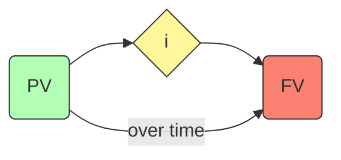

## 4.2 Time Value of Money

Time Value of Money (TVM) is the cornerstone of modern financial planning and analysis. At its core, TVM recognizes that a dollar today is worth more than a dollar received at some point in the future. This principle underpins a variety of wealth management strategies and calculations, such as projecting retirement needs, evaluating mortgages, and deciding on appropriate education funding strategies. In this section, we examine the core concepts of TVM, dissect practical applications in Canadian wealth management, and demonstrate how to employ financial calculators and other tools to optimize client outcomes.

---

## Introduction

The Time Value of Money suggests that money available now can be invested to earn returns over time. Therefore, the timing of cash inflows and outflows significantly impacts an individual’s net worth. Understanding how to manipulate and interpret the key variables of Present Value (PV), Future Value (FV), the discount or interest rate, and compounding frequency can help financial planners provide more accurate forecasts and better advice. This skill is critical when clients in Canada approach you with questions about saving for retirement, paying for education, or choosing between different mortgage repayment schedules.

The Canadian financial landscape offers a variety of registered plans (e.g., RRSP, TFSA, RESP) that leverage compounding to build wealth, with beneficial tax treatments. Mortgage structures, too, hinge on compounding frequencies and interest rates that can be monthly, semi-annual (commonly used by major Canadian banks like RBC or TD), or otherwise. Mastering these fundamentals assists advisors in guiding clients effectively in areas that directly affect long-term financial outcomes.

---

## Core Concepts

### Present Value (PV)

Present Value (PV) is the current worth of a future sum of money or cash flow, determined by discounting the future amount with an appropriate interest or discount rate. Generally, the equation is:


\text{PV} = \frac{\text{FV}}{(1 + i)^n}


Where:  
• PV = Present Value  
• FV = Future Value  
• i = Discount/interest rate per compounding period  
• n = Number of compounding periods  

If you expect to receive a certain amount of money in the future, you can calculate how much you need to invest today at a particular rate of return to achieve that amount. For example, if you need \$10,000 in five years for a down payment on a car, you can calculate how much you should deposit today in a TFSA earning 5% annual interest, compounded yearly, to accomplish that future goal.

### Future Value (FV)

Future Value (FV) calculates the potential growth of a lump sum or a series of payments over a specified period at a given interest rate. The general formula for the future value of a single lump sum is:


\text{FV} = \text{PV} \times (1 + i)^n


When dealing with multiple recurring payments (an annuity), the formula can be expanded to account for each contribution. This helps clients see how their recurring investments—such as monthly deposits to a Registered Retirement Savings Plan (RRSP)—will accumulate over time, given a specified rate of return.

### Discount Rate / Interest Rate

The discount rate or interest rate is crucial in TVM calculations. It represents the expected rate of return used to discount future values back to the present or to project current amounts forward to the future. A higher discount rate reduces the present value of future money because it implies you can earn more on your capital if you invested it today.

For instance, if markets are bullish, you might assume a higher nominal rate of return for your calculations. On the flip side, conservative clients may prefer using a lower rate to account for potential market volatility.

### Compounding

Compounding refers to earning or paying interest on both the principal (the initial sum) and on previously accumulated interest over time. The formula for compound growth over n compounding periods is:


\text{A} = \text{P} \times \left(1 + \frac{i}{m}\right)^{m \times t}


Where:  
• A = Amount after compounding  
• P = Principal (the initial amount of money)  
• i = Annual interest rate (in decimal form)  
• m = Number of compounding periods per year (e.g., 12 for monthly, 2 for semi-annual)  
• t = Total number of years  

The frequency of compounding can significantly impact how quickly your clients’ investments grow. Canadian mortgages commonly use semi-annual compounding, while consumer loans often use monthly compounding.

---

## Mermaid Diagram: Relationship of PV, FV, and Interest Rate

Below is a diagram that visually depicts how Present Value (PV) grows into Future Value (FV) based on an interest rate and time horizon.

Explanation:  
• The Present Value (PV) is invested at an interest rate (i).  
• Over a period, that amount grows into the Future Value (FV).  

---

## Applications in Financial Planning

### Retirement Planning

Many Canadians depend on RRSPs, TFSAs, and employer pension plans to fund retirement. By using time value of money calculations:

• Advisors forecast how periodic contributions and returns will accumulate.  
• Clients can see how changes—like contributing an additional \$100 a month—impact overall retirement savings.  
• Sensitivity analysis shows how adjusting the assumed rate of return from 4% to 6% changes final retirement nest eggs.

### Debt Amortization

Mortgages and other consumer loans rely on TVM to calculate amortization schedules. In mortgage planning:

• Advisors calculate monthly payments factoring in principal and interest.  
• Clients can compare different amortization periods (e.g., 25 vs. 30 years) to see their total interest costs.  
• They can also assess the impact of extra lump sum payments, which reduce outstanding principal and shorten the amortization schedule.

### Education Funding

For parents aiming to fund their child’s post-secondary education, compounding becomes critical. When contributing to a Registered Education Savings Plan (RESP):

• Advisors project how regular contributions will accumulate over 10–18 years.  
• They consider government grants (e.g., Canada Education Savings Grant), further enhancing long-term compounding.  
• The future value helps estimate if the child’s tuition and living expenses can be covered.

### Lump Sum vs. Annuity Choices

Clients sometimes face decisions about how to structure contributions:

• A single lump sum investment may deliver a higher starting principal, growing more rapidly when invested at the beginning of the period.  
• An annuity approach (recurring contributions) can be more manageable for clients with regular incomes who prefer to invest gradually.  

Being able to articulate the difference in projected growth between a lump sum and an annuity fosters better decision-making for both short-term and long-term financial goals.

---

## Calculation Approaches

### Financial Calculators and Software

Professional advisors frequently rely on dedicated tools to handle TVM calculations:

• HP 12C, TI BA II Plus: Both are classic and widely used in the financial services industry, capable of easily computing PV, FV, interest rates, and payment schedules.  
• Financial Planning Software: Comprehensive software packages integrate economic assumptions, expected rates of return, and even advanced Monte Carlo simulations.  
• Excel, Google Sheets, LibreOffice Calc: Built-in functions such as =PV, =FV, =RATE, and =NPER allow quick modeling of various scenarios.

### Formulae and Tables

Traditional compound interest tables are still helpful for quick illustrations or to cross-check results. Advisors can also use the basic formulas:

• Single lump sum future value:  
  
  \text{FV} = \text{PV} \times (1 + i)^n
  

• Annuity future value (regular payments at the end of each period):  
  
  \text{FV}_{\text{annuity}} = \text{PMT} \times \frac{(1 + i)^n - 1}{i}
  

• Present value of an annuity:  
  
  \text{PV}_{\text{annuity}} = \text{PMT} \times \frac{1 - (1 + i)^{-n}}{i}
  

Where PMT = periodic payment.

### Sensitivity Analysis

Sensitivity analysis helps illustrate how changing variables (e.g., interest rates, contribution amounts, time horizon) impacts a financial plan:

• Changing the annual growth rate in partial increments (like 4%, 5%, 6%) can show potential best-case or worst-case scenarios in portfolio values.  
• Adjusting contribution levels or mortgage payment strategies can help clients appreciate the flexibility or constraints in different financial environments.

---

## Real-Life Examples

### Comparing Investment Scenarios

Consider a client investing \$1,000 per month for 20 years:

• Scenario A: The annual compound return is assumed to be 6%.  
• Scenario B: The annual compound return is assumed to be 8%.  

Even a 2% difference in annual returns over two decades can create tens of thousands of dollars in additional funds, illustrating the meaningful impact of small differences in interest rates or investment performance.

### Mortgage Prepayments

A client has a \$400,000 mortgage at 4% semi-annually compounded interest over 25 years:

• The monthly payment might be calculated at or around \$2,100 (for illustrative purposes).  
• If the client makes a \$10,000 extra annual lump sum payment every year, they can significantly reduce the total interest paid and potentially shorten the amortization by several years.  
• Some lenders (like RBC or TD) allow flexible prepayment privileges, enabling clients to pay up to a specific percentage of the principal each year without penalty.

---

## Limitations and Considerations

1. Return Assumptions: Real markets fluctuate; historical returns are no guarantee of future performance.  
2. Inflation: Over long periods, inflation erodes purchasing power. Advisors often model real returns (net of inflation) to ensure the accuracy of long-term planning.  
3. Tax Implications: In non-registered accounts, returns are subject to taxation (e.g., capital gains tax, tax on interest and dividends). The effective annual return might be lower than the nominal rate.  

---

## Best Practices and Common Pitfalls

• Confirm the compounding frequency (monthly, semi-annually, annually) to align calculations with real-world rates, especially with mortgages and GIC rates in Canada.  
• Revisit TVM assumptions regularly—economic conditions change, and client goals evolve.  
• Avoid using overly optimistic rates of return; a balanced approach helps keep expectations realistic.  

---

## Glossary

• **Present Value (PV)**: The current value of a future amount, factoring in a specific discount rate or desired rate of return.  
• **Future Value (FV)**: The value an investment will grow to at a certain date in the future, based on a specified compounding rate.  
• **Discount Rate / Interest Rate**: The percentage rate used to calculate the present or future value of cash flows.  
• **Compound Interest**: Interest calculated on both the initial principal and accumulated interest from previous periods.  

---

## Additional Resources

• [FP Canada](https://www.fpcanada.ca) – Guidelines and standards for comprehensive financial planning in Canada, including tools for retirement projections based on TVM.  
• [Canadian Investment Regulatory Organization (CIRO)](https://www.ciro.ca) – Emphasizes the importance of suitable recommendations and accurate projections.  
• [LibreOffice Calc](https://www.libreoffice.org/) or Google Sheets – Free, open-source spreadsheet software featuring built-in financial functions (PV, FV, RATE, NPER).  
• Suggested Reading: “Time Value of Money: A Guide to Better Financial Decision Making” by Pamela Peterson Drake and Frank J. Fabozzi.  

---

## Conclusion

A strong command of Time Value of Money calculations is indispensable for any financial advisor looking to provide meaningful, actionable recommendations to clients. By understanding Present Value, Future Value, interest rates, and the impacts of compounding, advisors can guide their clients in Canada through a variety of financial decisions—ranging from mortgage amortization strategies to retirement planning and education funding. In volatile or uncertain times, savvy advisors will also conduct sensitivity analyses to show how different assumptions about market performance or contribution levels can shape a client’s overall financial future.

---

## Test Your Knowledge: Time Value of Money for Canadian Wealth Planners



### Which best describes the concept of Present Value (PV)?

- [x] It is the current value of a future amount discounted by a certain rate.  
- [ ] It is the total of annual contributions over time.  
- [ ] It is the amount you plan to invest only once at the beginning of the year.  
- [ ] It is the gross interest earned before compounding occurs.  

> **Explanation:** Present Value (PV) is the current worth of a future sum of money, discounted by an interest rate over a specific period.

### Which of the following factors is most likely to reduce the Present Value of a future sum?

- [x] A higher discount rate.  
- [ ] A longer compounding period.  
- [x] More frequent compounding.  
- [ ] Lower interest rates.  

> **Explanation:** As the discount rate increases, the present value decreases. Additionally, more frequent compounding implies that the future sum grows faster, thus its present value is relatively smaller.

### What key factor differentiates an annuity approach from a lump sum approach?

- [x] An annuity approach involves periodic contributions.  
- [ ] An annuity approach offers no growth over time.  
- [ ] A lump sum approach involves monthly deposits.  
- [ ] There is no real difference in compounding.  

> **Explanation:** An annuity means you contribute periodic payments. A lump sum is a single investment made at one point in time.

### When calculating mortgage payments, which compounding frequency is most commonly used by Canadian lenders like RBC or TD?

- [x] Semi-annual compounding.  
- [ ] Weekly compounding.  
- [ ] Daily compounding.  
- [ ] Annual compounding.  

> **Explanation:** In Canada, mortgages with major banks typically use semi-annual compounding when determining interest charges.

### How might a 2% difference in annual return rates significantly impact a client’s retirement planning?

- [x] Over time, it can result in dramatically different future values.  
- [ ] It rarely has a noticeable effect on long-term investments.  
- [x] It only matters if contributions are monthly and not annually.  
- [ ] It automatically leads to an increase in capital gains tax.  

> **Explanation:** Even a small difference in the annual return can lead to significantly different balances after decades of compounding.

### Which of the following can be a limitation of Time Value of Money calculations?

- [x] Actual returns can deviate from assumed rates.  
- [ ] They are always guaranteed to predict real-life outcomes.  
- [ ] They cannot handle more than one future cash flow.  
- [ ] They do not require assumptions about inflation.  

> **Explanation:** TVM assumes steady rates, but real market returns often deviate from these assumptions.

### In which scenario might an advisor recommend using an annuity future value calculation?

- [x] When a client makes regular monthly contributions to an RESP.  
- [ ] When a client invests a single lump sum into a TFSA.  
- [ ] When a client is only interested in the present value of a future payment.  
- [ ] When a client wants to calculate an entire mortgage balance as a lump sum.  

> **Explanation:** An annuity future value is used when payments or contributions are made periodically.

### Which statement about sensitivity analysis is TRUE?

- [x] It allows advisors to see how changes in interest rates or contributions affect results.  
- [ ] It only works with a single discount rate.  
- [ ] It does not affect retirement planning models.  
- [ ] It is rarely used due to its complexity.  

> **Explanation:** Sensitivity analysis changes one or more variables in projections to see how outcomes differ under various scenarios.

### Which action can a client take to reduce the total interest cost on a mortgage?

- [x] Make extra lump sum payments.  
- [ ] Extend the amortization period.  
- [ ] Only pay the minimum required amount.  
- [ ] Eliminate contributions to RRSPs.  

> **Explanation:** Making extra lump sum payments on the principal not only reduces the total interest cost but can also shorten the repayment period.

### The value placed on funds received today compared to funds received in the future is based on the principle that:

- [x] Money available now can be invested to earn additional returns.  
- [ ] Inflation always decreases future purchasing power.  
- [ ] Tax rates are constant over time.  
- [ ] No interest is accumulated unless invested in stocks.  

> **Explanation:** The Time Value of Money states that money available today is worth more than the same amount in the future because it can earn returns over time.



---

## For Additional Practice and Deeper Preparation

**[1. WME Course For Financial Planners (WME-FP): Exam 1](https://www.udemy.com/course/csi-wme-fp-exam1/?referralCode=1A23C67E56971C0A73D5)**  
• Dive into 6 full-length mock exams—1,500 questions in total—expertly matching the scope of WME-FP Exam 1.  
• Experience scenario-driven case questions and in-depth solutions, surpassing standard references.  
• Build confidence with step-by-step explanations designed to sharpen exam-day strategies.

**[2. WME Course For Financial Planners (WME-FP): Exam 2](https://www.udemy.com/course/csi-wme-fp-exam2/?referralCode=25879CCDED7B7905BBA8)**  
• Tackle 1,500 advanced questions spread across 6 rigorous mock exams (250 questions each).  
• Gain real-world insight with practical tips and detailed rationales that clarify tricky concepts.  
• Stay aligned with CIRO guidelines and CSI’s exam structure—this is a resource intentionally more challenging than the real exam to bolster your preparedness.

> Note: While these courses are specifically crafted to align with the WME-FP exam outlines, they are independently developed and not endorsed by CSI or CIRO.

---
