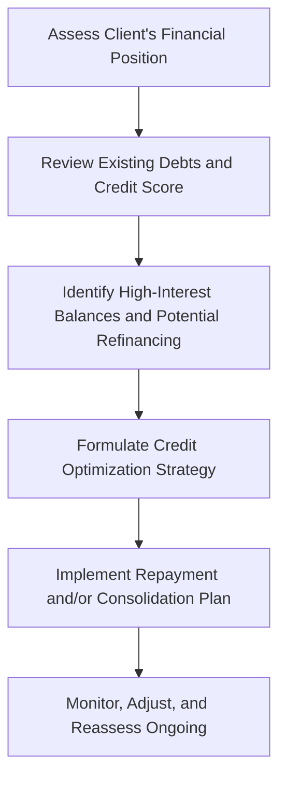

## 5.1 Credit Planning

Effective credit planning is a cornerstone of wealth management for Canadian clients, shaping cash flow, net worth, and long-term financial stability. This section explores the different types of consumer credit available in Canada, outlines the essentials of credit scores and creditworthiness, and provides tools for helping clients strategically use credit as part of an integrated financial plan. Financial advisors play a crucial role in supporting clients with ongoing credit assessments and monitoring, ensuring that debt remains both manageable and beneficial in the broader context of strategic wealth management.

---

### Types of Consumer Credit

Consumer credit can take various forms in Canada, each with its own features, costs, and potential benefits. Understanding these vehicles will help advisors choose the right solutions for clients’ unique financial situations.

#### Credit Cards
• Description and Use: Credit cards are common tools for daily expenditures, offering convenience, reward programs, and purchase protection.  
• Interest Rates: Typically higher than secured lending products (often ranging from 19.99% to 29.99% APR, or even higher for store cards).  
• Minimum Payments vs. Overall Costs: If a client only pays the minimum amount due, interest accumulates quickly, increasing total repayment costs.  
• Tip: Encourage clients to pay statements in full whenever possible to avoid interest charges.

#### Lines of Credit
• Secured vs. Unsecured:  
  – Secured lines of credit (such as a home equity line of credit [HELOC]) require collateral and offer lower interest rates.  
  – Unsecured lines of credit do not require collateral but generally charge higher rates.  
• Flexible Repayment: Clients can choose to pay only the interest or more substantial amounts to reduce principal.  
• Best Use: Large purchases or ongoing liquidity needs; some clients use secured lines of credit to fund renovations or investments.

#### Personal Loans
• Structure: Typically installment loans with a fixed term and fixed repayment schedule.  
• Uses: Debt consolidation, car purchases, emergencies, or home improvements without leveraging home equity.  
• Interest Rates: Generally stable and may be lower than credit cards, but often higher than secured lines of credit.

#### Overdraft Protection
• Description: A credit facility linked to a chequing account that covers shortfalls up to a specified limit.  
• Interest Rates and Fees: Often have higher interest rates and may involve additional fees if the overdraft is utilized for an extended period.  
• Avoiding NSF Fees: Can save money by preventing non-sufficient fund (NSF) charges on bounced cheques or pre-authorized payments.

---

### Credit Score and Creditworthiness

A strong credit profile broadens access to more favorable interest rates, higher credit limits, and broader financial opportunities. In Canada, two primary credit reporting agencies are Equifax and TransUnion. Understanding credit fundamentals empowers clients to maintain strong financial reputations.

#### Components of a Credit Score
1. Payment History (35%): Late or missed payments negatively impact credit scores.  
2. Credit Utilization (30%): The ratio of outstanding credit balances to total available credit. Staying under 30% utilization is typically advisable.  
3. Length of Credit History (15%): A longer history of responsible credit use improves credit scores.  
4. New Credit Inquiries (10%): Frequent requests for new credit can lower credit scores.  
5. Credit Mix (10%): A healthy blend of credit types (e.g., credit cards, lines of credit, mortgages) can improve scores.

#### Improving Credit Health
• Consistent, On-Time Payments: Late payments can remain on a credit report for years.  
• Keeping Credit Utilization Low: Aim for a utilization ratio under 30% of available credit.  
• Limiting New Credit Applications: Too many inquiries in a short period can reduce a score.  
• Checking Credit Reports Annually: Review for accuracy and potential fraudulent accounts.

#### Credit Reports
• Equifax: https://www.consumer.equifax.ca  
• TransUnion: https://www.transunion.ca  
• Tip: Encourage clients to request free reports annually and ensure all details, including addresses and employment data, are correct.

---

### Strategic Use of Credit

Credit, when managed well, can be a powerful tool in a client’s financial arsenal. Advisors can help clients use credit strategically to reduce costs, improve liquidity, and support long-term objectives.

#### Avoiding High-Interest Debt
• Prioritizing High-Rate Balances: Paying down credit card debt or high-interest unsecured loans first frees up cash flow.  
• Snowball vs. Avalanche Methods: Advocate for repayment strategies that either tackle the smallest balance first (snowball) or the highest interest rate first (avalanche).  
• Impact on Net Worth: Reducing high-interest debt can significantly enhance net worth over time.

#### Leveraging Low-Interest Options
• Secured Loans: Home equity lines of credit (HELOCs) often provide lower rates.  
• Investment Opportunities: Clients with solid net worth may utilize low-interest lines of credit to invest, but must be cautious about market risk.  
• Emergency Buffer: A low-rate line of credit can serve as an emergency fund alternative, but must be used prudently to avoid excessive debt.

#### Debt Consolidation
• Benefits: Streamlines multiple debt payments into one, often at a lower interest rate.  
• Credit Impact: Can reduce credit utilization and improve credit score if managed responsibly.  
• Potential Pitfalls: Closing old accounts may unintentionally reduce credit history length, impacting scores. Advisors should carefully evaluate all trade-offs.

---

### Role of the Advisor

Financial advisors add value by helping clients navigate complex credit landscapes. They can identify risks, optimize credit strategies, and monitor debt loads within the larger wealth management plan.

#### Assessment of Debt Ratios
• Debt-to-Income Ratio: Tracks monthly debt payments relative to income.  
• Total Debt Service (TDS) and Gross Debt Service (GDS) Ratios: Often used by lenders to assess mortgage affordability.  
• Early Warning: Identifying unsustainable ratios early allows for timely restructuring or refinancing.

#### Budget Integration
• Aligning Repayment: Ensure that monthly debt payments fit into the broader budgeting process without compromising savings or investment goals.  
• Cash Flow Management: Emphasize the importance of maintaining an emergency fund, even during debt repayment.

#### Ongoing Monitoring
• Regular Credit Check: Annual or semi-annual reviews of credit reports.  
• Refinancing Opportunities: Track interest rates and credit changes to identify beneficial refinancing or consolidation moments.  
• Cost-Benefit Analyses: Evaluate if paying off debt faster is more advantageous than investing surplus funds.

---

### Diagram: Overview of the Credit Planning Process

Below is a simplified flowchart illustrating common steps in credit planning for Canadian clients:

**Explanation:** Advisors and clients work together to assess the current debt landscape, identify focus areas, and implement strategic action plans. Regular monitoring keeps credit strategies aligned with changes in personal circumstances and market interest rates.

---

### Canadian Regulatory Context and References

• [Canadian Investment Regulatory Organization (CIRO)](https://www.ciro.ca): Provides regulatory guidance on leveraging strategies, margin requirements, and suitability rules for clients using credit to invest.  
• [Financial Consumer Agency of Canada (FCAC)](https://www.canada.ca/en/financial-consumer-agency.html): Offers online tools and educational resources for consumers and advisors on managing credit, understanding credit reports, and identifying warning signs of debt problems.  
• [Equifax](https://www.consumer.equifax.ca) and [TransUnion](https://www.transunion.ca): Main credit bureaus in Canada. Provide credit reports and scores for individuals and businesses.

---

### Tools and Additional Resources

• **Open-Source Financial Tools**:  
  – Budgeting templates and credit calculators available on GitHub or through FCAC’s interactive tools.  
  – Online amortization calculators to model various loan repayment scenarios.  

• **Suggested Reading**:  
  – “Why You Need a Credit Coach” by Tracy Piercy, illustrating practical steps to maintain strong credit.  

---

### Glossary

• **Collateral**: An asset pledged to secure a loan (e.g., property, vehicle) that can be seized if the borrower defaults.  
• **Credit Utilization Ratio**: The amount of credit used compared to total available credit.  
• **Debt Consolidation**: Combining multiple debts into a single loan or line of credit, often at a lower interest rate.  
• **Overdraft Protection**: A credit facility allowing an account holder to temporarily cover cash shortfalls up to a specified limit.

---

### Summary of Key Points

1. **Type of Credit Vehicle**: Tailor credit solutions to each client’s unique situation—credit cards, lines of credit, personal loans, or overdraft protection.  
2. **Credit Health**: Encourage clients to monitor and improve credit scores by paying bills on time, limiting new credit inquiries, and maintaining low credit utilization.  
3. **Strategic Debt**: Consider lower-interest options, debt consolidation, and prudent leveraging strategies within a holistic financial plan.  
4. **Advisor’s Role**: Assess client debt ratios, integrate repayment with budgeting, and conduct ongoing monitoring.  
5. **Regulatory Awareness**: Stay informed of CIRO guidelines, support client access to credit reports from Equifax and TransUnion, and utilize FCAC resources.

---

## Test Your Knowledge: Credit Planning in Canada Quiz



### Which type of consumer credit typically has the highest interest rates?

- [ ] Secured line of credit
- [ ] HELOC
- [x] Credit cards
- [ ] Personal loans

> **Explanation:** Credit cards commonly carry higher interest rates (often 19.99% or more), making them generally more expensive than secured lines of credit or personal loans.

### Which factor usually carries the most weight in determining a client’s credit score?

- [x] Payment history
- [ ] Credit mix
- [ ] New credit inquiries
- [ ] Length of credit history

> **Explanation:** Payment history typically accounts for 35% of a client’s credit score, making timely payments crucial for maintaining strong creditworthiness.

### What is the main advantage of a secured line of credit, such as a HELOC?

- [x] Lower interest rates due to collateral
- [ ] No collateral is required
- [ ] Principle cannot be reduced
- [ ] Guaranteed approval without a credit check

> **Explanation:** Because a home or other asset serves as collateral, lenders generally offer lower interest rates on secured lines of credit, such as HELOCs.

### If a client is looking to reduce high-interest debt, which strategy might be the best first step?

- [x] Paying off the highest-interest balances first
- [ ] Opening additional credit cards to spread out debt
- [ ] Maintaining only minimum payments on all debts
- [ ] Ignoring payment due dates

> **Explanation:** Tackling the highest-interest debt first (avalanche method) reduces overall interest expense and may speed up the payoff process.

### Why might consolidating debts into a single loan improve a client’s financial health?

- [x] Potentially lowering the overall interest rate
- [x] Simplifying multiple payments into one
- [ ] Guaranteeing a higher credit limit
- [ ] Eliminating all credit inquiries

> **Explanation:** Debt consolidation can streamline monthly obligations into a single loan, often with a lower interest rate than the composite of individual debts.

### Which government agency in Canada provides educational resources on credit cards and credit reports?

- [x] Financial Consumer Agency of Canada (FCAC)
- [ ] Financial Transactions and Reports Analysis Centre of Canada (FINTRAC)
- [ ] Canada Border Services Agency (CBSA)
- [ ] Bank of Canada

> **Explanation:** The Financial Consumer Agency of Canada (FCAC) focuses on consumer financial education, including credit usage and reporting guidelines.

### When reviewing a client’s credit profile, which ratio is often used by lenders to assess mortgage affordability?

- [x] Total Debt Service (TDS) ratio
- [ ] Quick ratio
- [x] Gross Debt Service (GDS) ratio
- [ ] Return on investment (ROI)

> **Explanation:** Both TDS and GDS ratios help lenders determine if the client’s income can comfortably service mortgage and related housing costs.

### What is one reason periodically checking a credit report is important?

- [x] Identifying potential fraud or errors
- [ ] Lowering monthly loan payments automatically
- [ ] Increasing the client’s credit utilization
- [ ] Permanently boosting the credit score

> **Explanation:** Regularly reviewing credit reports can uncover inaccuracies, signs of fraud, or issues that might negatively affect the client’s credit rating.

### Which of the following is a key benefit of using a Home Equity Line of Credit (HELOC)?

- [x] Access to funds at a relatively low interest rate
- [ ] Zero interest rates
- [ ] No payment terms
- [ ] Reduces the mortgage principal instantly

> **Explanation:** HELOCs typically offer interest rates lower than other forms of credit because they are secured by the homeowner’s property, offering more flexibility and potentially lower borrowing costs.

### Is focusing on credit utilization crucial when improving a credit score?

- [x] True
- [ ] False

> **Explanation:** Credit utilization comprises a significant portion of the credit score calculation. Keeping utilization below 30% is generally advised for maintaining healthy credit.



---

## For Additional Practice and Deeper Preparation

**[1. WME Course For Financial Planners (WME-FP): Exam 1](https://www.udemy.com/course/csi-wme-fp-exam1/?referralCode=1A23C67E56971C0A73D5)**  
• Dive into 6 full-length mock exams—1,500 questions in total—expertly matching the scope of WME-FP Exam 1.  
• Experience scenario-driven case questions and in-depth solutions, surpassing standard references.  
• Build confidence with step-by-step explanations designed to sharpen exam-day strategies.

**[2. WME Course For Financial Planners (WME-FP): Exam 2](https://www.udemy.com/course/csi-wme-fp-exam2/?referralCode=25879CCDED7B7905BBA8)**  
• Tackle 1,500 advanced questions spread across 6 rigorous mock exams (250 questions each).  
• Gain real-world insight with practical tips and detailed rationales that clarify tricky concepts.  
• Stay aligned with CIRO guidelines and CSI’s exam structure—this is a resource intentionally more challenging than the real exam to bolster your preparedness.

> Note: While these courses are specifically crafted to align with the WME-FP exam outlines, they are independently developed and not endorsed by CSI or CIRO.
