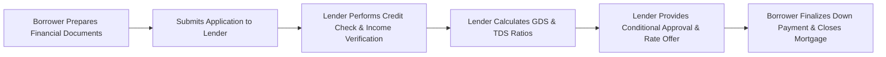

## 5.2 Residential Mortgages

Residential mortgages are fundamental to the home-buying process in Canada. As a financial planner, understanding the different mortgage types, qualification criteria, and regulatory requirements is essential. In this section, we will discuss:

• Types of Mortgages  
• Mortgage Amortization vs. Term  
• Qualifying for a Mortgage  
• Mortgage Default Insurance  

We will also explore practical examples and strategies, so you can better guide clients through one of their most significant financial commitments.

---

### Types of Mortgages

Canadian lenders—such as the major banks (e.g., Royal Bank of Canada (RBC) and Toronto-Dominion (TD) Bank)—and various credit unions provide different mortgage options to suit individual investment strategies, risk tolerances, and financial goals. The three most common are:

1. **Fixed-Rate Mortgages**  
2. **Variable-Rate Mortgages**  
3. **Hybrid or Combination Mortgages**

#### Fixed-Rate Mortgages
A fixed-rate mortgage offers an interest rate that remains constant throughout the selected term (often 1 to 5 years, though other term lengths exist). With predictable monthly payments, fixed-rate mortgages appeal to borrowers who want stability and straightforward budgeting.  

• **Advantages:**  
  – Predictable payments make financial planning easier.  
  – Protection against rising interest rates.  

• **Disadvantages:**  
  – Usually come with higher initial interest rates compared to variable-rate mortgages.  
  – Potential penalty costs can be steep if the borrower breaks the mortgage contract early.

##### Practical Example  
Suppose a client obtains a 5-year fixed-rate mortgage at 4.50% on a principal of $400,000. Their monthly payment stays consistent, making it easier to forecast monthly budgeting for the family’s cash flow.

#### Variable-Rate Mortgages
A variable-rate mortgage has an interest rate that fluctuates based on the lender’s prime rate (often influenced by the Bank of Canada’s overnight rate).  

• **Advantages:**  
  – Potential for savings if interest rates drop or remain stable.  
  – Typically lower initial rates compared to fixed-rate mortgages.  

• **Disadvantages:**  
  – Payments or the allocation of interest vs. principal can change if interest rates increase, making budgeting more challenging.  
  – Borrowers with tight cash flow may struggle if rates rise significantly.

##### Practical Example  
Consider a 5-year variable-rate mortgage with an initial rate of prime minus 0.50%. If the bank’s prime rate is 6.00%, the mortgage interest rate effectively starts at 5.50%. If the prime rate goes down to 5.75%, the mortgage interest rate drops to 5.25%, potentially lowering the borrower’s interest costs.

#### Hybrid or Combination Mortgages
Hybrid or combination mortgages split the principal into different segments: one portion at a fixed rate and another at a variable rate. This approach balances the stability of fixed payments with the possibility of lower costs from variable rates.

• **Advantages:**  
  – Partial protection against interest rate hikes on the variable portion.  
  – Opportunity to benefit from lower variable rates on the remaining portion.  

• **Disadvantages:**  
  – More complex structure, requiring careful planning and monitoring.  
  – Different renewal and penalty terms applied to each portion of the mortgage.

---

### Mortgage Amortization vs. Term

#### Amortization Period
The amortization period represents the total time it would take to pay off your entire mortgage if the interest rate and payment amounts remained constant. Common amortization periods in Canada include 25 years for first-time homebuyers, though some borrowers may opt for 30-year (or shorter) amortizations.  

• **Longer amortization:**  
  – Lower monthly payments.  
  – More interest paid over the life of the mortgage.  

• **Shorter amortization:**  
  – Higher monthly payments.  
  – Less total interest paid, faster path to full homeownership.

#### Term
The term is the length of time the mortgage contract is in effect—commonly 1, 3, or 5 years but can be as long as 10 years or as short as 6 months. Upon renewal, rates and conditions can change.  

• **Short-term mortgages:**  
  – Potentially lower rates.  
  – More frequent renewals, adding administrative tasks and potential penalties if you switch lenders.  

• **Long-term mortgages:**  
  – Rate stability over a longer horizon.  
  – Typically higher rates than shorter terms.

---

### Qualifying for a Mortgage

#### Down Payment Requirements
Canadian homebuyers generally require a minimum of 5% down for owner-occupied homes. However, any down payment below 20% results in a “high-ratio mortgage” that requires mortgage default insurance.

• **5% down payment:**  
  – Minimum to qualify for an owner-occupied property.  
  – Triggers mortgage default insurance.  

• **20% down payment:**  
  – Avoids mortgage default insurance.  
  – Lowers monthly payment obligations.

#### Debt Service Ratios
Lenders use two primary ratios to assess affordability:

• **Gross Debt Service (GDS) Ratio**  
  – (Mortgage Payment + Property Taxes + Heating + 50% of Condo Fees, if applicable) ÷ Gross Income  
  – A guideline is generally 32% or below.

• **Total Debt Service (TDS) Ratio**  
  – (Mortgage Payment + Property Taxes + Heating + Other Debt Payments) ÷ Gross Income  
  – A guideline is generally 40% or below.

Keep in mind that lenders may apply additional “stress tests,” using a higher qualifying interest rate to ensure borrowers can handle potential rate increases.

#### Credit Score Benchmarks
Lenders have various minimum credit score thresholds (e.g., 620, 650, or 680) that can affect interest rates and qualification criteria. A high credit score often results in more favorable terms and lower interest rates.  

• **Example:** A client with an excellent credit score of 750 may receive a discounted interest rate (e.g., prime minus 1.0%) compared to a client with a 650 credit score (who might only qualify for prime minus 0.25%).

#### Documentation
Key documents often required for mortgage applications include:  
• Proof of income (T4 slips, Notices of Assessment (NOAs) from the Canada Revenue Agency).  
• Employment verification letters.  
• Bank statements and proof of down payment sources.  
• Personal identification (driver’s license, passport, etc.).  

#### Visual Overview of the Mortgage Qualification Process

---

### Mortgage Default Insurance

#### Canada Mortgage and Housing Corporation (CMHC)
CMHC is the dominant provider of mortgage default insurance for high-ratio mortgages. Other providers include Genworth Canada and Canada Guaranty.  

• **Purpose:** Protects the lender in case of borrower default.  
• **Who Pays:** Premiums are added to the mortgage principal, thereby increasing monthly payments.

#### Effect on Costs
Because default insurance premiums get added to the mortgage and increase the principal, the borrower pays interest on both the mortgage amount and the insurance premium. A lower down payment typically involves higher premiums.

| Down Payment | Insurance Premium (Approx.) |
|-------------:|----------------------------:|
| 5%           | 4.00% of mortgage amount    |
| 10%          | 3.10% of mortgage amount    |
| 15%          | 2.80% of mortgage amount    |

(Note: Premium rates vary and are subject to change. Always consult the most recent CMHC guidelines.)

#### Benefits
Mortgage default insurance enables individuals with less than 20% down to become homeowners sooner, promoting broader access to the real estate market.

---

### Best Practices and Pitfalls

• **Refinancing Options:** Understand penalty structures for early mortgage payouts, as fixed-rate mortgages may carry larger charges than variable-rate mortgages.  
• **Stress Testing Your Payments:** Encourage clients to test their finances at higher interest rates to avoid future surprises.  
• **Rate-Buydown Strategies:** Some lenders offer rate “buydown” or discount points. Evaluate whether these upfront costs genuinely benefit the client’s total payment over the mortgage term.  
• **Porting Your Mortgage:** If a client sells their home and purchases a new one, some mortgages can be “ported” to avoid penalties and maintain the interest rate.

---

### Additional Resources and References

• **Financial Consumer Agency of Canada (FCAC) Mortgage Qualifier Tool:**  
  [https://itools-ioutils.fcac-acfc.gc.ca/MQ-HQ/MQ-EAPH-eng.aspx](https://itools-ioutils.fcac-acfc.gc.ca/MQ-HQ/MQ-EAPH-eng.aspx)  
  – A helpful tool for borrowers to estimate how much they can qualify for, considering different interest rates and amortization scenarios.

• **Canada Mortgage and Housing Corporation (CMHC):**  
  [https://www.cmhc-schl.gc.ca](https://www.cmhc-schl.gc.ca)  
  – Official source for mortgage loan insurance details, homeowner resources, and updates on mortgage-related regulations.

• **Canadian Investment Regulatory Organization (CIRO):**  
  [https://www.ciro.ca](https://www.ciro.ca)  
  – Guidance on appropriate use of leverage, ensuring that mortgage borrowing aligns with a client’s risk tolerance and investment objectives.

• **Suggested Reading:**  
  “The Mortgage Code: Helping You Move Up the Property Ladder One Step at a Time” by Angela Calla – A practical guide on navigating the Canadian mortgage landscape.

---

### Summary of Key Points

• **Mortgage Options:** Fixed-rate mortgages provide payment stability, variable-rate mortgages potentially lower costs if interest rates fall, and hybrid mortgages offer a blend of both.  
• **Amortization vs. Term:** The amortization period covers the entire timeline to repay the mortgage, whereas the term decides how long the current rate and conditions remain in effect.  
• **Qualifying:** Meeting minimum down payment requirements, possessing a strong credit score, and keeping debt service ratios within acceptable ranges are crucial for mortgage approval.  
• **Default Insurance:** Necessary for high-ratio mortgages, adding to the overall costs but facilitating homeownership for those with smaller down payments.

Whether a client is a first-time homebuyer or a seasoned real estate investor, understanding these mortgage fundamentals is critical for effective financial planning. Advising clients on structuring their mortgage effectively can help them secure better rates, manage cash flow, and achieve their wealth-building goals.

---

## Test Your Knowledge: Residential Mortgage Fundamentals Quiz



### Which type of mortgage maintains the same interest rate throughout its term?

- [x] Fixed-rate mortgage
- [ ] Variable-rate mortgage
- [ ] Hybrid mortgage
- [ ] Bridge loan

> **Explanation:** A fixed-rate mortgage keeps the interest rate constant throughout the mortgage term, providing predictable monthly payments.

### What is the typical minimum down payment for an owner-occupied property in Canada?

- [ ] 0%
- [x] 5%
- [ ] 15%
- [ ] 25%

> **Explanation:** Buyers generally need at least a 5% down payment for an owner-occupied property in Canada. Down payments under 20% trigger mortgage default insurance.

### Which ratio includes mortgage payments, property taxes, heating costs, and other debt payments compared to gross income?

- [ ] GDS Ratio
- [x] TDS Ratio
- [ ] EBITDA Ratio
- [ ] RRSP Ratio

> **Explanation:** The Total Debt Service (TDS) Ratio accounts for all debt obligations, including the mortgage, property taxes, heating costs, and other outstanding debts.

### In a variable-rate mortgage, the interest rate is typically tied to:

- [ ] A fixed bond yield
- [ ] A national housing index
- [x] The lender’s prime rate
- [ ] The unemployment rate

> **Explanation:** Variable-rate mortgages in Canada are generally linked to a lender’s prime rate, which in turn is influenced by the Bank of Canada’s overnight lending rate.

### Which statement best describes the difference between amortization period and term?

- [x] The amortization period is the total repayment timeline, while the term is how long the current mortgage conditions last.
- [ ] The term is the total repayment timeline, while amortization is how long the contract lasts.  
- [ ] Both are used interchangeably to define a mortgage contract length.
- [ ] Amortization period always equals the term.

> **Explanation:** The amortization period refers to the total time it would take to fully pay off the mortgage, whereas the term is the interval under which the mortgage rate and conditions are fixed.

### Which of the following is a benefit of mortgage default insurance?

- [x] It allows buyers with lower down payments to enter the market.
- [ ] It reduces mortgage interest rates directly.
- [ ] It protects borrowers from all financial losses.
- [ ] It’s only required for mortgages over 25 years.

> **Explanation:** Mortgage default insurance broadens access to home financing for those with down payments under 20% by covering the lender’s risk.

### Which ratio is generally recommended to be under 32% in Canada?

- [x] Gross Debt Service (GDS) Ratio
- [ ] Total Debt Service (TDS) Ratio
- [ ] Debt-to-Equity Ratio  
- [ ] Price-to-Earnings Ratio

> **Explanation:** In Canada, the GDS Ratio should typically be 32% or below, ensuring mortgage and housing-related costs remain at a manageable proportion to gross income.

### A hybrid mortgage typically combines:

- [ ] Two types of fixed-rate periods
- [x] A fixed-rate component and a variable-rate component
- [ ] Principal-only payments and interest-only payments
- [ ] Two different lenders under one agreement

> **Explanation:** A hybrid mortgage splits the loan into fixed-rate and variable-rate portions, providing both stability and potential interest rate savings.

### One main advantage of a fixed-rate mortgage is:

- [x] Stable and predictable payments
- [ ] Always having the lowest possible interest rate
- [ ] No penalties for early repayment
- [ ] Guaranteed approval regardless of credit score

> **Explanation:** Fixed-rate mortgages offer predictable monthly payments, giving borrowers certainty about their core housing cost, even if the broader interest rate environment changes.

### Mortgage default insurance premiums:

- [x] Are added to the mortgage principal
- [ ] Cover the borrower’s life insurance needs
- [ ] Are optional for all mortgages
- [ ] Never affect monthly payments

> **Explanation:** The premiums are typically added to the mortgage principal, thus increasing the amount on which the borrower pays interest.



---

## For Additional Practice and Deeper Preparation

**[1. WME Course For Financial Planners (WME-FP): Exam 1](https://www.udemy.com/course/csi-wme-fp-exam1/?referralCode=1A23C67E56971C0A73D5)**  
• Dive into 6 full-length mock exams—1,500 questions in total—expertly matching the scope of WME-FP Exam 1.  
• Experience scenario-driven case questions and in-depth solutions, surpassing standard references.  
• Build confidence with step-by-step explanations designed to sharpen exam-day strategies.

**[2. WME Course For Financial Planners (WME-FP): Exam 2](https://www.udemy.com/course/csi-wme-fp-exam2/?referralCode=25879CCDED7B7905BBA8)**  
• Tackle 1,500 advanced questions spread across 6 rigorous mock exams (250 questions each).  
• Gain real-world insight with practical tips and detailed rationales that clarify tricky concepts.  
• Stay aligned with CIRO guidelines and CSI’s exam structure—this is a resource intentionally more challenging than the real exam to bolster your preparedness.

> Note: While these courses are specifically crafted to align with the WME-FP exam outlines, they are independently developed and not endorsed by CSI or CIRO.
