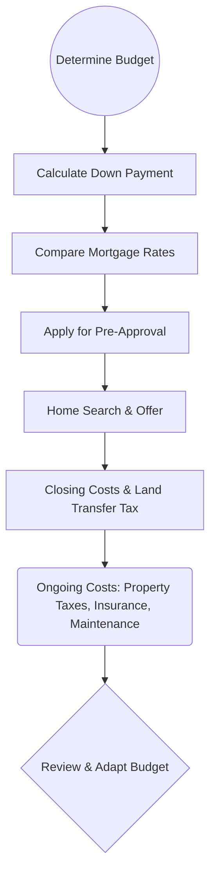

## 5.3 Key Financial Factors to Consider When Purchasing a Home

Buying a home in Canada is a sizeable financial commitment that involves a series of complex decisions. A prudent home purchase requires a detailed look at immediate and ongoing affordability, property-related costs and taxes, and alignment with personal and family goals. This section covers the critical financial elements prospective homebuyers and financial planners should carefully evaluate before making the leap.

---

## Housing Affordability

Financial planners play a crucial role in helping clients determine whether a home is truly affordable. Affordability involves far more than just qualifying for a mortgage. Here are key aspects to consider:

### Down Payment Availability

• Larger Down Payments and Default Insurance Requirements:  
  - In Canada, if the down payment is below 20% of the purchase price, clients are required to obtain mortgage default insurance (commonly from the Canada Mortgage and Housing Corporation, or CMHC).  
  - For homebuyers able to put at least 20% down, the need to pay additional insurance premiums is eliminated. This can save thousands of dollars over the mortgage’s lifespan.  

• Impact on Monthly Costs:  
  - A larger down payment reduces the principal amount borrowed, thereby decreasing monthly mortgage payments.  
  - It can also help clients qualify for lower interest rates and gain better negotiating power with lenders.

### Interest Rate Environment

• Fixed vs. Variable Rates:  
  - A fixed-rate mortgage locks in an interest rate for a specific term (e.g., 5 years), providing stable payments.  
  - A variable-rate mortgage, on the other hand, fluctuates with the lender’s prime rate or market rates, potentially offering lower initial interest but introducing unpredictability.  

• Economic Conditions and Rate Projections:  
  - Clients should consider prevailing market conditions and Bank of Canada overnight rate trends.  
  - Rising rates can increase borrowing costs significantly over time, so it is vital to run stress tests (e.g., calculating mortgage payments at 2% or 3% higher than the current rate).

### Closing Costs

Even after securing a mortgage, clients may face significant closing costs that must be factored into the budget:

• Transfer Taxes (Land Transfer Tax):  
  - Mandatory in most provinces (e.g., Ontario, British Columbia).  
  - Rates vary by jurisdiction, with some provinces and municipalities adding surcharges for high-value properties or foreign buyers.  

• Legal Fees and Disbursements:  
  - Cover the cost of preparing mortgage documents, title searches, and registration.  
  - Clients should request an estimate from their lawyer or notary to plan effectively.  

• Property Appraisals and Inspections:  
  - Property appraisal fees can range from CAD 300–500 or more, depending on property complexity.  
  - Home inspection fees typically range from CAD 400–600, offering peace of mind by detecting potential structural, electrical, or plumbing issues.  

• Title Insurance:  
  - Protects against title fraud, zoning contraventions, and other discrepancies that could affect the property’s legal status.  

---

## Taxes and Other Ongoing Expenses

The monthly mortgage payment is only part of the financial equation. A comprehensive affordability analysis should address recurring costs tied to the property.

### Property Taxes

• Municipality-Dependent:  
  - Property tax rates vary widely by municipality. High-demand cities like Toronto or Vancouver often have different tax structures than smaller towns.  
  - Planners should advise clients to consult city or local government websites (for example, the City of Toronto’s rate calculator at [https://www.toronto.ca/services-payments/property-taxes-utilities/](https://www.toronto.ca/services-payments/property-taxes-utilities/)) for accurate estimates.

• Incorporating into Monthly Budget:  
  - Many lenders offer an option to add property taxes into the monthly mortgage payment.  
  - Some clients prefer to pay taxes separately to maintain flexibility, but they must ensure they set aside sufficient funds regularly.

### Home Insurance

• Mandatory Coverage:  
  - Mortgage lenders almost always require home insurance coverage for fire, theft, and liability.  
  - Premiums depend on the type of construction, location (e.g., vulnerability to floods), and special features such as a swimming pool.

• Range of Premium Costs:  
  - Typical annual premiums can start as low as CAD 800 and go upward depending on location, building size, age, and coverage level.  
  - Advisors should ensure clients shop around for competitive quotes from reputable Canadian insurers.

### Maintenance and Condo Fees

• Maintenance for Freeholds:  
  - Owners of single-family homes bear the cost of ongoing maintenance, preventative work (e.g., furnace inspections), and repairs (e.g., roof replacements).  
  - Factoring 1–2% of the property value annually for maintenance is a good rule of thumb.

• Condo Fees (Strata Fees):  
  - Condo owners pay monthly fees for common area upkeep, building amenities, and sometimes utilities.  
  - Older condos may have higher fees due to ongoing repairs or upcoming structural projects.  

---

## Income Stability

A reliable stream of income is vital for repaying a mortgage comfortably amidst other financial commitments.

### Employment History

• Preference for Steady Employment:  
  - Lenders evaluate stability of income, typically requiring recent pay stubs, T4 slips, and sometimes notices of assessment from the Canada Revenue Agency (CRA).  
  - Self-employed individuals often need to provide thorough business financial statements, notarized client contracts, and detailed tax returns to satisfy more stringent lending criteria.

### Emergency Fund

• Contingency Planning:  
  - Encouraging clients to maintain an emergency fund covering at least three to six months’ worth of expenses helps safeguard against sudden unemployment or urgent home repairs.  
  - This cash reserve can prevent the need for high-interest credit card debt or personal loans in emergencies.

---

## Long-Term Goals and Lifestyle Factors

Beyond numbers, clients should consider how long-term life and career plans align with their home purchase decision.

### Proximity to Work, Schools, and Amenities

• Commute Times:  
  - Long commutes can add to transportation costs, vehicle maintenance, and stress, which indirectly affect overall quality of life.  

• Schools and Local Infrastructure:  
  - Proximity to good schools can significantly affect property values and future resale potential.  
  - Access to public transit, health care facilities, and recreational centers are also important lifestyle considerations.

### Potential for Family Expansion

• Family Growth and Property Size:  
  - A young couple planning to have children within a few years may benefit from projecting additional space requirements and planning for future mortgage and maintenance costs.  

• Layout and Location:  
  - Clients desiring to have multi-generational living arrangements might consider properties with in-law suites or the potential to renovate accordingly.

---

## Borrowing Capacity vs. True Affordability

It is common for lenders to offer mortgages that push clients to the upper limit of their debt-servicing capacity. Financial planners have a duty to help clients see beyond the lender’s approval amount and consider their comfort level and other life goals.

### Lender Limits vs. Personal Comfort

• Gross Debt Service (GDS) and Total Debt Service (TDS) Ratios:  
  - In Canada, most lenders want GDS (housing costs as a percentage of gross income) to be under 32% and TDS (all debt payments as a percentage of gross income) to be under 40%.  
  - Even if a lender allows higher ratios, financial planners should remind clients of the importance of lifestyle expenses (vacations, education, retirement contributions).  

• Balancing with Other Goals:  
  - Clients might forgo or delay savings for a child’s education or retirement if their mortgage consumes a large chunk of income.  
  - Being “house poor” can lead to increased financial stress and limited flexibility in times of emergency.

---

## Case Study: Sarah and Alex in Metro Vancouver

Imagine Sarah and Alex, a dual-income couple each earning CAD 50,000 per year. They think they can afford a townhome listed at around CAD 700,000. Their bank pre-approves them for a mortgage up to CAD 650,000, assuming they can put down CAD 50,000.  

• After factoring in the 5% down payment, they realize they will need CMHC mortgage default insurance, increasing their overall debt load.  
• Local property taxes in Metro Vancouver can add approximately CAD 3,000 annually, and condo fees for many strata properties might exceed CAD 300 per month.  
• By including these extra costs and potential annual maintenance, the couple finds that they can service the mortgage, but it leaves little room for RRSP contributions, an emergency fund, or other life goals—ultimately deciding to look for a lower-priced property, ensuring better long-term financial security.

---

## Practical Tools and Step-by-Step Guidance

Financial planners and clients can leverage a variety of resources to gauge fiscal readiness for a home purchase:

1. Mortgage Calculators:  
   - Free, open-source Excel or Google Sheets tools abound online.  
   - The Financial Consumer Agency of Canada (FCAC) provides a helpful online calculator at [https://www.canada.ca/en/financial-consumer-agency.html](https://www.canada.ca/en/financial-consumer-agency.html).

2. Stress Testing:  
   - Encourage clients to test financially for potential increases in mortgage interest rates (e.g., reserved rate plus 2%) and changes in property taxes or condo fees.  

3. Detailed Budgeting and Forecasting:  
   - Using simple planning software or platforms like GnuCash (an open-source tool) to project monthly cash flow, factoring in potential salary changes, child expenses, or health care needs.

4. Reviewing Municipal Websites:  
   - Detailed property tax estimators can help refine monthly budgeting.

---

## Using Diagrams to Understand the Homebuying Financial Flow

Below is a Mermaid.js diagram illustrating the key steps and financial considerations in the homebuying journey:

- This diagram shows how each step leads directly to the next, emphasizing the interconnected nature of homebuying costs and ongoing financial obligations.

---

## Regulatory Considerations

• Office of the Superintendent of Financial Institutions (OSFI) Guidelines:  
  - As part of Canada’s mortgage underwriting rules, OSFI requires potential borrowers to qualify under the higher of the contractual mortgage rate or the Bank of Canada’s benchmark rate.  

• Provincial Land Transfer Tax Regulations:  
  - Vary across provinces and sometimes municipalities. For example, Ontario has a tiered structure for the Land Transfer Tax, and Toronto imposes an additional municipal land transfer tax within city limits.  

• CMHC Mortgage Default Insurance Requirements:  
  - In cases where down payments are below 20%, borrowers must purchase CMHC insurance (or from private insurers like Sagen), subject to maximum home value and amortization limits.  

---

## Key Takeaways

1. **Plan Beyond the Mortgage Payment**: Property taxes, insurance, and ongoing maintenance are major expenses that must be incorporated into monthly budgets.  
2. **Down Payment Size Matters**: Significant cost reductions can result from putting 20% or more down, eliminating mortgage default insurance premiums.  
3. **Balance Life Goals**: Ensure housing costs do not overshadow other needs like retirement savings, emergency funds, or education savings plans.  
4. **Beware of Overqualifying**: Lender approvals may exceed a client’s comfort level. Encourage stress testing and a holistic financial review.  
5. **Leverage Tools and Resources**: Federal calculators, municipal tax guides, and budgeting software can help clients make informed decisions.  

---

## Glossary

• **Transfer Taxes (Land Transfer Tax)**: A tax applied when transferring property ownership, varying by province. For instance, Ontario levies a Land Transfer Tax, and the City of Toronto levies an additional municipal tax within city limits.  
• **Home Inspection**: An evaluation of a property’s structural and functional integrity, aiming to identify any major defects.  
• **Condo Fees (Strata Fees)**: Monthly amounts payable by condominium owners for common area maintenance, amenities, and sometimes utilities.  
• **Self-Employed Verification**: Additional documentation that lenders require to verify consistent business income, including but not limited to business financials and detailed notices of assessment.  

---

## References for Further Exploration

1. [City of Toronto – Property Taxes and Utilities](https://www.toronto.ca/services-payments/property-taxes-utilities/)  
2. [Financial Consumer Agency of Canada (FCAC)](https://www.canada.ca/en/financial-consumer-agency.html) – Mortgage calculators and budget worksheets  
3. [CMHC – Home Buying Step by Step](https://www.cmhc-schl.gc.ca/)  
4. [OSFI Residential Mortgage Underwriting Practices and Procedures](https://www.osfi-bsif.gc.ca/)  

---

## Test Your Knowledge: Key Financial Factors for Canadian Homebuyers Quiz



### Which of the following statements is TRUE regarding down payments in Canada?

- [x] If the down payment is below 20%, the borrower must purchase mortgage default insurance.  
- [ ] You always need at least a 25% down payment regardless of the property type.  
- [ ] Default insurance is typically optional at any down payment level.  
- [ ] If the home is in a rural area, there is no need for default insurance.  

> **Explanation:** Canadian lenders generally require mortgage default insurance (often CMHC) if the down payment is under 20% of the purchase price.

### When considering a variable-rate mortgage, which factor is most critical?

- [x] The borrower’s tolerance for potential interest rate fluctuations.  
- [ ] The borrower’s preference for a fixed monthly payment.  
- [ ] The type of property being purchased.  
- [ ] The presence of municipal tax abatements.  

> **Explanation:** A variable-rate mortgage’s interest rate changes in line with market conditions. Homebuyers must be prepared for fluctuations in monthly payment amounts.

### Which cost does NOT typically form part of closing costs?

- [ ] Legal fees  
- [ ] Land Transfer Tax  
- [x] Monthly condo fees  
- [ ] Property appraisal fees  

> **Explanation:** Monthly condo fees are an ongoing recurring cost, not a one-time closing cost.

### Why is having an emergency fund especially important for homeowners?

- [x] It provides a financial cushion for unexpected repairs or job loss.  
- [ ] It helps increase the credit score automatically.  
- [ ] It replaces the need for home insurance in many provinces.  
- [ ] It eliminates the need for maintenance budgeting.  

> **Explanation:** Homeownership entails unpredictable costs such as appliance breakdowns and urgent repairs. Having an emergency fund helps cover these expenses without resorting to high-interest debt.

### All else being equal, what is the benefit of putting a down payment of 20% or more on a home purchase?

- [x] Avoiding mortgage default insurance.  
- [ ] Avoiding fixed-rate mortgage requirements.  
- [x] Lower borrowing costs over the term.  
- [ ] Eliminating property tax obligations.  

> **Explanation:** A down payment of 20% or more helps borrowers sidestep mortgage default insurance premiums, reducing monthly mortgage payments and overall borrowing costs.

### A homeowner observing strict GDS and TDS limits but maintaining no savings or contingency budget is at risk of:

- [x] Being “house poor” and unable to handle emergencies.  
- [ ] Declining property taxes.  
- [ ] Rapid debt reduction.  
- [ ] Lender-imposed default insurance.  

> **Explanation:** Meeting GDS/TDS stipulations doesn’t automatically guarantee healthy personal finances if no savings or loan back-up plan exist.

### What is one of the main reasons self-employed individuals face extra scrutiny from lenders?

- [x] Their income can be variable and difficult to verify.  
- [ ] They have no personal expenses.  
- [x] They always qualify for higher mortgage amounts.  
- [ ] They do not have to pay property taxes.  

> **Explanation:** Self-employed individuals often have irregular or less predictable business incomes. Lenders may require more documentation (e.g., tax returns, contracts) to ensure repayment capacity.

### Which is normally the largest ongoing expense, aside from the mortgage payment, that owners of single-family homes face?

- [x] Property taxes  
- [ ] Utilities  
- [ ] School-related levies  
- [ ] Land transfer taxes  

> **Explanation:** Property taxes are often among the biggest ongoing expenses for homeowners, especially in high-rate municipalities.

### In a scenario where interest rates climb substantially, which homeowner is best protected?

- [x] A homeowner with a fixed-rate mortgage.  
- [ ] A homeowner with a variable-rate mortgage.  
- [ ] A homeowner without home insurance.  
- [ ] A homeowner with minimal equity.  

> **Explanation:** Fixed-rate mortgage holders lock in their rate for the term of the mortgage, insulating their payments from immediate rate hikes.

### A lender determines a client’s mortgage qualification primarily by:

- [x] True  
- [ ] False  

> **Explanation:** Lenders use factors such as income, credit score, debt levels, and the property’s appraised value to determine how large a mortgage a borrower can qualify for.



---

## For Additional Practice and Deeper Preparation

**[1. WME Course For Financial Planners (WME-FP): Exam 1](https://www.udemy.com/course/csi-wme-fp-exam1/?referralCode=1A23C67E56971C0A73D5)**  
• Dive into 6 full-length mock exams—1,500 questions in total—expertly matching the scope of WME-FP Exam 1.  
• Experience scenario-driven case questions and in-depth solutions, surpassing standard references.  
• Build confidence with step-by-step explanations designed to sharpen exam-day strategies.

**[2. WME Course For Financial Planners (WME-FP): Exam 2](https://www.udemy.com/course/csi-wme-fp-exam2/?referralCode=25879CCDED7B7905BBA8)**  
• Tackle 1,500 advanced questions spread across 6 rigorous mock exams (250 questions each).  
• Gain real-world insight with practical tips and detailed rationales that clarify tricky concepts.  
• Stay aligned with CIRO guidelines and CSI’s exam structure—this is a resource intentionally more challenging than the real exam to bolster your preparedness.

> Note: While these courses are specifically crafted to align with the WME-FP exam outlines, they are independently developed and not endorsed by CSI or CIRO.
