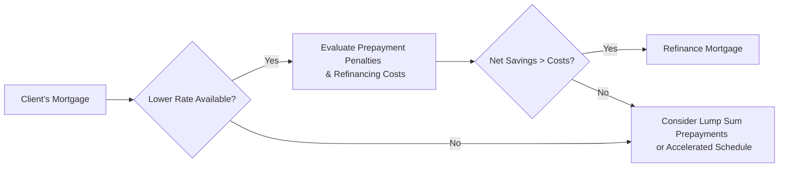

## 5.4 Methods of Reducing Interest Costs and Penalties

Effectively managing your mortgage and other consumer debt is a crucial part of any comprehensive wealth management plan. In Canada, reducing interest costs and penalties can help clients save thousands of dollars over the life of a mortgage, allowing them to build wealth more effectively. This section explores a range of strategies, from accelerated payment schedules and lump sum prepayments to refinancing, renegotiating terms, and avoiding penalties under standard mortgage agreements. By understanding these methods—and by applying them to real-world client scenarios—you can better guide Canadians in achieving long-term financial success.

---

## Accelerated Payment Schedules

An accelerated payment schedule involves paying mortgage installments more frequently or in larger amounts than the standard monthly setup. This approach reduces the outstanding principal more quickly, cutting down on total interest paid over the life of the loan.

### Bi-Weekly or Weekly Payments

• When clients opt for bi-weekly or weekly payments instead of monthly, they effectively make one or two extra monthly payments per year. This additional payment is applied directly to the principal, significantly reducing the amortization period.  
• For instance, if a mortgage is structured with a traditional 25-year amortization, switching to bi-weekly accelerated payments could shorten it by several years, leading to substantial interest savings.

### Lump Sum Prepayments

• Many lenders allow borrowers to apply lump sums toward their mortgage principal each year—often between 10% and 20% of the original principal—without incurring penalties.  
• Clients can use bonuses, inheritances, or tax refunds to reduce their outstanding balance. This can be done once or multiple times a year, depending on the mortgage contract’s terms.  
• By making these prepayments periodically, a homeowner can decrease the total interest paid and accelerate paying off the mortgage.

---

## Refinancing Best Practices

Refinancing a mortgage can be an efficient way to capitalize on lower interest rates, consolidate high-interest debts, or adjust mortgage terms to better fit a client’s changing financial situation.

### Lower Rate Opportunity

• If current rates are significantly lower than the existing mortgage rate, refinancing can generate notable savings on monthly payments.  
• However, it is crucial to account for potential breakage fees or penalties, which can quickly erode the advantage of a lower rate.  
• A general rule of thumb is to ensure that the potential savings from the lower interest rate exceed refinancing costs within a reasonable timeframe (commonly 12-24 months).

### Refinancing Costs

Before proceeding with a refinancing strategy, clients should evaluate the associated expenses:  
• Prepayment penalties (often referred to as “break fees”)  
• Legal fees  
• Appraisal costs  
• Possible administrative fees from the lender  

Financial planners should weigh these costs against the anticipated interest savings to see if the net benefit justifies refinancing. Proper modeling of potential savings versus costs is vital in this decision.

### Combining High-Interest Debt

• Homeowners can use home equity to consolidate higher-interest consumer debt such as credit card balances or personal loans.  
• This approach usually results in a lower overall effective interest rate.  
• However, it is crucial to ensure that clients maintain disciplined repayment habits. Rolling consumer debt into a mortgage can be counterproductive if the borrower racks up new high-interest debt soon after consolidation.

---

## Renegotiating Terms

Renegotiating mortgage terms can minimize penalties and potentially unlock more favorable rates or features.

### Early Renewal

• Some lenders permit mortgage holders to renew their term early—before the current term ends—if they want to lock in a lower rate.  
• This approach can help avoid all or part of a fixed-rate mortgage prepayment penalty.  
• The feasibility of early renewal without heavy penalties depends on the mortgage contract. Advisors should encourage clients to review their agreements or speak to their lender directly.

### Porting a Mortgage

• “Porting” a mortgage refers to transferring an existing loan and its terms to a new property.  
• Clients who relocate can keep their original mortgage conditions, such as interest rate and term, which might help avoid early repayment penalties.  
• Not all mortgages are portable, so verifying portability provisions beforehand is imperative.

---

## Avoiding Prepayment Penalties

Mortgage contracts, especially fixed-rate ones, can impose hefty fees if the borrower:

• Pays off the mortgage entirely before the term ends  
• Makes a payment beyond the permitted lump sum  
• Breaks the mortgage for refinancing or transferring to another lender  

### Prepayment Privileges

• Many lenders allow extra payments as part of the mortgage contract—known as “prepayment privileges”—without charging penalties.  
• Advisors should identify options to double-up payments, increase payment frequency, or add lump sums beyond the regular schedule.  
• Encouraging clients to take full advantage of these privileges can help reduce their interest burden without incurring penalties.

### Open vs. Closed Mortgages

• Open mortgages often come with higher interest rates but allow repayable amounts at any time without penalty.  
• Closed mortgages generally have lower rates but restrict early repayment unless a penalty is paid.  
• For clients expecting a windfall soon or planning to move in the near future, an open mortgage may be a better fit to avoid penalties. For those with a stable, long-term outlook, a closed mortgage can provide more cost-efficient financing.

---

## Balancing Short-Term Cash Flow and Long-Term Savings

While rapidly paying off a mortgage can save significant amounts in interest, financial planners must also ensure clients have adequate cash for day-to-day living and emergencies.

### Impact of Increased Monthly Payments

• Increasing monthly or bi-weekly payments will reduce the mortgage balance more quickly.  
• This approach helps reduce total interest costs, but the client’s monthly cash flow flexibility must remain manageable.  
• Advisors should use budgeting tools or cash flow analyses to determine whether an increased payment schedule aligns with the client’s financial stability.

### Maintaining an Emergency Reserve

• Clients often feel compelled to place every available dollar toward mortgage prepayments. However, lack of an emergency reserve can lead to financial stress.  
• Encouraging clients to keep a cushion for unexpected expenses—e.g., property repairs, health costs, or job loss—prevents potential future borrowing at higher interest rates.

---

## Practical Examples and Case Study

Let’s consider an example of Mr. James, who has a $400,000 mortgage with a 3.5% fixed interest rate from RBC. Originally, he chose a 25-year amortization with monthly payments. Midway through his term, market rates declined to 2.8%. He contemplates refinancing since RBC offers a new mortgage at 2.8% for a 5-year term.

• Refinancing Cost:  
  – Prepayment penalty is three months’ interest.  
  – Legal fees and appraisal costs total $1,200.  

• Monthly Payment Reduction:  
  – With the new 2.8% rate, Mr. James could save approximately $120 per month on interest.  

If the interest savings accumulate to $4,320 over three years, but refinancing fees total around $2,500, Mr. James stands to net $1,820 in savings over that period. Thus, refinancing becomes a viable option, especially if he intends to stay in his home for the subsequent years. However, if Mr. James expects to move in two years, it might be more prudent to port his mortgage to avoid an additional penalty upon selling.

---

The diagram above illustrates a simplified decision flow for mortgage holders in Canada to determine if refinancing is advantageous or whether other strategies—such as an accelerated payment schedule or lump sum prepayments—offer better value.

---

## Glossary

• **Accelerated Payment Schedule:** A payment structure that reduces the amortization period by making payments more frequently than monthly, such as bi-weekly or weekly.  
• **Refinancing:** Replacing an existing mortgage with a new one on potentially better terms or lower interest rates.  
• **Porting a Mortgage:** Applying current mortgage terms and interest rates to a new property, typically when moving or upgrading a home.  
• **Prepayment Penalty:** A fee charged by the lender if the mortgage is significantly prepaid or broken before the end of the term (common in closed mortgage arrangements).

---

## References and Additional Resources

• For guidelines on leveraging and to ensure penalty costs do not jeopardize a client’s financial situation, visit the Canadian Investment Regulatory Organization (CIRO):  
  [https://www.ciro.ca](https://www.ciro.ca)

• The Financial Consumer Agency of Canada (FCAC) provides interactive mortgage calculators, budget tools, and in-depth resources to analyze prepayment options:  
  [https://www.canada.ca/en/financial-consumer-agency.html](https://www.canada.ca/en/financial-consumer-agency.html)

• Provincial consumer protection offices often offer fact sheets on mortgages, refinancing, and borrower rights. Check your province’s website for updates.

• Suggested Reading:  
  “Mortgage Free!: Innovative Strategies for Debt-Free Home Ownership” by Douglas Gray

These resources focus primarily on Canadian regulations and opportunities but can be further expanded by comparing global mortgage structures and best practices.  

---

## Summary and Best Practices

Managing interest costs and minimizing penalties are crucial elements that financial planners in Canada must address when helping clients structure or restructure their mortgages. A comprehensive approach should integrate:

• Accelerated payment schedules (bi-weekly or weekly)  
• Lump sum prepayments subject to the lender’s prepayment privileges  
• Cost-benefit analysis of refinancing opportunities  
• Renegotiation strategies, including early renewal or porting  
• An assessment of prepayment penalties and sustainability of cash flow needs  

Navigating these strategies effectively requires continuous review, flexible planning, and in-depth knowledge of regulatory frameworks. By proactively implementing the above methods, Canadian financial planners can help clients optimize their repayment structure, reduce overall interest, and maintain healthy financial flexibility.

---

## Mortgage Interest Savings Quiz: Test Your Knowledge and Strategies



### Which strategy involves splitting mortgage payments into smaller but more frequent installments, leading to reduced total interest?

- [x] Accelerated payment schedule  
- [ ] Balloon payment schedule  
- [ ] Interest-only payment structure  
- [ ] Reverse mortgage setup  

> **Explanation:** Accelerated payment schedules, such as bi-weekly or weekly payments, effectively save on interest by shortening the amortization period.

### Which of the following are key costs to consider when refinancing a mortgage? (Select all that apply.)

- [x] Prepayment penalties  
- [x] Legal and appraisal fees  
- [ ] Sales tax adjustments  
- [ ] Insurance premium hikes  

> **Explanation:** Mortgage refinancing usually involves prepayment penalties for the old mortgage, along with legal and appraisal fees. Insurance premiums might be affected in some scenarios, but they are not typically major refinancing costs.

### In Canada, a typical prepayment privilege allows a borrower to pay what portion of the principal annually without penalties?

- [ ] 5% of the principal  
- [x] 10–20% of the principal  
- [ ] 70% of the principal  
- [ ] Unlimited prepayment  

> **Explanation:** Although specific allowance depends on the lender, many Canadian mortgage contracts permit 10–20% of the principal to be prepaid annually without incurring penalties.

### What is a potential downside of consolidating consumer debt into a home equity refinance?

- [x] Clients may re-accumulate high-interest debt if they aren’t disciplined  
- [ ] Home equity lines of credit usually charge higher interest rates than credit cards  
- [ ] Debt consolidation is considered illegal in most Canadian provinces  
- [ ] Cash flow is no longer a consideration  

> **Explanation:** While debt consolidation can reduce overall interest, disciplined repayment is necessary to avoid accumulating further high-interest debt.

### Which mortgage feature allows homeowners to transfer their current mortgage to a new property while keeping the same terms?

- [x] Porting  
- [ ] Locking in  
- [x] Early renewal  
- [ ] Buying down  

> **Explanation:** Porting a mortgage means transferring it to a new property under the same (or similar) interest rate and terms, potentially avoiding additional penalties. Early renewal, on the other hand, is renegotiating your mortgage term before it expires.

### How can accelerated bi-weekly payments reduce the total interest cost on a mortgage?

- [x] By applying an extra monthly payment to the principal each year  
- [ ] By eliminating the need for property taxes  
- [ ] By reducing the interest rate by half  
- [ ] By extending the amortization period  

> **Explanation:** Accelerated payments increase the frequency of payments, ensuring that more funds go toward the principal over time, thus reducing overall interest costs.

### Which of the following is NOT a refinancing cost to factor into a mortgage renewal decision?

- [x] Real estate commission fees  
- [ ] Prepayment penalty  
- [x] Mortgage default insurance (if applicable)  
- [ ] Legal and discharge fees  

> **Explanation:** Real estate commission fees typically occur during property sales, not during a refinance, whereas mortgage default insurance may or may not be recalculated depending on the loan-to-value ratio in the new mortgage structure. Both remain potential considerations, but real estate commission relates more directly to selling a home, not refinancing.

### Why might an open mortgage be more suitable for certain clients?

- [x] It allows for penalty-free lump sum repayments at any time  
- [ ] It offers the lowest market interest rate  
- [ ] It’s designed only for high-net-worth individuals  
- [ ] It guarantees no future rate changes  

> **Explanation:** Open mortgages generally have flexible repayment options without penalty, suitable for clients who anticipate paying off their mortgage or significantly reducing it in the near future.

### Which factor should be considered before making additional mortgage prepayments?

- [x] Whether an adequate emergency fund is maintained  
- [ ] The borrower’s professional designation  
- [ ] The aesthetic appeal of the home  
- [ ] The number of mortgage lenders left in the region  

> **Explanation:** Having an adequate emergency reserve is critical. Draining cash reserves for mortgage prepayments could leave borrowers financially vulnerable if unexpected expenses arise.

### Prepayment penalties in Canada are generally:

- [x] True  
- [ ] False  

> **Explanation:** Prepayment penalties exist in many fixed-rate mortgage contracts and are typically required if the borrower breaks the mortgage or makes extra payments above contractual limits.



---

## For Additional Practice and Deeper Preparation

**[1. WME Course For Financial Planners (WME-FP): Exam 1](https://www.udemy.com/course/csi-wme-fp-exam1/?referralCode=1A23C67E56971C0A73D5)**  
• Dive into 6 full-length mock exams—1,500 questions in total—expertly matching the scope of WME-FP Exam 1.  
• Experience scenario-driven case questions and in-depth solutions, surpassing standard references.  
• Build confidence with step-by-step explanations designed to sharpen exam-day strategies.

**[2. WME Course For Financial Planners (WME-FP): Exam 2](https://www.udemy.com/course/csi-wme-fp-exam2/?referralCode=25879CCDED7B7905BBA8)**  
• Tackle 1,500 advanced questions spread across 6 rigorous mock exams (250 questions each).  
• Gain real-world insight with practical tips and detailed rationales that clarify tricky concepts.  
• Stay aligned with CIRO guidelines and CSI’s exam structure—this is a resource intentionally more challenging than the real exam to bolster your preparedness.

> Note: While these courses are specifically crafted to align with the WME-FP exam outlines, they are independently developed and not endorsed by CSI or CIRO.

---
