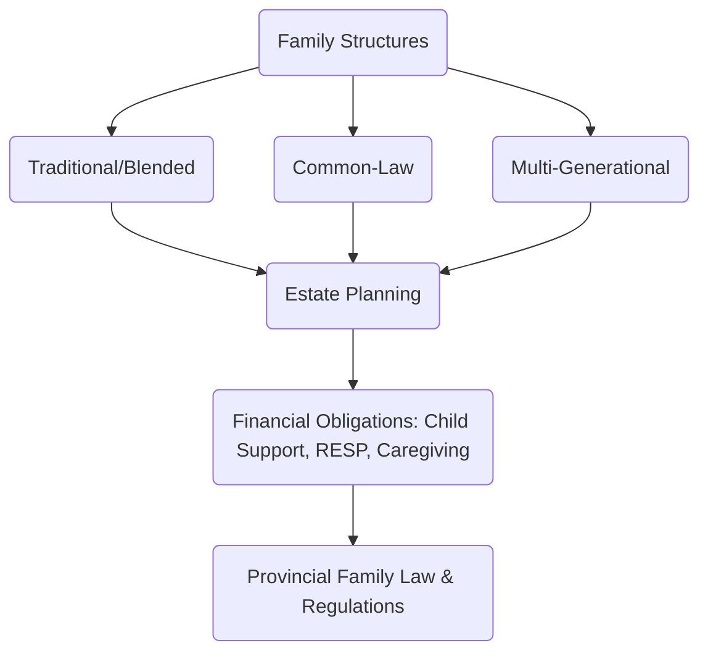

## 6.1 Family-Related Issues

Financial planning for families in Canada has grown increasingly complex, partly due to changing family structures, cultural considerations, and evolving legal frameworks across provinces. In this section, we examine the financial, legal, and cultural elements that impact family-related strategies. By understanding these dynamics, advisors can build more comprehensive and personalized wealth plans. Specifically, we will explore:

1. Financial Planning within Varied Family Structures (Traditional vs. Blended, Common-Law, Multi-Generational)  
2. Cultural and Religious Factors  
3. Responsibilities to Minor Children or Dependents  
4. Caregiving Roles and Responsibilities  
5. Glossary of Key Terms

We also provide references to official Canadian regulations and other resources to help you navigate the complexities of family law and wealth management.

---

### Financial Planning Within Varied Family Structures

Canadian families come in all forms, each having its own set of financial considerations. Understanding the nuances of these distinct structures and how provinces handle such relationships is critical for sound financial planning.

#### Traditional vs. Blended Families

• In a traditional family, both partners may be in their first marriage with children who are biologically related to both. Estate planning and beneficiary designations are often straightforward.  
• Blended families (often including stepchildren) require careful attention to beneficiary designations, property rights, and estate distribution. If one or both partners have children from previous relationships, the advisor must coordinate spousal entitlements with provisions for stepchildren.  
• Common pitfalls:  
  - Not updating wills and beneficiary designations after remarriage.  
  - Overlooking child support or spousal support obligations from prior relationships.  
  - Failing to negotiate or review domestic contracts (e.g., prenuptial, marriage, or cohabitation agreements).  

##### Example: Divorce and Remarriage in Ontario  
An individual divorces in Ontario and remarries shortly after. He has two children from the previous marriage. If he does not update his will or life insurance beneficiary designations, the existing documents might leave assets to his former spouse. This could undermine his intention to provide for his new spouse and stepchildren.  

#### Common-Law Relationships

• Definition varies by province: For instance, in Ontario, couples must live together in a conjugal relationship for three years (or have a child together) to be considered common-law. Other provinces, such as British Columbia, consider two years of cohabitation.  
• Property division rules: Common-law partners are usually not entitled to the same property rights as legally married spouses unless specified in a cohabitation agreement. Advisors should confirm provincial legislation to help clients understand ownership rights to the family home, personal property, and retirement assets.  
• Estate considerations: In certain provinces, common-law partners may not automatically inherit property without a will. This underscores the importance of a carefully drafted will to protect each partner’s interests.

##### Example: Common-Law Cohabitation in Alberta  
In Alberta, the Family Property Act may extend certain rights to “adult interdependent partners.” If you are advising a couple who has lived together for at least three years (or a shorter period if they have a child), ensure they understand that the law may treat them as partners for specific property divisions and support obligations.

#### Multi-Generational Households

• Rising housing costs and cultural preferences have contributed to an increase in multi-generational living arrangements. These may include grandparents, adult children, and grandchildren sharing one home.  
• Advisors should clarify financial responsibilities within these households:  
  - Who holds the mortgage or property title?  
  - How are monthly expenses split?  
  - What are the loan or liability arrangements for renovations or major household expenses?  
• Estate planning challenges can arise if multiple individuals contribute to the property’s down payment or mortgage. Ownership stakes must be documented legalistically to avoid future disputes.  

---

### Cultural and Religious Factors

Cultural and religious practices can shape financial decisions involving marriage, inheritance, and charitable giving. Advisors should remain respectful and open-minded:  

• Marriage Contracts in Certain Cultures: Marriage contracts or religious agreements could influence the distribution of assets or responsibilities. These may not necessarily align with provincial family law, making it essential to obtain legal advice in parallel.  
• Inheritance Practices: Some traditions emphasize passing wealth to male heirs or require particular bequests to extended family members. This may necessitate specialized trust arrangements or estate plans.  
• Charitable Giving: Religious obligations, such as zakat in Islamic practice, can influence charitable giving strategies. Advisors can integrate these obligations into a financial plan to reflect a client’s values.

---

### Responsibilities to Minor Children or Dependents

Financial professionals can help families fulfill legal obligations and personal goals relating to children’s well-being and education.

#### Educational Costs and RESP Planning

• A Registered Education Savings Plan (RESP) allows tax-deferred growth on contributions, and the Government of Canada provides matching grants (Canada Education Savings Grant) up to certain limits.  
• When planning for future education expenses:  
  1. Establish how much the parents intend to contribute.  
  2. Select an appropriate RESP provider (e.g., RBC, TD, or other Canadian banks) and investment strategy.  
  3. Take advantage of matching government grants, up to the maximum allowable each year.  

##### Example Calculation:  
Suppose parents contribute $2,500 annually to an RESP. The Canada Education Savings Grant provides 20% per year on the first $2,500 contributed, amounting to $500. Over 15 years, these contributions plus grant and compounding can significantly offset post-secondary tuition costs.

#### Child Support

• Provincial child support guidelines, such as those found on the [Department of Justice Canada](https://www.justice.gc.ca) website, dictate the minimum required financial support for a child’s basic needs—including health care, educational, and living expenses.  
• Child support amounts are typically calculated based on the income of the non-custodial parent and the number of children.  
• For families with shared custody, income differentials can determine the net support amount. Advisors should incorporate child support obligations into cash flow planning, savings goals, and insurance coverage to ensure consistent financial stability for dependents.

---

### Caregiving Roles and Responsibilities

As Canada’s population ages, many families face eldercare responsibilities. Financial advisors should consider:

• Retirement Planning Adjustments: Caregiving for older parents may require clients to reduce working hours or retire earlier, decreasing their own retirement savings. Planning should account for a potential drop in wage income or accelerated use of savings to cover care expenses.  
• Health and Long-Term Care Insurance: Insurance coverage or personal savings might be needed to fund assisted living, home care, or medical treatments not covered by provincial health plans.  
• Estate Implications: When adult children become caregivers, it can affect how assets are distributed. Some parents compensate caregiving children through specific bequests or property transfers, raising questions about tax implications and fairness among siblings.

Below is a simplified flowchart illustrating typical family-related financial obligations and interactions with Canadian provincial laws:

**Diagram Explanation:**  
1. Family Structures (Traditional, Blended, Common-Law, Multi-Generational) connect to Estate Planning considerations (Wills, beneficiary updates, property ownership).  
2. All estate and financial planning obligations (child support, sponsoring RESP, caregiving costs) intersect with specific provincial family law rules.

---

### Glossary

• **Blended Family:**  
  A family unit where one or both partners have children from previous relationships, merging into the new household.  

• **Common-Law Relationship:**  
  A living arrangement where two individuals cohabit in a marriage-like relationship yet are not formally married. Definitions differ across Canadian provinces.  

• **RESP (Registered Education Savings Plan):**  
  A tax-sheltered account used to save for a child’s or grandchild’s post-secondary education. The government may provide matching contributions through grants.  

• **Child Support:**  
  A legal obligation in family law requiring parents to provide financial support for a child’s upbringing, usually calculated under provincial guidelines.

---

### Key Takeaways and Best Practices

1. Confirm Each Province’s Requirements.  
   • Advisors should always verify provincial legislation regarding property rights, support obligations, and spousal entitlements for common-law and blended families.  

2. Maintain Up-to-Date Documentation.  
   • Encourage clients to update wills, beneficiary designations, and insurance policies after marital status changes, births, or adoptions.  

3. Consider Cultural and Religious Influences.  
   • Integrate a family’s cultural or religious practices into financial plans, particularly regarding marriage contracts or inheritance customs.  

4. Factor in Caregiving and Multi-Generational Living.  
   • Discuss financial arrangements and legal agreements for any multi-generational mortgage or caregiving responsibilities.  

5. Leverage Available Resources.  
   • The [Department of Justice Canada](https://www.justice.gc.ca) website, and each province’s family law statutes (e.g., [Ontario’s Family Law Act](https://www.ontario.ca/laws/statute/90f03), [Alberta’s Family Property Act](https://www.qp.alberta.ca), [British Columbia’s Family Law Act](https://www.bclaws.gov.bc.ca)), provide guidance on child support, property division, and other matters.  
   • The [Financial Consumer Agency of Canada (FCAC)](https://www.canada.ca/en/financial-consumer-agency.html) offers resources on budgeting for multi-generational households.  

6. Engage Specialists.  
   • Collaborate with family law attorneys, tax accountants, and estate specialists to address complex issues like second marriages, intergenerational wealth transfers, and cultural obligations.

---

### Practical Exercises

1. Ask your client to draft a family tree and note all key relationships: marriages, stepchildren, living parents or grandparents, siblings providing or needing care, and so forth. Use this map to identify financial responsibilities (e.g., child support, spousal support, shared property).  
2. Review a sample will or beneficiary designation. Practice identifying where the structure of a blended or common-law family might require changes to align with the client’s intentions.  
3. Calculate the potential growth of an RESP over 15 years, factoring in yearly contributions and government grants. Analyze how this might affect other savings goals.

---

### Additional Resources

• “The Family Financial Toolkit” by Janice Goldman. This publication discusses strategy and communication for complex family financial situations.  
• [Department of Justice Canada](https://www.justice.gc.ca) for official child support guidelines.  
• Provincial Legislation Websites:  
  - [Ontario Family Law Act](https://www.ontario.ca/laws/statute/90f03)  
  - [Alberta Family Property Act](https://www.qp.alberta.ca)  
  - [British Columbia Family Law Act](https://www.bclaws.gov.bc.ca)  
• [Financial Consumer Agency of Canada (FCAC)](https://www.canada.ca/en/financial-consumer-agency.html) on practical budgeting for families.

---

## Test Your Knowledge: Canadian Family Law & Financial Planning Quiz



### What is a key financial consideration when advising a blended family regarding estate planning?

- [ ] Maintaining a single joint will for simplicity.  
- [ ] The assumption that stepchildren will automatically inherit assets.  
- [x] Ensuring wills and beneficiary designations clearly outline obligations to stepchildren and spouses.  
- [ ] Relying solely on a verbal agreement between spouses.  

> **Explanation:** In a blended family, legal documents (such as wills and beneficiary designations) must be reviewed and updated to recognize the rights of children from previous relationships and new spouses. Without explicit documentation, conflicts and unintended consequences may arise.

### Which statement accurately describes a common-law relationship in Canada?

- [x] The definition and legal treatment vary by province.  
- [ ] It is federally defined and identical across all provinces.  
- [ ] Common-law partners always have the same property rights as married couples.  
- [ ] Canada does not recognize common-law partnerships.  

> **Explanation:** Each province has its own criteria for recognizing common-law partnerships, which may affect property rights, inheritance, and spousal support differently.

### Why are multi-generational households becoming more prevalent in Canada?

- [ ] Government mandates require children to live with parents after age 18.  
- [x] Rising housing costs and cultural preferences encourage families to live together.  
- [ ] It is illegal for elderly parents to live alone.  
- [ ] Only single individuals can own property.  

> **Explanation:** Many families opt for multi-generational living due to economic factors like housing affordability and cultural or personal preferences.

### Which of the following is generally not covered by provincial child support guidelines?

- [x] Post-secondary tuition for unrelated family members.  
- [ ] Basic living expenses for a minor child.  
- [ ] Medical and dental insurance premiums for the child.  
- [ ] Educational costs for a mandatory school program.  

> **Explanation:** Child support typically covers a child’s basic living and educational expenses, but it does not cover costs incurred by unrelated family members.

### In a Registered Education Savings Plan (RESP), how does the Canada Education Savings Grant (CESG) benefit contributors?

- [ ] It eliminates all taxes on contributions.  
- [x] It provides a 20% matching grant on contributions up to a certain annual limit.  
- [ ] It guarantees an annual 10% return on the RESP.  
- [ ] It completely waives tuition fees at Canadian universities.  

> **Explanation:** The CESG matches 20% of annual contributions (up to the specified limit), boosting total savings for a child’s post-secondary education.

### How can caregiving responsibilities for aging parents impact a client’s retirement plan?

- [ ] They have no effect on retirement planning.  
- [ ] They ensure the client will retire later and with higher savings.  
- [ ] They lower the need for personal savings.  
- [x] They may require earlier retirement, reduced contributions, or increased expenses.  

> **Explanation:** Providing care to older relatives can result in unforeseen financial strains, including reduced work hours and higher healthcare costs, impacting the client’s overall retirement strategy.

### Which resource provides official child support guidelines in Canada?

- [x] The Department of Justice Canada website.  
- [ ] A personal finance blog.  
- [ ] The BC Securities Commission.  
- [ ] The TSX (Toronto Stock Exchange).  

> **Explanation:** The Department of Justice Canada offers official guidelines and calculators for determining child support obligations.

### Under which circumstance might common-law partners automatically inherit each other’s property in some Canadian provinces?

- [x] If the provincial law grants property division or inheritance rights to adult interdependent partners.  
- [ ] If they cohabited for under a year.  
- [ ] All provinces treat common-law the same as legal marriage.  
- [ ] Only if a trust company intervenes.  

> **Explanation:** Certain provinces (like Alberta for adult interdependent partners) provide legal rights in property division or inheritance. However, not all provinces share these rules, and legal definitions vary.

### Which family document is most important to update when a new child is born or adopted?

- [x] A will and beneficiary designations.  
- [ ] Business incorporation papers.  
- [ ] Credit card statements.  
- [ ] A personal diary.  

> **Explanation:** Ensuring that the will and beneficiary designations reflect new dependents is vital to secure their inheritance and care.

### True or False: Blended families sometimes require special trust arrangements to ensure asset protection for both the surviving spouse and any children from previous relationships.

- [x] True  
- [ ] False  

> **Explanation:** Trusts can help segregate assets to protect children’s inheritances while still providing for the surviving spouse, mitigating conflicts and uncertainty.



---

## For Additional Practice and Deeper Preparation

**[1. WME Course For Financial Planners (WME-FP): Exam 1](https://www.udemy.com/course/csi-wme-fp-exam1/?referralCode=1A23C67E56971C0A73D5)**  
• Dive into 6 full-length mock exams—1,500 questions in total—expertly matching the scope of WME-FP Exam 1.  
• Experience scenario-driven case questions and in-depth solutions, surpassing standard references.  
• Build confidence with step-by-step explanations designed to sharpen exam-day strategies.

**[2. WME Course For Financial Planners (WME-FP): Exam 2](https://www.udemy.com/course/csi-wme-fp-exam2/?referralCode=25879CCDED7B7905BBA8)**  
• Tackle 1,500 advanced questions spread across 6 rigorous mock exams (250 questions each).  
• Gain real-world insight with practical tips and detailed rationales that clarify tricky concepts.  
• Stay aligned with CIRO guidelines and CSI’s exam structure—this is a resource intentionally more challenging than the real exam to bolster your preparedness.

> Note: While these courses are specifically crafted to align with the WME-FP exam outlines, they are independently developed and not endorsed by CSI or CIRO.
