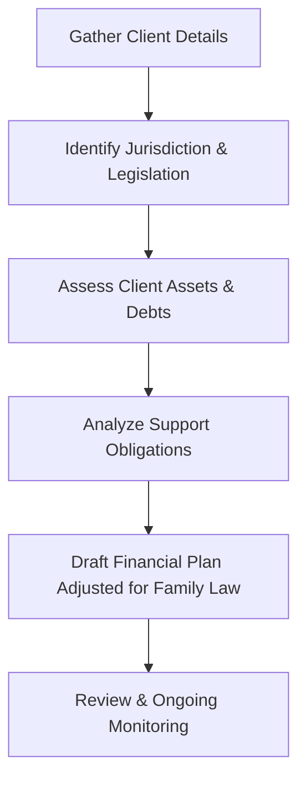

## 6.2 Fundamental Aspects of Family Law

Family law intersects significantly with financial planning and wealth management. As a financial planner, you will often advise clients on the economic implications of marriage, divorce, property division, and support obligations. Effective planning means understanding the fundamentals of Canadian family law, which varies from province to province. In this section, we will explore key principles governing family relationships, focusing on how legal frameworks guide the division of property, the obligations for child and spousal support, and the essential enforcement mechanisms.

---

## Provincial Jurisdiction over Family Matters

In Canada, most family matters—such as marriage formation, marital property division, child custody, and support obligations—are governed by provincial and territorial legislation. The federal Divorce Act governs divorce and related child or spousal support amid divorce proceedings, but issues like property division and enforcement often fall under provincial jurisdiction.

A few key points to note:

• Each province or territory has its own legislation and court system addressing family law issues.  
• While some principles remain broadly consistent across Canada (e.g., the “best interests of the child” for custody decisions), the specific rules and application can differ depending on the province.  
• As a financial planner, it is prudent to develop a network of family law specialists to navigate provincial differences effectively.

---

## Marriage and Divorce

### Legal Requirements for Marriage

Marriage rules differ slightly by province or territory, but generally include:

1. Age Requirements:  
   • The age of majority (18 or 19, depending on the province) must be reached, or the minor must have parental/guardian consent.  
   • Individuals under a certain age (e.g., under 16) cannot legally marry in Canada.

2. Consent:  
   • Both parties must willingly enter into the marriage.  
   • Factors like coercion, fraud, or mental incapacity can invalidate a marriage if consent was not freely given.

3. Compliance with Provincial Regulations:  
   • Couples must obtain a marriage license.  
   • A legally authorized person (e.g., clergy, judge, or justice of the peace) must officiate.  
   • Marriage ceremonies must adhere to provincial requirements for witnessing and documentation.

### Grounds for Divorce

Divorce in Canada is regulated under the federal Divorce Act. The primary ground for divorce is the breakdown of the marriage, which can be established in one of three ways:

1. Living Separate and Apart for One Year:  
   • The most commonly used ground.  
   • Spouses must live separate and apart for at least one year (they can still reside in the same home but act separately in daily life).  

2. Fault-Based Grounds:  
   • Adultery.  
   • Physical or mental cruelty.  
   These grounds are less common and typically more contentious, often requiring proof of misconduct.

### Custody and Access

When children are involved, custody and parenting arrangements remain paramount during and after the divorce process. Courts apply the “best interests of the child” standard, considering factors such as:

• The child’s emotional and physical well-being.  
• Stability and continuity in the child’s day-to-day life.  
• Each parent’s ability to provide proper care, guidance, and emotional support.  

Common arrangements include sole custody, joint custody, or shared parenting time. Financial planners should be aware of how these arrangements can impact child support obligations and overall family cash flows.

---

## Support Obligations

### Child Support

Child support follows the Federal Child Support Guidelines or relevant provincial guidelines, depending on whether the support stems from a divorce (federal) or separation between common-law partners (provincial). Key points include:

• Support amounts are determined primarily by the paying parent’s gross income and the number of children.  
• Special or extraordinary expenses—such as day care, medical expenses, or extracurricular activities—may be shared in proportion to the parents’ incomes.  
• Child support is generally non-taxable to the recipient, and non-deductible by the payer, though certain exceptions may exist.

Understanding child support is crucial in preparing a client’s financial plan, as it affects both short- and long-term cash flow projections. For example, an RBC or TD banking client receiving child support will want to plan how funds flow through their savings and investment accounts to cover child-related expenses.

### Spousal Support

Spousal support addresses the economic disadvantage one spouse may face following separation or divorce. Courts weigh multiple factors:

• The length of the marriage or relationship.  
• Roles played during the marriage, including child-rearing and career sacrifices.  
• Future income prospects and each spouse’s ability to be self-sufficient.  

The federal Spousal Support Advisory Guidelines may be applied by the courts as a reference to determine potential ranges for the amount and duration of support. Spousal support is typically taxable income for the recipient and tax-deductible for the payer if established by court order or written agreement, although the tax treatment can differ based on structuring (e.g., lump-sum vs. periodic payments).

---

## Property Division Principles

### Equalization or Division

In many provinces and territories, the law presumes that spouses share equally in property acquired during the marriage. Depending on the jurisdiction, this can take the form of:

• An “equalization” payment: Where one spouse with a higher net family property pays the other spouse an amount to equalize their net worth.  
• A division of property: Where the property itself is split between spouses on a 50/50 basis, subject to provincial rules.  

Financial planners often help clients inventory their assets and liabilities. Examples might include:

• Family homes or investment properties.  
• Retirement savings plans (RRSPs), Tax-Free Savings Accounts (TFSAs), and employer-sponsored pension plans.  
• Non-registered investment portfolios or shares in privately held corporations.  

The division of these assets can significantly impact a client’s financial situation. Cash flow or risk levels can change if, for example, the client must increase contributions to a mortgage or comply with new property ownership arrangements.

### Exemptions

Some property—such as inheritances, gifts, or property owned before the marriage—may be partially or fully exempt, depending on the province and the nature of the property. However, increases in market value of these assets during the marriage may be subject to sharing. For instance, if a spouse owned 1,000 shares in a major Canadian bank (e.g., RBC) before marriage, the original share value might be exempt, but any appreciation during the relationship might be divided. 

If couples wish to protect specific assets from distribution, legal instruments such as domestic contracts or prenuptial agreements may clarify exemptions. As a financial planner, encourage your clients to seek legal advice proactively if they have unique or high-value assets prior to marriage.

---

## Enforcement Mechanisms

Many provinces have a Maintenance Enforcement Program (MEP) to ensure child and spousal support orders or agreements are upheld. Key enforcement tools include:

• Wage garnishments, where amounts are deducted directly from a payer’s salary.  
• Suspension of driver’s licenses or passports for significant arrears.  
• Registration of arrears as liens against property or other assets.  

For financial planners, it is important to understand that these mechanisms can affect wage allotments, business cash flows, or credit profiles when support obligations remain unmet. Clients who fail to comply risk significant legal and financial consequences.

---

## Practical Example and Case Study

Consider a married couple, Alex and Priya, who own a home in Ontario with a mortgage at RBC. Alex also holds a substantial Registered Retirement Savings Plan (RRSP), while Priya has a modest TFSA and invests in a TD non-registered brokerage account. After 10 years of marriage, they decide to separate:

1. Child Support: Alex remains the primary caregiver of their two children. Priya’s income is higher, so, under the Federal Child Support Guidelines, she must pay monthly child support.  
2. Spousal Support: Because Alex left a corporate career to look after the children, the court might award spousal support to Alex, reflecting the economic disadvantage from lost career progression.  
3. Property Division: Their matrimonial home, RRSPs, and brokerage accounts may be tallied to determine who owes an equalization payment. Priya’s inherited cottage may be partially exempt, but the appreciation in the cottage’s value during marriage may be considered in the equalization process.  
4. Enforcement: If Priya fails to pay child or spousal support, Alex can enlist the Ontario Family Responsibility Office to enforce the court order, potentially garnishing Priya’s wages.

From a planning perspective, each client’s cash flow, debt management, retirement strategy, and investment plan need adjusting to reflect child support, spousal support obligations, and asset division.

---

## Step-by-Step Guidance for Financial Planners

Below is a simplified workflow diagram detailing how a financial planner might approach family law matters when advising clients:

1. Gather Client Details: Collect full financial records, marital status, custody arrangements, and personal goals.  
2. Identify Jurisdiction & Legislation: Confirm the province or territory’s law, and whether the Divorce Act (federal) or provincial law applies.  
3. Assess Client Assets & Debts: Identify which assets may be subject to division or exempt. Update net worth statements.  
4. Analyze Support Obligations: Determine child and/or spousal support obligations under the Federal Child Support Guidelines, Spousal Support Advisory Guidelines, or provincial equivalents.  
5. Draft an Adjusted Financial Plan: Reflect new cash flows associated with support or property division in retirement planning or investment strategies.  
6. Review & Ongoing Monitoring: Continually update the plan to account for changes in client income, support obligations, or asset valuations.

---

## Best Practices and Common Pitfalls

### Best Practices

• Collaborate with Family Law Experts: Work together with lawyers or mediators for clarity on provincial regulations.  
• Document All Assets: Encourage clients to maintain thorough records of their assets, including the date and cost of acquisition.  
• Update Estate Plans: Changes in family status frequently require updating wills, beneficiaries of RRSPs or TFSAs, and Powers of Attorney.

### Common Pitfalls

• Overlooking Future Obligations: Ignoring cost-of-living increases or “extraordinary expenses” for child support can create financial strain.  
• Inadequate Communication: Failing to coordinate with other professionals (e.g., accountants, appraisers, real estate agents) may result in incomplete advice.  
• Underestimating Tax Implications: Remember that spousal support often has tax consequences for both payer and recipient.  

---

## Additional Resources

• [Divorce Act (federal legislation)](https://laws-lois.justice.gc.ca/eng/acts/d-3.4/)  
• Provincial Ministries or Departments of Justice for local family law regulations and support enforcement:  
  – [Ontario Family Responsibility Office](https://www.mcss.gov.on.ca/en/mcss/programs/familyResponsibility/)  
  – [Alberta Maintenance Enforcement Program](https://www.alberta.ca/maintenance-enforcement-program.aspx)  
• [FP Canada](https://www.fpcanada.ca): Professional standards on incorporating legal and financial considerations in family planning.  
• Suggested Reading: “Canadian Family Law” by Malcolm C. Kronby for a deep dive into Canada’s family law landscape (including updates from case law and legislative reforms).

---

## Summary

Understanding the fundamental aspects of family law is essential for financial planners advising clients through marriage, separation, or divorce. By recognizing the nuances of child and spousal support, property division, and enforcement mechanisms, planners can provide clients with a robust and well-informed strategy to secure their financial future. Maintaining current knowledge of provincial regulations and collaborating with relevant legal professionals ensures that solutions are both relevant and legally sound.

---

## Test Your Knowledge: Canadian Family Law Essentials Quiz



### Which of the following is the most common ground for divorce in Canada?

- [x] One-year separation.  
- [ ] Adultery.  
- [ ] Physical cruelty.  
- [ ] Mental cruelty.  

> **Explanation:** The primary and most frequently used ground for divorce in Canada is a one-year separation under the Divorce Act. Evidence of fault-based grounds (e.g., adultery, cruelty) is less commonly pursued because demonstrating an uncontested separation of one year is typically simpler.

### Which level of government in Canada primarily governs the division of matrimonial property?

- [x] Provincial or territorial government.  
- [ ] Federal government.  
- [ ] Municipal government.  
- [ ] None of the above.  

> **Explanation:** While the federal Divorce Act defines Canada’s national framework for divorce proceedings, provinces and territories handle property division upon relationship breakdown.

### Under the Federal Child Support Guidelines, what is the primary factor for determining the base child support amount?

- [x] The paying parent’s gross annual income.  
- [ ] The child’s specific daily expenses.  
- [ ] The paying parent’s net worth.  
- [ ] The custody arrangement.  

> **Explanation:** The Federal Child Support Guidelines link the base amount of support to the paying parent’s gross income and the number of children, although custody arrangements and special expenses are also considered.

### What is a common enforcement mechanism for unpaid child or spousal support?

- [x] Wage garnishment by a Maintenance Enforcement Program.  
- [ ] Voluntary payment programs.  
- [ ] Discretionary measures by the payer’s employer.  
- [ ] Automatic release of arrears.  

> **Explanation:** Provinces have Maintenance Enforcement Programs that can garnish wages or implement other measures (like liens or license suspension) to ensure compliance with support orders.

### Which of the following scenarios typically triggers the use of the Spousal Support Advisory Guidelines?

- [x] A spouse experiencing economic disadvantage following a divorce or separation.  
- [ ] A minor child’s request for new clothing.  
- [x] A long-term marriage where one spouse sacrificed a career for family duties.  
- [ ] A spouse who remains financially independent post-separation.  

> **Explanation:** Spousal support is intended to address economic disadvantages arising from decisions or sacrifices within the marriage. The Spousal Support Advisory Guidelines help determine an appropriate range for spousal support in such cases.

### In many provinces, how is matrimonial property acquired during marriage generally divided?

- [x] Equally between the spouses.  
- [ ] According to the original ownership.  
- [ ] Solely to the higher-earning spouse.  
- [ ] To the spouse with primary custody of the children.  

> **Explanation:** Property acquired during marriage is typically shared equally, though each province’s legislation has specific rules and potential exemptions.

### Which statement best describes an exempt asset in property division?

- [x] An asset that is excluded from division, often because it was acquired before marriage or through inheritance.  
- [ ] An asset that must be automatically shared.  
- [x] An asset that has no appreciation in value.  
- [ ] An asset whose appreciation cannot be divided.  

> **Explanation:** Certain property, like inheritances or gifts, can be exempt from division. However, any increase in the value of the exempt asset during the marriage may be split, depending on specific provincial rules.

### What is the primary goal of the “best interests of the child” standard where custody is concerned?

- [x] Ensuring the child’s emotional and physical well-being is the priority.  
- [ ] Guaranteeing a 50/50 parenting schedule.  
- [ ] Minimizing legal disputes between spouses.  
- [ ] Maximizing parental income.  

> **Explanation:** Courts evaluate a variety of factors to protect the child’s overall security and stability, always guided by the “best interests of the child.”

### Which of the following is a crucial reason financial planners should track child support payments carefully?

- [x] They impact a client’s monthly cash flow and overall financial plan.  
- [ ] They are tax-deductible for the recipient.  
- [ ] They replace investment income.  
- [ ] They eliminate the need for a maintenance enforcement program.  

> **Explanation:** Child support must be reflected in a client’s budget and may influence short- and long-term savings strategies. It doesn’t typically provide any direct tax benefits but is essential to track to ensure compliance and accurate financial planning.

### True or False: Spousal support payments are always tax-free for the recipient.

- [x] True  
- [ ] False  

> **Explanation:** Under court orders or written agreements, spousal support is generally taxable to the recipient and tax-deductible for the payer if paid periodically. However, exceptions can arise for lump-sum settlements or specific arrangements. Always consult a tax specialist.



---

## For Additional Practice and Deeper Preparation

**[1. WME Course For Financial Planners (WME-FP): Exam 1](https://www.udemy.com/course/csi-wme-fp-exam1/?referralCode=1A23C67E56971C0A73D5)**  
• Dive into 6 full-length mock exams—1,500 questions in total—expertly matching the scope of WME-FP Exam 1.  
• Experience scenario-driven case questions and in-depth solutions, surpassing standard references.  
• Build confidence with step-by-step explanations designed to sharpen exam-day strategies.

**[2. WME Course For Financial Planners (WME-FP): Exam 2](https://www.udemy.com/course/csi-wme-fp-exam2/?referralCode=25879CCDED7B7905BBA8)**  
• Tackle 1,500 advanced questions spread across 6 rigorous mock exams (250 questions each).  
• Gain real-world insight with practical tips and detailed rationales that clarify tricky concepts.  
• Stay aligned with CIRO guidelines and CSI’s exam structure—this is a resource intentionally more challenging than the real exam to bolster your preparedness.

> Note: While these courses are specifically crafted to align with the WME-FP exam outlines, they are independently developed and not endorsed by CSI or CIRO.
