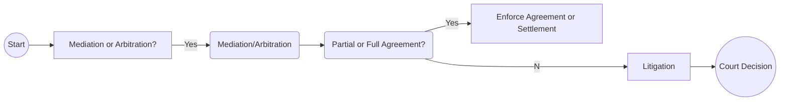

## 6.4 Property Issues on Relationship Breakdown

This section addresses the legal and financial complexities involved in the division of property when a marriage or common-law relationship ends in Canada. We will explore how provincial legislation influences which assets are considered family property, methods of valuing those assets, and how both the courts and alternative dispute resolution processes approach property division. We will also examine the role of financial advisors in managing taxation and ensuring that each party’s long-term financial goals are safeguarded.

--------------------------------------------------------------------------------

### Introduction

When spouses separate or divorce, determining how to divide assets is often one of the most contentious and complex processes. Canadian jurisdictions recognize that each partner contributed—financially or otherwise—to the accumulation of marital or family assets. Consequently, the law typically requires an equitable division or “equalization” of these assets.

On the other hand, certain assets, such as property belonging to one spouse prior to marriage or personal gifts, may be subject to exclusion rules, resulting in either a partial or total exemption from division. In this chapter, we will outline the main categories of family property, introduce valuation principles, summarize the most common dispute resolution processes, and highlight the tax implications that family law practitioners and financial advisors should consider.

--------------------------------------------------------------------------------

### Division of Family Property

In most Canadian provinces, the legislation addressing family property relies on the principle that both spouses share equally in the financial gains made during the marriage. However, specifics can vary across provinces (for instance, in Ontario under the Family Law Act or in British Columbia under the Family Law Act of BC). Before working with clients, it is crucial to verify the jurisdiction-specific rules.

#### Identification of Family Assets

Family or matrimonial property generally encompasses:

• Real Estate: The matrimonial home, vacation properties such as cottages, and rental properties.  
• Vehicles: Cars, boats, recreational vehicles if acquired during the marriage.  
• Bank Accounts and Investments: Joint and individual accounts often form part of family property unless they are linked to excluded sources.  
• Business Interests: Shares or partnership interests in private corporations or professional practices.  
• Pensions and Registered Plans: Workplace pensions and Registered Retirement Savings Plans (RRSPs).  
• Other Investments: Security portfolios (stocks, bonds, mutual funds, or Exchange-Traded Funds), Tax-Free Savings Accounts (TFSAs), and other wealth accumulation vehicles.

#### Exclusions

While each province has its nuances, the following assets are commonly excluded:

• Property Owned Prior to Marriage: The original value may be excluded, but any growth in value might be partially shareable.  
• Inheritances: In many jurisdictions, inheritances are excluded as long as they remain traceable and have not been commingled with family assets.  
• Personal Gifts: Gifts from third parties specifically to one spouse—again, provided they remain traceable.  
• Damages from Personal Injury: Settlement monies (such as disability payouts) may be excluded, subject to tracking.

One complexity arises if excluded property (e.g., inherited funds) is used to purchase a matrimonial home, which often triggers different rules. Advisors must therefore help clients maintain clear records and documentation so they can trace the value and source of assets.

#### Impact on Retirement Plans

Retirement plans, including RRSPs, RPPs (Registered Pension Plans), pensions under the Canada Pension Plan (CPP), and other registered plans, can be split during a relationship breakdown.

• Splitting Pension Entitlements: Pension legislation and family law legislation frequently allow for pension splitting (formally known as a “Division of Pension,” depending on the plan and province).  
• Splitting RRSPs: Transfer of RRSP assets from one spouse’s plan to the other’s may be done on a tax-deferred basis if it meets CRA requirements.  
• Tax and Liquidity Ramifications: While the rollover provisions help defer tax, the liquidity implications for each spouse must be considered. For instance, drawing on RRSPs early can cause unforeseen tax liabilities.

Financial advisors should offer guidance to ensure that the division of retirement assets aligns with each spouse’s long-term financial well-being, including future retirement prospects.

--------------------------------------------------------------------------------

### Valuation Methods

Valuing assets at separation can be straightforward in the case of liquid investments traded on public markets. However, tangible property such as real estate or livestock on farmland and intangible property such as business interests require careful and sometimes specialized approaches.

#### Fair Market Value

For most real estate holdings, publicly traded securities, and standard vehicles, fair market value (FMV) is typically used. FMV represents the highest price an asset would fetch in an open market between informed and willing parties. In many provinces, the relevant date is the date of separation, though the law may specify a different date to reduce disputes.

#### Business Valuations

When a family business or professional practice forms part of the matrimonial property, an external expert, such as a Chartered Business Valuator (CBV), may be required. Key factors influencing the valuation include:

• Historical earnings and cash flow.  
• Industry benchmarks and comparable transactions.  
• Growth prospects, including intangible goodwill.  
• Potential discounts for minority interests or lack of marketability.

This process can be complex and time-consuming. Financial advisors, alongside legal professionals, must ensure that any valuation is conducted accurately and objectively, preserving the viability of the business while ensuring fairness to both parties.

#### Discounts or Offsets

In certain provinces, special exemptions or discounts may exist to address the needs of farmland or family businesses. Courts or mediators might consider:

• Maintaining family-owned farms as a going concern.  
• Preserving the livelihood of the spouse who actively works in the business.  
• Ensuring minors or other dependents retain necessary support and stability.

Moreover, each province applies its own regulations regarding how farmland or business assets are assessed. Financial advisors should stay informed of region-specific guidelines to guide clients appropriately.

--------------------------------------------------------------------------------

### Dispute Resolution Processes

Although litigation is often assumed necessary for settling property disputes, alternative dispute resolution (ADR) methods, such as mediation or arbitration, can be faster and more cost-effective.

#### Mediation and Arbitration

• Mediation: A neutral mediator assists the spouses in negotiations, encouraging them to find a mutually agreeable solution. Not legally binding unless formalized, but can pave the way for an amicable resolution.  
• Arbitration: A neutral arbitrator reviews each spouse’s position and makes a binding decision. It is generally faster than litigation but might lack the full procedural safeguards of a court.

Many financial advisors encourage mediation or arbitration first, particularly when valuations are not heavily contested or when spouses aim for a more collaborative resolution.

#### Litigation

If mediation or arbitration fails or is not agreed upon, litigation in the court system remains the final option. Litigation can be lengthy and expensive, often causing significant emotional distress. By planning ahead with prenuptial or cohabitation agreements (collectively called domestic contracts), couples can reduce uncertainty, as courts may uphold these agreements if properly executed and considered fair.

The following diagram provides an overview of common dispute resolution strategies:

--------------------------------------------------------------------------------

### Tax Implications

When spouses transfer property between themselves as part of a division, the transaction may be treated as a rollover, deferring any immediate capital gains. However, to qualify, the transfer must meet the Canada Revenue Agency (CRA) requirements under the Income Tax Act. Some key considerations:

• Rollover Provisions: The transferor’s cost base generally becomes the transferee’s cost base, avoiding immediate tax.  
• Retirement Accounts: RRSP spousal rollovers essentially allow for direct transfer of funds between spouses without immediate tax consequences, provided the divorce or separation agreement is in place.  
• Tracing After Transfer: Once assets move, carrying over historical capital gains can mean a larger tax bill in the future if the property is later disposed of.  
• Timing of Settlement: Ensure that each tax year’s deadlines and potential clawbacks (e.g., new capital gains in the year of sale) are carefully planned.

Staying aligned with CRA guidelines is critical to avoid unwanted tax surprises. For more details, visit the Canada Revenue Agency website:  
[https://www.canada.ca/en/revenue-agency.html](https://www.canada.ca/en/revenue-agency.html)

--------------------------------------------------------------------------------

### Role of the Financial Advisor

Dividing property on relationship breakdown is a multi-faceted process. Financial advisors can be invaluable in navigating the complexities and ensuring each party is set up for long-term financial stability.

#### Asset Tracing and Organization

Advisors can help clients:

• Identify which assets are considered marital property and which are excluded.  
• Gather statements, quotes, and valuations to support a fair settlement.  
• Maintain meticulous records of all assets, especially gifts, inheritances, or property owned prior to marriage.

#### Short-Term vs. Long-Term Impact

Divorce settlements can significantly alter retirement goals and estate plans. Advisors can model different asset division scenarios to project long-term outcomes:

• Scenario Analysis: For instance, how will a 50/50 split of an RRSP portfolio affect each party’s tax liabilities and retirement savings horizon?  
• Estate Implications: Updates to wills, beneficiary designations, and powers of attorney become paramount.  
• Cash Flow: Post-separation, both parties need independent sources of income and liquidity to cover rent or mortgage in separate residences.

#### Cash Flow Management

Financial advisors should evaluate how immediate or future cash needs might be impacted after separation:

• Spousal or Child Support Obligations: Adjust budgets for support payments or receipts.  
• Managing Debt: Mortgage refinancing or bridging loans may be needed if one spouse retains the home.  
• Business Capital Needs: If one spouse remains in charge of the family business, ensuring adequate working capital and liquidity is vital.

--------------------------------------------------------------------------------

### Best Practices and Common Pitfalls

• Keep Detailed Records: Advisors should encourage clients to keep records of all major financial transactions, especially gifts, inheritances, or pre-marital property.  
• Seek Expert Valuations: If the family business or certain real estate holdings are significant, enlist a credible business valuator or real estate appraiser.  
• Plan for Liquidity: Even if a particular asset (e.g., farmland) is deemed “special,” that spouse may need liquid funds to buy out the other spouse’s share.  
• Avoid Rushing to Court: Attempt mediation or arbitration first, as litigation is often more expensive and time-consuming.  
• Update Estate and Beneficiary Documents Immediately: Divorce can impact beneficiary designations on insurance, pensions, and registered accounts.

--------------------------------------------------------------------------------

### References and Additional Resources

• Provincial Legislation:  
  – Ontario’s Family Law Act  
  – British Columbia’s Family Law Act  
  – Alberta’s Family Property Act  

• CRA Guidelines on Rollover Provisions:  
  [https://www.canada.ca/en/revenue-agency.html](https://www.canada.ca/en/revenue-agency.html)

• Alternative Dispute Resolution Organizations:  
  – Mediate BC: [https://www.adrbc.com](https://www.adrbc.com)  
  – ADR Institute of Canada: [https://adric.ca](https://adric.ca)

• Suggested Reading:  
  – “Dividing the Assets: Legal and Financial Aspects of Divorce” by Marlene Stotland  

• Open-Source Tools:  
  – “GNUCash” for record-keeping of personal finances  
  – “OpenValuation” (community-driven) can offer preliminary academic approaches to business valuations, though professional advice is recommended for accuracy.

--------------------------------------------------------------------------------

### Glossary

• **Matrimonial/Familial Property**: Assets and liabilities acquired during the marriage or cohabitation that are subject to division upon separation or divorce.  
• **Valuation Date**: The legal date (often the date of separation) on which assets are valued for division.  
• **Rollover for Divorced Spouses**: The tax rule allowing transfers of capital property between separated spouses without immediate capital gains.  
• **Business Valuation**: The process of determining the fair market value of a private corporation or partnership interest.

--------------------------------------------------------------------------------

## Quiz: Strengthen Your Knowledge of Canadian Property Division



### Which of the following assets are generally considered “matrimonial/familial property” upon separation in most Canadian jurisdictions?

- [ ] Personal gifts from third parties that have not been commingled
- [x] Investment accounts jointly acquired during the marriage
- [ ] Property inherited before marriage and kept separate
- [ ] All vehicles, regardless of when they were purchased

> **Explanation:** In most provincial family law frameworks, assets jointly acquired during the marriage (e.g., investment accounts) generally qualify as matrimonial/familial property. Personal gifts and pre-marital inheritances are often excluded if they have not been commingled.

### When dealing with an RRSP in a separation agreement, which of the following is TRUE?

- [ ] RRSP transfers upon separation are always immediately taxable
- [x] RRSP transfers can typically be done without triggering immediate tax if properly documented
- [ ] Spousal RRSPs cannot be divided without court authorization
- [ ] RRSP division is never allowed during separation

> **Explanation:** If an RRSP transfer is conducted under a formal separation agreement or divorce judgment compliant with CRA requirements, it generally qualifies for a tax-deferred rollover.

### What is the primary purpose of using a credible Chartered Business Valuator (CBV) for business assets in a divorce proceeding?

- [x] To ensure an objective and accurate valuation of a private business
- [ ] To provide legal counsel regarding family law
- [ ] To issue final court orders on property division
- [ ] To guarantee full disclosure of personal assets

> **Explanation:** A CBV specializes in the valuation of private companies, intangible assets, and goodwill, ensuring objective and credible valuations during property division.

### Which of the following statements about mediation in a family property dispute is correct?

- [x] It can reduce the adversarial nature of property division
- [ ] It is binding on the parties without further documentation
- [ ] It always requires court approval
- [ ] It can never address complex valuations

> **Explanation:** Mediation aims to help disputing spouses find common ground and reduce hostility, but any agreement reached generally needs formal documentation (e.g., a separation agreement) to become legally binding.

### In most Canadian jurisdictions, which scenario might lead to a partial exclusion of property from family assets?

- [x] Appreciation in value of an inherited asset during marriage
- [x] Mixed funds (personal inheritance used to partially pay a matrimonial home)
- [ ] All bank accounts opened during the marriage
- [ ] Registered pension plan contributions made during the marriage

> **Explanation:** Inheritances are often excluded if kept separate, but appreciation during the marriage may be partially included. Mixed funds (commingled inheritance) can also lead to partial exclusions.

### What is one potential advantage of arbitration compared to litigation in family disputes?

- [x] It is typically faster and may be less costly
- [ ] It always provides greater legal recourse than a court
- [ ] The arbitrator’s decision is non-binding
- [ ] The rules of evidence do not apply

> **Explanation:** Arbitration often resolves issues more quickly and at a lower cost than a full court proceeding. The arbitrator’s decision can be binding, offering a definitive resolution.

### When determining the fair market value (FMV) of a publicly traded stock portfolio on separation, which factor is most important?

- [x] The quoted market price at or near the valuation date
- [ ] The price from one week before the valuation date to account for market fluctuations
- [x] Whether the portfolio was jointly acquired during the marriage
- [ ] Whether one spouse is better at trading than the other spouse

> **Explanation:** Publicly traded securities are generally valued at their quoted market price on (or near) the legally prescribed valuation date. Additionally, whether the portfolio is considered matrimonial property depends on how and when it was acquired.

### Which type of dispute resolution typically involves a neutral third party making a binding decision after reviewing the evidence?

- [ ] Mediation
- [x] Arbitration
- [ ] Conciliation
- [ ] Collaborative Law

> **Explanation:** In arbitration, a neutral arbitrator (often an expert or someone appointed by both parties) reviews the case and renders a binding decision. Mediation, by contrast, helps parties reach a mutual agreement but does not impose one.

### Which of the following best describes “rollover” provisions for divorcing spouses?

- [ ] All transferred assets must be re-registered at a fair market value
- [x] Certain asset transfers between spouses can occur without immediate capital gains taxation
- [ ] Spouses must pay 50% of the capital gains tax upfront
- [ ] Rollover provisions only apply to TFSAs

> **Explanation:** Under Canadian tax law, spouses can transfer certain property without triggering immediate capital gains if the transfer adheres to CRA requirements for divorcing or separating spouses.

### In Canada, how might a family-owned farm be treated differently from other assets in a property division?

- [x] Courts may account for maintaining the viability of the farm and limit forced liquidation
- [ ] It cannot be included in matrimonial property
- [ ] It must be liquidated immediately for equal division
- [ ] All farms receive a 100% value exemption

> **Explanation:** Some courts recognize that forcing the sale of farmland could destroy a family’s livelihood, so they may account for maintaining viability and limit forced liquidation or apply certain valuation discounts.



--------------------------------------------------------------------------------

## For Additional Practice and Deeper Preparation

**[1. WME Course For Financial Planners (WME-FP): Exam 1](https://www.udemy.com/course/csi-wme-fp-exam1/?referralCode=1A23C67E56971C0A73D5)**  
• Dive into 6 full-length mock exams—1,500 questions in total—expertly matching the scope of WME-FP Exam 1.  
• Experience scenario-driven case questions and in-depth solutions, surpassing standard references.  
• Build confidence with step-by-step explanations designed to sharpen exam-day strategies.

**[2. WME Course For Financial Planners (WME-FP): Exam 2](https://www.udemy.com/course/csi-wme-fp-exam2/?referralCode=25879CCDED7B7905BBA8)**  
• Tackle 1,500 advanced questions spread across 6 rigorous mock exams (250 questions each).  
• Gain real-world insight with practical tips and detailed rationales that clarify tricky concepts.  
• Stay aligned with CIRO guidelines and CSI’s exam structure—this is a resource intentionally more challenging than the real exam to bolster your preparedness.

> Note: While these courses are specifically crafted to align with the WME-FP exam outlines, they are independently developed and not endorsed by CSI or CIRO.
