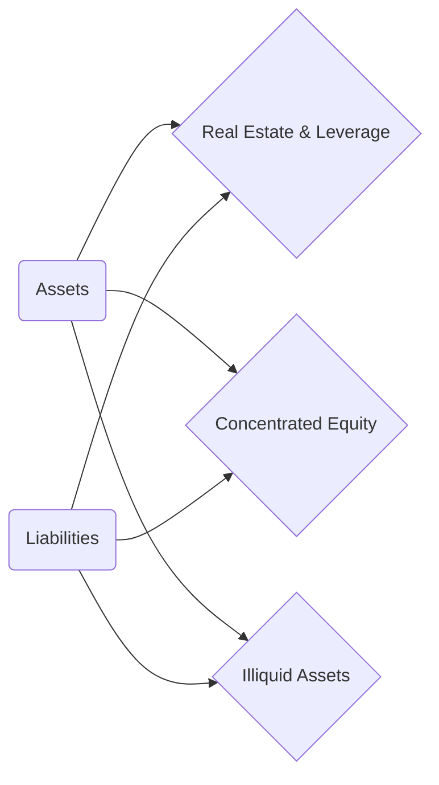
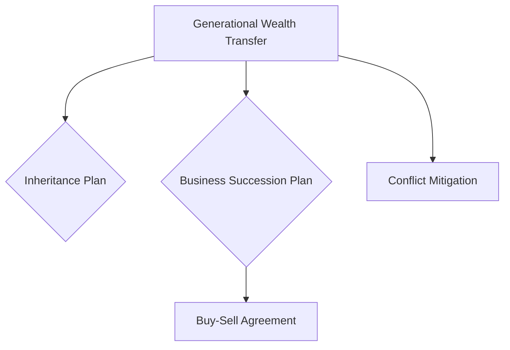

## 7.4 Identifying Risk within a Client’s Net Worth

Effectively identifying risk within a client’s net worth is foundational to constructing a robust personal risk management plan. Whether a client’s wealth is derived from real estate, business ownership, or concentrated equity positions, thorough risk assessment helps financial planners anticipate adverse economic events and protect the client’s financial well-being. Indeed, developing a holistic view of net worth vulnerabilities lays the groundwork for strategic wealth preservation, ensuring that the client’s financial goals remain achievable even under challenging market or personal circumstances.

This section covers four key areas to explore when advising clients—(1) Asset Liability Review, (2) Income Protection, (3) Liability Exposures, and (4) Generational Wealth Transfer Risks. Each category has its own set of complexities and requires targeted strategies to minimize the risk of financial distress.

---

## Asset Liability Review

A client’s net worth is shaped by the assets they hold—real estate, businesses, investments—and the liabilities they owe, such as mortgages, credit lines, or margin loans. The balance (or imbalance) between these elements determines a client’s financial resilience and capacity to withstand unforeseen events.

### Real Estate and Leverage
Real estate is often a cornerstone of Canadian net worth. Owning a family home in Toronto or Vancouver can result in substantial equity, but carrying high mortgage balances increases the risk of financial strain if property values drop or interest rates climb sharply. Rising interest rates can lead to mortgage payment shocks, while declining real estate prices can erode equity for those who leveraged heavily.

• Example: Consider a client with a home in Montreal purchased for CAD 900,000 and financed with minimal down payment. If local real estate values drop 10% and interest rates rise by 2%, this client may face negative equity (owing more on the mortgage than the home’s worth) and higher monthly payments, intensifying financial pressure.

• Best Practices for Real Estate Risks:  
  - Keep down payments and mortgage terms aligned with one’s income stability.  
  - Consider stress testing the mortgage payment for higher interest rates.  
  - Use home equity lines of credit (HELOCs) judiciously, ensuring liquidity for emergencies without overextending.

### Concentrated Equity Positions
When a large portion of a client’s net worth is tied up in a single company’s stock—whether it’s their employer’s shares, a private venture, or a legacy holding—the risk of volatility increases dramatically. A downturn in that company’s performance, even if the broader market is stable, can significantly impact the client’s wealth.

• Example: A senior manager at RBC who has amassed a substantial portion of RBC shares through stock-option grants and share purchase plans. If RBC experiences a sharp drop due to an economic downturn or internal scandal, the manager’s wealth could plummet.  

• Mitigation Strategies:  
  - Gradually diversify holdings (e.g., through a systematic sale of shares or a swap-based hedging strategy).  
  - Use protective options (if available) to limit downside risk.  
  - Establish a disciplined diversification plan aligned with personal life goals and retirement timelines.

### Illiquid Assets
Assets such as art collections, private businesses, or real estate developments are inherently illiquid. They typically cannot be sold quickly without significant price concessions and can trap capital precisely when urgent cash needs arise.

• Example: A family in Calgary owns a private trucking business valued at CAD 2 million but runs into an operational crisis requiring rapid capital infusion. The illiquid nature of the business makes it challenging to sell shares or raise funds without incurring large discounts or detrimental terms.

• Strategies to Address Illiquidity:  
  - Maintain a healthy emergency fund or liquid investment bucket.  
  - Explore partial equity sales, private placements, or creative financing to secure liquidity.  
  - Use insurance products (e.g., key person insurance) for businesses to handle unexpected events.

Below is a simplified diagram illustrating these three main risk areas within asset-liability reviews:

In this diagram, both Assets (A) and Liabilities (E) exert forces on the three focal risk areas. By examining these areas in tandem, advisors can develop a more complete understanding of where and how net worth might be vulnerable.

---

## Income Protection

While examining the asset side of a client’s net worth is critical, assessing the stability and continuity of a client’s income is often just as imperative. Income disruptions—due to disability, job loss, or industry shifts—can rapidly deplete savings and push clients toward detrimental financial decisions.

### Evaluating Salary Dependence
Clients reliant on a single source of income with no supplementary streams (e.g., rental properties, part-time consulting) face heightened risk if that primary income stream disappears. Professionals who rely on specialized skills or operate in highly cyclical industries—such as oil and gas—are particularly susceptible.

• Case Study: A geologist working at a major oil producer in Alberta faced layoffs during a commodity price downturn. With no alternative income and limited emergency funds, she had to liquidate part of her RRSP at a disadvantageous time, resulting in tax consequences and a smaller retirement cushion.

• Strategies for Salary Dependence:  
  - Build alternative income streams (small business, consulting, online ventures, or dividend-paying stocks).  
  - Maintain healthy emergency funds (generally 3 to 6 months of living expenses).  
  - Explore insurance products like disability insurance or critical illness insurance.

### Emergency Funds and Insurance
One of the primary defenses against income disruption is a properly sized emergency fund. Additionally, adequate insurance coverage—such as life, critical illness, or disability insurance—can preserve net worth in the face of unforeseen personal crises. Provincial guidelines, such as those issued by Quebec’s Autorité des marchés financiers (AMF), emphasize having sufficient coverage based on one’s occupation and family obligations.

• Example: A client with a stable public-sector job but extensive financial commitments (mortgage, car loan, and childcare expenses) might maintain an emergency fund covering 6 months of essential outlays, coupled with short- and long-term disability insurance to mitigate the risks of sudden job loss or illness.

---

## Liability Exposures

In addition to income protection and the assets one holds, personal and professional liability can present significant risks. Lawsuits, malpractice claims, or personal accidents can jeopardize a client’s assets if there isn’t enough liability coverage in place.

### Professional Liability
Certain professions, such as medicine, finance, or law, carry distinct liability risks. A malpractice claim or professional negligence suit can result in substantial damages and legal fees. Doctors in Canada generally hold malpractice coverage through organizations such as the Canadian Medical Protective Association (CMPA). Financial advisors typically carry errors and omissions (E&O) insurance, as required by regulators like CIRO (Canadian Investment Regulatory Organization) to safeguard client interests and preserve advisors’ own assets.

• Example: A financial planner who inadvertently breaches a client’s confidence or provides flawed advice resulting in losses could face legal action. Adequate E&O coverage protects the planner’s personal net worth from potential judgments.

### Personal Liability
Aside from professional practice, non-occupational accidents or litigation—ranging from auto accidents to slip-and-fall incidents—can threaten personal assets if coverage is insufficient. Umbrella liability policies commonly extend coverage above and beyond standard home and auto insurance, proving valuable in catastrophic events.

• Managing Liability Risks:  
  - Maintain appropriate professional coverage (medical, E&O, or professional indemnity insurance).  
  - Consider adding a personal umbrella policy that covers high-limit liability claims.  
  - Periodically review coverage amounts, ensuring policies keep pace with rising net worth and changes in personal circumstances.

---

## Generational Wealth Transfer Risks

Wealth transfer plans—whether through inheritance, trusts, or business succession—often comprise a major component of a client’s long-term financial strategy. Failure to structure these transfers with a focus on risk management can lead to destructive familial conflicts or forced asset sales.

### Inheritance or Business Succession
In Canada, intergenerational business transfers can be tricky due to tax implications and the complexities of shared ownership. Having sound documentation—such as shareholders’ agreements or buy-sell agreements—can minimize unexpected disruptions.

• Example: A private manufacturing company in Ontario is jointly owned by siblings. If one sibling passes away without a proper buy-sell agreement, the surviving owners may be forced to buy their shares at an inopportune moment, potentially causing liquidity stress. Proper estate and succession planning protect the business’s continuity and the owners’ net worth.

### Structuring Buy-Sell Agreements
A buy-sell agreement is integral when co-owners want to ensure a transparent process if one partner decides to exit the venture or becomes disabled. These agreements dictate the valuation trigger, purchase pricing, and timeline, preventing expensive disputes that could lead to legal action or business disruptions.

• Example: A mid-size consultancy firm in Toronto has three partners. By crafting a comprehensive buy-sell agreement backed by life and disability insurance, they ensure the deceased (or disabled) partner’s family is compensated without burdening the remaining partners with an abrupt, unfunded buyout.

Below is a simplified mermaid diagram indicating how generational wealth transfer considerations—inheritance, buy-sell agreements, and potential conflict—intersect to mitigate risks:

---

## Integrating Risk Assessment into Financial Planning

Financial planners should integrate these risk areas into regular net worth reviews, client discovery sessions, and ongoing portfolio monitoring. Incorporating scenario analyses—such as stress testing real estate portfolios or evaluating business continuity plans—can unearth potential pitfalls early, allowing for proactive solutions.

• Overview of Actions:  
  1. Gather Data: Understand clients’ total net worth, debt structures, insurance coverage, and business or estate plans.  
  2. Assess Vulnerabilities: Identify concentrated equity positions, large illiquid holdings, or underinsurance.  
  3. Develop Mitigation Strategies: Diversify investments, secure insurance coverage, and draft or revise legal agreements.  
  4. Monitor and Update: Adjust strategies as personal circumstances, regulations, and market conditions evolve.

---

## Practical Examples and Case Studies

• Case Study 1:  
  - A high-income engineer in Ontario invests heavily in oil and gas stocks while carrying a large mortgage. She also lacks sufficient disability insurance. In a recession, she faces job loss at the same time her investments lose value. Her mortgage remains constant, imposing considerable monthly repayments on a reduced income. Diversifying her stock holdings, obtaining proper disability coverage, and carrying a more conservative mortgage would have mitigated these risks.

• Case Study 2:  
  - A dentist planning to retire in five years aims to pass the practice to a junior partner. Without a robust buy-sell agreement, the junior partner’s departure leaves the dentist scrambling to find a new associate or sell the practice quickly, risking a lower sale price. By establishing a well-funded agreement (potentially backed by life or disability insurance), they could have prevented significant loss of business value.

---

## Glossary

• Leverage: Using borrowed capital, such as a mortgage or margin loan, to increase potential returns (and potential losses).  
• Concentrated Equity Position: Holding a significant portion of net worth in a single stock (or ownership stake) in one company; greatly increases volatility risk.  
• Illiquid Assets: Items or investments that cannot be converted to cash quickly without significant price impacts, such as art collections, private businesses, or certain types of real estate.  
• Buy-Sell Agreement: A contract among co-owners stating the terms of a future business share sale, typically triggered by a key owner’s death, disability, or decision to sell.

---

## References and Additional Resources

• CIRO – Canadian Investment Regulatory Organization (https://www.ciro.ca): Provides guidelines for margin accounts, risk disclosure, and advisor best practices.  
• Autorité des marchés financiers (AMF) in Quebec (https://lautorite.qc.ca): Offers consumer protection measures and educational material on insurance and liability.  
• FP Canada (https://www.fpcanada.ca): For official guidance on advanced planning and family business considerations.  
• “Succession Planning for the Family Business” by Bork, Jaffe, Lane, Dashew: A comprehensive guide on risk management in generational wealth scenarios.

Consider consulting open-source financial planning tools on GitHub and specialized retirement programming calculators for scenario testing. You can also review policy manuals from RBC, TD, and other major Canadian banks to better understand their underwriting processes and credit risk policies.

---

## Summary and Key Takeaways

1. Real Estate and Leverage: Assess potential interest rate shocks, property value fluctuations, and the prudent use of HELOCs.  
2. Concentrated Equity Positions: Monitor excess allocations to employer stock or single companies, using diversification and hedging.  
3. Illiquid Assets: Maintain adequate liquidity, exploring creative financing and structured insurance solutions.  
4. Income Protection: Secure adequate insurance, build emergency funds, and seek out alternative income streams.  
5. Liability Exposures: Evaluate professional and personal liability needs, ensuring coverage levels match personal risk.  
6. Generational Wealth Transfers: Implement inheritance structures, buy-sell agreements, and family business succession planning to avoid costly pitfalls.

Proactive identification and mitigation of potential risk factors within your clients’ net worth is essential to preserving the wealth they’ve worked hard to build. Through structured assessments, well-informed strategies, and continuous monitoring, modern wealth managers can enable their clients to navigate evolving financial landscapes with confidence and stability.

---

## Test Your Knowledge: Identifying and Managing Net Worth Risks Quiz



### Which of the following is a significant hazard when a large portion of a client's net worth is tied to one company's stock?

- [x] Concentration risk leading to elevated portfolio volatility.
- [ ] Reduced overall gains due to diversification.
- [ ] Immediate liquidity in times of need.
- [ ] Complete immunity from market swings.

> **Explanation:** When too much money is allocated to a single company, the portfolio experiences higher volatility and risk if that specific company’s stock price falls.

### If mortgage rates suddenly rise while property values drop, which scenario is most likely for a highly leveraged homeowner?

- [x] Negative equity and potential payment shock.
- [ ] Immediate ability to refinance at a lower interest rate.
- [ ] Higher home equity and increased cash flow.
- [ ] No change in monthly mortgage payments.

> **Explanation:** Rising rates can increase monthly mortgage costs, while declining home prices can reduce home equity, creating a financially stressful situation.

### What can mitigate illiquidity risk for a client holding significant real estate investments?

- [x] Maintaining an adequate cash reserve or emergency fund.
- [ ] Investing all assets in private, less liquid placements.
- [ ] Eliminating all forms of insurance.
- [ ] Relying solely on unsecured credit lines.

> **Explanation:** A well-funded emergency account ensures liquidity without forcing the sale of illiquid properties at a disadvantageous time.

### Which type of insurance coverage is most important for professionals like doctors or financial advisors?

- [x] Professional liability or errors and omissions coverage.
- [ ] Earthquake insurance.
- [ ] Personal auto insurance.
- [ ] Travel insurance.

> **Explanation:** Professional liability or E&O insurance protects practitioners against claims of malpractice or negligence in their line of work.

### Which statement is accurate regarding buy-sell agreements in Canada?

- [x] They are key to ensuring a transparent disposition of business shares when a partner leaves or passes away.
- [ ] They are illegal unless the business has more than 10 partners.
- [x] They often involve life or disability insurance to fund the purchase of a departing owner’s equity.
- [ ] They become void if a business is publicly traded.

> **Explanation:** Buy-sell agreements are fundamental in private businesses to manage ownership transitions. They often leverage insurance to fund share repurchases, reducing financial strain on remaining owners.

### Which strategy helps mitigate concentration risk for a client holding significant shares of their employer’s stock?

- [x] Systematically selling shares and reinvesting in diversified assets.
- [ ] Holding indefinitely in hopes of continuous stock appreciation.
- [ ] Cancelling all other investment accounts.
- [ ] Taking on additional margin debt to buy more shares.

> **Explanation:** Gradual diversification through systematic sales is widely recognized as a prudent way to manage concentration risk.

### In the context of personal liability risk, which coverage option offers supplementary protection beyond home and auto insurance?

- [x] Umbrella liability insurance.
- [ ] Excess earthquake insurance.
- [x] Provincial medical coverage alone.
- [ ] Guaranteed Investment Certificates (GICs).

> **Explanation:** Umbrella liability policies add additional coverage limits beyond what standard home and auto policies provide.

### How can business owners protect their net worth against potential forced asset sales due to an owner’s death or disability?

- [x] Creating a buy-sell agreement funded by life or disability insurance.
- [ ] Ceasing to carry any form of insurance.
- [ ] Avoiding formal legal contracts among partners.
- [ ] Maintaining a single-account structure with no separate reserves.

> **Explanation:** A buy-sell agreement funded by insurance ensures a smooth transfer of ownership interests without the need for abrupt asset liquidations.

### When evaluating a client’s salary dependency risk, which factor is most relevant to risk levels?

- [x] Reliance on a single income stream with no alternative or backup.
- [ ] Number of streams of passive income supporting the main salary.
- [ ] Extensive personal savings with no debt.
- [ ] Low mortgage payments and flexible job arrangements.

> **Explanation:** Clients who rely on one job or one direct source of income are more vulnerable to sudden financial stresses if they lose that job.

### A client’s net worth can be compromised when they are severely underinsured in the face of potential lawsuits. Is this statement true or false?

- [x] True
- [ ] False

> **Explanation:** Inadequate liability coverage can expose personal assets to seizure in a lawsuit, thereby diminishing net worth significantly.



---

## For Additional Practice and Deeper Preparation

**[1. WME Course For Financial Planners (WME-FP): Exam 1](https://www.udemy.com/course/csi-wme-fp-exam1/?referralCode=1A23C67E56971C0A73D5)**  
• Dive into 6 full-length mock exams—1,500 questions in total—expertly matching the scope of WME-FP Exam 1.  
• Experience scenario-driven case questions and in-depth solutions, surpassing standard references.  
• Build confidence with step-by-step explanations designed to sharpen exam-day strategies.

**[2. WME Course For Financial Planners (WME-FP): Exam 2](https://www.udemy.com/course/csi-wme-fp-exam2/?referralCode=25879CCDED7B7905BBA8)**  
• Tackle 1,500 advanced questions spread across 6 rigorous mock exams (250 questions each).  
• Gain real-world insight with practical tips and detailed rationales that clarify tricky concepts.  
• Stay aligned with CIRO guidelines and CSI’s exam structure—this is a resource intentionally more challenging than the real exam to bolster your preparedness.

> Note: While these courses are specifically crafted to align with the WME-FP exam outlines, they are independently developed and not endorsed by CSI or CIRO.
