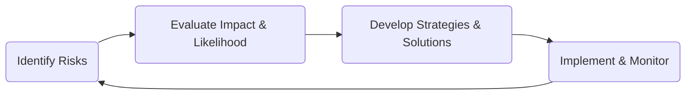

## 7.6 The Personal Risk Management Process

Effectively managing personal risk is a key pillar of comprehensive wealth management. Without a proactive, well-rounded approach to anticipating and mitigating risks, even the most robust investment and savings strategies can falter in the face of unforeseen events. In Canada, financial planners must not only recognize the unique challenges posed by our country’s regulatory environment and market dynamics but also tailor risk management strategies to clients’ personal circumstances. Whether you are advising a young professional looking to protect future income or an established entrepreneur juggling multiple properties, understanding and implementing a proper risk management process will help protect your clients’ financial aspirations.

This section details a four-step personal risk management process:  
1) Identifying Risks  
2) Evaluating Impact and Likelihood  
3) Developing Strategies and Solutions  
4) Implementing and Monitoring  

We will explore these steps with practical Canadian examples, discuss relevant regulatory frameworks, and illustrate best practices for creating a sustainable, integrated personal risk management strategy.

---

## Introduction

Risk management is more than just buying insurance. It is a holistic process that begins with understanding the potential perils that can derail financial plans, continues with prioritizing the likelihood and severity of those risks, and culminates in creating a tailored strategy to either reduce, transfer, avoid, or accept them. For Canadian financial planners, this approach must also include staying compliant with provincial and federal regulations, maintaining appropriate insurance licensing credentials, and being aware of guidelines from organizations like CIRO and FP Canada.

---

## Key Concepts in Personal Risk Management

Before diving into the four-step process, let’s clarify a few foundational concepts:

• Risk Avoidance: Eliminating or eschewing activities or situations that are deemed excessively risky. For instance, a client might decide against investing in high-volatility stocks on margin to avoid potential large-scale losses.

• Risk Reduction: Taking proactive measures to minimize the severity or frequency of a risk. Examples include lifestyle choices that lower health risks or installing a fire alarm system in a home to reduce potential property damage.

• Risk Transfer: Purchasing insurance or entering into contracts to shift the financial impact of a risk to another party, such as an insurance company.

• Risk Retention: Acknowledging and bearing certain risks directly. A client may decide to manage small, infrequent out-of-pocket expenses (like minor property repairs) rather than insure against them.

---

## Step 1: Identifying Risks

Identifying risks is the foundational step in personal risk management. You can integrate this process into the client discovery or onboarding phase and continue refining it as client needs evolve.

### Client Interviews and Documentation

• Start with comprehensive client interviews to gather details about personal circumstances, including family composition, work history, health, and lifestyle preferences.  
• Review net worth and cash flow statements to identify financial obligations and potential exposures such as outstanding loans or seasonal cash flow fluctuations.  
• Ask about any special circumstances such as co-signing for a family member’s loan, operating a small business, or owning multiple residential properties.

### Family Life Cycle Considerations

Being mindful of the client’s stage in the family life cycle helps you anticipate risks associated with their generational context. For example:  
• Singles and young couples may need to focus on disability insurance for income protection.  
• Growing families often need life insurance to protect dependents’ living expenses and educational needs.  
• Pre-retirees may concentrate on protecting accumulated assets and ensuring stable retirement income.

### Unique Liabilities

Certain clients will have distinct liabilities or potential exposures. An entrepreneur might face greater business continuity risks, while someone managing multiple rental properties will likely have broader liability insurance needs. Understanding the scope of these liabilities informs which products and services may be most useful.

---

## Step 2: Evaluating Impact and Likelihood

After identifying potential risks, the next step is to analyze their probability of occurring and their possible magnitude. This allows financial planners to prioritize solutions for the pressures that could have the most severe financial consequences.

### Quantifying Potential Scenarios

• Project outcomes for each risk. For example, how would a three-month job loss affect cash flow? How costly would a home rebuild be in the event of a fire?  
• Use scenario planning—commonly employed by large Canadian financial institutions like RBC and TD—to simulate events such as natural disasters, market downturns, job layoffs, or health crises. This helps approximate potential financial damage.

### Severity vs. Frequency

• High Severity, Low Frequency Risks: These are catastrophic events like premature death or major property damage. They may occur rarely, but the consequences are significant enough to demand immediate attention—often mitigated through insurance.  
• Low Severity, High Frequency Risks: These are recurring costs or events that pose minor financial disruptions but happen regularly, such as routine home repairs or minor car dents. In many cases, it’s economical for clients to handle these out of pocket (risk retention) rather than purchase extensive insurance coverage.  
• High Severity, High Frequency Risks: Extremely problematic, typically requiring immediate risk avoidance or robust insurance solutions.  
• Low Severity, Low Frequency Risks: Often considered acceptable or easily absorbed by the client’s financial cushion.

By systematically categorizing identified risks, you can anchor the discussion on “what could happen,” “how likely it is to happen,” and “what the financial fallout would be.”

---

## Step 3: Developing Strategies and Solutions

With risks identified and evaluated, you can begin crafting strategies for mitigating or addressing these challenges. Typically, these strategies fall into four main categories: avoidance, reduction, transfer, and retention.

### Risk Avoidance

• Opting out of specific activities or investments to eliminate potential threats.  
• Example: A high-net-worth client might avoid using margin accounts for stock trading to eliminate the risk of margin calls during a market downturn.

### Risk Reduction

• Implementing techniques to minimize either the frequency or severity of a loss.  
• Outside of insurance considerations, risk reduction often involves healthy lifestyle choices to reduce health-related risks or investment diversification to mitigate market volatility.  
• Example: Encouraging a client to install home security systems and fire alarms for property risk reduction, lowering premium costs and the likelihood of large claims.

### Risk Transfer (Insurance)

• The most common form of risk transfer is insurance, wherein clients pay premiums to an insurer. In exchange, the insurer covers specific losses that arise from insured events.  
• Canadians have a variety of insurance options: life insurance, critical illness, disability, liability, and property and casualty insurance.  
• Due diligence: Check with each provincial insurance council, such as the Insurance Council of British Columbia, for guidelines on product offerings, licensing, and consumer protection.

### Risk Retention

• Clients may choose to self-insure, especially for minor or low-severity risks where insurance may not be cost-effective.  
• Examples include setting aside an emergency fund for minor car repairs, small dental expenses, or other short-term emergencies.  
• It’s crucial to emphasize the importance of an adequate emergency fund to cover these retained risks without interrupting the client’s long-term financial plan.

---

## Step 4: Implementing and Monitoring

Even the best-laid plans lose effectiveness without proper execution, ongoing monitoring, and periodic adjustments. Implementation often involves coordinating with a team of specialists—insurance professionals, tax advisors, and perhaps legal counsel—to ensure comprehensive coverage and compliance.

### Reviewing Policies and Beneficiary Designations

• Ensure that clients’ contracts, especially life insurance policies, have the correct ownership structure and beneficiary designation.  
• Work with legal teams to confirm that beneficiary designations align with estate planning documents. Mistakes here can have unintended tax consequences or family disputes.

### Updating Coverage After Life Events

• Life changes like marriage, divorce, the birth of a child, or a career switch may call for adjusting coverage levels or adding new types of insurance.  
• Collaborate with other professionals—accountants, lawyers, child guardians—to ensure a cohesive approach.  

### Coordinating with Legal, Tax, and Insurance Experts

• Risk management often intersects with tax planning (e.g., ensuring that insurance solutions maximize after-tax benefits) and legal requirements (e.g., validating a power of attorney).  
• Applying FP Canada’s guidelines for integrated risk management ensures that all facets of a client’s finances are coordinated around their risk profile.

### Continuous Oversight

• Schedule annual or semi-annual meetings to re-evaluate the client’s risk environment and update any materials or coverage.  
• If new legislation or significant market shifts occur, an interim review may be necessary. Keeping abreast of relevant regulatory updates from CIRO or your local insurance council is a best practice.

---

## Visualizing the Risk Management Process

Below is a simple flowchart, rendered in Mermaid, illustrating how each step in the process builds on the previous one:

Each loop back to the “Identify Risks” phase signifies that risk management is a dynamic and ongoing cycle. As clients progress through different life stages or experience changes, new risks emerge, and old risks evolve.

---

## Case Study: A Growing Family in Toronto

Imagine a couple in their early 30s living in Toronto. They are expecting their second child and recently bought a larger family home with a mortgage from TD Bank. Here is how they might apply the personal risk management process:

1) Identifying Risks:  
   • Potential loss of income if one spouse is unable to work due to illness or injury.  
   • Increased liability from mortgage debt in the event of an unexpected death.  
   • Additional childcare expenses during any period of disability or illness.

2) Evaluating Impact and Likelihood:  
   • The risk of one parent becoming disabled for an extended period seems moderate, but the financial ramifications (loss of significant earnings) could be severe.  
   • The risk of a premature death may be low, but its financial impact would be devastating, especially with major mortgage obligations.

3) Developing Strategies:  
   • Risk Transfer: Purchase new term life insurance policies with enough coverage to pay off mortgage debts and educational costs for the children.  
   • Risk Reduction: Use a homeowner’s insurance policy with an appropriate rider for additional liability coverage.  
   • Risk Retention: Establish an emergency fund to cover smaller unexpected expenses (e.g., a broken furnace).

4) Implementing and Monitoring:  
   • Review the family’s net worth and allocate funds for premium payments.  
   • Check beneficiary designations to ensure the proceeds go to the intended heirs.  
   • Re-evaluate coverage every few years or after major life changes.

By walking through these steps, the family can effectively safeguard their financial well-being against significant disruptions and maintain peace of mind.

---

## Glossary

• **Risk Avoidance**: Eliminating involvement in activities or situations that generate risk.  
• **Risk Transfer (Insurance)**: Outsourcing the financial consequences of a risk to a third party (insurer) in exchange for premiums.  
• **Risk Retention**: Accepting the financial burden of a risk, either intentionally or due to lack of insurance.  
• **Beneficiary Designation**: Selecting individuals or entities (e.g., trusts) to receive proceeds of an insurance policy or registered account.

---

## Additional Resources and References

For even deeper insights into Canadian risk management and compliance, consider the following:

• [CIRO](https://www.ciro.ca) – Outlines positions on discussing risk and potential insurance solutions for Canadian client portfolios.  
• [Insurance Council of British Columbia](https://www.insurancecouncilofbc.com) – Provincial body offering guidance on licensing requirements and consumer protection; other provinces have similar councils.  
• [FP Canada](https://www.fpcanada.ca) – Guidelines for integrated risk management in financial planning.  
• **Suggested Reading**: “Fundamentals of Risk and Insurance” by Emmett J. Vaughan and Therese Vaughan – A comprehensive overview of insurance principles, covering everything from underwriting to specialized policies.

---

## Summary

Personal risk management is an iterative and client-centric process. By methodically identifying potential risks, assessing their impact, and developing tailored solutions, financial planners can help their clients protect their financial futures. From life insurance and disability coverage to simple strategies like building an emergency fund, risk management strategies must be woven seamlessly into your clients’ overall financial plans. Likewise, monitoring changes in circumstances, legislation, and market conditions is fundamental to maintaining a plan that remains relevant and effective over time. This holistic, continuously adaptive approach is both a professional responsibility and a key driver of client satisfaction and retention in Canadian wealth management.

---

## Test Your Knowledge of Personal Risk Management in Canada



### Which of the following best describes the purpose of personal risk management?

- [x] To identify and mitigate potential threats to a client’s financialwell-being.  
- [ ] To avoid purchasing any form of insurance.  
- [ ] To reduce premium costs without considering broader coverage.  
- [ ] To focus solely on property risk and disregard health risks.  

> **Explanation:** Personal risk management includes identifying, evaluating, and mitigating potential threats to a client’s financial future, encompassing insurance, lifestyle strategies, and more.

### Which scenario is most likely addressed by risk avoidance?

- [x] Deciding not to invest in high-leverage margin accounts.  
- [ ] Setting aside an emergency fund for small repairs.  
- [ ] Purchasing life insurance.  
- [ ] Choosing a higher deductible on a home insurance policy.  

> **Explanation:** Risk avoidance means eliminating engagement in particularly risky activities altogether, such as avoiding margin accounts to eliminate the risk of margin calls.

### What is the primary example of risk transfer in personal risk management?

- [x] Purchasing an insurance policy.  
- [ ] Building a large emergency fund.  
- [ ] Diversifying an investment portfolio.  
- [ ] Taking out a secondary mortgage.  

> **Explanation:** Risk transfer involves shifting the financial burden of a potential loss to another party—commonly through insurance.

### How can a client’s stage in the family life cycle affect their risk management strategy?

- [x] Different life stages have different financial priorities and responsibilities, influencing needed coverage types.  
- [ ] It has minimal effect, as all families should replicate the same risk management strategy.  
- [ ] Younger individuals should only hold life insurance, as they have fewer needs.  
- [ ] Clients in retirement have no need for risk management.  

> **Explanation:** Singles, families with young children, and retirees each face distinct sets of risks; needs and priorities shift throughout the family life cycle.

### Which of the following is an example of risk retention?

- [x] Self-insuring minor car repairs.  
- [ ] Buying a comprehensive group health policy.  
- [x] Accepting the cost of minor health expenses.  
- [ ] Eliminating mortgage debt.  

> **Explanation:** Risk retention means the client shoulders the cost of low-severity losses out of pocket, often for smaller or more predictable events.

### A young professional in Ontario is concerned about losing income if injured. Which insurance solution typically addresses that concern?

- [x] Disability insurance.  
- [ ] Home insurance.  
- [ ] Critical illness insurance.  
- [ ] Auto liability insurance.  

> **Explanation:** Disability insurance replaces a portion of income if the policyholder cannot work due to an injury or illness.

### What is a best practice when monitoring a client’s personal risk management plan?

- [x] Conducting at least an annual review of policies and coverage.  
- [ ] Maintaining the same coverage levels for 10+ years.  
- [x] Updating beneficiaries only upon death.  
- [ ] Cancelling policies after paying off a mortgage.  

> **Explanation:** Due to life changes and evolving priorities, it is important to conduct at least annual reviews to determine if coverage needs to be updated or benefits adjusted.

### Why is evaluating both the likelihood and impact of a risk important?

- [x] It prioritizes the most financially disruptive risks that are relatively probable.  
- [ ] It helps identify which activities can be safely ignored.  
- [ ] It ensures all risks require the same insurance coverage.  
- [ ] It simplifies all risk scenarios into a single cost estimate.  

> **Explanation:** By assessing both aspects, financial planners can focus on risks that are both probable and capable of causing significant financial harm.

### Which of the following best describes the role of provincial insurance councils in Canada?

- [x] They guide licensing requirements and consumer protection for insurance professionals.  
- [ ] They set mandatory interest rates for bonds.  
- [ ] They approve all mortgage applications in each province.  
- [ ] They handle federal banking regulations.  

> **Explanation:** Provincial insurance councils oversee insurance field regulations and consumer protection mechanisms, ensuring compliance with provincial laws.

### True or False: A client’s personal risk management plan should remain unchanged once initially established.

- [x] False  
- [ ] True  

> **Explanation:** Risk management is a dynamic process. Life events, changing market conditions, and new regulations can all necessitate updates to a client’s plan.



---

## For Additional Practice and Deeper Preparation

**[1. WME Course For Financial Planners (WME-FP): Exam 1](https://www.udemy.com/course/csi-wme-fp-exam1/?referralCode=1A23C67E56971C0A73D5)**  
• Dive into 6 full-length mock exams—1,500 questions in total—expertly matching the scope of WME-FP Exam 1.  
• Experience scenario-driven case questions and in-depth solutions, surpassing standard references.  
• Build confidence with step-by-step explanations designed to sharpen exam-day strategies.

**[2. WME Course For Financial Planners (WME-FP): Exam 2](https://www.udemy.com/course/csi-wme-fp-exam2/?referralCode=25879CCDED7B7905BBA8)**  
• Tackle 1,500 advanced questions spread across 6 rigorous mock exams (250 questions each).  
• Gain real-world insight with practical tips and detailed rationales that clarify tricky concepts.  
• Stay aligned with CIRO guidelines and CSI’s exam structure—this is a resource intentionally more challenging than the real exam to bolster your preparedness.

> Note: While these courses are specifically crafted to align with the WME-FP exam outlines, they are independently developed and not endorsed by CSI or CIRO.
