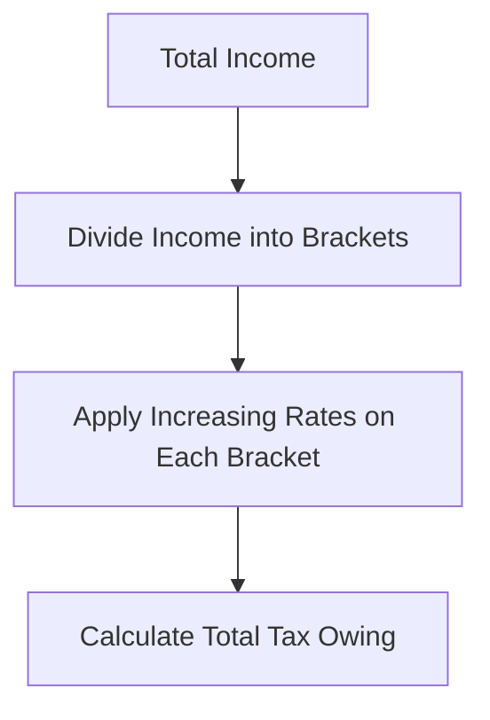

## 8.1 Financial Planning and Taxation

Taxation plays a pivotal role in a client’s overall wealth management strategy. Through informed planning, advisors can help clients preserve more of their income, reduce tax liabilities, and promote the efficient growth of assets. This section provides an in-depth exploration of the Canadian tax framework, emphasizing the strategic actions financial planners can take to maximize clients’ after-tax wealth. 

---
## Importance of Tax Knowledge in Financial Planning

A thorough understanding of Canadian tax rules is essential for any wealth advisor for several reasons:

1. **Maximizing After-Tax Income and Asset Growth**  
   • Thoughtful tax management can significantly increase a client’s net returns.  
   • Strategic timing of withdrawals and contributions to registered accounts (e.g., RRSP, TFSA) can yield substantial tax savings.  

2. **Informing Retirement Income Streams**  
   • Deciding when to draw from government benefits (such as CPP/OAS), employer-sponsored pensions, and personal savings affects effective tax rates.  
   • Adjusting the mix of taxable versus non-taxable income streams to limit overall tax liability.  

3. **Structuring Investment Portfolios**  
   • Dividend income, interest income, and capital gains are all taxed differently in Canada.  
   • The selection of specific investment vehicles (e.g., corporate-class mutual funds, certain exchange-traded funds, or flow-through shares) can influence total tax exposures.

4. **Anticipating Regulatory Changes**  
   • Tax laws evolve frequently. Advisors who monitor changes can help clients adjust their strategies proactively and remain compliant.

---
## Basic Tax Framework

Canada’s tax system is multifaceted, split between federal and provincial/territorial taxes and administered primarily through the Canada Revenue Agency (CRA). 

### Federal and Provincial/Territorial Taxation

• **Federal Income Tax**: Collected by the CRA according to the Income Tax Act.  
• **Provincial/Territorial Taxes**: Each province or territory imposes additional tax, typically added onto the federal tax rates. These taxes vary among jurisdictions.

### Progressive Tax Rates

Canada employs a **progressive tax system**, meaning higher-income earners pay a higher marginal tax rate (MTR) on each additional dollar of income. Having a grasp of these rates is vital when advising on strategies such as splitting income with a spouse, contributing to RRSPs, or realizing capital gains.

Below is a simplified illustration of how a progressive tax system can be visualized:



1. **Divide Income into Brackets**: A taxpayer’s income is allocated into progressively higher tax brackets.  
2. **Apply Rates**: Each bracket has a designated rate. Income in the first bracket is taxed at the lowest rate, while income in the highest bracket is taxed at the highest rate.  
3. **Sum Up**: The total tax payable is the sum of taxes owed across all brackets.

### Common Tax Deductions and Credits

Deductions and credits are crucial in reducing an individual’s overall tax burden:

• **Deductions (reduce taxable income)**  
  – RRSP contributions  
  – Childcare expenses  
  – Moving expenses (when eligible)  
  – Spousal support payments  

• **Credits (reduce tax payable)**  
  – Non-refundable credits (e.g., basic personal amount, age amount, charitable donation tax credits)  
  – Refundable credits (e.g., GST/HST credit, refundable medical expense supplement)

These can make a significant difference in a client’s net tax liability. For example, contributing to a Registered Retirement Savings Plan (RRSP) provides a deduction against taxable income, potentially moving a client into a lower tax bracket.

---
## Role of Advisors in Tax Planning

Financial planners hold a central responsibility in integrating tax considerations into broader wealth strategies. 

### Identifying Eligible Deductions

An advisor proficient in tax rules helps ensure all eligible deductions are claimed. For instance, a family that has relocated to a different city for employment might qualify for moving expense deductions, or a parent paying for child care can deduct these costs if certain conditions are met.

### Recognizing Tax Credits

Tax credits can be either **non-refundable** (reducing tax payable, but not capable of creating negative tax) or **refundable** (providing a tax refund if credits exceed tax owing). Advisors should:

• Remind clients of credits like the disability tax credit or Canada caregiver credit.  
• Check for the GST/HST credit and Ontario Trillium Benefit or similar provincial credits for qualifying clients.

### Year-Round Planning

A common pitfall is limiting tax planning to the peak “tax season.” Instead, advisors should implement a year-round approach:

1. **Quarterly Check-ups**: Review clients’ investment activities, major life events (weddings, divorces, births), and changes in employment status or compensation methods (e.g., incorporation).  
2. **Adjustment to Withholding Taxes**: Encourage clients with side businesses or multiple revenue streams to adjust withholding taxes or make installment payments as needed.  
3. **Regulatory Updates**: Stay abreast of CIRO guidelines, CRA bulletins, and any amendments to the Income Tax Act that affect financial products.

By engaging in consistent, proactive communication, advisors help clients avoid surprises at tax time and better capitalize on emergent opportunities.

---
## Practical Examples and Case Studies

To illustrate the interplay of tax planning in real-world scenarios, consider the following:

### Case Study 1: RRSP Contribution Timing  
• A 45-year-old professional, earning a high salary at RBC, faces a significant year-end bonus.  
• The advisor suggests maximizing RRSP contributions immediately to reduce current taxable income.  
• With contributions locked in before the submission deadline, the client can significantly lower their marginal tax for that year and build retirement savings.  

### Case Study 2: Spousal RRSP for Income Splitting  
• A married couple, one if whom works as a senior manager at TD while the other is a stay-at-home parent.  
• The higher-income spouse contributes to a Spousal RRSP. This reduces the contributor’s taxable income and also provides a future tax advantage when the lower-earning spouse withdraws from the plan (potentially at a lower tax rate).

### Case Study 3: Combining Deductions and Credits  
• A single parent with multiple tax credits (disability tax credit for a dependent child, medical expense credit) carefully times medical treatments to maximize claims.  
• The advisor’s plan ensures the client’s annual medical expenses surpass the threshold in a single tax year, enabling a larger overall credit.

These cases highlight how deep tax knowledge can help advisors pinpoint opportunities, matching clients’ needs with the intricacies of tax regulations.

---
## Additional Tools and Resources

Advisors are encouraged to stay updated through official sources and educational materials:

- **Canada Revenue Agency (CRA)**:  
  Comprehensive source of guidance and forms. Visit:  
  https://www.canada.ca/en/revenue-agency.html  

- **KPMG “Tax Planning for You and Your Family”**:  
  Updated annually with practical tax tips and insights.  

- **CIRO (Canadian Investment Regulatory Organization) Guidelines**:  
  Stresses the necessity for advisors to provide accurate representations of tax impacts. Refer to:  
  https://www.ciro.ca  

- **FP Canada**:  
  Highlights the importance of embedding taxation strategies within a holistic financial plan. Check:  
  https://www.fpcanada.ca  

- **Open-Source Financial Tools**:  
  Tools such as online tax calculators and budgeting platforms can provide real-time estimates of taxable income and potential refunds, assisting both advisors and clients in decision-making.

---
## Best Practices, Common Pitfalls, and Challenges

1. **Best Practices**  
   – Promote year-round planning.  
   – Maintain thorough documentation of all deductions and credits.  
   – Coordinate with accountants or tax specialists for complex situations.

2. **Common Pitfalls**  
   – Overlooking minor credits or adjustments, such as medical expense credits or carrying charges for investments.  
   – Missing deadlines for RRSP contributions or installment payments.  
   – Underestimating the tax implications of capital gains.

3. **Potential Challenges**  
   – Clients with multiple income sources (e.g., rental properties, side businesses, commissions).  
   – Rapid changes in tax regulations, prompting ongoing learning for the advisor.  
   – Encouraging clients to invest in professional tax advice when required (complex corporate structures or significant investment income).

---
## Diagram: Integrating Tax Planning into Financial Advice

Below is a simplified diagram showing how tax planning dovetails into comprehensive financial advice throughout the year:
```mermaid
flowchart TB
    A[Client Engagement] --> B[Gather Financial Data]
    B --> C[Assess Tax Position]
    C --> D[Recommend Adjustments (e.g. RRSP contributions, credits)]
    D --> E[Implement Strategies & Monitor]
    E --> F[Review and Update Year-Round]
    F --> A[Repeat Cycle]
```

1. **Client Engagement**: Establish rapport and gather necessary information.  
2. **Gather Financial Data**: Acquire details about income, expenses, and investments.  
3. **Assess Tax Position**: Evaluate marginal tax rate, existing deductions, and credits.  
4. **Recommend Adjustments**: Propose changes, such as rebalancing the portfolio and maximizing tax-sheltered contributions.  
5. **Implement & Monitor**: Ensure timely execution, remain alert to life changes or new regulations.  
6. **Review and Update**: Conduct regular check-ins to maintain alignment with clients’ goals and tax landscape.

---
## Summary and Key Takeaways

• **Tax Knowledge is Foundational**: For any financial planner in Canada, tax literacy is indispensable for optimizing clients’ net worth and ensuring compliance.  
• **Progressive Tax System Implications**: Understanding marginal tax rates is central to structuring investments and withdrawals effectively.  
• **Strategic Deductions and Credits**: A well-planned approach to leveraging available deductions and credits can yield substantial benefits.  
• **Year-Round Tax Strategy**: Continuous engagement, rather than last-minute interventions, creates more consistent tax-efficient outcomes.  
• **Collaboration with Specialists**: Complex tax situations may require the expertise of accountants or tax lawyers, often working in tandem with a financial planner’s holistic approach.

By weaving tax considerations into every layer of financial planning—from investment selection to retirement income strategies—advisors can drive superior outcomes that resonate across a client’s overall wealth management journey.

---

## Test Your Knowledge: Comprehensive Canadian Tax Planning Quiz



### Which best describes why financial planners need comprehensive tax knowledge?

- [x] To help maximize clients’ after-tax income and optimize wealth growth.
- [ ] To replace the role of an accountant and prepare tax returns for clients directly.
- [ ] Because high net-worth clients typically do not file taxes independently.
- [ ] To advise clients to avoid paying any taxes legally.

> **Explanation:** Financial planners use their understanding of tax rules to create strategies that enhance after-tax income, manage assets effectively, and comply with regulations.  


### Which statement correctly defines the provincial and federal tax responsibilities?

- [x] Both federal and provincial governments levy income taxes, with the federal portion administered by the Canada Revenue Agency.
- [ ] Only the federal government has the authority to impose Progressive Tax Rates.
- [ ] Provinces set their own taxes independently with no federal involvement.
- [ ] Tax rates across different provinces and territories are identical.

> **Explanation:** Canada levies taxes on two levels—federal and provincial/territorial—both administered through the CRA for efficiency, though the specific rates and systems can vary by province or territory.  


### What is the primary feature of a progressive tax system?

- [x] Higher-income brackets face higher marginal tax rates.
- [ ] Everyone pays the same tax rate, regardless of income.
- [ ] Taxes reduce if your income exceeds certain thresholds.
- [ ] A flat fee is applied to all income earners.

> **Explanation:** In a progressive system, each additional dollar of income above certain thresholds is taxed at a higher rate, ensuring those with higher incomes pay more proportionally.  


### Which of the following is a deduction that reduces taxable income rather than tax payable?

- [x] RRSP contribution.
- [ ] GST/HST credit.
- [ ] Canada Workers Benefit.
- [ ] Basic personal amount.

> **Explanation:** RRSP contributions lower an individual’s taxable income directly, while credits like the GST/HST credit and the basic personal amount reduce the amount of tax payable.  


### Which of the following tax credits are considered refundable?

- [x] GST/HST credit and refundable medical expense supplement
- [ ] Basic personal amount
- [x] Canada Child Benefit
- [ ] Charitable donation tax credit

> **Explanation:** Refundable credits such as the GST/HST credit, Canada Child Benefit, and the refundable medical expense supplement can be paid out even if they exceed an individual’s total tax owing.  


### According to best practices, when should a financial planner focus on tax planning?

- [x] Continually throughout the year.
- [ ] Only in February during RRSP season.
- [ ] Exclusively in April when taxes are due.
- [ ] Right after receiving the notice of assessment (NOA).

> **Explanation:** Tax planning is an ongoing process. Advisors who focus on it year-round can respond more effectively to clients’ changing circumstances and shifting regulations.  


### Which of the following is most useful for individuals who move residences for employment?

- [x] Moving expense deduction.
- [ ] Charitable donation deduction.
- [x] Education tax credit.
- [ ] Interest on student loan deduction.

> **Explanation:** If the move meets certain CRA conditions, moving expenses can be claimed as a deduction and reduce taxable income.  


### How can advisors help clients balance different types of investment income to minimize taxes?

- [x] By structuring the portfolio to optimize tax efficiency (e.g., maximizing capital gains in TFSAs, dividend-paying stocks in non-registered accounts).
- [ ] By suggesting clients avoid dividends altogether.
- [ ] By discouraging interest-bearing investments under any circumstances.
- [ ] By focusing solely on capital gains regardless of market conditions.

> **Explanation:** Advisors who understand the tax implications of various investment returns (interest, dividends, capital gains) can strategically allocate investments to optimize the tax outcome for each client.  


### What is typically considered a non-refundable tax credit?

- [x] Charitable donation tax credit
- [ ] Canada Child Benefit
- [ ] GST/HST credit
- [ ] Refundable medical expense supplement

> **Explanation:** The charitable donation tax credit is non-refundable, which reduces the amount of tax payable but cannot generate a refund if it exceeds taxes owed.  


### A marginal tax rate (MTR) is best described as:

- [x] The amount of tax paid on the next dollar of income.
- [ ] The effective rate on the total income.
- [ ] The overall rate based on average taxable income.
- [ ] The portion of income taxed at the lowest bracket.

> **Explanation:** The marginal tax rate is the percentage of tax applied to an additional dollar of income, which is foundational to understanding where tax savings can be made (e.g., by timing income or making deductions strategically).  



---

## For Additional Practice and Deeper Preparation

**[1. WME Course For Financial Planners (WME-FP): Exam 1](https://www.udemy.com/course/csi-wme-fp-exam1/?referralCode=1A23C67E56971C0A73D5)**  
• Dive into 6 full-length mock exams—1,500 questions in total—expertly matching the scope of WME-FP Exam 1.  
• Experience scenario-driven case questions and in-depth solutions, surpassing standard references.  
• Build confidence with step-by-step explanations designed to sharpen exam-day strategies.

**[2. WME Course For Financial Planners (WME-FP): Exam 2](https://www.udemy.com/course/csi-wme-fp-exam2/?referralCode=25879CCDED7B7905BBA8)**  
• Tackle 1,500 advanced questions spread across 6 rigorous mock exams (250 questions each).  
• Gain real-world insight with practical tips and detailed rationales that clarify tricky concepts.  
• Stay aligned with CIRO guidelines and CSI’s exam structure—this is a resource intentionally more challenging than the real exam to bolster your preparedness.

> Note: While these courses are specifically crafted to align with the WME-FP exam outlines, they are independently developed and not endorsed by CSI or CIRO.
