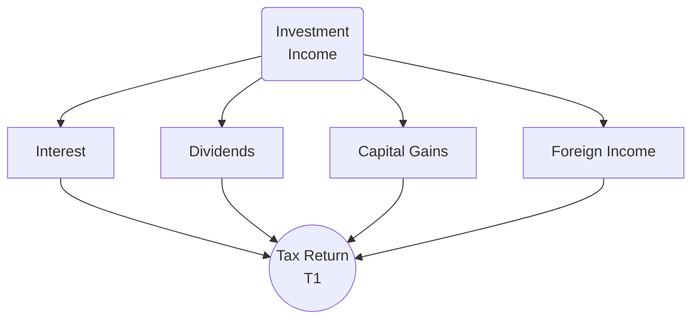

## 8.3 Taxation of Investment Income

Investment income can be derived from a variety of sources, such as interest from Guaranteed Investment Certificates (GICs), dividends paid by Canadian corporations, and capital gains realized through the sale of securities. The Canadian government has established specific tax rules to address each of these sources of income, aiming to maintain fairness and efficiency in the tax system. This section explores the fundamentals of how investment income is taxed in Canada, with practical examples and case studies to illustrate key concepts.

In this chapter, we will cover:

• Interest Income  
• Dividend Income  
• Capital Gains  
• Foreign Investment Income  
• Tax-Preferred Accounts

You will also find recommendations for Canadian regulatory references, official guides, and open-source resources that will enable you to further deepen your understanding of these topics.

---

### The Big Picture of Taxation on Investment Income

Taxation rules differ significantly depending on the type of investment income. Interest, dividends, and capital gains each have unique tax treatments that can materially affect how much net income investors retain. Proper tax planning can help minimize taxes and maximize net investment returns.

Below is a simple diagram illustrating the flow of different types of investment income into the Canadian tax return (T1):

Each investor will aggregate these forms of income and report them on their T1 tax return. In some cases, additional forms (like T5 slips for interest or dividend income, and T5013 for partnership income) will supplement the T1. Advisors must ensure their clients understand which forms to complete and how different rules apply to each income stream.

---

## 8.3.1 Interest Income

### Fully Taxable at Marginal Rates
Interest income is generally the most straightforward category of investment income. It is fully taxable—meaning 100% of any interest earned is included in a taxpayer’s income for that year. Typical sources of interest include:  
• Savings accounts at financial institutions (e.g., RBC, TD)  
• GICs (Guaranteed Investment Certificates)  
• Bonds issued by corporations or governments  
• Treasury bills (discounted securities that generate interest-like income)

Because interest income does not benefit from any preferential tax rates, it is included in the taxpayer’s gross income at their marginal tax rate. Higher-income earners, therefore, often pay more tax on interest income than on other types of investment income such as dividends.

### T5 Slips
In most cases, financial institutions will issue a T5 slip when an investor earns more than $50 in interest income in a calendar year.  

• Even if no T5 is issued (for example, if you earned $30 in interest), you are still required to report the amount.  
• T5 slips detail the total interest (or dividends) individuals have received from the issuing institution during the year.  

#### Example: Interest on a Three-Year GIC
Suppose a client invests CA$50,000 in a three-year GIC at RBC with an annual interest rate of 3%. Each year, the client will earn CA$1,500 in interest, fully taxable at their marginal tax rate. RBC will issue the client a T5 slip for that interest amount (assuming it exceeds CA$50).

---

## 8.3.2 Dividend Income

Dividend income is often more tax-advantageous than interest income, thanks to the dividend gross-up and tax credit system that prevents double taxation of corporate profits. There are two main types of dividends in Canada: eligible dividends (from most large Canadian public corporations) and non-eligible (or “other”) dividends (commonly paid by smaller private corporations).

### Gross-Up and Dividend Tax Credit
When an individual receives a dividend from a Canadian corporation, the dividend amount is "grossed-up" to reflect the income before corporate taxes. The taxpayer then reports this grossed-up amount in their tax return. However, they also receive a corresponding Dividend Tax Credit (DTC) to offset the taxes that have already been paid by the corporation.

#### Eligible vs. Non-Eligible Dividends

1. **Eligible Dividends**  
   • Paid typically by public corporations or large private corporations that meet specific conditions.  
   • These dividends benefit from a higher gross-up factor and a more generous dividend tax credit.

2. **Non-Eligible Dividends**  
   • Often paid by small private corporations that do not qualify for the enhanced (eligible) dividend tax credit.  
   • Gross-up factor and dividend tax credit rates are lower than for eligible dividends.

#### Example: Dividends from a Canadian Bank
If a client holds 100 shares of TD Bank, with an annual dividend of CA$3.50 per share, they would receive CA$350 in dividends over the year. Suppose these are eligible dividends. This CA$350 is *grossed-up* when reported on the tax return (the gross-up currently stands at 38% for eligible dividends, subject to changes in legislation). The Dividend Tax Credit then provides a partial offset for the tax that would be payable.

---

## 8.3.3 Capital Gains

Capital gains arise when an investor sells a capital asset—such as shares in a company, mutual funds, or real estate—for more than its adjusted cost base (ACB). Canada’s tax regime currently taxes only 50% of net capital gains.

### 50% Inclusion Rate
A capital gain is calculated as follows:

Let’s denote:  
• Pᵣ = Proceeds of disposition  
• ACB = Adjusted cost base  
• E = Expenses associated with the disposition (commissions, fees)

The capital gain formula:

Capital Gain = Pᵣ – (ACB + E)

Of the net result, only 50% is included in your taxable income.

### Capital Losses
Capital losses occur when an investor sells a capital asset for less than its ACB. Capital losses can be used to offset capital gains in the current year. If there is not enough capital gain to fully absorb the capital loss, any unused net capital loss can be:  
• Carried back three years, or  
• Carried forward indefinitely

#### Example: Realizing Capital Gains and Losses
Suppose a client purchased 200 shares of a TSX-listed company at CA$10 per share for a total cost (ACB) of CA$2,000. They incur trading commissions of CA$20. If they later sell those shares at CA$15 per share (for CA$3,000) with a commission of CA$20, the capital gain is:

• Proceeds = CA$3,000 – CA$20 = CA$2,980  
• Cost = CA$2,000 + CA$20 = CA$2,020  
• Net capital gain = CA$2,980 – CA$2,020 = CA$960  
• Taxable portion (50% inclusion) = CA$480

This CA$480 is added to taxable income, not the entire CA$960.

---

## 8.3.4 Foreign Investment Income

Many Canadian investors hold assets outside Canada to diversify their portfolios. Foreign investment income can come from interest, dividends, or capital gains from international securities. Advisors must be vigilant about both Canadian tax rules and foreign withholding taxes.

### Currency Conversion
All income and expenses related to foreign assets must be converted into Canadian dollars for reporting. Conversion typically occurs at the exchange rate on the day the income is received or the transaction is completed.  

• Gains and losses from currency fluctuations can complicate the calculation of net gains/losses.  
• In practice, many investors use the annual average exchange rate for interest and dividend income if it is reasonable.  

### Foreign Tax Credits
In many cases, Canadians will pay withholding tax to a foreign government on investment income earned in that country. To avoid double taxation, the Canadian tax system allows a Foreign Tax Credit (FTC). This credit is generally the lesser of:  

1. Foreign taxes paid, or  
2. Canadian taxes otherwise payable on that foreign-sourced income.  

#### Example: U.S. Dividend
A Canadian investor holds shares in a U.S. corporation. The U.S. imposes a withholding tax, typically 15% for many treaty-eligible Canadians. If the investor receives US$100 in dividends, the U.S. withholding tax is US$15, leaving them US$85 in hand. For Canadian tax purposes, the investor includes the full US$100 (converted to Canadian dollars) in income and then typically claims a foreign tax credit for the US$15 withheld.

---

## 8.3.5 Tax-Preferred Accounts

### Tax-Free Savings Accounts (TFSAs)
A TFSA allows Canadians to contribute funds each year (up to an annual limit). All investment income and capital gains earned inside a TFSA are tax-free, and withdrawals are also tax-free.  

• TFSA room accumulates each year for every Canadian resident over 18.  
• Withdrawals made in one year are re-added to the contribution room in the following year.  

Because the earnings within the account are not subject to tax, TFSAs can be very effective for high-growth or high-yield investments, especially for individuals in higher tax brackets.

### Registered Retirement Savings Plans (RRSPs) and Registered Retirement Income Funds (RRIFs)
RRSP contributions are tax-deductible, allowing investors to defer tax on both contributions and investment gains. However, when the investor withdraws funds (or converts to a RRIF for distribution in retirement), the withdrawals are taxed as regular income.  

• RRSPs are primarily used to build retirement savings.  
• RRIFs are simply the legally required distribution stage of RRSPs, where minimum annual withdrawals must be made.

### Registered Education Savings Plans (RESPs)
RESPs allow investment growth to accumulate tax-free until funds are withdrawn for qualified education expenses. When the money is eventually withdrawn for the student’s use, the growth and government grants are taxed in the student’s hands, typically at a much lower tax bracket.

---

## Comparison of Tax-Preferred Accounts

Below is a simplified table showing key differences among TFSAs, RRSPs, RRIFs, and RESPs:

| Account Type | Contributions | Tax on Withdrawals | Primary Purpose         |
|--------------|---------------|---------------------|-------------------------|
| TFSA         | Not deductible; limited by annual/contribution room  | None (investment gains are tax-free)      | All-purpose, flexible savings |
| RRSP         | Tax-deductible; limited by earned income            | Fully taxable at marginal rate            | Retirement savings           |
| RRIF         | (Conversion from RRSP; no new contributions)        | Fully taxable at marginal rate            | Retirement income            |
| RESP         | Not deductible; limited by program rules            | Taxed in the beneficiary’s hands (usually minimal) | Education savings         |

---

## Practical Guidance and Best Practices

1. **Strategic Account Placement**  
   Place interest-bearing assets within registered accounts (e.g., RRSP) where possible, to defer or eliminate the higher marginal tax on interest. Meanwhile, place dividend-paying stocks or capital-gain-heavy investments in taxable accounts where they attract favorable tax treatment.

2. **Timing of Sales**  
   Selling a security with a large unrealized capital gain in December versus January could shift capital gains income to the following tax year. This could be advantageous if your marginal rate is expected to drop.

3. **Capital Loss Harvesting**  
   If a position has experienced declines, realize the capital loss to offset capital gains. Remember the “superficial loss” rules preventing you from repurchasing the same security (or a substantially identical one) within 30 days in the same or a related account.

4. **Foreign Exchange**  
   Keep detailed records of currency conversions to simplify tax reporting. Where feasible, utilize resources such as the Bank of Canada’s exchange rates or open-source currency conversion tools.

5. **Stay Informed Consistently**  
   Tax rates and rules can change. Advisors should always refer to the most recent guidance from the Canada Revenue Agency (CRA) and provincial tax authorities.

---

## Additional Resources

• **Canada Revenue Agency (CRA) – Official Guides**  
  - [T4037 Capital Gains Guide](https://www.canada.ca/en/revenue-agency.html): A detailed reference on determining and reporting capital gains and losses.  
  - [TFSA and RRSP Rules Overview](https://www.canada.ca/en/services/taxes.html): Up-to-date information on contribution limits and withdrawal rules.

• **FP Canada**  
  - Guidelines on how to integrate tax efficiency into a comprehensive financial plan.

• **Other Recommended Resources**  
  - “The Canadian Guide to Investing” (various authors) includes sections on taxation of investments, investor psychology, and retirement planning.  
  - The Bank of Canada’s website for historical exchange rates that can be used for foreign income calculations.

---

## Summary and Key Takeaways

1. **Interest income** is taxed at 100% and is subject to a taxpayer’s marginal rate.  
2. **Dividend income** from Canadian corporations benefits from a gross-up and dividend tax credit system designed to avoid double taxation.  
3. **Capital gains** receive favorable treatment with only 50% of net gains being taxable. Proper management of capital losses can reduce current or future tax liability.  
4. **Foreign investment income** requires careful consideration of currency conversions and possible foreign tax credits to avoid double taxation.  
5. **Tax-preferred accounts** (TFSAs, RRSPs, RRIFs, RESPs) offer various forms of tax relief or deferral strategies and are crucial tools for long-term financial planning.

By strategically arranging assets across multiple account types, monitoring gains and losses, and staying informed about the latest tax regulations, investors and advisors can significantly enhance after-tax returns.

---

## Master Your Knowledge of Canadian Investment Income Taxation



### Which of the following statements about interest income is correct?

- [ ] Only 50% of interest income is included in taxable income.  
- [ ] Interest income is taxed at a lower rate than dividend income.  
- [x] 100% of interest income must be reported in taxable income.  
- [ ] Interest income does not have to be reported if no T5 slip is issued.  

> **Explanation:** In Canada, interest income is fully taxable at a taxpayer’s marginal rate. Even if a T5 slip is not issued, you must still report any interest income earned.

### Which of the following best describes the gross-up and dividend tax credit mechanism for eligible dividends?

- [ ] Eligible dividends are completely tax-free for Canadians.  
- [x] The dividend is “grossed-up,” then a tax credit is applied to offset corporate taxes already paid.  
- [ ] Only 25% of dividends must be included, and no tax credit is provided.  
- [ ] The net dividend is fully taxed with no credit.  

> **Explanation:** Eligible dividends from Canadian corporations are grossed-up and then reduced by the dividend tax credit, preventing double taxation on corporate profits.

### What is the current inclusion rate for capital gains in Canada?

- [ ] 100%  
- [x] 50%  
- [ ] 75%  
- [ ] 25%  

> **Explanation:** Only half (50%) of net capital gains are included in taxable income, providing a tax advantage over fully taxable income.

### How can net capital losses be managed for tax purposes?

- [ ] They are fully deducted from employment income.  
- [x] They can offset capital gains in the current year and be carried back three years or forward indefinitely.  
- [ ] They are not allowed to offset any other type of income.  
- [ ] They must be ignored and cannot reduce future taxes.  

> **Explanation:** Net capital losses in Canada cannot be used against regular income but can offset capital gains in the current year, be carried back up to three years, or carried forward indefinitely.

### Regarding foreign investment income, which of the following is true?

- [x] Foreign income must be converted to Canadian dollars at the relevant exchange rate and may be eligible for a foreign tax credit.  
- [ ] Canadian individuals do not need to report foreign income if it is below CA$50,000.  
- [x] Double taxation is generally avoided through foreign tax credits.  
- [ ] Withholding taxes cannot be claimed as a credit in Canada.  

> **Explanation:** Foreign investment income must be reported in Canadian dollars. Canadians often claim a foreign tax credit to avoid double taxation when foreign withholding taxes have been paid. The credit is limited to the lesser of the foreign tax paid or what Canadian tax would have been on the same income.

### Which account type allows for tax-free growth and tax-free withdrawals?

- [ ] RRSP  
- [ ] RESP  
- [ ] RRIF  
- [x] TFSA  

> **Explanation:** The Tax-Free Savings Account (TFSA) offers both tax-free growth and tax-free withdrawals, making it a flexible investment and savings option for Canadian residents.

### How are withdrawals from an RRSP or RRIF taxed?

- [x] At an individual’s marginal tax rate in the year of withdrawal.  
- [ ] Based on dividend tax rates.  
- [x] As ordinary income, combining contributions and investment growth.  
- [ ] Withdrawals from an RRIF are tax-free.  

> **Explanation:** Both contributions and investment earnings in an RRSP or RRIF are tax-deferred, but withdrawals are taxed at the individual’s marginal rate as ordinary income.  

### What type of dividends commonly receive the enhanced (eligible) dividend tax credit?

- [x] Dividends from most large Canadian public corporations.  
- [ ] Dividends from private foreign corporations.  
- [ ] Bond interest payouts from Canadian banks.  
- [ ] Dividends from all small corporations.  

> **Explanation:** Eligible dividends that qualify for the enhanced dividend tax credit generally come from large, publicly traded Canadian corporations that meet specific criteria.  

### When calculating a capital gain, which of the following is usually subtracted from the proceeds of disposition?

- [x] Adjusted cost base plus expenses or commissions.  
- [ ] The tax withheld on foreign income.  
- [ ] The difference between dividends and interest income.  
- [ ] The gross-up amount applied to dividends.  

> **Explanation:** A capital gain is the proceeds of disposition minus both the adjusted cost base (ACB) and transaction expenses (like commissions).

### True or False: Investment income earned in a TFSA is taxed at 50% of the capital gains inclusion rate.

- [x] True  
- [ ] False  

> **Explanation:** This is a trick question—while capital gains outside a TFSA are generally taxed at 50% inclusion, gains inside a TFSA pay no tax at all. The 50% rate would apply if you withdrew the asset and sold it outside of the TFSA (but that rarely would make sense). By contrast, properly managed within a TFSA, capital gains remain tax-free.



---

## For Additional Practice and Deeper Preparation

**[1. WME Course For Financial Planners (WME-FP): Exam 1](https://www.udemy.com/course/csi-wme-fp-exam1/?referralCode=1A23C67E56971C0A73D5)**  
• Dive into 6 full-length mock exams—1,500 questions in total—expertly matching the scope of WME-FP Exam 1.  
• Experience scenario-driven case questions and in-depth solutions, surpassing standard references.  
• Build confidence with step-by-step explanations designed to sharpen exam-day strategies.

**[2. WME Course For Financial Planners (WME-FP): Exam 2](https://www.udemy.com/course/csi-wme-fp-exam2/?referralCode=25879CCDED7B7905BBA8)**  
• Tackle 1,500 advanced questions spread across 6 rigorous mock exams (250 questions each).  
• Gain real-world insight with practical tips and detailed rationales that clarify tricky concepts.  
• Stay aligned with CIRO guidelines and CSI’s exam structure—this is a resource intentionally more challenging than the real exam to bolster your preparedness.

> Note: While these courses are specifically crafted to align with the WME-FP exam outlines, they are independently developed and not endorsed by CSI or CIRO.
