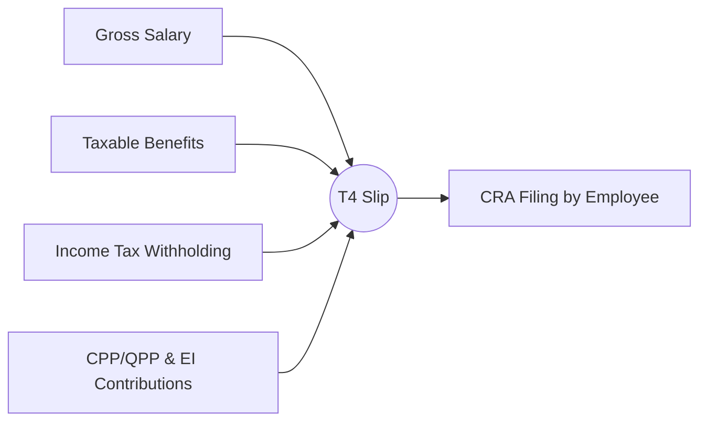

## 8.4 Taxable and Non-Taxable Employee Benefits

Employee benefits not only provide additional value for workers but also have significant tax implications. As a financial planner, understanding which benefits are taxable and which are non-taxable is essential for helping clients maintain accurate tax records, plan their cash flow, and structure overall wealth-management strategies. This section covers common forms of taxable and non-taxable benefits, discusses record-keeping and reporting obligations, and highlights planning opportunities to optimize clients’ financial arrangements.

---

### Common Taxable Benefits

Taxable benefits are perks or allowances provided by employers that are required to be included in the employee’s total taxable income. The Canada Revenue Agency (CRA) defines a taxable benefit as any benefit received or enjoyed by an employee, that primarily benefits the employee, rather than the employer’s business. Below are examples of common taxable benefits.

#### Company Car or Vehicle Allowance

When an employer provides a car for an employee’s personal use, the value of this personal-use portion is typically considered a taxable benefit. The calculation of the taxable amount is often based on two components:

1. A standby charge: Reflecting the cost of making the car available.  
2. An operating expense benefit: Reflecting gas, maintenance, and other operating costs for personal use.

For instance, if an employee of RBC (Royal Bank of Canada) often uses a company car for both business and personal transactions, the employer will usually calculate the personal-use component and report it on the employee’s T4 slip. If instead of an actual vehicle, the employer provides a vehicle allowance—such as a flat monthly payment to cover car expenses—the entire amount can be added to the employee’s taxable income.

#### Group Health Benefits (Certain Components)

Most provincial and federal regulations allow core medical and dental plans to be non-taxable if they strictly cover medical expenses; however, additional coverage, such as employer-paid premiums for disability or critical illness insurance, might be treated differently. If the employer pays the full premium for short- or long-term disability insurance, employees may eventually pay tax on disability benefits they receive. Ensure that clients understand:

• Core health and dental insurance premiums are typically non-taxable.  
• Employer-paid disability premiums often lead to taxable disability benefit payments if the employee later needs to claim these benefits.

#### Stock Options

Stock options give employees the right to purchase shares of the employer’s stock at a strike price (often discounted) during a specified period. From a tax perspective, the timing of exercising these options and the difference between the strike price and the market price at exercise are crucial. In Canada, certain conditions allow employees to receive a 50% deduction on the taxable benefit if:

• The option’s strike price is set at the fair market value at the time the option is granted.  
• Shares are common shares (not preferred).  
• The employee meets other conditions established by the applicable legislation.

Advisors should guide their clients to:

• Carefully choose the timing of exercise to align with lower marginal tax years or potential capital gains considerations.  
• Stay compliant with CIRO’s guidelines on employee stock options, especially if they work for major banks like TD or BMO that have additional insider trading restrictions.

#### Tuition Reimbursements (Non–Work Related)

If tuition reimbursements are directly related to improving job skills and required by the employer, these payments are typically non-taxable. However, if they are for broad personal or professional development not directly related to the job—such as a career change course or a hobby course—these reimbursements are generally considered a taxable benefit. As an example, if an employee has tuition reimbursed for a marketing course closely related to their position at a major Canadian insurance firm, that benefit might be non-taxable. Conversely, if the employee takes a course in culinary arts unrelated to their job, any reimbursement from the employer is usually taxable.

---

### Non-Taxable Benefits

Non-taxable benefits do not add to the employee’s taxable income. They generally represent compensation intended to support employees’ well-being, mental or physical health, or job-related education. Understanding this classification allows advisors to help clients take full advantage of their compensation packages.

#### Group Health Insurance (Core Medical & Dental Plans)

In many provinces, employers pay health insurance premiums as part of an extended health and dental plan, and this is often not considered taxable to the employee. However, certain provincial guidelines may impose a health levy or have different rules. For example:

• Quebec: Some health benefits may be included in provincial taxable income even if they are exempt federally.  
• Most other Canadian jurisdictions: Core health and dental plans remain non-taxable to the employee.

Encourage clients to verify local regulations and consider that changes in provincial rules can impact the taxability of these benefits.

#### Counseling Services

Many organizations offer Employee Assistance Programs (EAPs) that provide counseling for mental health, stress management, or family guidance. These services are typically considered non-taxable benefits if they are:

• Available to all employees in similar positions.  
• Designed to address personal challenges (e.g., mental health counseling, stress management workshops, or addiction counseling).

This aligns with CRA’s view that such programs benefit both the employer (by maintaining a healthy workforce) and the employee in a way that is not purely remunerative.

#### Gift Certificates (Small Amount)

Although most gift certificates are typically taxable, there are exceptions. If the employer provides a small gift (e.g., a holiday gift or an award) that meets certain conditions set by the CRA—often referred to as the “nominal threshold value” for non-cash gifts—this may be non-taxable. For instance, if a financial institution rewards employees with a $50 gift certificate at the end of the year for each employee’s consistent performance and the gift certificate meets CRA guidelines, it may be excluded from taxable income. However, if the amount is higher or given too frequently, the benefit becomes taxable.

---

### Record-Keeping and Reporting

Accurate record-keeping is crucial to ensure that clients understand their total remuneration and file their taxes properly.

#### T4 Statement of Remuneration Paid

The T4 slip is issued by employers each year to report:

• Salary/Wages  
• Tax Deductions (CPP/QPP contributions, EI premiums, income tax withheld)  
• Taxable Benefits (shown in designated boxes, such as box 14, box 40, and detailed codes)

Financial planners should regularly review T4 slips and other statements to ensure all benefits and allowances have been correctly identified and included in the right boxes.

#### In-Kind Benefits

If an employer pays for an employee’s personal expenses (e.g., club membership fees, personal travel costs, or personal cellphone plan beyond basic business usage), the employee receives an “in-kind benefit.” Such amounts are generally taxable. An example might be an employer in the Canadian energy sector paying employees’ golf club memberships. The personal portion is added to the T4 as a taxable benefit.

Below is a simple diagram to illustrate how different forms of compensation feed into T4 reporting:

In this diagram, all forms of compensation—salary, taxable benefits, and withholdings—flow into the T4 slip. The employee then uses these details when filing their annual tax return to the CRA.

---

### Advisor’s Perspective and Planning

As a financial planner, analyzing employee benefits is critical to forming an accurate picture of a client’s income, tax exposure, and overall financial status. Integrating the taxation of these benefits into broader wealth planning is an ongoing, high-value service.

#### Maximizing Workplace Benefits

Encourage clients to leverage their employer-sponsored benefits to the fullest, especially:

• Matching Contributions to Group RRSPs: Some employers match a percentage of employee contributions. Motivate clients to contribute enough to capture the full match as it effectively doubles part of their savings.  
• Optional Coverage: Assess whether optional life or disability coverage meets the client’s needs, being mindful of any potential tax implications.

#### Tax Deferral Opportunities

With stock options and other incentive plans, timing becomes strategic:

• Stock Option Exercises: Employees may delay exercising an option until retirement or a year when their marginal tax rate is lower.  
• Splitting Exercises Over Multiple Tax Years: This sometimes reduces the total tax burden and effectively defers taxes.

#### Integration into Overall Plan

Workplace benefits impact net worth and need to be integrated into retirement savings, insurance, estate planning, and investment decisions. For instance, if an employee’s disability premiums are entirely paid by the employer, the client should be aware that benefits received might be taxable income and thus result in lower net proceeds if they claim. Similarly, employer shares acquired through stock options can significantly influence an individual’s investment portfolio weighting, creating a home-bias risk if not diversified appropriately.

Consider the following simple visual for how employee benefits fit into an overall financial plan:

---

### Summary of Key Points

1. **Taxable vs. Non-Taxable**: Understand that benefits such as personal use of a company car, certain tuition reimbursements, and employer-paid disability premiums are often taxed, whereas health and dental coverage, some counseling services, and certain small-value awards may be exempt.  
2. **Compliance**: Properly reporting benefits is crucial for both employer and employee; T4 slips are the primary mechanism for capturing total remuneration.  
3. **Strategic Planning**: Optimal use of group benefits and strategic timing for exercising stock options can reduce tax liabilities and fit seamlessly into a broader wealth management plan.

---

### Glossary

• **Taxable Benefit**: A perk received from an employer that is added to the employee’s taxable income.  
• **Non-Taxable Benefit**: A benefit that is not added to the employee’s taxable income under CRA guidelines.  
• **Stock Options**: A right to buy shares of a company at a fixed price (strike price), potentially yielding capital gains or income tax treatment.  
• **In-Kind Benefits**: Non-monetary compensation provided by an employer, such as covering personal bills or club memberships.

---

### Additional References for Further Exploration

• **CRA’s Guide T4130 – Employers’ Guide Taxable Benefits and Allowances**:  
  https://www.canada.ca/en/revenue-agency.html  

• **CIRO Bulletins on Employee Stock Options and Insider Trading**:  
  https://www.ciro.ca  

• **Carswell’s Payroll Source (Thomson Reuters)**: A detailed reference for HR/payroll professionals on administering employee benefits.  

• **“Everything You Always Wanted to Know About Employee Benefits in Canada” by Alan McEwen**: Offers deeper insight into how Canadian benefit programs are structured and administered.

---

## Test Your Knowledge: Maximizing Tax Benefits in Employee Compensation



### Which of the following is typically considered a taxable employee benefit?

- [x] Personal-use portion of a company car
- [ ] Employer-paid core dental coverage
- [ ] A small holiday gift under $50
- [ ] Employer-sponsored counseling services

> **Explanation:** The personal (non-business) use of a company car is deemed a taxable benefit, while core dental coverage, a nominal holiday gift, and certain counseling services can be non-taxable under CRA rules.

### Group health benefits provided by an employer are generally non-taxable, except in scenarios where:

- [ ] The employer pays for all health and dental premiums.
- [x] Disability insurance premiums are covered by the employer.
- [ ] Vision care is included in the benefits plan.
- [ ] The employee chooses to pay part of the premium costs.

> **Explanation:** When the employer covers disability premiums, any disability income received by the employee becomes taxable. Other core medical and dental coverages are typically non-taxable, though provincial rules (such as in Quebec) can add complexity.

### When can an employee generally qualify for a 50% tax deduction on stock option benefits?

- [x] If the option’s exercise price is at least equal to the fair market value on the grant date.
- [ ] If the employer pays all the strike price costs.
- [x] If the employee exercises the option in a low marginal tax year.
- [ ] If the employee sells the shares immediately after exercising the option.

> **Explanation:** The CRA allows a 50% deduction if specific conditions are met, including that the exercise price was not discounted. Timing the exercise with a low marginal tax year can help reduce tax liabilities, although the 50% deduction itself is linked primarily to meeting the CRA’s eligibility conditions.

### Which of the following statements about tuition reimbursements is correct?

- [x] Tuition for job-related courses is often non-taxable if required by the employer.
- [ ] All tuition reimbursements are always taxable.
- [ ] Non-work-related tuition is always non-taxable.
- [ ] Tuition reimbursements of less than $2,500 annually are automatically non-taxable.

> **Explanation:** If courses directly relate to the employee’s current job and the employer requires it, the reimbursement is usually non-taxable. Non-work-related courses are generally taxable.

### What is an example of an “in-kind benefit” that might be taxable?

- [x] Employer paying an employee’s personal club membership
- [ ] Employer-sponsored group RRSP contributions
- [x] Employer-provided restricted stock grants
- [ ] Employer-paid professional association fees that align with the employee’s job

> **Explanation:** In-kind benefits include any employer payments of personal expenses. If a professional association fee is required for the employee’s job (e.g., a required certification), it might not be considered taxable. Restricted stock grants, while also “in-kind,” follow specific taxation rules but typically result in a taxable benefit upon vesting or redemption. Personal club membership fees, on the other hand, are immediately taxable if they are a personal expense covered by the employer.

### How might a financial planner support clients regarding employee benefits?

- [x] By helping clients understand taxable vs. non-taxable benefits.
- [ ] By ensuring clients always receive no taxable benefits.
- [ ] By automatically converting non-taxable benefits into taxable ones for larger T4 statements.
- [ ] By only focusing on salary and ignoring benefits altogether.

> **Explanation:** Financial planners add value by clarifying pertinent tax rules and ensuring clients maximize their compensation packages while remaining compliant.

### A nominal gift certificate offered by an employer to employees:

- [x] Can be non-taxable if the value and circumstances meet CRA guidelines.
- [ ] Is never taxable regardless of the amount.
- [x] Might become taxable if it exceeds certain thresholds.
- [ ] Is always taxed at the highest marginal rate.

> **Explanation:** Small, infrequent gifts may be non-taxable. However, employers must follow CRA guidelines on the frequency and total value of such gifts to avoid making them taxable.

### Which of the following best describes a T4 Statement of Remuneration Paid?

- [x] It’s an annual slip showing employees’ income, taxable benefits, and deductions.
- [ ] It’s a federal form only used for reporting self-employment income.
- [ ] It’s a Canada Pension Plan contribution summary.
- [ ] It’s optional for employers to prepare.

> **Explanation:** The T4 is the official slip employers must file and provide annually, detailing employees’ wages, taxable benefits, and source deductions.

### In Quebec, how might tax rules differ regarding health benefits?

- [x] Certain employer-funded health benefits may be partially taxable at the provincial level.
- [ ] Quebec exempts all employer-funded health benefits.
- [ ] Quebec only taxes disability benefits.
- [ ] Quebec treats group dental plans as fully taxable but not other medical plans.

> **Explanation:** Quebec sometimes includes certain employer-paid premiums as taxable at the provincial level, even if they are exempt federally. Regulations vary over time, so staying abreast of the latest provincial guidelines is crucial.

### Under CRA definitions, disability benefits received by an employee are generally taxable if:

- [x] The employer paid the disability insurance premiums.
- [ ] The employee paid 100% of the disability insurance premiums.
- [ ] The benefits are related to a workplace injury.
- [ ] The benefits were paid in a lump-sum settlement.

> **Explanation:** If the employer funds disability premiums, disability benefits paid out to the employee are often taxed as regular income. When the employee pays the premiums, the benefits are generally non-taxable.



---

## For Additional Practice and Deeper Preparation

**[1. WME Course For Financial Planners (WME-FP): Exam 1](https://www.udemy.com/course/csi-wme-fp-exam1/?referralCode=1A23C67E56971C0A73D5)**  
• Dive into 6 full-length mock exams—1,500 questions in total—expertly matching the scope of WME-FP Exam 1.  
• Experience scenario-driven case questions and in-depth solutions, surpassing standard references.  
• Build confidence with step-by-step explanations designed to sharpen exam-day strategies.

**[2. WME Course For Financial Planners (WME-FP): Exam 2](https://www.udemy.com/course/csi-wme-fp-exam2/?referralCode=25879CCDED7B7905BBA8)**  
• Tackle 1,500 advanced questions spread across 6 rigorous mock exams (250 questions each).  
• Gain real-world insight with practical tips and detailed rationales that clarify tricky concepts.  
• Stay aligned with CIRO guidelines and CSI’s exam structure—this is a resource intentionally more challenging than the real exam to bolster your preparedness.

> Note: While these courses are specifically crafted to align with the WME-FP exam outlines, they are independently developed and not endorsed by CSI or CIRO.
