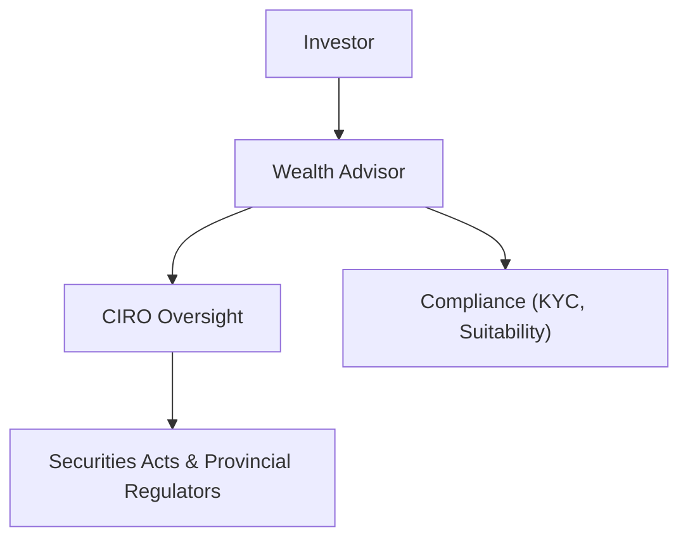

## 1.4 Regulatory Environment

Canada’s financial services industry operates under a robust regulatory framework designed to protect investors, foster transparent capital markets, and maintain investor confidence. Wealth advisors must navigate various regulatory requirements while managing client portfolios and delivering financial advice. Below, we explore the key regulatory bodies, obligations, and practical considerations that shape wealth management in Canada.

### CIRO’s Role in Wealth Management

The Canadian Investment Regulatory Organization (CIRO) is Canada’s national self-regulatory organization (SRO) overseeing both investment dealers and mutual fund dealers. Formed from the amalgamation of the Investment Industry Regulatory Organization of Canada (IIROC) and the Mutual Fund Dealers Association of Canada (MFDA), CIRO ensures:

- A unified rulebook for all registered dealers (investment and mutual fund).  
- Consistent enforcement of standards across all regulated firms.  
- Comprehensive oversight, covering everything from proficiency requirements to market integrity and compliance practices.

CIRO’s expanded authority means that Canadians now benefit from greater consistency and transparency in the wealth management industry. For the latest updates, rule amendments, and enforcement notices, advisors and investors should refer to [CIRO’s official website](https://www.ciro.ca).

**Diagram Explanation:** This flowchart illustrates how the investor’s relationship with a wealth advisor is framed by CIRO’s oversight, which operates in alignment with provincial securities regulations.

### National and Provincial Regulatory Bodies

While CIRO sets national standards for registered dealers, securities legislation in Canada is maintained at the provincial and territorial level. Each jurisdiction has its own securities regulator, such as:

- Ontario Securities Commission (OSC)  
- Autorité des marchés financiers (AMF) in Quebec  
- British Columbia Securities Commission (BCSC)  
- Alberta Securities Commission (ASC)

To harmonize efforts, these regulators collaborate under the umbrella of the Canadian Securities Administrators (CSA). The CSA develops and coordinates national instruments and policies—like National Instrument (NI) 31-103 for registration requirements—that aim to unify compliance and enforcement across provinces.

From a wealth advisor’s perspective, keeping abreast of each province’s rules is essential, particularly if you serve clients across different jurisdictions. For example, RBC, TD, and BMO—three of Canada’s largest banks—each have operations spanning all provinces, requiring their advisors to ensure compliance with multiple provincial regulations coordinated by the CSA.

### The Compliance Framework

A critical aspect of the Canadian regulatory environment is the focus on investor protection and suitability. Wealth advisors must:

1. **Meet Proficiency Standards**:  
   • Complete recognized industry courses (e.g., the Canadian Securities Course® (CSC®) or advanced designations).  
   • Maintain ongoing professional development to stay current with evolving regulations, product offerings, and best practices.

2. **Fulfill Know-Your-Client (KYC) Obligations**:  
   • Collect and document each client’s financial situation, investment objectives, and risk tolerance.  
   • Keep KYC information up to date as clients’ life circumstances change.

3. **Demonstrate Suitability**:  
   • Recommend investment products and strategies that align with the client’s profile and stated objectives.  
   • Provide disclosures about risks, fees, and product features so clients can make informed decisions.

4. **Ongoing Disclosure and Reporting**:  
   • Explain any changes in account structure, management fees, or investment performance.  
   • Provide timely updates on portfolio performance and potential risks.

5. **Continuing Education**:  
   • Complete mandatory courses or programs set by CIRO that address regulatory changes and emerging industry practices.  
   • Document educational activities to demonstrate compliance with continuing education requirements.

**Tip:** Many Canadian wealth management firms leverage digital KYC tools and integrated client relationship management (CRM) systems to streamline disclosure, reporting, and record-keeping.

### Regulatory Filings and Reporting

Investment dealers and their advisor teams are required to submit regular filings to ensure ongoing compliance with securities laws. These filings typically include:

- **Trade Reports**: Details of executed trades, dates, volumes, and values, helping regulators monitor market activities.  
- **Client Holdings**: Documentation of client positions to verify that investment decisions align with suitability and risk tolerance profiles.  
- **Financial Statements**: Audited statements showing the firm’s financial health and any risk exposures.

Accurate record-keeping and timely submissions are critical. Failure to adhere to filing schedules or accurate record-keeping can result in regulatory scrutiny and possible disciplinary measures.

### Client Protection Mechanisms

CIRO-regulated firms are members of the Canadian Investor Protection Fund ([CIPF](https://www.cipf.ca/)), which offers coverage to eligible clients if a member firm becomes insolvent. Key points:

- CIPF covers losses for eligible accounts up to prescribed limits when a member fails to return assets it effectively held for clients.  
- It provides crucial reassurance for investors, particularly during market disruptions or firm bankruptcies.

**Case Study – RBC Example**:  
If a hypothetical RBC investment advisor’s firm became insolvent and was unable to return investor property, RBC clients would have CIPF protection for certain assets, subject to CIPF’s coverage limits and eligibility conditions.

### Enforcement Actions and Penalties

Regulators have broad powers to enforce compliance and sanction misconduct. Penalties include:

- **Fines**, which can range from minor to substantial amounts depending on the severity of the infraction.  
- **Suspensions** that temporarily bar advisors from practicing.  
- **Permanent Bans** from the industry for repeated or egregious violations.  
- **Public Disciplinary Notices**, which can harm an advisor’s professional reputation.

CIRO, in coordination with provincial commissions, regularly publishes enforcement notices detailing infractions and disciplinary actions. Advisors should review these to stay informed about common pitfalls and proactive compliance measures.

**Pitfall:** Failure to update a client’s KYC profile or recommending unsuitable products can lead to investigations, fines, and reputational damage.

### Evolving Regulatory Landscape

The Canadian regulatory framework is dynamic. Proposed changes and emerging discussions include:

- **Assessment-Centric Model**: Future proficiency rules may emphasize verified competency through practical assessments rather than requiring a set number of classroom hours.  
- **Technology Innovations**: Regulators are examining how robo-advice platforms, digital assets (e.g., cryptocurrencies), and artificial intelligence can be supervised while still fostering innovation.  
- **Holistic Advice**: As the complexity of financial products grows, regulators increasingly expect advisors to examine all aspects of a client’s financial life, including insurance needs, tax considerations, and retirement plans.

Wealth advisors must stay current on these changes by regularly reading CIRO publications and participating in industry webinars, conferences, and courses.

### Best Practices

**Important:**  
• Keep thorough documentation for all client communications, especially regarding risk profile changes.  
• Review your client files regularly to ensure KYC accuracy and suitability alignment.  
• Maintain a strong relationship with compliance and legal teams for guidance on new policies.

**Tip:**  
• Use industry webinars, professional development courses, and CIRO bulletins to stay updated on regulatory changes.  
• Encourage your team to earn advanced certifications demonstrating their commitment to professional excellence.

**Pitfall:**  
• Neglecting to promptly notify regulators of material changes (e.g., a firm merger, substantial changes to your product shelf) can result in enforcement proceedings.

### Glossary of Key Terms

- **Know-Your-Client (KYC)**: The process of gathering and updating client information on financial circumstances, risk tolerance, and objectives.  
- **Suitability Obligation**: The requirement to align investments and advice with a client’s profile, goals, and risk preference.  
- **Canadian Securities Administrators (CSA)**: An umbrella organization coordinating efforts among Canada’s provincial and territorial securities regulators.  
- **CIRO**: The Canadian Investment Regulatory Organization, the national SRO overseeing investment dealers and mutual fund dealers.  
- **Compliance**: Adherence to rules, regulations, and guidelines governing financial services.  
- **Investor Protection Fund**: A compensation fund (CIPF) safeguarding client assets if a member firm becomes insolvent.  
- **Proficiency Standards**: Educational and exam-based requirements for advisors and other registrants in the securities industry.  
- **Assessment-Centric Model**: A regulatory approach that emphasizes demonstrated competencies instead of seat-time or course hours.

### Additional Resources

- [CIRO Website](https://www.ciro.ca/) – For current regulatory notices, investor protection information, and enforcement updates.  
- [Canadian Securities Administrators (CSA) National Instruments](https://www.securities-administrators.ca/) – Access NI 31-103 and other key legislation.  
- [Canadian Investor Protection Fund (CIPF)](https://www.cipf.ca/) – Understand coverage limits and how CIPF safeguards investors.  
- CSI (Canadian Securities Institute) Courses – Including the Canadian Securities Course® (CSC®) and advanced compliance-focused offerings.  

### Conclusion

The Canadian regulatory environment for wealth management is intricate, with multiple entities and rules working in tandem to protect investors and uphold market integrity. Advisors who understand the hierarchy—from provincial regulators and the CSA to CIRO’s unified oversight—are better positioned to serve clients ethically and competently.

By embracing continuous learning, complying with prescribed standards, and engaging closely with regulatory changes, wealth professionals can not only achieve compliance but also enhance client trust and build sustainable practices.

---

## Test Your Knowledge: Navigating Canada’s Regulatory Environment Quiz



### Which national self-regulatory organization (SRO) currently oversees both investment dealers and mutual fund dealers in Canada?

- [ ] The Mutual Fund Dealers Association (MFDA)
- [ ] The Investment Industry Regulatory Organization of Canada (IIROC)
- [x] The Canadian Investment Regulatory Organization (CIRO)
- [ ] The Canadian Securities Administrators (CSA)

> **Explanation:** Effective 2023, MFDA and IIROC amalgamated into the Canadian Investment Regulatory Organization (CIRO). The CSA is a coordinating body for provincial and territorial regulators.

### Under the compliance framework, which requirement ensures that financial products align with an investor’s risk tolerance and objectives?

- [ ] Registration
- [ ] Proficiency requirements
- [ ] Ethics disclosure
- [x] Suitability obligation

> **Explanation:** The suitability obligation mandates that advisors present investment options consistent with their client’s objectives, timelines, and risk capacity.

### Which umbrella organization coordinates Canada’s provincial and territorial securities regulators?

- [ ] The Office of the Superintendent of Financial Institutions (OSFI)
- [x] The Canadian Securities Administrators (CSA)
- [ ] The Ontario Securities Commission (OSC)
- [ ] The Canadian Bankers Association (CBA)

> **Explanation:** The CSA works to harmonize policies and regulations across all Canadian jurisdictions, each of which has its own securities commission.

### What is a core function of the Canadian Investor Protection Fund (CIPF)?

- [ ] Setting securities trading fees
- [ ] Overseeing credit unions
- [ ] Penalizing advisors for non-compliance
- [x] Protecting client assets if a member firm becomes insolvent

> **Explanation:** CIPF provides coverage up to prescribed limits when investors’ assets are lost due to a member firm’s insolvency.

### Which of the following practices helps maintain effective documentation and meets regulatory obligations?

- [x] Updating KYC forms regularly
- [ ] Providing recommends without rationale
- [x] Recording client communications accurately
- [ ] Skipping regular portfolio reviews

> **Explanation:** Frequent updating of KYC data and detailed record-keeping are crucial for compliance with CIRO regulations.

### What is a potential penalty from regulators if an advisor fails to meet their suitability obligations?

- [x] Fines and disciplinary actions
- [ ] Automatic eligibility for promotion
- [ ] No penalty imposed
- [ ] Lower continuing education requirements

> **Explanation:** Regulators can impose serious penalties, including fines, suspensions, and bans, to enforce compliance.

### When regulators refer to an “assessment-centric model” for wealth advisor proficiency, they emphasize:

- [x] Practical demonstration of essential competencies
- [ ] More seat-time in mandatory courses
- [x] Fewer course hours but higher testing standards
- [ ] Abolishing all proficiency standards

> **Explanation:** An assessment-centric approach focuses on verifying that advisors possess the necessary skills rather than just fulfilling completion hours.

### Which of the following accurately describes Canada’s regulatory environment?

- [x] Provincial regulators coordinate through the CSA for national consistency
- [ ] The entire securities industry falls directly under a single federal regulator
- [ ] Compliance is optional for wealth advisors
- [ ] Legacy SROs (IIROC and MFDA) remain fully active as separate entities

> **Explanation:** Canada’s fragmented but cooperative model assigns primary responsibility to provincial/territorial regulators, coordinated by the CSA and enforced through CIRO.

### Which best practice can wealth advisors adopt to stay informed about regulatory changes?

- [x] Attend industry webinars and read CIRO bulletins
- [ ] Rely solely on client feedback
- [ ] Avoid reading enforcement notices
- [ ] Rely on secondhand information from colleagues only

> **Explanation:** Direct engagement with official regulatory communications and professional development opportunities ensures advisors remain current.

### True or False: Wealth advisors must maintain regular continuing education to keep abreast of evolving regulations in Canada.

- [x] True
- [ ] False

> **Explanation:** Advisors are required to pursue ongoing professional development to maintain proficiency and stay informed on new products, regulatory updates, and industry trends.


