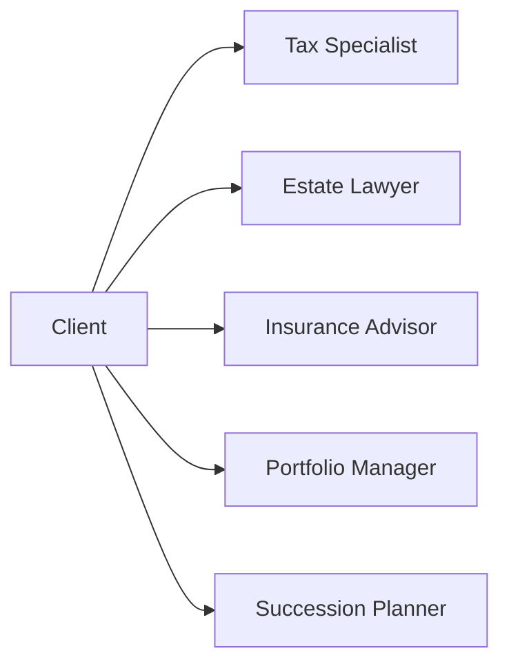

## 1.7 Building a Team of Specialists

A successful wealth manager understands that no single advisor can be an expert in every facet of financial planning. From tax optimization to estate law, insurance coverage to business succession, clients’ needs can be complex and nuanced. This is why building a team of specialists is essential to delivering comprehensive advice—ensuring every aspect of a client’s financial life is addressed with the highest level of expertise.

Below, we explore the rationale behind a team-based approach, the roles of key specialists, and the communication required to maintain synergy. We also cover potential challenges, legal considerations, and best practices to ensure each client benefits from a coordinated advisory experience.

---

## Why a Team-Based Approach?

1. **Depth of Expertise**  
   • Financial planning often requires deep knowledge in multiple areas (tax, law, insurance, investments, etc.).  
   • A single advisor rarely has the capacity or qualifications to provide robust guidance on each.  
   • Collaborating with subject matter experts ensures each topic is handled by a specialist with thorough training and real-world experience.

2. **Holistic Perspective**  
   • Clients benefit from strategies that align tax considerations, estate decisions, retirement planning, and investment management.  
   • A multi-disciplinary team guarantees that decisions in one area (e.g., tax planning) do not inadvertently harm another (e.g., estate planning).

3. **Streamlined Process**  
   • Clients can experience a “hub-and-spoke” model, where one advisor coordinates multiple professionals on their behalf.  
   • This integrated approach minimizes the need for clients to seek separate advice and ensures consistent, agreed-upon strategies.

---

## Types of Specialists

Though every client’s needs vary, certain specialists commonly serve on a wealth management team:

1. **Tax Specialists (CPAs)**  
   • Responsible for crafting tax-efficient strategies for individuals, businesses, trusts, and estates.  
   • Certified Professional Accountants (CPAs) can help ensure compliance with Canada Revenue Agency (CRA) regulations.

2. **Estate Lawyers and Trust Officers**  
   • Provide legal expertise in will creation, trust arrangements, and estate settlement.  
   • Trust Officers administer trusts, ensuring they follow the trust deed and protect beneficiaries’ interests.

3. **Insurance Advisors**  
   • Offer guidance on life, disability, and critical illness coverage.  
   • Develop solutions that protect client wealth and address inheritance or liquidity needs.

4. **Investment Strategists or Portfolio Managers**  
   • Manage portfolios, selecting securities or overseeing managed products aligned with a client’s risk tolerance and objectives.  
   • Leverage portfolio theory, asset allocation strategies, and risk-management tools.

5. **Business Succession Planners**  
   • Specialize in helping entrepreneurs transition ownership or leadership efficiently and tax-effectively.  
   • Work with family-run companies and large corporations to facilitate smooth handovers.

The above flowchart shows how a client (A) may need the support of multiple specialists simultaneously. Each specialist offers targeted expertise while working in collaboration toward the client’s financial goals.

---

## Coordination and Communication

A high-performing wealth management team relies on consistent communication and coordinated action:

- **Clearly Defined Roles and Responsibilities**  
  • Each specialist should understand the scope of their role.  
  • Minimizes conflicting advice, duplicated work, or missed opportunities.

- **Regular Team Meetings**  
  • Frequent check-ins ensure everyone is informed of changes to the client’s circumstances.  
  • Advisors can quickly adjust recommendations when legislative or regulatory changes occur.

- **Designated Point of Contact**  
  • Typically, the primary wealth advisor or family office lead takes responsibility for coordinating activities.  
  • Centralizes communication and avoids placing administrative burdens on the client.

This communication framework is especially critical for clients with complex financial structures, such as high-net-worth individuals, family offices, or owner-managers of businesses.

---

## Benefits to the Client

A well-structured team offers tangible advantages:

- **Access to Specialized Knowledge**  
  • CPAs can advise on the latest CRA guidelines.  
  • Estate lawyers ensure the client’s final wishes are legally sound.  
  • Insurance advisors help protect wealth against unforeseen risks.

- **Integrated Planning**  
  • Recommendations are reviewed from multiple angles, ensuring alignment with the client’s overall objectives.

- **Streamlined Document Preparation**  
  • Eliminates duplication of data collection and reduces errors.  
  • Legal and financial documents can be prepared more efficiently.

- **Consistency of Service**  
  • Each specialist collaborates with the broader team, leading to a unified strategy regardless of the client’s life stage.

---

## Potential Challenges

Even the best-structured teams face hurdles:

- **Managing Costs**  
  • Retaining multiple specialists can increase fees.  
  • Advisors must be transparent about how fees are structured (e.g., hourly vs. retainer vs. shared arrangements).

- **Ensuring Consistent Advice**  
  • Differences in professional opinions can delay decision-making.  
  • Open lines of communication and a lead advisor help reconcile conflicting viewpoints.

- **Coordination Overload**  
  • Juggling the schedules and input of multiple experts can be time-consuming.  
  • Clear meeting agendas and project management tools can maintain efficiency.

- **Regulatory Compliance**  
  • Referral arrangements and fee-sharing must comply with Canadian Investment Regulatory Organization (CIRO) rules.  
  • Advisors must remain vigilant in meeting privacy, anti-money laundering, and other compliance requirements.

---

## Legal Considerations

- **Confidentiality Agreements**  
  • Sharing sensitive information among different professionals demands robust privacy protections.  
  • Advisors should employ formal confidentiality agreements to safeguard client data.

- **Regulatory Compliance Supervision**  
  • Under CIRO oversight, investment advisors must ensure that specialists operate within prescribed regulatory frameworks.  
  • Advisors must confirm that tax and legal professionals comply with relevant bodies such as CPA Canada and the Law Societies in their respective provinces.

- **Fee-Sharing Models**  
  • Any compensation arrangement involving multiple professionals must adhere to CIRO rules on referral fees and permissible sharing structures.  
  • Transparent disclosure to clients regarding all fees is non-negotiable.

- **Client Consent**  
  • Clients should authorize the exchange of their personal information between team members.  
  • Clear communication regarding what data is shared and why fosters trust.

---

## Client Engagement and Transparency

1. **Client Awareness**  
   • Introduce each specialist to the client, clarifying roles and qualifications.  
   • Ensure the client understands deliverables, expected outcomes, and timelines.

2. **Fee and Compensation Structures**  
   • Some specialists charge hourly rates; others work on a retainer or fee-for-service model.  
   • Provide clients with a detailed breakdown of costs, aligning them with CIRO’s disclosure requirements.

3. **Gathering Feedback**  
   • Encourage clients to voice concerns or questions about strategies or fees.  
   • Collect ongoing feedback to refine collaboration and maintain satisfaction.

---

## Best Practices and Implementation Tips

- **Tip: Start Small**  
  • Begin by partnering with one or two specialists—such as a CPA and estate lawyer—before expanding.  
  • This approach streamlines your initial experience with interdisciplinary collaboration.

- **Tip: Formalize Communication Protocols**  
  • Use secure online portals or project management systems to share and store documents.  
  • Schedule recurring “all-hands” calls or videoconferences around major client milestones (e.g., year-end tax planning).

- **Pitfall: Not Vetting Your Specialists**  
  • Align yourself with reputable professionals who understand the intricacies of Canadian financial regulations.  
  • Check references, credentials, and track record with relevant professional bodies.

- **Pitfall: Overlooking Regulatory Updates**  
  • Keep abreast of changes from CIRO, OSFI, CSA, and CRA.  
  • Subscribe to bulletins or alerts that impact wealth management directives or legislation.

---

## Canadian Context and Real-World Examples

- **Major Canadian Banks**  
  • Institutions like RBC, TD, and BMO often have teams of internal specialists, offering a broad suite of services—ranging from private banking to estate planning.  
  • This integrated model provides one-stop, coordinated solutions for affluent clients.

- **Investment Strategies Used by Canadian Pension Funds**  
  • Large pension funds (e.g., CPP Investments) often partner with external asset managers for specialized investment strategies (infrastructure, private equity, etc.).  
  • Wealth managers can adopt a similar model by leveraging third-party specialists in niche areas.

- **Local Case Studies**  
  • In provinces such as Ontario and British Columbia, estate lawyers commonly collaborate with CPAs to optimize family trust systems.  
  • Family-run businesses in Alberta frequently rely on succession planners who specialize in oil, gas, and agricultural enterprises.

---

## Glossary

- **Trust Officer**  
  A professional responsible for administering trusts and ensuring assets are managed according to the trust deed and beneficiaries’ interests.

- **CPA (Chartered Professional Accountant)**  
  A professional designation in Canada indicating expertise in accounting, tax planning, and business advisory services.

- **Succession Planner**  
  An expert focusing on evolving business ownership or leadership structures, considering legal, tax, and family dynamics. 

- **Interdisciplinary Collaboration**  
  Collaboration among specialists from different professional fields to provide holistic advice aligned with client goals.

- **Confidentiality Agreements**  
  Legal contracts that safeguard private client information shared among specialists, preventing unauthorized disclosure.

- **Team-Based Approach**  
  A model in which multiple professionals coordinate their efforts, ensuring each specialized area is handled expertly.

- **Fee-Sharing Models**  
  Fee structures that allocate compensation among multiple specialists, subject to regulatory guidelines.

- **Compliance Supervision**  
  Oversight of team activities to ensure adherence to regulations set by CIRO, including privacy and referral rules.

---

## Key Takeaways

• A team-based approach is vital for providing comprehensive and specialized guidance.  
• Clear roles, consistent communication, and strong leadership promote a cohesive strategy.  
• Legal and regulatory considerations—particularly around confidentiality—remain paramount.  
• Transparent fee and compensation structures help maintain client trust.  
• Major Canadian institutions successfully deploy multi-disciplinary teams, showcasing the model’s efficiency.  

By applying these principles, wealth advisors can deliver enriched value to their clients, ensuring no aspect of the client’s financial life is overlooked or under-served.

---

## Strengthening Wealth Strategies with Specialized Teams: A Comprehensive Quiz



### 1. Which of the following best describes the primary rationale for building a team of wealth management specialists?

- [x] No single advisor can be an expert in every aspect of financial planning.  
- [ ] It reduces the number of regulatory obligations for the lead advisor.  
- [ ] Clients prefer to work with as many different professionals as possible.  
- [ ] It is mandated by the Canadian Investment Regulatory Organization (CIRO).  

> **Explanation:** A team-based approach allows each area of financial planning (tax, estate, investment, insurance) to be handled by experts, ensuring comprehensive and accurate advice.

---

### 2. Which professional is typically responsible for administering trusts and ensuring they are managed in line with the beneficiaries’ interests?

- [ ] CPA (Chartered Professional Accountant)  
- [ ] Insurance Advisor  
- [x] Trust Officer  
- [ ] Investment Strategist  

> **Explanation:** A Trust Officer is dedicated to the accurate administration of trusts, working within the terms set by the trust deed.

---

### 3. Which of the following is a significant benefit for clients when working with a multidisciplinary team?

- [ ] Access to more conflicting advice  
- [x] Integrated and holistic financial strategies  
- [ ] Lower legal disclosure requirements  
- [ ] Increased administrative load on the client  

> **Explanation:** By combining the knowledge of various specialists, clients receive holistic advice that ties together all aspects of their finances.

---

### 4. One of the potential challenges of a team-based approach is:

- [ ] Reduced scope of advice  
- [ ] Lower service quality  
- [x] Managing differences in professional opinions  
- [ ] Decreased awareness of relevant laws  

> **Explanation:** Specialists may sometimes have differing views. Clear communication and a responsible lead advisor help reconcile these efficiently.

---

### 5. In Canada, which regulatory body supervises referral arrangements and fee-sharing among investment dealers and mutual fund dealers?

- [ ] The Mutual Fund Dealers Association (MFDA)  
- [ ] The Investment Industry Regulatory Organization of Canada (IIROC)  
- [x] The Canadian Investment Regulatory Organization (CIRO)  
- [ ] The Canadian Investor Protection Fund (CIPF)  

> **Explanation:** As of 2025, CIRO (formed from the post-2023 amalgamation of IIROC and MFDA) oversees compliance and regulatory matters related to referral arrangements and fee-sharing.

---

### 6. What is the primary risk if a Canadian wealth advisor shares client data among specialists without a proper framework?

- [ ] Higher tax obligations  
- [ ] A potential increase in professional fees  
- [x] Breach of client confidentiality and privacy regulations  
- [ ] Reduced access to estate planning advice  

> **Explanation:** Data privacy laws in Canada require that personal information is safeguarded. Failure to put confidentiality agreements in place can lead to regulatory infractions.

---

### 7. Which of the following is a recommended best practice for communication among a team of specialists?

- [x] Scheduling regular all-hands meetings  
- [ ] Only communicating via client emails  
- [x] Using secure online portals for document sharing  
- [ ] Delegating all communication solely to the CPA  

> **Explanation:** Frequent team meetings and secure digital tools ensure everyone remains aligned. 

---

### 8. When forming a team-based approach, it is important to clarify:

- [x] Each specialist’s roles and responsibilities  
- [ ] That only the lead advisor needs to engage directly with the client  
- [ ] The inability of multiple advisors to reduce service overlaps  
- [ ] The requirement for a single universal skill set  

> **Explanation:** Transparency in roles prevents overlap and confusions, ensuring each professional focuses on their area of expertise.

---

### 9. Business succession planners are primarily involved in:

- [ ] Setting up registered retirement accounts  
- [ ] Advising on short-term investment strategies  
- [x] Facilitating ownership and leadership transitions for entrepreneurs  
- [ ] Reviewing client insurance policies  

> **Explanation:** Succession planners specialize in creating smooth transitions in ownership or leadership of a family business or corporation.

---

### 10. True or False: A wealth advisory team that includes an offense-oriented investment strategist but lacks a tax specialist can still offer a fully holistic service.

- [ ] False  
- [x] True  

> **Explanation:** While having a tax specialist is highly recommended for a truly holistic approach, some smaller advisory teams might build robust partnerships with external accountants on an as-needed basis. However, best practice encourages a dedicated tax specialist to ensure all regulations and optimization strategies are thoroughly addressed.


