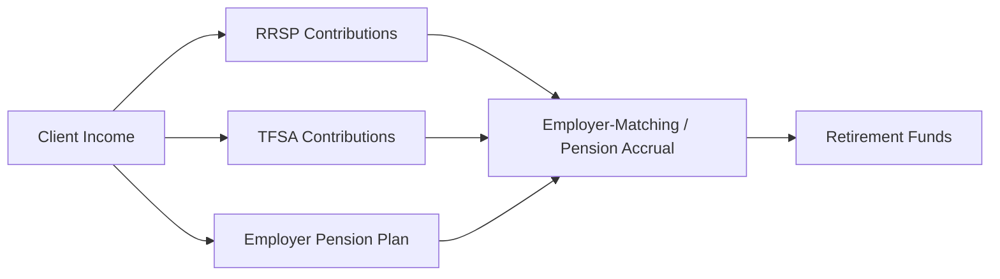

## 10.1 Preparing to Fund Retirement

Preparing to fund retirement is a critical component of any comprehensive wealth management plan. Registered Retirement Savings Plans (RRSPs) offer Canadians a powerful way to accumulate funds in a tax-deferred environment, helping investments grow faster compared to taxable accounts. This section explores key considerations for effectively preparing your clients—or yourself—for retirement, including the importance of starting early, the need for clear retirement goals, and strategies for balancing competing financial priorities.

---

## The Importance of Starting Early

Starting to save for retirement early can significantly enhance long-term financial outcomes due to the power of compounding. In a Canadian context, RRSPs provide shelter from tax on investment income until withdrawals are made, typically in retirement when an individual’s tax bracket may be lower.

### Why Early Contributions Matter

• Extended Growth Window: The longer your contributions have to grow, the more they benefit from compounding—earning interest or returns on both the original principal and previous gains.  
• Reduced Tax Liability: RRSP contributions can directly reduce the taxable income for the year in which the contributions are made (to specific limits), providing immediate tax relief in addition to long-term savings benefits.  
• Habit Formation: Establishing a consistent savings habit—such as setting up an automatic monthly transfer to an RRSP—encourages disciplined investing and reduces the temptation to delay contributions.

### Example: Power of Compounding

Suppose you contribute $6,000 annually to an RRSP starting at age 25, with an average annual return of 5%. By age 65, the investment could grow to a substantial amount—significantly more than if you started at age 35 or 45.

Using a simplified future value formula:

$$
FV = C \times \frac{(1 + r)^{n} - 1}{r}
$$

Where:  
• \\( C \\) = annual contribution (in this example, \$6,000)  
• \\( r \\) = annual growth rate (5% or 0.05)  
• \\( n \\) = number of years contributed  

This formula assumes contributions are made once per year. Adjust for monthly or bi-weekly schedules as needed. The key takeaway is that each additional year of compounding can add exponentially to your final retirement pot.

---

## Identify Retirement Goals

Proper goal setting allows clients to visualize their retirement lifestyle and establish clear targets for how much money they need to accumulate. Advisors can help guide this vital step with tools such as:

1. Financial Planning Calculators: Many Canadian financial institutions (e.g., RBC, TD Bank, BMO) offer robust online calculators that estimate how much monthly or annual savings are required to meet specific retirement targets.  
2. Spreadsheet Models: Users comfortable with Excel, Google Sheets, or other software can construct personalized models reflecting inflation, expected rates of return, and withdrawal needs.  
3. Professional Consultation: Engaging with a Certified Financial Planner (CFP®) or other wealth management professionals can help tailor retirement projections to each client's individual circumstances.

Critical elements to consider when identifying retirement goals include:  
• Desired retirement age  
• Anticipated housing costs (e.g., moving to a smaller home, renting, or paying off a mortgage)  
• Healthcare needs  
• Travel and lifestyle plans  
• Legacy goals (leaving an inheritance or philanthropy)

---

## Assessing Available Resources

Clients must consider their current financial status and constraints to determine realistic RRSP contribution levels.

1. Current Cash Flow: A thorough review of monthly income, expenses, and net savings capacity.  
2. Emergency Fund: Maintaining an adequate cushion for unexpected costs ensures that retirement contributions are not raided in emergencies.  
3. Debt Obligations: High-interest debt, such as credit cards or personal loans, may warrant prioritized repayment before or alongside RRSP contributions.  
4. Employer-Sponsored Plans: Many Canadian employers offer defined contribution pension plans or match contributions to group RRSPs; not taking advantage means leaving potential free money on the table.

For instance, a client with a stable, higher-paying job may allocate a more substantial portion of income to RRSPs, whereas someone with fluctuating income (like a freelancer or small business owner) might emphasize building a robust emergency fund before increasing RRSP contributions.

---

## Balancing Priorities

Advisors often encounter clients juggling multiple financial objectives: mortgage repayment, children’s education funds, and consumer debt, to name just a few. While paying down high-interest debt is typically prudent, ignoring retirement savings entirely may forfeit years of potential tax-sheltered growth.

**Key Strategies:**

• Split Contributions: Direct a portion of disposable income toward both debt reduction and retirement savings.  
• Evaluate Interest Rates: Compare the effective return of money allocated to debt repayment (i.e., avoiding the high-interest rate charged) versus potential returns on RRSP investments.  
• Consider Mortgage vs. RRSP: In today’s low-to-moderate interest rate environment, diverting some resources to RRSP contributions could yield a higher net benefit if the investment returns exceed mortgage interest rates over time.

---

## Integrate Various Financial Products

While RRSPs form the focus of this section, retirement funding often requires leveraging other products and sources:

1. Tax-Free Savings Accounts (TFSAs): Offer tax-free growth of investments and can complement RRSPs, especially for clients who anticipate being in a higher tax bracket at retirement or who require flexible withdrawals.  
2. Employer-Sponsored Plans: Defined benefit and defined contribution pension plans can provide additional layers of retirement income.  
3. Government Benefits: Canada Pension Plan (CPP) and Old Age Security (OAS) jointly form the backbone of most Canadians’ retirement income.  
4. Personal and Non-Registered Savings: For those whose RRSP and TFSA contributions have been maximized—or for short-term liquidity needs—non-registered accounts might be an essential complement.

**Diagram: RRSP and Related Retirement Funding Sources**  

The diagram above illustrates how a client’s different contributions and investment vehicles connect to produce comprehensive retirement funds.

---

## Stress-Test Scenarios

Market volatility, personal emergencies, and unexpected life changes can derail even the most meticulous retirement plan. Stress-testing helps evaluate if the plan can withstand adverse conditions:

1. **Market Downturns**: Model portfolio returns at lower-than-expected levels (e.g., 2% instead of 5%) to see if clients can still meet their retirement goals.  
2. **Life Events**: Consider scenarios such as job loss, disability, or a major unforeseen expense.  
3. **Inflation Changes**: Adjust inflation assumptions upward (from 2% to 4%, for example) to reflect a rising cost of living.  
4. **Longevity Risks**: Clients today may live well into their 90s; plan for a potentially longer retirement phase to avoid outliving savings.

**Pitfall:** Failing to review or update assumptions over time. Encourage clients to revisit their retirement projections at least annually or after significant life changes.

---

## Glossary

• **Earned Income**: Employment, business, or certain disability income. The Canada Revenue Agency (CRA) uses this figure to calculate an individual’s RRSP contribution limit.  
• **Compounding**: Reinvesting interest or investment earnings to generate additional returns over time, creating exponential growth.  
• **Lifestyle Expenses**: Outflows associated with day-to-day living, entertainment, and discretionary spending, which vary widely among retirees.  
• **Stress-Test**: Evaluating a financial plan’s resilience by applying adverse conditions, such as market downturns or increased inflation.

---

## References and Additional Resources

• **Canada Revenue Agency (CRA)** for the latest RRSP contribution guidelines, maximum limits, and definitions:  
  <https://www.canada.ca/en/revenue-agency/services/tax/individuals/topics/rrsps-related-plans.html>  

• **Canadian Investment Regulatory Organization (CIRO)** for regulatory updates, best practices, and investor protection information:  
  <https://www.ciro.ca>  

• **Open-Source Calculators** on platforms such as GitHub (search “retirement calculator Canada”) for spreadsheet or web-based tools to simulate retirement savings under various assumptions.

• **Recommended Reading**:  
  • “The Wealthy Barber” by David Chilton for a fundamental approach to personal finance and saving.  
  • “Retirement Income For Life” by Frederick Vettese for advanced retirement planning strategies in Canada.

---

## Conclusion

Preparing to fund retirement demands a thoughtful and methodical approach, from understanding the benefits of starting RRSP contributions early to stress-testing different scenarios that could affect your future lifestyle. By setting clear goals, assessing available resources, balancing competing priorities, and incorporating complementary products like TFSAs or employer pensions, investors can build a robust retirement roadmap.

Engage clients—or reflect personally—on how today’s financial decisions will shape tomorrow’s retirement journey. With regular reviews, professional advice, and adherence to Canadian regulatory guidelines, individuals can venture toward a more secure and fulfilling retirement.

---

## Test Your Knowledge: RRSP Contributions and Retirement Funding in Canada



### 1. Which best describes the key advantage of starting RRSP contributions early?

- [x] Investments have more time to benefit from compounding returns.
- [ ] It eliminates the need for employer-sponsored plans.
- [ ] It guarantees higher withdrawal amounts during retirement.
- [ ] It prevents any tax liabilities in retirement.

> **Explanation:** Contributing early maximizes the duration over which compounding can occur, thereby increasing long-term returns.

---

### 2. What is the main purpose of conducting a stress-test on a retirement plan?

- [x] To assess how the plan performs under adverse conditions such as market downturns or inflation.
- [ ] To determine the average RRSP contribution limits.
- [ ] To compare interest rates offered by different Canadian banks.
- [ ] To calculate exact OAS and CPP benefits.

> **Explanation:** Stress-testing helps investors evaluate if their plan remains viable during challenging markets or personal emergencies.

---

### 3. Which of the following is generally NOT considered in setting retirement goals?

- [x] Desire for a new smartphone every six months.
- [ ] Anticipated housing costs.
- [ ] Healthcare needs.
- [ ] Travel aspirations.

> **Explanation:** While personal preferences may matter, frequently upgrading smartphones is not a primary driver of retirement planning. Housing, healthcare, and travel are typically more significant.

---

### 4. Why is it essential to balance debt repayment with RRSP contributions?

- [x] It allows for simultaneously reducing high-interest debt and building retirement savings over time.
- [ ] It guarantees no tax is ever paid on RRSP funds.
- [ ] It eliminates mortgage interest for all homeowners.
- [ ] It ensures that travel and lifestyle expenses always remain fixed.

> **Explanation:** Balancing priorities helps manage debt while also leveraging the growth potential of retirement savings.

---

### 5. Which statement about RRSP contributions is accurate in Canada?

- [x] They reduce taxable income for the year in which they are contributed, subject to individual limits. 
- [ ] They apply only to self-employed individuals.
- [x] They compound tax-deferred until withdrawals in retirement.
- [ ] They are available only to those over the age of 45.

> **Explanation:** RRSP contributions lower current taxable income and enjoy tax-deferred growth, making them valuable for building retirement funds.

---

### 6. What is a common approach to setting realistic retirement income goals?

- [x] Combining professional advice with financial planning tools like online calculators and spreadsheet models.
- [ ] Relying solely on guesswork or informal discussions.
- [ ] Using only monthly bank statements and ignoring investment fluctuations.
- [ ] Focusing solely on acquiring real estate.

> **Explanation:** Using a mix of software tools and professional input enables accurate projections and well-rounded planning.

---

### 7. Which of the following illustrates a strategic approach to integrating multiple retirement accounts?

- [x] Contributing to an RRSP, a TFSA, and capitalizing on employer pension plans if available.
- [ ] Investing only in high-risk non-registered crypto accounts for explosive growth.
- [x] Diversifying across tax-deferred and tax-free savings vehicles, plus personal savings.
- [ ] Allocating all income to TFSAs alone without considering RRSP benefits.

> **Explanation:** Smart retirement planning typically incorporates various products—RRSPs, TFSAs, employer plans, and non-registered accounts as needed—to diversify tax treatment and manage risks.

---

### 8. What is one reason to prioritize high-interest debt repayment before increasing RRSP contributions?

- [x] High-interest debt often erodes net worth faster than potential RRSP gains.
- [ ] It guarantees doubling the investment value in your RRSP.
- [ ] It allows you to avoid any mortgage payments at retirement.
- [ ] It increases emergency fund availability automatically.

> **Explanation:** Paying off high-interest debt can offer a “risk-free” return equivalent to the debt’s interest rate, which can be higher than likely investment returns.

---

### 9. What might be a pitfall if you do NOT periodically update your retirement plan assumptions?

- [x] You risk underestimating required savings if market conditions or life changes occur.
- [ ] You receive unlimited RRSP contribution room from the CRA.
- [ ] You secure a guaranteed rate of return from major Canadian banks.
- [ ] You can skip monitoring your portfolio until retirement age.

> **Explanation:** Failing to review and update assumptions can leave you unprepared for shifts in personal needs or economic factors, creating a financial gap in retirement.

---

### 10. Stress-testing a retirement plan includes assessing potential longevity risk. Which statement is true?

- [x] Clients may live into their 90s, making it crucial to plan for a longer retirement horizon.
- [ ] Longevity risk only applies to individuals above age 80.
- [ ] Longevity risk is automatically covered by government programs.
- [ ] Longevity risk does not affect Canadians because of CPP and OAS.

> **Explanation:** Canadians are living longer, so portfolios must be prepared for a potentially extended retirement period and to avoid the risk of outliving one’s savings.




