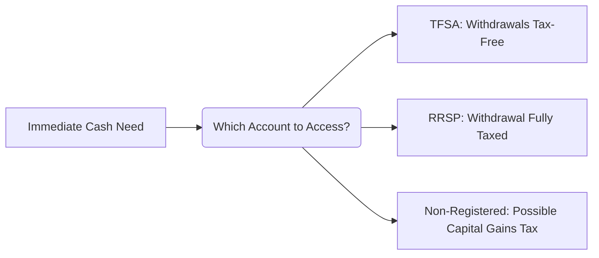
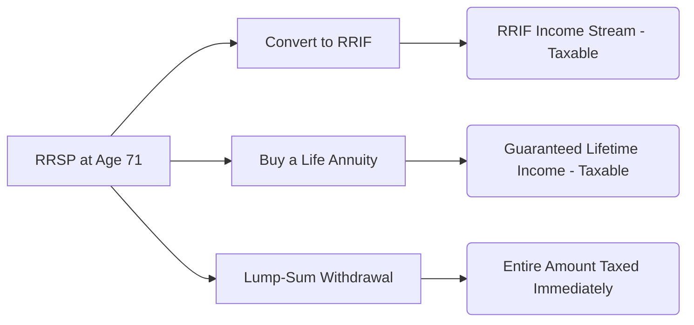

## 10.5 What Clients Should Know About Their Registered Retirement Savings Plans

Registered Retirement Savings Plans (RRSPs) remain a cornerstone of retirement planning for Canadians. By contributing to an RRSP, individuals receive a tax deduction today, benefit from tax-deferred growth, and ideally withdraw funds when their taxable income is lower (often in retirement). However, there are key considerations—withdrawal implications, mandatory conversion rules, spousal RRSPs, and estate handling—that profoundly impact the long-term benefits of an RRSP. This section highlights the essential knowledge clients should have to navigate their RRSPs effectively.

---

## Withdrawal Implications

When withdrawing from an RRSP, remember that you cannot simply treat it like a typical savings account. Any amount you take out is added to your taxable income in the year of withdrawal.

- Potential Higher Tax Bracket:   
  Because RRSP withdrawals are fully taxable, a large withdrawal could push you into a higher marginal tax bracket, reducing the net benefit of your saved funds. 

- Withholding Tax at Source:  
  Typically, financial institutions withhold a percentage for taxes at the time of withdrawal. However, this withheld amount might not be the final tax figure required. At tax filing time, you may owe additional taxes if your total taxable income grew significantly because of the withdrawal.

- Alternatives for Short-Term Cash Needs:  
  - TFSAs (Tax-Free Savings Accounts): No immediate tax deduction, but withdrawals are tax-free.  
  - Non-Registered Accounts: Gains may be taxed at more favorable rates (capital gains, dividends), depending on the type of investment return.  
  - Evaluate All Options: Always compare tax impacts before tapping into RRSP funds for short-term needs.

**Figure:** A simple decision flow for determining which account to use when cash is needed. Consider the tax ramifications of an RRSP withdrawal carefully.

### Example:  
Suppose Mei, a 40-year-old investor, suddenly needs $15,000 to fund a home renovation. If she withdraws from her RRSP, the $15,000 is added to her taxable income that year. Due to her existing income, Mei may pay a marginal rate of 43%. Alternatively, if she has enough contributions available in her TFSA, she can withdraw $15,000 tax-free, freeing her RRSP to continue compounding.

---

## Mandatory Conversion at Age 71

Under Canadian tax rules, an individual’s RRSP must be converted to a form of retirement income by December 31 of the year they turn 71.

1. **Registered Retirement Income Fund (RRIF):**  
   - Assets continue to grow tax-deferred.  
   - A minimum annual withdrawal is required, and those withdrawals are taxed as income.

2. **Life Annuity:**  
   - Provides a guaranteed income for life.  
   - Payment amount depends on interest rates, life expectancy, and any special annuity features (e.g., guaranteed periods).

3. **Lump Sum Withdrawal:**  
   - The entire RRSP balance is considered taxable income in the withdrawal year, often resulting in a substantial tax liability.

**Figure:** Options available when an RRSP must be converted before December 31 of the year the plan holder turns 71.

**Tip:** Most Canadians pivot to a RRIF to maintain tax-deferred growth and flexible withdrawal options, although an annuity can be attractive if the client desires certainty around lifetime income.

---

## Home Buyers’ Plan (HBP) and Lifelong Learning Plan (LLP)

### Home Buyers’ Plan (HBP)
- Allows eligible first-time homebuyers to withdraw up to a set limit (as of this writing, $35,000 per individual) from their RRSPs without immediate taxation.  
- Must be repaid to the RRSP over a 15-year period to avoid being included as taxable income.  
- Explore the Government of Canada’s official pages for the most up-to-date withdrawal limits and requirements:  
  [HBP Official Guide](https://www.canada.ca/en/revenue-agency/services/tax/individuals/topics/rrsps-related-plans.html)

### Lifelong Learning Plan (LLP)
- Permits withdrawals from RRSPs for education or training.  
- Maximum withdrawal limits and repayment periods apply.  
- Withdrawals are not taxed immediately if repaid according to the schedule set by the Canada Revenue Agency (CRA).

---

## RRSP vs. TFSA vs. Non-Registered Accounts

RRSPs are just one component of a well-structured wealth plan:

1. **RRSP**  
   - Tax deduction on contributions.  
   - Tax-deferred growth.  
   - Fully taxable withdrawals.  
   - Best for long-term retirement savings.

2. **Tax-Free Savings Account (TFSA)**  
   - No tax deduction on contributions.  
   - Tax-free growth and withdrawals.  
   - Flexible for short- to medium-term goals.  
   - Contribution limits are set annually by the CRA.

3. **Non-Registered Investment Accounts**  
   - No contribution limits.  
   - Gains may be taxed favorably (capital gains at only 50% inclusion rate, dividends at dividend tax rates).  
   - No tax deferral on interest income.

**Tip:** Matching investments with the right “tax-shelter or tax location” can significantly enhance after-tax returns. For example, interest-bearing investments are often best kept in an RRSP or TFSA, while equities that pay eligible dividends can be held in a non-registered account to leverage the dividend tax credit.

---

## Spousal RRSP Income Splitting

If you anticipate a significant income disparity between spouses in retirement, spousal RRSPs can effectively bring down the family’s overall tax bill:

- **Mechanism:**  
  The higher-earning spouse contributes to a spousal RRSP in the lower-earning spouse’s name. The contributor gains the tax deduction, and retirement withdrawals are taxed in the (likely lower) spouse’s hands.

- **Attribution Rules (Pitfall):**  
  - If withdrawals are made within three calendar years of the contribution, the contributed amounts and related investment growth can be attributed back to the higher-income spouse and taxed to them.  
  - Plan withdrawals accordingly to avoid unintended consequences.

**Real-World Example:**  
Major Canadian banks like RBC and TD offer spousal RRSP services and track “attribution windows.” RBC Wealth Management, for instance, often advises couples to set up a spousal RRSP five or more years ahead of retirement to sidestep attribution pitfalls.

---

## Estate Considerations

When an RRSP account holder passes away, the remaining account value forms part of their estate. Key points include:

- **Spouse or Common-Law Partner Beneficiary:**  
  - Transfer the balance to the spouse’s RRSP or RRIF on a tax-deferred basis.  
  - Defers tax until the surviving spouse makes withdrawals or eventually passes.

- **Other Beneficiaries (“Non-Spouse”):**  
  - Generally, the full value of the RRSP is taxed as income in the deceased’s terminal tax return.  
  - Large RRSP balances may significantly increase taxes owed by the estate.

**Estate Planning Tip:**  
To minimize taxes, consider naming a spouse or financially dependent minor or infirm child as beneficiary, if applicable, for a tax-deferred “rollover.”

---

## Glossary of Key Terms

- **Home Buyers’ Plan (HBP):** A government program enabling eligible individuals to withdraw funds from their RRSP to buy or build a qualifying first home.  
- **Lifelong Learning Plan (LLP):** Canadian government initiative allowing RRSP withdrawals for education or training.  
- **RRIF (Registered Retirement Income Fund):** A product to which individuals convert their RRSPs. RRIFs mandate yearly minimum withdrawals, each taxed as income.  
- **Attribution Rules:** Tax provisions requiring income or capital gains to be “attributed” back to the original contributor if certain conditions (like early withdrawals from spousal RRSPs) are met.

---

## Additional Resources

- **CRA Guidelines on RRIFs and Minimum Withdrawals:**  
  [Official CRA Page on RRIFs](https://www.canada.ca/en/revenue-agency/services/tax/individuals/topics/rrsps-related-plans/rrifs.html)

- **CIRO Bulletins and Resources:**  
  [Canadian Investment Regulatory Organization (CIRO)](https://www.ciro.ca)  
  (Successor to the defunct MFDA and IIROC)

- **Recommended Reading:**  
  - “Building Wealth and Managing Your Retirement” by Gordon Pape  
  - Government of Canada’s official pages on [RRSPs and Related Plans](https://www.canada.ca/en/revenue-agency/services/tax/individuals/topics/rrsps-related-plans.html)

- **Calculators and Tools:**  
  - Many Canadian financial institutions (e.g., BMO, TD) offer free online RRSP contribution limit calculators, retirement income planners, and spousal RRSP optimization tools.

---

## Conclusion

RRSPs remain pivotal in building a secure retirement income stream. They offer valuable tax advantages, but understanding the finer points—withdrawal rules, spousal contributions, deadlines, and estate treatments—is crucial for maximizing benefits. As part of a broader strategy encompassing TFSAs, non-registered investments, and pension programs, RRSPs help develop a robust, tax-efficient retirement plan suitable for Canadian investors across various income levels.

By weaving together these considerations—along with professional advice and reputable resources—clients can confidently tailor their RRSP utilization to meet short- and long-term financial goals.

---

## Maximizing Your RRSP Knowledge: A Comprehensive Quiz for Canadian Investors



### RRSP withdrawals during your working years are:

- [ ] Always tax-free
- [x] Subject to immediate withholding and added to taxable income
- [ ] Taxed only if they exceed $10,000
- [ ] Allowed only for first-home purchases

> **Explanation:** RRSP withdrawals are fully taxable and often subject to withholding at source, making them potentially costly if done prior to retirement.

### What happens to your RRSP at age 71 if you do nothing?

- [ ] You can keep contributing indefinitely
- [x] It must be converted to a RRIF, annuity, or taken as a lump sum
- [ ] You can roll it into a TFSA
- [ ] You only need to withdraw the minimum amount without conversion

> **Explanation:** By December 31 of the year you turn 71, Canadian regulations require your RRSP to be converted to an income stream, such as a RRIF, an annuity, or withdrawn as a lump sum.

### Which benefit does the Home Buyers’ Plan (HBP) provide?

- [x] The ability to withdraw a certain amount from an RRSP for a first home purchase without immediate taxation
- [ ] A discount on property taxes for first-home buyers
- [ ] A guaranteed return on RRSP investment
- [ ] Absolute deferral of tax until age 71

> **Explanation:** The HBP allows potential first-home buyers to withdraw funds from their RRSP up to a certain limit tax-free, as long as those funds are repaid according to the specified schedule.

### Under a spousal RRSP, attribution rules most commonly apply when:

- [x] The spouse withdraws contributions within three years of the deposit
- [ ] The plan holder is over 71
- [ ] The taxpayers are in the same tax bracket
- [ ] There is no marriage certificate

> **Explanation:** If the lower-income spouse withdraws funds within three calendar years of the contribution, the original contributor faces the possibility of having the withdrawal “attributed” to them for tax purposes.

### Which of the following is not true about RRSPs?

- [ ] Contributions are tax-deductible
- [x] All withdrawals are tax-free no matter the amount
- [ ] Contributions must be within your available RRSP room
- [x] You can convert your RRSP to a TFSA at any point without taxes

> **Explanation:** RRSP withdrawals are fully taxable. Furthermore, there is no direct conversion from an RRSP to a TFSA without incurring tax implications.

### What is the main difference between an RRSP and a TFSA?

- [x] RRSP contributions are tax deductible, while TFSA contributions are not
- [ ] TFSAs offer a larger contribution limit
- [ ] RRSP withdrawals are always tax-free
- [ ] RRSPs cannot hold equities

> **Explanation:** RRSP contributions reduce your taxable income, whereas TFSA contributions do not. However, TFSA withdrawals are typically tax-free.

### Which option typically offers partial protection against taxation on investment gains, making it potentially more favorable for equities?

- [x] Non-Registered Accounts
- [ ] RRIF
- [x] Non-Registered Accounts
- [ ] Locked-In Retirement Account (LIRA)

> **Explanation:** Equities in a non-registered account can benefit from the capital gains inclusion rate (currently 50%) and dividend tax credits, making them more tax-efficient for certain individuals.

### When an RRSP account holder passes away, which statement is correct?

- [x] The RRSP can be rolled over to a spouse’s RRSP or RRIF tax-deferred
- [ ] The entire RRSP value is always immediately tax-free  
- [ ] There is no option to name a beneficiary
- [ ] Non-spouse beneficiaries have no tax implications

> **Explanation:** Under Canadian tax law, an RRSP can be transferred to a spouse’s registered plan on a tax-deferred basis. Non-spouse beneficiaries typically trigger a deemed disposition.

### How can an annuity purchased at age 71 be beneficial?

- [x] It provides a guaranteed income stream for life
- [ ] It avoids any taxation
- [ ] It allows for unlimited early withdrawals without penalty
- [ ] It guarantees a 10% rate of return

> **Explanation:** A life annuity ensures a lifetime income, although payments are fully taxable as they come from a registered plan.

### Interpreting Canada's rules for mandatory RRSP conversion by age 71, is the following statement true or false?  
"All RRSP funds must be converted to a RRIF, but no withdrawals are required until age 81."

- [x] True
- [ ] False

> **Explanation:** This is a trick question. By age 71, you must convert your RRSP, typically to a RRIF, and minimum withdrawals begin the following year, not at 81. So, if you read closely, the statement is partially correct about mandatory conversion but inaccurate about the withdrawal requirement starting only at 81.  


