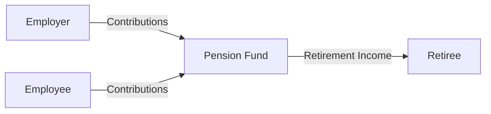

## 11.1 Employer-Sponsored Pension Plans

Employer-sponsored pension plans are formal arrangements set up by employers to assist employees in saving for retirement. In Canada, they form a core component of the three-pillar retirement income system, supplementing government benefits, such as the Canada Pension Plan (CPP) and Old Age Security (OAS), and individual savings. This section explores how employer-sponsored pension plans work, focusing on plan types, regulatory responsibilities, tax considerations, and the important role wealth advisors play.

---

### Understanding Employer-Sponsored Pension Plans

In Canada, employer-sponsored pension plans are registered with government authorities under federal or provincial legislation. They can significantly enhance employees’ financial security in retirement but vary in structure, risk sharing, and regulatory oversight.

#### Two Main Types of Pension Plans

1. **Defined Benefit (DB) Plans**  
   - Guarantee a specific retirement income based on a formula that commonly uses years of service, salary history, and a benefit multiplier.  
   - Employers bear the bulk of the investment and funding risk; if the plan’s investments do not perform as needed, the employer must contribute more to ensure benefits are paid.  
   - Actuarial valuations determine the contributions needed to fund future pension obligations.  
   - Many DB plans have vesting rules (e.g., employees must accrue two years of service to be “vested”) before pension benefits become non-forfeitable.

   A simplified formula for a DB plan’s annual benefit might be:

   $$
   \text{Annual Pension} = \text{Years of Credited Service} \times \text{Benefit Multiplier} \times \text{Average of Best Earnings}
   $$

   For instance, if an employee worked 35 years, the plan uses a 2% multiplier, and the average of their best-five-year earnings is \$60,000, the annual pension would be:

   $$
   35 \times 0.02 \times 60{,}000 = \$42{,}000
   $$

2. **Defined Contribution (DC) Plans**  
   - Outline the contributions made by both employer and employee (often a percentage of salary).  
   - Final pension benefits depend on the accumulated funds plus investment returns.  
   - Investment risk lies with the employee, who typically decides how to invest contributions among available fund choices.  
   - At retirement, employees use these accumulated funds to generate an income via annuity purchases, Registered Retirement Income Funds (RRIFs), or other withdrawal mechanisms.

---

### Regulatory Oversight and Funding

Employer-sponsored pension plans may fall under federal or provincial jurisdiction:

- **Federal Regulation**:  
  - Governed by the **Pension Benefits Standards Act, 1985 (PBSA)**.  
  - Overseen by the **Office of the Superintendent of Financial Institutions (OSFI)**.  
  - Applies to industries such as banking (e.g., RBC, TD, BMO), telecommunications, and interprovincial transportation.

- **Provincial Regulation**:  
  - Each province has legislation covering most employers within its jurisdiction.  
  - For example, Ontario’s **Pension Benefits Act (PBA)** is overseen by the **Financial Services Regulatory Authority of Ontario (FSRA)**.

**CIRO (Canadian Investment Regulatory Organization)**, formed from the amalgamation of the former self-regulatory organizations (IIROC and MFDA), sets and enforces rules for investment dealers and mutual fund dealers. While CIRO primarily oversees securities regulation, its advisors must also comprehend pension rules that influence clients’ retirement investments.

---

### Vesting, Locking-In, and Portability

1. **Vesting**  
   - Once employees fulfill the plan’s vesting criteria, they own a non-forfeitable right to future benefits.  
   - Vesting periods differ by jurisdiction and plan terms.

2. **Locking-In**  
   - Government regulations “lock in” pension funds, prohibiting early withdrawal except in limited circumstances (e.g., small balance unlockings, severe financial hardship, or shortened life expectancy).  
   - Locking-in ensures that funds remain dedicated to retirement.

3. **Portability**  
   - If employees change employers, they often can transfer out the commuted value (for a DB plan) or the account balance (for a DC plan).  
   - These transfers typically go to a Locked-In Retirement Account (LIRA) or the new employer’s pension plan, subject to provincial or federal rules.

---

### Ancillary Benefits

In addition to standard pension entitlements, many plans offer:

- **Early retirement options**—may allow retirement before age 65 with some penalties or reduced benefits.  
- **Bridging benefits**—temporary payments that supplement income until government benefits (like CPP) begin.  
- **Spouse or survivor benefits**—ensure that a portion of the pension continues to a surviving partner.  
- **Inflation protection (indexation)**—helps maintain purchasing power over time.

Understanding these features can substantially impact retirement timing decisions. Financial advisors must often help clients evaluate whether to commute pension benefits or keep them within the plan, taking into account bridging and survivor protection.

---

### Real-World Canadian Examples

- **Large Bank Pension Plans**:  
  - Many Canadian banks, such as RBC, TD, and BMO, offer hybrid pension arrangements with both DB and DC components. For instance, RBC has historically provided DB plans for longer-tenured employees but has introduced DC plans for newer hires to balance costs and risk.  
  - Funding oversight for these plans rests with OSFI because banks are federally regulated.  
  - Banks often maintain well-diversified pension investment portfolios. RBC and BMO, for example, may use Liability-Driven Investing (LDI) strategies in their DB segments to match long-term liabilities with bond investments.

- **Public Pension Funds**:  
  - Beyond employer-sponsored arrangements, large funds like the Canada Pension Plan Investment Board (CPPIB) and Ontario Teachers’ Pension Plan (OTPP) manage billions of dollars for their stakeholders. Their success underscores how professional investment strategies can enhance long-term retirement security.

---

### Plan Funding and Actuarial Valuations

For DB plans, actuarial methods measure whether current assets and future contributions are sufficient to meet promised benefits. Underfunded plans require employers to make additional contributions. DC plan funding is simpler—contributions are defined upfront—but employees carry the investment risk, so if markets perform poorly, retirement balances can suffer.

---

### Tax Considerations for Pension Plans

- **Tax Treatment of Employer Contributions**  
  - Employer contributions to Registered Pension Plans (RPPs) do not count as taxable income for employees.  
  - However, the **Pension Adjustment (PA)**—reflected on an employee’s T4—reduces the next year’s RRSP contribution room to prevent excessive tax-sheltered savings.

- **Contribution Limits**  
  - Federal legislation sets annual contribution limits and maximum pension accrual rates in DB plans.  
  - The Canada Revenue Agency (CRA) enforces these limits under the **Income Tax Act** to ensure fairness and consistency.

---

### Role of the Financial Advisor

A wealth advisor or financial planner can help clients by:

1. **Analyzing Pension Statements**  
   - Clarifying contribution levels, projected retirement income, vesting status, and ancillary benefits.

2. **Coordinating with Other Savings**  
   - Integrating pension projections with RRSP, TFSA, and non-registered investments to form a unified retirement strategy.

3. **Navigating Transfer Options**  
   - Evaluating whether to commute DB benefits or keep them within the plan, and what that means for future financial security.

4. **Assessing Tax Implications**  
   - Calculating the impact of pension adjustments on RRSP contribution room.  
   - Recommending strategies to maximize tax efficiencies, such as spousal RRSPs or TFSAs.

5. **Advising on Retirement Timing**  
   - Estimating incomes from multiple sources and bridging benefits for clients considering early retirement.  

---

### Mermaid Diagram: The Pension Contribution Flow

Below is a simplified visual of how contributions and benefits flow in a typical employer-sponsored pension plan:

**Explanation**: In this diagram, both employer and employee contribute to the pension fund. Upon retirement, the pension fund pays out retirement income (monthly benefits for DB plans or retirement withdrawals for DC plans).

---

### Best Practices and Common Pitfalls

**Best Practices**  
- Review annual pension statements thoroughly.  
- Keep track of vesting periods and lock-in rules.  
- Consult with actuaries or financial planners to understand the value of commuted benefits.  
- Estimate potential retirement income across multiple scenarios.

**Pitfalls**  
- **Underfunded Plans**: Relying solely on employers to manage the plan can pose a risk if funding issues arise.  
- **Premature Commutation**: Taking a lump sum too early without a clear reinvestment strategy can diminish long-term retirement security.  
- **Ignoring Spousal or Survivor Benefits**: Overlooking these provisions can hamper family estate planning.  
- **Overlooking Tax Implications**: Misjudging the effect of pension adjustments on RRSP room can reduce overall retirement savings capacity.

---

### Additional Resources

- **Government of Canada – Pension Plans and Retirement Savings**  
  (https://www.canada.ca/en/services/benefits/publicpensions.html)

- **Office of the Superintendent of Financial Institutions (OSFI)**  
  (https://www.osfi-bsif.gc.ca/)

- **Provincial Regulators** such as the **Financial Services Regulatory Authority of Ontario (FSRA)**  
  (https://www.fsrao.ca/)

- **CIRO (Canadian Investment Regulatory Organization)** for industry regulations  
  (https://www.ciro.ca/)

- **Recommended Books**:  
  - “Pension Mathematics for Actuaries” by Arthur W. Anderson – covers actuarial valuations in-depth.  
  - “The Pension Puzzle” by Bruce Cohen and Brian Fitzgerald – broad overview of government benefits, employer plans, and personal retirement savings.

- **Online Courses**:  
  - Canadian Securities Institute (CSI) advanced retirement planning courses.  
  - Open-source financial planning tools on platforms like GitHub.

---

### Key Takeaways

1. **Employer-sponsored pension plans** play a vital role in ensuring financial security for retirees.  
2. **Defined Benefit (DB) vs. Defined Contribution (DC)**: The former provides predictable retirement income, while in the latter, outcomes depend on investment performance.  
3. **Regulatory oversight** includes both **federal (OSFI)** and **provincial** bodies, with the **PBSA** guiding federally regulated plans.  
4. **Vesting, locking-in, and portability** rules affect how and when pension benefits can be accessed or transferred.  
5. **Wealth advisors** are crucial in helping clients integrate employer-sponsored pensions with personal savings strategies, ensuring well-rounded retirement planning.

---

## Mastering Employer-Sponsored Pension Plans in Canada: A Comprehensive Quiz



### Which of the following best describes a Defined Benefit (DB) pension plan? 
- [x] A plan promising a specific monthly income based on factors like years of service and salary history. 
- [ ] A plan where employees bear no market-related risks. 
- [ ] A plan without any vesting requirement. 
- [ ] A plan where employees manage all investments directly. 

> **Explanation:** DB plans promise a predetermined benefit upon retirement, typically calculated by years of service, a benefit multiplier, and an average salary figure. Investment risk is largely borne by the employer.

### In a Defined Contribution (DC) plan: 
- [ ] The employer guarantees employees a fixed income in retirement. 
- [x] Employees typically select from various investment options and bear investment risk. 
- [ ] The employer must ensure the plan remains fully funded at all times. 
- [ ] There is no need for employee contributions. 

> **Explanation:** DC plans confer the investment choice—and thus risk—to the employee. The final pension amount depends on contribution totals plus investment returns.

### Which regulatory body oversees most federally regulated pension plans in Canada? 
- [ ] Canada Revenue Agency (CRA) 
- [x] Office of the Superintendent of Financial Institutions (OSFI) 
- [ ] Canadian Investment Regulatory Organization (CIRO) 
- [ ] Financial Services Regulatory Authority of Ontario (FSRA) 

> **Explanation:** OSFI supervises and regulates pension plans subject to the PBSA, which primarily covers federally regulated industries like banking and telecommunications.

### Vesting refers to: 
- [x] The point at which the employee gains a non-forfeitable right to the pension benefit. 
- [ ] The requirement for employees to make voluntary contributions. 
- [ ] The plan’s investment policy statement. 
- [ ] The process of commuting a pension into a lump sum. 

> **Explanation:** Vesting is the stage when an employee becomes legally entitled to future pension benefits under the plan rules.

### In a Locked-In Retirement Account (LIRA), funds: 
- [x] Generally cannot be withdrawn until retirement, apart from a few special exemptions. 
- [ ] Can be withdrawn at any point without penalties. 
- [ ] Are not restricted by provincial or federal legislation. 
- [x] May be unlocked for financial hardship in certain situations. 

> **Explanation:** A LIRA is designed to preserve pension funds until retirement, although limited access may be allowed for hardship or other special circumstances.

### Which of the following can reduce RRSP contribution room? 
- [x] Pension Adjustment (PA) 
- [ ] Dividend Reinvestment Plans (DRIP) 
- [ ] Gauging room from prior years 
- [ ] The Canada Pension Plan (CPP) contribution 

> **Explanation:** The Pension Adjustment (PA) reported on an employee’s T4 reflects the deemed value of benefits accrued in an RPP; it effectively reduces next year’s RRSP contribution room.

### A commuted value in a DB pension plan is: 
- [x] The lump-sum present value of future pension benefits. 
- [ ] An employer’s mandatory contribution amount. 
- [x] Transferable to another registered plan in many cases. 
- [ ] The only payment form available under DB pensions. 

> **Explanation:** When an employee leaves a DB plan, one choice may be transferring the commuted value (representing the present value of future pension payments) to a LIRA or new employer plan, if permitted.

### A bridging benefit in a pension plan provides: 
- [ ] Additional life insurance coverage post-retirement. 
- [x] Temporary income until government pension programs begin. 
- [ ] A fixed annual increase to combat inflation. 
- [ ] A method to unlock pension funds early. 

> **Explanation:** Bridging benefits offer a short-term supplement to bridge retirees from their initial pension start date until they qualify for government benefits like CPP.

### Why is ongoing actuarial valuation crucial for Defined Benefit (DB) plans? 
- [ ] It only affects employees’ ability to commute pensions. 
- [x] It ensures the plan can meet its long-term obligations by assessing whether contributions and assets match future liabilities. 
- [ ] It determines which employees are vested in the plan. 
- [ ] It eliminates the need for employer contributions. 

> **Explanation:** In DB plans, actuarial valuations measure funding adequacy, ensuring the plan can honor its guaranteed benefits over the long term.

### True or False: CIRO primarily focuses on regulating employer-sponsored pension plans across Canada. 
- [ ] True 
- [x] False 

> **Explanation:** CIRO provides oversight for Canada’s investment dealers and mutual fund dealers, not directly for employer-sponsored pension plans. OSFI or provincial regulators oversee pension regulation, though advisors under CIRO often assist clients with pension-related advice.


