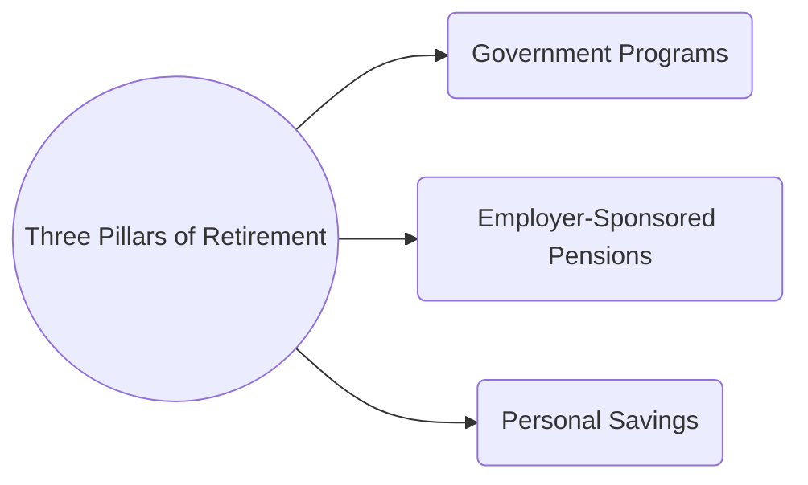

## 11.2 Funding Retirement

Retirement planning for clients in Canada relies on three main components (commonly called the “three-pillar” system): government programs, employer-sponsored pension plans, and personal savings. A well-structured retirement plan integrates all three pillars, ensuring sufficient income throughout retirement. This section explores how to estimate required retirement income, integrate pension benefits with clients’ overall savings strategy, weigh the pros and cons of commuted values or annuity purchases, and identify best practices for early retirement, bridging benefits, and tax reduction strategies.

---

### The Three-Pillar Model of Retirement Funding

The Canadian retirement system can be viewed in three pillars:

1. **Government Programs (Pillar 1)**  
   • Includes the Canada Pension Plan (CPP) or Quebec Pension Plan (QPP) and Old Age Security (OAS).  
   • Generally provides a modest baseline income in retirement.  
   • Designed to ensure all Canadians have some foundational retirement income but rarely covers total financial needs.

2. **Employer-Sponsored Pension Plans and Group RRSPs (Pillar 2)**  
   • Encompasses Defined Benefit (DB) and Defined Contribution (DC) pension plans, along with group RRSPs offered by employers.  
   • Typically bridges the gap between government income and personal savings.  
   • Plan generosity varies. Some employers (e.g., RBC, TD) offer competitive pension programs, while others provide only minimal contribution matches.

3. **Personal Savings (Pillar 3)**  
   • Includes individual Registered Retirement Savings Plans (RRSPs), Tax-Free Savings Accounts (TFSAs), and non-registered investments.  
   • Offers the most flexibility and control to the saver.  
   • Helps supplement retirement needs if government and employer-sponsored plans are insufficient.

*Diagram Explanation:* This Mermaid diagram represents the three pillars of Canada’s retirement system, illustrating how each component contributes to the retiree’s total income stream.

---

### Calculating Retirement Income Needs

A key step in retirement planning is determining the income required to maintain a chosen lifestyle:

- **Replacement Ratio:**  
  Many financial planners suggest targeting around 70–80% of an individual’s pre-retirement income. This typically accounts for lower expenses in retirement (e.g., no commuting, reduced insurance costs).  
- **Cash Flow Analysis:**  
  Advisors prepare net worth statements and project annual living expenses in retirement. When combined with assumptions about inflation, investment returns, and life expectancy, it is possible to approximate the capital needed.  
- **Using Financial Tools:**  
  Tools like the Government of Canada’s “Retirement Income Calculator” (<https://srv111.services.gc.ca/>) can help estimate future entitlements from government programs along with pension income sources.

A simplified formula for estimating the present value of required retirement capital (if the client desires a constant annual income for a certain number of years) is:

$$
\text{Required Capital at Retirement} = \sum_{t=1}^{T} \frac{\text{Annual Income Need}}{(1 + r)^t}
$$

Where:  
- \\( t \\) is each year in retirement.  
- \\( r \\) is the assumed annual rate of return.  
- \\( T \\) is the total number of retirement years (e.g., from age 65 to projected lifespan).

---

### Integrating Pension Benefits with Personal Savings

Clients often have multiple streams of retirement income. The advisor’s role is essential in coordinating these to meet overall retirement goals:

- **Pension Plan Generosity:**  
  If an employer’s pension plan is a generous DB plan providing substantial coverage, clients may reduce contributions to RRSPs or other vehicles. Conversely, limited or no employer-sponsored pension benefits may necessitate higher contributions to personal savings.  
- **Tax Impact:**  
  - **Pension Adjustment (PA):** Reflects the deemed value of contributions made to a registered pension plan. The PA reduces the RRSP contribution room.  
  - **Maximum Pension Benefit Limits:** Under the Income Tax Act, there are calculation limits for DB benefits and maximum annual contributions for DC plans.  
- **Coordination With TFSAs and Other Accounts:**  
  Given TFSAs offer tax-free growth and withdrawals, and non-registered assets may be taxed at different rates, a mix of accounts can optimize retirement income and tax minimization.

---

### Deciding Between Pension Income Options

Choosing how to receive pension benefits is critical for DB and DC plan members alike:

1. **Defined Benefit Pension Plan Members**  
   - **Guaranteed Monthly Pension:** Provides a predictable monthly payment for life.  
   - **Commuted Value (CV):** A lump sum reflecting the “present value” of future pension payments.  
     - Advantages: Control over investment strategy, flexibility for estate planning.  
     - Disadvantages: Investment risk is transferred to the individual; the pension guarantee is forfeited.  

2. **Defined Contribution Pension Plan Members**  
   - **Life Annuities:** Guarantee lifetime income by turning accumulated funds into a predictable flow.  
   - **Registered Retirement Income Fund (RRIF):** Offers more flexibility but also investment risk and the need for ongoing portfolio management.  
   - **Partial Commutation:** For some DB or hybrid plans, it might be possible to take part of the pension as a lump sum and keep the remainder as a monthly benefit.

Clients should also consider bridging benefits, spousal pension splits, and any survivor benefits. The decision must factor in longevity risk, inflation concerns, and personal circumstances (e.g., desire to leave inheritance).

---

### Planning for Early Retirement and Bridge Benefits

Many pension plans permit early retirement, sometimes as early as age 55:

- **Early Retirement Reductions:**  
  Retiring before the standard retirement age, often 65, usually reduces monthly pension amounts to account for longer payout periods.  
- **Bridge Benefits:**  
  Temporary pension supplements provided until government program benefits (CPP/QPP, OAS) commence. They help fill the gap for those retiring before full entitlement age.  
- **Feasibility Analysis:**  
  Clients need to balance the allure of early retirement with the reality of decreased income and potentially higher healthcare expenses over a longer retirement horizon.

---

### Tax Implications of Pension Income

Pension income in Canada is generally taxable at the recipient’s marginal tax rate:

- **Pension Income Splitting:**  
  Under federal rules, up to 50% of eligible pension income can often be split between spouses. This can reduce the total family tax burden if one spouse sits in a lower tax bracket.  
- **Optimizing RRSP Withdrawals:**  
  Timing is key. Withdrawals combined with pension income should be planned to avoid higher marginal tax rates.  
- **CRA Guidance:**  
  Refer to the Canada Revenue Agency (<https://www.canada.ca/en/revenue-agency.html>) for official definitions of eligible pension income and tax credits.

---

### Role of the Advisor in Retirement Funding

The advisor’s primary responsibilities include:

1. **Comprehensive Integration**  
   Synthesizing government entitlements, employer pensions, and personal savings to create a consistent retirement income stream.

2. **Decumulation Strategy**  
   Determining a withdrawal sequence that maximizes tax efficiencies, extends capital longevity, and aligns with the client’s risk tolerance.

3. **Education and Guidance**  
   Clients often underestimate how long their savings must last or how taxes can change over time. Advisors can run scenario analyses, project portfolio longevity, and explore sensitivity factors (e.g., inflation, unexpected healthcare costs).

4. **Staying Current With Regulations**  
   - **CIRO:** Canada’s national self-regulatory organization (<https://www.ciro.ca/>) sets conduct rules affecting the delivery of pension and retirement planning advice.  
   - **OSFI:** Oversees federally regulated pension plans and financial institutions.  
   - **CRA:** Defines tax treatments for contributions, withdrawals, and various forms of pension income.

---

### Glossary

- **Bridge Benefits:** Temporary pension payments provided by some employer-sponsored plans to support early retirees until they become eligible for government benefits (e.g., CPP/QPP).  
- **Commuted Value (CV):** The lump-sum equivalent of a defined benefit pension’s value, available in certain circumstances such as leaving a plan early.  
- **Life Annuity:** A contract guaranteeing regular payments for the annuitant’s lifetime, often purchased with a DC pension plan balance.  
- **Pension Income Splitting:** A tax strategy allowing the transfer (up to 50%) of certain pension income amounts to a spouse for tax purposes.  
- **Registered Retirement Income Fund (RRIF):** A registered plan that provides retirement income withdrawals, funded by an individual’s accumulated retirement savings (e.g., RRSP proceeds).  
- **Decumulation Phase:** The period in retirement when accumulated assets are drawn down to fund living expenses.

---

### References and Resources

- **Canada Revenue Agency (CRA):**  
  Guides on taxation of pension income, RRSP/RRIF rules, and pension income splitting. <https://www.canada.ca/en/revenue-agency.html>  

- **Government of Canada “Retirement Income Calculator”:**  
  An official tool for estimating the combination of government, employer, and personal retirement income. <https://srv111.services.gc.ca/>  

- **CIRO:**  
  For current regulations governing Canadian investment dealers and mutual fund dealers. <https://www.ciro.ca/>  

- **Open-Source Modeling Tools:**  
  Search GitHub for “retirement calculator for Canada” to find flexible spreadsheets and software that can incorporate plan parameters, bridging benefits, and tax rates.

- **Further Reading:**  
  1. “The Real Retirement” by Fred Vettese and Bill Morneau – offers insight into calculating and funding retirement in Canada.  
  2. “Retirement Income For Life” by Frederick Vettese – focuses on decumulation approaches, longevity risk, and lifecycle investing.  
  3. Advanced courses from the Canadian Securities Institute (CSI) – delve deeper into pension and estate planning strategies for wealth advisors.

---

## Comprehensive Funding Retirement in Canada: A Quiz



### 1. What are the three pillars of Canada’s retirement system?

- [x] Government programs, employer-sponsored pensions, and personal savings  
- [ ] Guaranteed Income Supplement, corporate bond interest, and personal TFSAs  
- [ ] Personal credit lines, inheritance, and charitable donations  
- [ ] Social security from other countries, stock options, and savings bonds  

> **Explanation:** In Canada, retirement funding typically relies on government programs (e.g., CPP/QPP, OAS), employer-sponsored pensions or group RRSPs, and personal savings (e.g., RRSPs, TFSAs, non-registered).

### 2. Which of the following generally describes the target replacement ratio for retirement income?

- [ ] 100–110% of pre-retirement income  
- [x] 70–80% of pre-retirement income  
- [ ] 20–30% of pre-retirement income  
- [ ] 5–10% of pre-retirement income  

> **Explanation:** Many planners use a broad rule of thumb that retirees aim for about 70–80% of their pre-retirement income to maintain a similar lifestyle post-retirement.

### 3. In a defined benefit (DB) pension plan, what does “commuted value” refer to?

- [x] The lump-sum equivalent of future pension payments  
- [ ] A standardized payout based on government indexes  
- [ ] The sum of all employee contributions, without interest  
- [ ] A fully guaranteed monthly annuity option  

> **Explanation:** The commuted value is the present value of accrued DB pension benefits, offered as a lump sum in case of early departure from the pension plan or plan wind-up.

### 4. What is a key drawback to choosing a commuted value over a guaranteed monthly pension?

- [x] Investment risk is transferred to the individual  
- [ ] Guaranteed monthly pension offers zero flexibility in payout timing  
- [ ] Commuted value payouts are always tax-free  
- [ ] Lump-sum payments cannot be reinvested in RRSPs  

> **Explanation:** Taking the commuted value shifts the longevity and investment risk to the retiree. Although flexible, it comes without the guarantee of a monthly pension for life.

### 5. Which of the following statements about early retirement is correct?

- [x] Pension benefits are often reduced if taken before normal retirement age  
- [ ] Early retirement benefits are always higher to account for inflation  
- [x] Bridge benefits may temporarily supplement income for early retirees  
- [ ] Early retirement is disallowed in all DC plans  

> **Explanation:** In many pension plans, benefits are reduced for early retirees. Bridge benefits can help fill the income gap until government benefits start; however, they are not universal across all plans.

### 6. How can Canadian couples potentially reduce the overall tax burden on pension income?

- [x] By using pension income splitting  
- [ ] By avoiding all forms of registered savings  
- [ ] By withdrawing all RRSP funds at once  
- [ ] By maximizing TFSAs, which are taxed at a higher rate  

> **Explanation:** Pension income splitting can lower a household’s overall tax payable if the spouse receiving pension income is in a higher tax bracket than the other.

### 7. Which pillar of retirement funding is mainly within an individual’s direct control?

- [x] Personal savings, including RRSPs and TFSAs  
- [ ] Government benefits, as they depend on market performance  
- [x] Employer-sponsored plans, which employees have no influence over  
- [ ] Manufactured products like GICs protected by CIPF  

> **Explanation:** Personal savings (e.g., TFSAs, RRSPs, and non-registered investments) are primarily under the control of the individual. Government programs and employer-sponsored plans operate under statutory or corporate rules.

### 8. Under a defined contribution plan, which option usually offers a guaranteed lifetime payout?

- [x] Purchasing a life annuity  
- [ ] Converting all assets into a lump sum cash transfer  
- [ ] Transferring the entire plan assets into a TFSA  
- [ ] Leaving assets uninvested in the plan indefinitely  

> **Explanation:** In a DC plan, the participant’s accumulated balance can be used to purchase a life annuity, which guarantees payments for life.

### 9. What is a primary role of the financial advisor during the decumulation phase?

- [x] Determining withdrawal strategies and sequencing for tax efficiency  
- [ ] Recommending borrowing to fund day-to-day living in retirement  
- [ ] Eliminating all risk by concentrating in a single asset class  
- [ ] Guaranteeing that the portfolio will never decline in value  

> **Explanation:** In the decumulation phase, advisors help clients plan their withdrawals so that assets last and taxes are minimized. They also manage portfolio risk but cannot guarantee values against market fluctuations.

### 10. True or False: The Pension Adjustment (PA) has no effect on a client’s RRSP contribution room in Canada.

- [x] False  
- [ ] True  

> **Explanation:** The Pension Adjustment (PA) does affect a client’s available RRSP contribution room. It accounts for the estimated value of benefits provided by an employer-sponsored pension plan.




