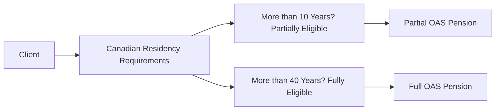

## 12.2 Old Age Security (OAS) Program

The Old Age Security (OAS) program offers a foundational source of retirement income for Canadian residents aged 65 and over. Because it is funded from general tax revenues, OAS does not require individual contributions. Understanding OAS eligibility, benefits, deferral options, and tax considerations—including potential recovery tax (clawback)—is critical in crafting cost-effective, tax-efficient retirement plans for clients. This article provides a comprehensive overview of OAS, helps identify key planning strategies, and highlights best practices for advisors regulated by the Canadian Investment Regulatory Organization (CIRO).

---

## Overview of the OAS Program

- The Old Age Security (OAS) program is designed to provide a basic monthly income to Canadian seniors.
- Unlike the Canada Pension Plan (CPP) or the Quebec Pension Plan (QPP), OAS is funded through government general revenues, not through direct or mandatory contributions by workers.
- Eligibility for full OAS requires at least 40 years of residency in Canada after age 18, while partial benefits may be available with as little as 10 years of residency (with proportional reduction in the monthly amount).

### Real-World Example

• Many major Canadian banks, such as RBC and TD, prominently feature retirement calculators on their websites that include estimated OAS benefits when projecting a client’s total income. These tools help illustrate how OAS works in tandem with CPP/QPP, employer pensions, RRSP/RRIF withdrawals, and other retirement income sources.

---

## Benefits Under OAS

### Basic OAS Pension

• A monthly benefit payable at age 65 for eligible Canadian seniors.  
• The payment amount may vary depending on how long an individual has resided in Canada.

### Guaranteed Income Supplement (GIS)

• A non-taxable monthly benefit designed for low-income OAS recipients.  
• The GIS amount is income-tested, meaning it decreases or is eliminated as other income sources (such as RRIF withdrawals, part-time employment income, or investment income) increase.

### Allowance and Allowance for the Survivor

- Allowance: A benefit for low-income spouses or common-law partners (aged 60–64) of an OAS/GIS recipient.  
- Allowance for the Survivor: A similar benefit for low-income individuals (aged 60–64) whose spouse or common-law partner has passed away and who would have qualified for OAS/GIS.

### Use Case: Coordinating GIS and Other Income

• Some clients may delay certain taxable withdrawals (e.g., from a Registered Retirement Income Fund—RRIF) to preserve their GIS entitlement.  
• Canadian financial institutions, such as BMO, often recommend a careful drawdown schedule to avoid pushing net income above thresholds that would otherwise reduce GIS benefits.

---

## Deferral Option

The federal government allows individuals to defer their OAS pension up to five years (until age 70) in exchange for a higher monthly payment.

- Monthly deferral credit: For each month of deferral (up to 60 months), OAS benefits increase by 0.6% of the base amount.  
- Formula for deferred OAS (if deferring for \\( M \\) months up to 60 months):

  $$
  \mathrm{OAS}_{\mathrm{deferred}} 
  = \mathrm{OAS}_{65} \times \bigl(1 + 0.006 \times M \bigr)
  $$

Where:  
• \\( \mathrm{OAS}_{65} \\) is the monthly amount you would receive if you started OAS at 65.  
• \\( M \\) is the number of months deferred (1 to 60).

### When Deferral May Be Advantageous

- If your client has sufficient retirement income from other sources (e.g., corporate pension, RRSP, or personal savings) and can afford to delay government benefits.  
- If your client’s longevity risk (i.e., living beyond average life expectancy) is a significant concern and they anticipate a longer retirement period.  
- If your client wants to reduce or avoid OAS clawback in early retirement years when their income is high but expects reduced income later.

### Important Consideration

• Deferral is not beneficial for everyone. For individuals with severe health concerns or other reasons to expect a shorter retirement horizon, starting OAS at 65 may be more prudent.

---

## Eligibility and Residency Requirements

- **Minimum Residency**: 10 years after age 18 in Canada to receive a partial OAS pension.  
- **Full OAS Pension**: Typically requires 40 years of residency after age 18 in Canada.  
- **Documentation**: Applicants must usually provide proof of legal status (e.g., citizenship or permanent residency) and evidence of residency, especially if they have spent time working or living abroad.

### Pitfall

If your client has lived and worked in multiple countries, be sure to investigate international pension agreements. Canada has social security agreements with various nations that can help count foreign periods of contribution or residency for OAS eligibility.

**Diagram Explanation:** The flowchart outlines how minimum Canadian residency requirements determine partial or full OAS eligibility.

---

## The OAS Clawback (Recovery Tax)

OAS benefits are subject to a recovery tax (commonly called the clawback) if the recipient’s net income exceeds a specific threshold. Key points:

- **Income Threshold**: Updated annually; OAS recipients with net income above this limit must repay some or all of their OAS benefits.  
- **Progressive Clawback**: As income increases above the threshold, the OAS is gradually reduced until it is fully clawed back.

### Best Practice

Check the latest federal guidelines published by the Canada Revenue Agency (CRA) for the current net income threshold. Advisors should model scenarios with different levels of RRIF withdrawals, taxable investments, or part-time work to see if a client is at risk of losing OAS benefits.

---

## Planning Strategies

1. **Income-Leveling**:  
   - Spread out large lump-sum withdrawals, such as from a Registered Retirement Savings Plan (RRSP) or corporate pension, to avoid a spike in net income that triggers the clawback.  
   - Example: RBC often advises clients to convert RRSPs to RRIFs gradually, maintaining smaller, consistent withdrawals to mitigate large annual income swings.

2. **Deferral Coordination**:  
   - In cases where the client’s income will fluctuate during retirement, deferring OAS might minimize clawback risks.  
   - Advisors at TD suggest using deferral as a tool to align retirement cash flows—especially valuable when bridging from partial retirement to full retirement.

3. **Couples and Survivors**:  
   - Coordination between spouses or partners can optimize GIS, Allowance, or Allowance for the Survivor benefits.  
   - Minimizing one spouse’s taxable income may preserve or increase the other spouse’s marginal benefits.

4. **Split Pension Income**:  
   - Earned or private pension income can sometimes be split with a spouse, lowering net income for each partner and potentially reducing the OAS clawback.

5. **Holistic Retirement Planning**:  
   - Combine forecasts for OAS, CPP/QPP, private pensions, RRSP/RRIF, TFSA, and non-registered accounts to create a multiyear retirement income stream that is both tax-efficient and sustainable.

---

## Considerations for CIRO-Regulated Advisors

• **Know Your Client (KYC)**: As required by CIRO, maintain an updated and accurate understanding of a client’s financial position, residency history, and retirement plans.  
• **Documentation**: Encourage clients to keep meticulous records of residency and property ownership (especially if splitting time between Canada and another country).  
• **Deferral or Early Application**: Present trade-offs clearly, addressing the client’s complete tax picture, health status, longevity expectations, and potential clawback consequences.  
• **Compliance**: Stay informed on CIRO guidelines and relevant CRA rules for retirement-income products that integrate with or affect OAS eligibility.

---

## Glossary

- **Old Age Security (OAS)**: A monthly social security payment available to most Canadians aged 65 and older, funded by general tax revenues.  
- **Guaranteed Income Supplement (GIS)**: A non-taxable supplement for low-income OAS recipients.  
- **Allowance**: A benefit for the spouse or common-law partner (aged 60–64) of a person receiving OAS and GIS.  
- **Allowance for the Survivor**: A benefit for individuals aged 60–64 who have lost a spouse or common-law partner who was eligible for OAS/GIS.  
- **Residency Requirement**: The length of time (years) spent living in Canada after age 18, used to determine OAS qualification (partial or full).  
- **Clawback (OAS Recovery Tax)**: A reduction of OAS benefits when a recipient’s net income surpasses the federally determined threshold.  
- **Deferral**: An option to delay OAS (up to five years) in exchange for a permanently higher monthly payment.  
- **Income Threshold**: The net income level beyond which OAS benefits begin to be partially or fully clawed back.

---

## Additional Resources

• **Service Canada – Old Age Security (OAS) Overview**  
  [https://www.canada.ca/en/services/benefits/publicpensions/cpp/old-age-security.html](https://www.canada.ca/en/services/benefits/publicpensions/cpp/old-age-security.html)

• **GIS and Allowance Applications and Eligibility Tools**  
  [https://www.canada.ca/en/services/benefits/publicpensions/cpp/old-age-security/guaranteed-income-supplement.html](https://www.canada.ca/en/services/benefits/publicpensions/cpp/old-age-security/guaranteed-income-supplement.html)

• **CIRO – Canadian Investment Regulatory Organization**  
  [https://www.ciro.ca](https://www.ciro.ca)

• **Books/Guides**  
  - “Canadian Master Tax Guide” by Wolters Kluwer for details on the tax implications of OAS and GIS.  
  - “The New Rules of Retirement” by Robert C. Carlson (U.S.-focused, with relevant deferral insights).

• **Online Courses/Articles**  
  - Government of Canada Retirement Income Resources: [https://www.canada.ca/en/services/benefits/publicpensions.html](https://www.canada.ca/en/services/benefits/publicpensions.html)  
  - Retirement planning courses on Udemy, Coursera, and edX offer modules on OAS planning strategies.

---

## Conclusion

Old Age Security (OAS) serves as a crucial foundation for many Canadians seeking income security in retirement. While OAS delivers universal coverage, its full value and potential can only be realized through deliberate coordination with other retirement benefits such as CPP/QPP, RRSPs, TFSAs, and workplace pensions. The interplay of deferral options, clawback thresholds, GIS eligibility, and spousal benefits means that advisors must evaluate OAS within the context of a comprehensive retirement plan. By adhering to CIRO’s regulatory requirements, applying rigorous “Know Your Client” (KYC) practices, and understanding OAS intricacies, wealth advisors can help clients optimize retirement income and maintain the financial well-being they desire.

---

## Test Your Knowledge: Old Age Security (OAS) in Canada Quiz



### What is the main funding source for the Old Age Security (OAS) program?

- [x] General government tax revenues
- [ ] Employee and employer contributions
- [ ] Personal RRSP contributions
- [ ] Province-by-province sales taxes

> **Explanation:** OAS is a non-contributory program funded directly by government general tax revenues, not by payroll or individual contributions.

### Which statement about OAS eligibility is correct?

- [ ] You must have 50 years of Canadian residency to receive any OAS benefits.
- [ ] OAS is only available to individuals who have contributed to the plan.
- [x] Individuals with as little as 10 years of Canadian residency may qualify for partial OAS.
- [ ] OAS eligibility does not require any residency if you have Canadian citizenship.

> **Explanation:** A minimum of 10 years of Canadian residency after age 18 is required for partial OAS, and 40 years for a full pension.

### Which benefit is specifically designed to support low-income OAS recipients?

- [ ] The Basic OAS Pension
- [ ] The Survivor Benefit
- [x] The Guaranteed Income Supplement (GIS)
- [ ] The Clawback Protection Benefit

> **Explanation:** GIS is a non-taxable monthly benefit added to OAS for low-income seniors, separate from the basic OAS pension.

### What happens to the monthly OAS benefit if it is deferred past age 65?

- [ ] It decreases by 0.5% for every month deferred.
- [x] It increases by 0.6% for every month deferred.
- [ ] It remains constant, but is subject to lower tax rates.
- [ ] It is automatically merged with CPP/QPP benefits.

> **Explanation:** Canadians can delay OAS up to 60 months (5 years), earning a 0.6% monthly increase over the base amount at 65.

### Which of the following is not a factor in determining whether OAS benefits will be clawed back?

- [x] Total TFSA contributions
- [ ] Investment income from non-registered accounts
- [ ] RRIF withdrawal amounts
- [ ] Income from part-time work

> **Explanation:** TFSA withdrawals do not count as taxable income. The OAS clawback is based on net income, which includes RRIF withdrawals, investment income, and employment income, but not TFSA withdrawals.

### How do the Allowance and Allowance for the Survivor benefits assist eligible individuals?

- [ ] By providing a lump sum for medical expenses only
- [x] By delivering monthly income to low-income spouses, common-law partners, or survivors aged 60–64
- [ ] By guaranteeing a full OAS pension at age 50
- [ ] By covering all travel expenses for retirees

> **Explanation:** The Allowance and Allowance for the Survivor benefits are targeted monthly payments for low-income individuals aged 60–64 who are connected to an OAS/GIS recipient or have lost a spouse or common-law partner.

### Which entity currently regulates both mutual fund dealers and investment dealers in Canada?

- [ ] The Investment Industry Regulatory Organization of Canada (IIROC)
- [ ] The Mutual Fund Dealers Association of Canada (MFDA)
- [ ] The Canadian Securities Administrators (CSA)
- [x] The Canadian Investment Regulatory Organization (CIRO)

> **Explanation:** As of 2023, IIROC and the MFDA amalgamated into CIRO, which is now the national self-regulatory body overseeing investment and mutual fund dealers in Canada.

### Which documentation might be required to apply for OAS if you have lived abroad?

- [ ] RRSP transaction records only
- [ ] Non-registered investment account statements
- [ ] CRA Notice of Assessment for the previous year
- [x] Proof of legal status in Canada and overseas residency or employment records

> **Explanation:** When applying for OAS, the government will often require proof of Canadian residency as well as records of foreign residencies or employment to determine eligibility and any social security agreements.

### Why might someone choose to coordinate the start of OAS with RRIF withdrawals?

- [x] To minimize net income in certain years and potentially avoid the OAS clawback
- [ ] To eliminate all tax liabilities on retirement income
- [ ] To merge OAS payments directly with RRIF disbursements into a single pension product
- [ ] To ensure immediate access to GIS benefits

> **Explanation:** Coordinating an OAS start date with RRIF withdrawal strategies is a common tactic to manage net income so that retirees are less likely to trigger OAS clawbacks in high-income years.

### The OAS “clawback” is officially referred to as:

- [x] The OAS Recovery Tax
- [ ] The GIS Annex
- [ ] The Federal Deduction Policy
- [ ] The CPP/QPP Surcharge

> **Explanation:** The term “clawback” commonly refers to the OAS Recovery Tax, which reduces or eliminates OAS benefits for higher-income retirees.




