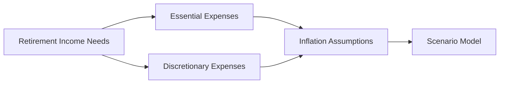

## 13.2 Retirement Income Needs Analysis

Retirement planning goes well beyond setting aside money in registered and non-registered savings vehicles. One of the most critical aspects of the retirement planning process is accurately determining the amount of income required to support a desired lifestyle after leaving the workforce. This process is typically referred to as the “retirement income needs analysis.” Below, we explore key elements of this analysis in a Canadian context, including the Income Replacement Ratio (IRR), budgeting, government benefits, inflation assumptions, and liquidity planning.

---

## Understanding the Income Replacement Ratio (IRR)

The Income Replacement Ratio (IRR) represents the percentage of your pre-retirement income that should be replaced during retirement to maintain a similar standard of living. A commonly cited guideline is between 60% and 80% of pre-retirement income, but many factors can move the “right” ratio up or down, including:

- Desired lifestyle (e.g., frequent travel, increased leisure activities)  
- Health considerations and healthcare costs  
- Debt levels and housing expenses  
- Geographic location (rural vs. urban)  
- Other sources of retirement income (annuities, rental properties, part-time work, etc.)

To estimate the IRR mathematically in a simplified form:

$$
\text{IRR} = \frac{\text{Required Retirement Income}}{\text{Pre-Retirement Income}} \times 100\%
$$

If someone currently earns \$100,000 pre-retirement and needs \$70,000 to maintain a comfortable lifestyle in retirement, then the IRR is:

$$
\text{IRR} = \frac{70{,}000}{100{,}000} \times 100\% = 70\%
$$

Of course, each retiree’s personal circumstances will vary greatly. An aggressive IRR target might be more appropriate when large discretionary expenses—like extended travel—are planned. Some people, however, will require a lower IRR if they anticipate less spending or if major expenses such as a mortgage have been paid off.

---

## Incorporating Inflation Assumptions

Inflation is an essential factor when projecting retirement income needs. Over a retirement span of 20 to 30 years (or more), even modest annual inflation can erode purchasing power significantly. For example, if you assume 2% annual inflation, a retirement costing \$70,000 annually today will need to be higher in future dollars to accommodate the rising cost of goods and services.

One way to factor in inflation is to calculate the future value of annual retirement expenses:

$$
\text{Future Retirement Expense at } t = \text{Current Retirement Expense} \times (1 + \pi)^t
$$

Where:  
- \\( \pi \\) is the annual inflation rate (e.g., 0.02 for 2%)  
- \\( t \\) is the number of years until retirement  

In practice, using comprehensive financial planning software (or open-source computational tools like Python’s NumPy and pandas libraries) allows sophisticated forecasting of inflation-adjusted retirement budgets. Canadian financial institutions such as RBC or TD often offer online tools that incorporate inflation assumptions to help clients gauge how much they need to save each year.

---

## Considering Government Benefits: CPP/QPP and OAS

Another key element of retirement income in Canada is government support through:

- **CPP/QPP:** The Canada Pension Plan (CPP) or Quebec Pension Plan (QPP) provides retirement, disability, and survivor benefits. The amount you receive depends on your contribution history, average earnings, and the age at which you decide to start benefits. Claiming CPP/QPP before age 65 reduces monthly payments permanently, whereas delaying beyond 65 can increase the monthly benefit.
- **OAS:** Old Age Security (OAS) is a federal benefit available to most Canadians aged 65 or older, subject to residency requirements. A clawback (recovery tax) may apply if your income exceeds a certain threshold.

When performing a retirement income needs analysis, you should estimate CPP/QPP and OAS payouts based on your specific circumstances (including potential start dates) to see how these programs fit within your overall income replacement strategy. Consider using official resources from the Government of Canada (https://www.canada.ca/en/services/benefits/publicpensions.html) to verify updated amounts and clawback thresholds.

---

## Budgeting for Retirement: Essential and Discretionary Expenses

A thorough retirement budget typically includes two main categories:

1. **Essential Expenses (Needs):**  
   - Housing costs (property taxes, utilities, condo fees, rent if downsizing)  
   - Groceries and other basic household items  
   - Healthcare and insurance premiums (including prescription drugs)  
   - Transportation (car payments, maintenance, public transit)

2. **Discretionary Expenses (Wants):**  
   - Travel, vacations, and hobbies  
   - Dining out and entertainment  
   - Gifts and charitable donations  
   - Memberships and leisure activities  

In Canada, expenses such as extended medical insurance or medications not covered by provincial health plans can grow over time or vary depending on medical needs. Reviewing these expenses is often best done line by line. Many advisors rely on retirement budgeting worksheets or specialized tools such as:

- **Financial planning software** (e.g., Naviplan, RazorPlan)  
- **Open-source spreadsheets** or Python-based tools  
- **Online calculators** from trusted banks or organizations (e.g., BMO’s retirement planning tools, or nonprofit retiree resource centers)

---

## Building a Contingency Fund

Retirees may face unexpected expenses such as:

- Home repairs (roof replacement, major appliance purchases)  
- Significant out-of-pocket medical expenses  
- Market downturns impacting investments  
- Economic uncertainties (inflation spikes or recessionary pressures)

A common rule of thumb is to maintain an emergency or contingency fund covering three to six months of essential living expenses. However, some experts advise retirees to maintain a larger buffer (up to one year’s worth of expenses) given their limited ability to supplement income via work. Storing contingency funds in low-volatility, liquid instruments such as high-interest savings accounts or short-term GICs helps protect against market fluctuations and ensures quick availability of cash.

---

## Analyzing Liquidity Needs

Liquidity refers to having enough readily accessible capital, without incurring penalties or losses from selling long-term investments prematurely. Effectively managing liquidity in retirement helps you:

- Pay for anticipated large expenses (e.g., a new car, a renovation)  
- Weather economic volatility by avoiding forced sales at depressed market prices  
- Maintain peace of mind that unexpected needs can be met

Canadian investment advisors often recommend laddering maturities in GICs or using segregated funds with flexible withdrawal options. Building a “liquidity cushion” is also critical for clients with higher-risk portfolios—if equity markets drop, you may choose to draw from more stable or liquid holdings until conditions improve.

---

## Scenario Modeling with Technology

Smart forecasting and scenario modeling can greatly enhance the accuracy of a retirement income needs analysis. By varying factors such as expected returns, inflation, life expectancy, and the timing of CPP/QPP and OAS withdrawal, you can see multiple outcomes and plan contingencies. Advisors and clients alike can leverage:

- **Commercial Financial Planning Platforms:** Often integrated with major Canadian financial institutions, featuring robust scenario analysis.  
- **Open-Source Tools (Python, R):** Libraries like NumPy, pandas, or even specialized financial modeling packages can build custom simulations (e.g., Monte Carlo analysis).  
- **Online Calculators:** Offered by banks (RBC, TD, BMO) or organizations like FP Canada (https://www.fpcanada.ca) to test different retirement parameters.

Scenario modeling helps illustrate the “retirement smile” concept—spending may peak early in retirement (travel, leisure) and later in retirement (healthcare costs) while generally dipping in the middle phase.

---

**Diagram Explanation:** The flowchart shows how both essential and discretionary expenses feed into estimates that factor in inflation assumptions, ultimately informing scenario modeling tools. This helps create a comprehensive retirement plan that aligns with your income needs.

---

## Additional Resources and References

- **CIRO (Canadian Investment Regulatory Organization):** Ensures compliance among Canadian investment dealers and mutual fund dealers. Check (https://www.ciro.ca) for the latest regulatory updates and best practices.  
- **CRA (Canada Revenue Agency):** For current tax brackets, OAS recovery tax thresholds, and registered plan contribution limits.  
- **Office of the Superintendent of Financial Institutions (OSFI):** Oversees pension plan regulations in federally regulated sectors.  
- **Research and Academic Reading:** “Pensionize Your Nest Egg” by Moshe Milevsky and Alexandra Macqueen offers practical techniques to convert retirement savings into sustainable income.

---

## Best Practices, Pitfalls, and Strategies

### Best Practices
- Start the retirement income needs analysis early in your career to ensure ample savings time.  
- Review and update your assumptions (inflation rate, expected returns, lifestyle changes) regularly.  
- Model different retirement start dates to see how they impact CPP/QPP and OAS benefits.  
- Discuss both essential and discretionary spending goals with your family or advisor.

### Common Pitfalls
- Underestimating healthcare costs or long-term care expenses.  
- Overlooking the impact of inflation or ignoring “tax drag” on withdrawals from registered accounts.  
- Failing to adjust investment strategies to ensure sufficient liquidity and minimize sequence-of-returns risk.

### Strategies to Solve Challenges
- **Gradual Retirement:** Working part-time beyond the traditional retirement age can reduce the strain on savings.  
- **Structured Withdrawals:** Use a mix of systematic withdrawal plans (SWPs), annuities, and guaranteed investment products to stabilize income.  
- **Risk Management:** Diversify across asset classes; consider insurance products if appropriate.  

---

## Summary and Key Takeaways

- **Income Replacement Ratio (IRR):** Provides an initial target for how much of your pre-retirement income you may need.  
- **Inflation Assumptions:** Should be integrated into all retirement simulations to maintain purchasing power.  
- **Government Benefits (CPP/QPP, OAS):** Timing of benefit uptake can make a large difference in monthly paychecks.  
- **Detailed Budget:** Separating essential from discretionary expenditures paints a clearer retirement expense picture.  
- **Contingency Fund & Liquidity:** Safeguards against emergencies and market downturns.  
- **Scenario Modeling and Tools:** Enables you to test various assumptions for a more resilient retirement strategy.

By systematically analyzing these factors and modeling different scenarios, you can better understand your actual retirement income needs. This ensures you make informed decisions about saving, investing, and ultimately enjoying your retirement years.

---

## Maximize Your Retirement Income: A Comprehensive Needs Analysis Quiz



### 1. Which of the following best describes the Income Replacement Ratio (IRR) in retirement?

- [x] The percentage of pre-retirement income that a retiree needs to maintain a similar lifestyle
- [ ] The interest rate used to discount future pension payments
- [ ] The percentage of an individual’s net worth dedicated to fixed-income investments
- [ ] A ratio measuring tax savings in registered accounts

> **Explanation:** The IRR measures how much of your pre-retirement income you need to replace to keep up your lifestyle after retirement.

### 2. What is a typical range for the IRR suggested by many industry guidelines?

- [ ] 30%–50% of pre-retirement income
- [x] 60%–80% of pre-retirement income
- [ ] 85%–90% of pre-retirement income
- [ ] Exactly 100% of pre-retirement income

> **Explanation:** While individual circumstances vary, many experts suggest planning for an IRR between 60% and 80% of pre-retirement income.

### 3. Why is it essential to incorporate inflation assumptions into retirement income calculations?

- [x] Inflation reduces purchasing power of money over time
- [ ] Inflation has no impact on fixed pension benefits
- [ ] Inflation rates remain stable and can be ignored
- [ ] Inflation only affects discretionary expenses

> **Explanation:** Over a lengthy retirement, inflation gradually reduces how much a fixed income can buy, making it critical to account for rising costs.

### 4. Which of the following Canadian government programs provides a monthly benefit subject to potential clawbacks if income exceeds a certain threshold?

- [ ] Canada Pension Plan (CPP)
- [ ] Quebec Pension Plan (QPP)
- [x] Old Age Security (OAS)
- [ ] Guaranteed Income Supplement (GIS) only

> **Explanation:** OAS benefits may be reduced (clawed back) if your retirement income exceeds specific thresholds set by the CRA.

### 5. How does taking CPP/QPP before the age of 65 typically affect benefit payments?

- [x] They are permanently reduced
- [ ] They remain the same indefinitely
- [x] They may provide more total payments if you live a very long life
- [ ] They are adjusted for inflation automatically but not for any other factors

> **Explanation:** Opting for early CPP/QPP results in reduced monthly benefits, but you may receive payments for a longer overall period.

### 6. What is the usual purpose of maintaining a contingency fund during retirement?

- [x] To cover unexpected expenses such as home repairs or medical bills
- [ ] To invest aggressively in higher-yield products
- [ ] To spend on vacations and dining more frequently
- [ ] To hedge interest rate fluctuations in corporate bonds

> **Explanation:** A contingency fund ensures that retirees can handle emergencies without forcing the sale of income-generating assets at an inopportune time.

### 7. For what main reason should retirees ensure liquidity in their portfolios?

- [x] To avoid selling long-term assets at inopportune times or during market downturns
- [ ] To maximize returns in speculative investments
- [x] To readily pay for significant anticipated expenses
- [ ] To qualify for government subsidies

> **Explanation:** Liquidity is crucial so retirees can easily access cash when needed (due to a large purchase or emergency) without having to sell assets at potentially unfavourable prices.

### 8. How do scenario modeling tools assist in retirement planning?

- [x] By varying key assumptions such as inflation, life expectancy, and investment returns
- [ ] By guaranteeing a specified investment return
- [ ] By eliminating the need for ongoing adjustments to retirement plans
- [ ] By automatically changing government benefit amounts

> **Explanation:** Scenario modeling allows you to test different “what-if” situations, illuminating the impact of changes in key planning variables.

### 9. Which of the following would typically be categorized as a discretionary expense during retirement?

- [ ] Mortgage or rent payments
- [ ] Prescription medications
- [ ] Property taxes
- [x] Travel and leisure activities

> **Explanation:** Discretionary expenses include lifestyle pursuits such as vacations, hobbies, and entertainment. Housing and medical costs generally fall into essential expenses.

### 10. True or False: The recommended range of three to six months for an emergency or contingency fund never changes for retirees.

- [x] True
- [ ] False

> **Explanation:** While three to six months is a common guideline, many advisors suggest retirees maintain a larger buffer (sometimes closer to 12 months of expenses) due to limited income flexibility.




