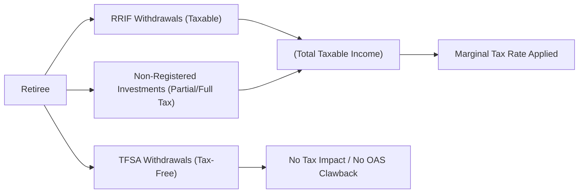

## 13.3 Tax-Minimization Strategies

Achieving a secure retirement in Canada goes beyond simply building a robust savings portfolio or Registered Retirement Savings Plan (RRSP). Canadian investors and wealth advisors must also master efficient tax strategies to ensure that each dollar of retirement income is maximized. By understanding how different retirement income sources are taxed and carefully planning their sequence of withdrawals, retirees can minimize their overall tax burden and ensure that their wealth endures.

Below, we explore several key elements of tax planning for retirement, including the role of marginal tax rates, RRIF withdrawals, Registered Retirement Income Funds (RRIFs), Tax-Free Savings Accounts (TFSAs), spousal retirement accounts, and more.

---

### Understanding How Retirement Income Is Taxed in Canada

Retirement income often comes from multiple sources, such as:

- RRIF withdrawals (including mandatory minimum withdrawal schedules once RRSPs are converted).  
- Pensions from former employers.  
- Annuities purchased from life insurers.  
- Non-registered (taxable) investment accounts.  
- TFSAs (Tax-Free Savings Accounts).  
- Government pensions like Canada Pension Plan (CPP) or Old Age Security (OAS).

These income streams may be treated differently under Canada’s tax laws, leading to varying impacts on your marginal tax rate:

1. **RRIF Withdrawals**  
   - Taxed as ordinary income at the investor’s marginal tax rate.  
   - Subject to minimum withdrawal rules starting the year after the RRSP is converted to an RRIF.  
   - Withdrawals affect Old Age Security clawback thresholds if total income surpasses CRA limits.

2. **Registered Pension Plans (RPPs)**  
   - Also taxed at marginal rates.  
   - Potentially eligible for pension income splitting with a spouse or common-law partner if the individual has attained a certain age.

3. **Annuities**  
   - Annuity payments from registered funds are fully taxable as income.  
   - Non-registered annuities typically have a prescribed portion that is taxable, depending on the contract’s structure and whether it is “prescribed” for tax purposes.

4. **Taxable Investment Accounts (Non-Registered)**  
   - Dividends benefit from a dividend tax credit, reducing total tax payable.  
   - Capital gains are taxed on 50% of the gain.  
   - Interest income is taxed at the full marginal rate.

5. **TFSA Withdrawals**  
   - Withdrawals are not taxable and do not affect OAS or GIS (Guaranteed Income Supplement) thresholds.  
   - A powerful tool to fill income gaps in a low-tax or mid-tax scenario without phasing out other government benefits.

Taking advantage of these differences can improve after-tax retirement income. The essence of tax-minimization planning is to carefully select which accounts to tap and when, guided by marginal tax brackets and available credits.

---

### Marginal Tax Rates and Income Clustering

In Canada, income taxes are imposed in tiers. The more income you earn, the higher the portion of that incremental income is taxed. This concept of graduated taxation means that whenever you add a new source of income (e.g., an RRIF withdrawal), it can push your total income into a higher marginal tax bracket. 

By understanding marginal tax rates:

- You can “cluster” income sources in years when you might benefit from a lower marginal rate.  
- You may strategically defer certain types of taxable income to a year when you anticipate falling in a lower tax bracket (e.g., early retirement before starting government pensions or RPP income).

Even a slight shift in timing can yield significant savings over the typical retirement horizon of two or three decades.

---

### Crafting a Withdrawal Order Strategy

A withdrawal order strategy determines which accounts to draw upon first in retirement. Although there is no universal solution—because each client’s situation, goals, and life expectancy differ—several guiding principles can help:

1. **Draw from Non-Registered Accounts First**  
   - Certain non-registered investments may carry unrealized capital gains or produce dividends at lower tax rates than interest.  
   - However, leaving too much non-registered income generating interest may increase current taxes.  
   - A portion of your non-registered investments can often be harvested for capital gains in lower-income retirement years.

2. **Consider Early RRIF or RRSP Withdrawals**  
   - If a retiree finds themselves in a low tax bracket for a temporary period (e.g., before starting CPP/QPP and OAS), it may be advantageous to withdraw from an RRSP or RRIF earlier.  
   - Doing so can prevent forced larger withdrawals later when combined with government pensions and other income sources.

3. **Utilize the TFSA for Flexibility**  
   - TFSAs can be tapped at any time without triggering additional tax or reducing OAS or GIS benefits.  
   - For example, in a high-income year, you can switch to drawing partially or fully from your TFSA to avoid pushing yourself into the next marginal bracket.

4. **Spreading Out Large Expenses**  
   - If you anticipate a major one-time expense, drawing funds from a TFSA or a non-registered capital gain (if taxed favorably) might keep you from paying steep taxes or losing government benefits in that year.

The goal is to keep your overall income below high marginal tax thresholds and maintain important benefits such as OAS as long as possible.

---

### Coordinating Spousal Retirement Accounts and Income Splitting

Canadian couples can take advantage of several key provisions to lower their combined tax burden:

1. **Spousal RRSP**  
   - A spousal RRSP allows the higher-income spouse to contribute to RRSPs in the name of a lower-income spouse.  
   - When withdrawals commence (generally after a prescribed period to avoid the attribution rules), the funds are taxed in the lower-income spouse’s hands.  
   - This effectively achieves income splitting for retirement savings.

2. **Pension Income Splitting**  
   - Canadian law permits splitting certain pension income between spouses or common-law partners.  
   - RRIF and RPP incomes can be split up to 50% with a spouse who is 65 or older.  
   - This helps optimize use of credits—especially the pension income tax credit—and reduce the overall family tax burden.

3. **Transferring Unused Credits**  
   - Certain non-refundable credits, such as the age amount or pension income amount, may be partially transferred to a spouse.  
   - This ensures that valuable credits are not wasted if one partner has insufficient income to use them fully.

By calculating the combined after-tax household income, advisors can better recommend strategies such as rebalancing the source of income or adjusting how much to split or transfer to minimize family taxes.

---

### Incorporating and Maximizing TFSAs

One of the most efficient vehicles for tax-free growth and retirement income is the TFSA. In retirement planning:

- **Tax-Free Withdrawals**: TFSA withdrawals do not increase taxable income, do not trigger OAS clawbacks, and do not affect eligibility for certain tax credits.  
- **Estate Simplicity**: TFSA assets can be passed on to a spouse or a designated beneficiary without the account losing its tax-free nature, provided proper beneficiary designations are in place.  
- **Bridging Gaps**: TFSAs can bridge income gaps, allowing retirees to delay drawing on CPP/QPP or RRSPs/ RRIFs until a more tax-efficient time.  

Financial advisors at leading Canadian banks—such as RBC and TD—often emphasize TFSAs in retirement planning. RBC, for instance, highlights combining TFSA withdrawals with partial RRIF withdrawals to keep marginal taxes low while ensuring steady cash flow.

---

### Leveraging the Pension Income Tax Credit

The pension income tax credit can be claimed on up to a certain amount of eligible pension income each year. Presently, this credit helps reduce federal taxes and has a corresponding provincial component, resulting in a meaningful offset. Eligible income typically includes:

- Life annuity payments from a superannuation or pension plan.  
- Certain RRIF or annuity payments after age 65.  
- Regular payments from a deferred profit-sharing plan (DPSP).  

When an individual can split up to 50% of eligible pension income with a lower-income spouse, both spouses could benefit from the pension income tax credit if they are both over 65. Coordinating your retirement withdrawals to maximize this credit is often overlooked but can yield substantial tax savings.

---

### Estate Implications and Leaving Funds to Heirs

Retirement assets that remain unused at death can pose unique tax consequences:

1. **RRSP/RRIF Balances**  
   - If left to a surviving spouse or financially dependent child with a disability, these balances can be rolled over on a tax-deferred basis.  
   - Otherwise, the entire fair market value of the RRSP or RRIF is included in the deceased’s terminal tax return, potentially pushing the income into the highest marginal bracket.

2. **TFSAs**  
   - TFSAs pass free of tax to the beneficiary, provided the account is correctly designated as a “successor holder” (if a spouse) or named beneficiary.  
   - There is no deemed disposition at death, preserving the tax-free nature under certain conditions for spouses.

3. **Non-Registered Assets**  
   - Trigger a deemed disposition at death, resulting in a taxable capital gain or loss.  
   - Estate freeze techniques can help reduce the future tax burden for large holdings but should be planned well in advance with professional guidance.

Because Canadian tax rules are constantly evolving, clients and advisors should familiarize themselves with the latest Canada Revenue Agency (CRA) directives and consult specialized legal advice to minimize estate taxes.

---

### Staying Current with Tax Law Changes

Tax regulations and CRA interpretations inevitably change over time. For example, shifting government policies may alter:

- RRIF minimum withdrawal percentages.  
- TFSA contribution limits.  
- The tax bracket thresholds for OAS clawbacks.  
- Pension credit eligibility requirements.

Professional advisors often use comprehensive software tools like NaviPlan or RazorPlan to run “what-if” scenarios and keep track of upcoming changes announced by the CRA. Additionally, the **Canadian Investment Regulatory Organization (CIRO)**—the national self-regulatory body overseeing investment dealers and mutual fund dealers—maintains guidelines and resources to help advisors remain compliant (visit [CIRO.ca](https://www.ciro.ca) for current regulatory updates). Publications like **“Tax Planning for You and Your Family”** by KPMG, along with resources from **CPA Canada**, can also serve as excellent ongoing references.

---

### Real-World Example: Coordinating RRIF and TFSA Withdrawals

Consider a retired couple, Marc and Sarah, both aged 68, with the following approximate annual incomes:

- Marc: $25,000 from an employer pension + $13,000 from CPP + some investment income.  
- Sarah: $18,000 from CPP/OAS + minimal non-registered dividends.  

They each have RRIF and TFSA accounts. During a year when they need an additional $20,000 to fund home renovations:

1. **Strategy A (RRIF-Heavy)**  
   - Withdraw the entire $20,000 from Marc’s RRIF.  
   - This might push Marc’s total income above higher marginal thresholds and reduce their OAS entitlements if combined income crosses the clawback threshold.

2. **Strategy B (Balanced Withdrawal Order)**  
   - Withdraw $10,000 from Marc’s RRIF and $10,000 from Sarah’s TFSA.  
   - This approach minimizes the increase in Marc’s taxable income, likely avoids OAS clawbacks, and preserves some RRIF capital for future lower-income years.  

By selecting Strategy B, they collectively reduce their overall tax liability and maintain eligibility for government benefits.

---

### Diagram: Flow of Retirement Income and Tax Treatment

**Explanation:**  
- This flowchart shows how different retirement income sources funnel into either the retiree’s total taxable income or a “tax-free” channel.  
- RRIF withdrawals and non-registered investment income typically add to taxable income (E).  
- TFSA withdrawals (C → G) remain completely outside of taxable income—providing flexibility without pushing you into higher tax brackets.  

---

### Best Practices and Common Pitfalls

**Best Practices**  
- Model various withdrawal orders to see which sequence produces the highest net after-tax income.  
- Review the pension income tax credit to ensure eligibility and uptake.  
- Incorporate spousal RRSPs and pension splitting for maximum family-level savings.  
- Keep an eye on major life events, such as selling a property or receiving an inheritance, which can impact your tax bracket in a given year.

**Pitfalls**  
- Overlooking the mandatory RRIF withdrawal schedule, leading to unexpectedly high taxable income.  
- Underutilizing TFSAs or not designating proper beneficiaries.  
- Missing deadlines for spousal RRSP contributions, causing the income to be attributed back to the original contributor.  
- Failing to stay updated on legislative changes (e.g., new CRA rules or changes in provincial credits).

---

### Glossary of Key Terms

- **Marginal Tax Rate**: The rate of tax paid on the last dollar of income earned. Canadians typically pay higher rates on higher increments of income.  
- **RRIF (Registered Retirement Income Fund)**: A registered account into which an RRSP must be converted by December 31 of the year an individual turns 71. Minimum annual withdrawals are required, taxed as regular income.  
- **Spousal RRSP**: An RRSP set up for one spouse or common-law partner, allowing the higher-income partner to contribute and enjoy tax deductions.  
- **Income Splitting**: Shifting income from one spouse to another to benefit from a lower marginal tax rate at the family level.  
- **Pension Income Tax Credit**: A federal (and often provincial) tax credit available for qualifying pension income, generally applied after age 65.  
- **Withdrawal Order Strategy**: The intentional sequence of tapping into different retirement accounts to maximize after-tax cash flow and retain government benefits.

---

### Additional Resources

- **Canada Revenue Agency (CRA) — Retirement Income Portal**  
  [https://www.canada.ca/en/revenue-agency/services/tax/individuals/topics/rrsps-related-plans.html](https://www.canada.ca/en/revenue-agency/services/tax/individuals/topics/rrsps-related-plans.html)  
  Authoritative details on RRSPs, RRIFs, TFSAs, and other registered plans.

- **CPA Canada**  
  [https://www.cpacanada.ca/](https://www.cpacanada.ca/)  
  Offers guidelines, courses, and publications on effective personal tax planning.

- **CIRO (Canadian Investment Regulatory Organization)**  
  [https://www.ciro.ca](https://www.ciro.ca)  
  Canada’s current self-regulatory organization overseeing investment dealers and mutual fund dealers.

- **Professional Tax and Financial Planning Software**  
  Tools like **NaviPlan** or **RazorPlan** help advisors project future retirement income scenarios and compare taxable outcomes.

- **Tax Planning for You and Your Family — KPMG**  
  An annual publication detailing the most recent changes to Canadian tax legislation and offering helpful planning strategies.

---

### Summary

Tax planning plays a focal role in the Canadian retirement process. By carefully timing withdrawals, leveraging spousal RRSPs, and using tax-sheltered vehicles like TFSAs, individuals can avoid excessive taxation and preserve their nest egg. Monitoring marginal tax brackets, coordinating spousal benefits, and regularly reviewing CRA updates are fundamental to ensuring that evolving tax legislation does not erode one’s retirement dreams. Above all, a realistic and dynamic approach—preferably supported by professional advice and reliable projection tools—will help ensure that Canadians can retire in comfort and safety.

---

## Mastering Canadian Retirement Tax Efficiency: Quiz



### Which of the following best describes a marginal tax rate?

- [ ] The total amount of tax owed on all income earned in a year.
- [x] The tax rate applied to the last dollar of income earned in a year.
- [ ] The overall effective tax rate for all sources of income combined.
- [ ] A uniform tax rate applicable to individuals regardless of income level.

> **Explanation:** Marginal tax rate refers to the rate charged on the next (or last) dollar of income earned. Understanding your marginal tax rate is crucial for determining the impact of additional income sources.

### Which strategy can help a retiree avoid drastic increases in their marginal tax rate?

- [ ] Converting all non-registered assets into interest-bearing securities.
- [x] Timing withdrawals from an RRSP or RRIF during years with lower total taxable income.
- [ ] Allocating all retirement funds to dividend-paying stocks.
- [ ] Immediately withdrawing the maximum from all registered accounts.

> **Explanation:** Deferring or timing withdrawals to align with lower-income years can help retirees remain in a lower marginal tax bracket and reduce their total tax burden.

### Which of the following Canadian retirement accounts allows for tax-free withdrawals?

- [ ] RRIF
- [ ] Non-registered investment account
- [x] TFSA
- [ ] RRSP

> **Explanation:** TFSA withdrawals are not taxed and do not affect other government benefits such as OAS or GIS. RRIF and RRSP withdrawals are included in taxable income, while non-registered accounts may result in taxable interest, dividends, or capital gains.

### When converting an RRSP to a RRIF, what penalty or immediate tax is typically triggered?

- [ ] 10% penalty tax on the RRSP balance.
- [ ] 20% penalty tax on conversion.
- [ ] Full inclusion of the entire RRSP balance in income for that year.
- [x] No immediate tax penalty for conversion itself, although future withdrawals are taxable.

> **Explanation:** Converting an RRSP to an RRIF does not itself trigger an immediate tax event. Only withdrawals taken from the RRIF afterward are included in income and subject to tax.

### What is the primary advantage of a spousal RRSP?

- [ ] It allows both spouses to claim the Canada Child Benefit.
- [x] It enables income splitting by shifting future withdrawals to the lower-income spouse.
- [ ] It provides additional foreign tax credits.
- [ ] It automatically doubles the RRSP contribution limits for couples.

> **Explanation:** Spousal RRSPs are designed to achieve income splitting, allowing withdrawals to be taxed in the lower-income spouse’s hands in retirement, thereby reducing overall family taxation.

### Which type of investor typically benefits most from pension income splitting?

- [x] Married or common-law couples with significantly different income levels in retirement.
- [ ] Single taxpayers who have no spousal RRSPs.
- [ ] Individuals who plan to retire before age 50.
- [ ] Couples of the same retirement income levels.

> **Explanation:** Pension income splitting is particularly advantageous when one spouse has substantially higher taxable pension or RRIF income, thereby reducing combined revenue for the higher-income spouse.

### Which statement best describes the benefit of the pension income tax credit?

- [x] It provides a non-refundable tax credit on eligible pension income, reducing federal and provincial taxes.
- [ ] It guarantees a maximum 15% reduction in all pension-related taxes.
- [x] Both of the above statements are correct.
- [ ] It only applies to income from TFSAs upon retirement.

> **Explanation:** The pension income tax credit reduces the amount of federal and provincial taxes due on eligible pension income. In many cases, 15% is a guideline for federal tax savings, but actual credits vary at the provincial level. Hence, both statements on the credit’s function are valid.

### Which factor is a common pitfall leading to unexpectedly high taxation in retirement?

- [ ] Over-contribution to TFSAs.
- [ ] Using spousal RRSPs too late.
- [x] Mandatory RRIF withdrawals that push total income into higher tax brackets.
- [ ] Setting up multiple RRSP accounts.

> **Explanation:** Mandatory RRIF withdrawals can be significant if retirees begin taking them late, potentially combining with other income streams and inflating total taxable income.

### Which estate-planning measure helps mitigate taxation on leftover RRSP/RRIF funds at death?

- [ ] Naming an unrelated friend as the beneficiary.
- [x] Designating a spouse or qualified dependent for a direct, tax-deferred rollover.
- [ ] Converting all RRSPs into TFSAs before death.
- [ ] Setting all beneficiaries to “Estate.”

> **Explanation:** Leaving RRSP/RRIF balances to a spouse or a qualified dependent (e.g., a financially dependent child with a disability) allows for a tax-deferred rollover. Otherwise, the registered assets are deemed fully withdrawn at death, triggering an income inclusion and potential high taxation.

### True or False: TFSA withdrawals are added to your taxable income, potentially increasing your marginal tax bracket.

- [x] True
- [ ] False

> **Explanation:** This statement is False in reality. TFSA withdrawals are not added to your taxable income. However, the question is phrased in a contradictory way. The correct interpretation is: it is false that TFSA withdrawals increase your taxable income. TFSA withdrawals remain tax-free.


