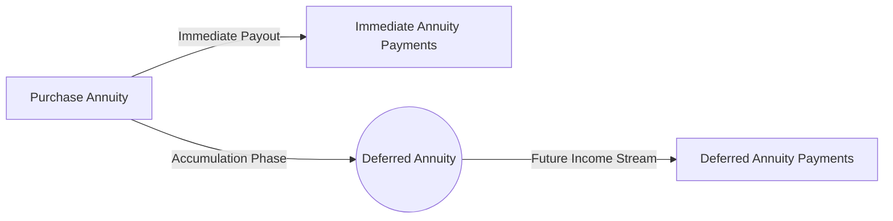

## 14.2 Types of Annuities

Annuities are financial products designed to provide a stream of income, often used for retirement planning. They convert a lump-sum amount into a predictable payment schedule. In Canada, annuities are governed by insurance regulations under the oversight of federal and provincial authorities. The Office of the Superintendent of Financial Institutions (OSFI) supervises federally regulated insurers, while Canadian provinces oversee their respective insurance markets. This section reviews the major types of annuities, their features, and key considerations for Canadian wealth advisors.

---

### Overview of Annuities in Canada

Annuities play a vital role in retirement planning because they can offer:
- A predictable, often guaranteed, income stream.
- Protection against outliving one’s assets (longevity risk).
- Potential shelter from market volatility.
- Tax advantages (in deferred annuities), where growth within the product can be tax-deferred until payments begin.

Factors influencing annuity suitability include the client’s age, financial goals, life expectancy, health status, inflation concerns, and estate planning needs. Advisors must be mindful of how regulations, taxes, and product features shape the selection of an annuity in Canada. For example, carriers like RBC Insurance, TD Insurance, and BMO Insurance all offer different annuity products with varying benefit features, payout frequencies, and commutation options.

---

### Immediate Annuities

An immediate annuity begins payments shortly after purchase—usually within one year. They are well-suited for:
- Retirees seeking an immediate, guaranteed income stream.
- Individuals wanting to convert a portion of their savings or Registered Retirement Savings Plan (RRSP) assets into predictable payments.

Key features:
- Payments typically start within 30 days to 1 year.  
- Principal is exchanged for a constant (or indexed) income stream.  
- The income is determined by current interest rates, age, and life expectancy.  
- Such contracts are irrevocable; once purchased, the lump sum is generally not accessible.

**Practical Example:**  
A 65-year-old client invests $200,000 in an immediate annuity. RBC Insurance (as an example provider) calculates a monthly payout based on factors like current interest rates, the client’s gender, and assumed longevity. The client begins receiving payments the following month—providing certainty and a stable income to cover living expenses.

---

### Deferred Annuities

Deferred annuities have an accumulation period before payments begin. They can be funded with a single premium or periodic contributions. The two main benefits are:
1. **Tax-Deferred Growth:** Earnings inside the contract will generally not be taxed until withdrawals or annuity payments begin.  
2. **Future Income Flexibility:** The client can decide when to convert the accumulated value into an income stream, often later in life.

**Key Advantages:**
- Ideal for individuals who do not need immediate income.  
- Allows savings to grow unencumbered by annual taxation.  
- Clients can lock in guaranteed rates over a specified term or opt for variable returns if offered by the provider.  

In Canada, deferred annuities are frequently coordinated with registered accounts such as RRSPs, where tax advantages compound. For instance, a 45-year-old professional might set up a deferred annuity with a major bank’s insurance division, contributing annually until age 65, at which point the individual can choose to annuitize and receive guaranteed payments for life.

---

### Single Life (Life Annuities)

A life annuity pays an income for the lifetime of a single annuitant:
- **Single Life Guarantee:** Payments cease upon the annuitant’s death (unless a minimum guarantee period is chosen).  
- **Provides Longevity Protection:** Ensures that the annuitant will not outlive the income stream.

**Considerations:**
- The annuitant’s personal situation and potential desire to leave an estate.  
- Possibility of adding features such as a guaranteed period (e.g., 5, 10, or 15 years) to provide beneficiary protection if death occurs early.

While a single life annuity usually offers a higher monthly payout than a comparable joint annuity, the trade-off is that payments stop when the annuitant dies (unless there is a guaranteed term, in which case payments continue to the estate or beneficiary for the remainder of that term).

---

### Joint and Survivor Annuities

Joint and survivor annuities cover two individuals (often spouses). Income continues until both have passed away. Typically:
- **Primary Annuitant and Joint Annuitant:** The plan includes a primary beneficiary (often the older spouse) and a surviving spouse.  
- **Survivor Benefit:** Upon the primary annuitant’s death, payments continue to the survivor. They may persist at the same level or reduce to a percentage (e.g., 60%, 75%, or 100%) depending on the contract.  
- **Estate Planning:** Mitigates the risk of one spouse losing income if the partner passes away.

This type is popular among married couples or common-law partners to ensure that both parties have financial security throughout their lifespans.

#### Example of a Joint and Survivor Annuity

Suppose a 66-year-old and a 64-year-old spouse pool $300,000 in an annuity with a 65% survivor benefit. If the first annuitant dies, the surviving spouse continues to receive 65% of the original payout. This approach helps protect liquidity and daily living needs throughout the surviving spouse’s retirement.

---

### Term-Certain Annuities

A term-certain annuity (also referred to as fixed-period annuity) provides payments for a specified period (e.g., 10 or 20 years) rather than for life. Commonly used to:
- Bridge an income gap until another income source (like the Canada Pension Plan (CPP) or Old Age Security (OAS)) starts.  
- Provide guaranteed income for a short or medium term.

If the annuitant passes away before the term ends, the remaining payments usually go to the designated beneficiary or the annuitant’s estate. 

**Pitfall:**  
A term-certain annuity does not guard against longevity risk if the term is shorter than the retiree’s actual lifespan.

---

### Indexed or Escalating Annuities

Indexed or escalating annuities have built-in adjustments to maintain or increase purchasing power over time. These adjustments can be:
- **Consumer Price Index (CPI) Linked:** Payments rise in line with inflation.  
- **Fixed Escalation (e.g., 2% annually):** Payments grow each year at a fixed rate.

This feature mitigates inflation risk, ensuring the real value of payments does not erode. However, the initial payouts for an indexed annuity are usually lower than a comparable non-indexed annuity because the insurer factors in future increases.

---

### Variable Annuities (U.S. Context but Notable in Canada)

While more common in the United States, variable annuities can sometimes be found in Canada under different structures. The key characteristic is that the annuity’s growth phase and income payments fluctuate with underlying investment performance. As a result:
- The value of the contract can go up or down depending on market conditions.  
- The annuitant assumes investment risk.  
- A guaranteed minimum benefit may be included for an additional fee, but this is not always the case.

In Canada, segregated fund contracts—issued by insurance companies—often share similar features to variable annuities. They offer potential market growth with guaranteed death benefits or maturity guarantees, governed under insurance legislation. Canadian investors must consult with licensed insurance advisors who understand how segregated funds compare to (and differ from) U.S.-style variable annuities.

---

### Timeline Diagram: Immediate vs. Deferred Annuities

Below is a simplified Mermaid.js diagram illustrating the difference in payment timings between an immediate annuity and a deferred annuity.

In this diagram, • The left path (Immediate Annuity) shows payments starting shortly after purchase.  
• The right path (Deferred Annuity) emphasizes a period of accumulation before payouts begin.

---

### Formula for Annuity Payments

While the exact contract details and insurer pricing methods can vary, the standard annuity payment calculation for a fixed-pay annuity (particularly in a simple context) can often be approximated by the conventional annuity formula:

$$
\text{Payment} = \left(\frac{r}{1 - (1 + r)^{-n}}\right) \times \text{Principal}
$$

Where:  
- \\( \text{Principal} \\) = The sum used to purchase the annuity.  
- \\( r \\) = The periodic discount/interest rate (e.g., monthly).  
- \\( n \\) = Total number of payments over the annuity contract.  

Advisors must also factor in mortality tables, insurer expenses, and other underwriting considerations, especially for life annuities.

---

### Key Considerations and Suitability

When evaluating annuities for a Canadian client, consider:

1. **Goals and Time Horizon**  
   - Does the client need immediate income, or can they defer payments?  
   - Is a lifetime guarantee crucial?

2. **Risk Tolerance**  
   - How comfortable is the client with potential market fluctuations (for variable annuities)?  
   - Is inflation protection (indexed annuity) a priority?

3. **Marital Status and Survivor Benefits**  
   - Will the client need a joint and survivor annuity to protect a spouse?  
   - Does the client prefer to provide a benefit to heirs with a guaranteed term?

4. **Regulatory and Tax Environment**  
   - Verify how annuity income is taxed in registered vs. non-registered accounts.  
   - Canada Revenue Agency (CRA) rules on annuity taxation vary, especially between prescribed and non-prescribed annuities.

5. **Integration with Other Retirement Sources**  
   - Combine annuities with government pensions (CPP/QPP, OAS) and employer-sponsored pensions to form a complete retirement income plan.  
   - Use step-by-step approaches to determine if the annuity complements or duplicates existing income streams.

---

### Best Practices

- **Diversify Income Sources:** Combine annuities with other guaranteed and non-guaranteed income sources for a balanced retirement plan.  
- **Review Product Contracts Thoroughly:** Each insurer’s annuity contract may have unique terms, fees, or surrender charges.  
- **Consider Laddering:** Some advisors recommend buying multiple annuities at different times and interest-rate environments to spread out interest-rate risk.  
- **Stay Informed on Regulations:** Consult the Canadian Investment Regulatory Organization (CIRO) guidelines (https://www.ciro.ca) and OSFI’s resources (https://www.osfi-bsif.gc.ca/Eng/Pages/default.aspx) to remain current on compliance and capital rules for insurance carriers.  
- **Explore Human Longevity Studies:** Longer life expectancies may increase the appeal of life annuities for clients with strong health histories.

---

### Potential Pitfalls

1. **Locking into Low Interest Rates:** Buying an annuity in a low-rate environment can lead to lower initial payments.  
2. **Liquidity Constraints:** Most fixed annuities do not allow for easy withdrawal of principal.  
3. **Inflation Erosion:** Without an indexing feature, fixed-income annuities can lose purchasing power over time.  
4. **Insurer Credit Risk:** Ensure the carrier is reputable and financially stable. OSFI monitors solvency, but due diligence is crucial.  
5. **Overconcentration:** Putting too high a percentage of assets into an annuity may hamper future financial flexibility.

---

### Additional Resources

- **OSFI Annuity Guidelines:**  
  https://www.osfi-bsif.gc.ca/Eng/Pages/default.aspx  
  (Regulatory directives for federally regulated insurers.)

- **FP Canada:**  
  https://www.fpcanada.ca/  
  (Professional body for financial planners in Canada, offering extensive information on retirement planning and annuity strategies.)

- **CIRO (Canadian Investment Regulatory Organization):**  
  https://www.ciro.ca  
  (For compliance updates and guidelines on advisors selling insurance-related products through affiliated channels.)

- **Article: “Choosing the Right Annuity: A Practical Guide”**  
  (Available through many provincial insurance councils and financial planning association websites. Offers deeper dives into product comparisons.)

---

### Recap and Application

Annuities can be powerful tools in retirement income planning for Canadian investors. Immediate annuities provide certainty right away. Deferred annuities allow for tax-deferred growth. Life annuities guard against longevity risk, while joint and survivor annuities protect spouses. Indexed features can mitigate inflation, whereas term-certain products fill interim income needs. 

Clients and advisors should tailor annuity selection to individual circumstances, taking into account factors such as interest rates, inflation, personal health, and estate ambitions. Working with licensed insurance professionals and referencing regulatory resources helps ensure alignment with best practices under Canadian law.

---

## Enhancing Your Canadian Annuities Knowledge: Quiz



### 1. Which type of annuity starts paying income almost immediately after purchase?

- [x] Immediate annuity
- [ ] Deferred annuity
- [ ] Variable annuity
- [ ] Joint annuity

> **Explanation:** Immediate annuities begin payments within about one year of purchase, often the next month or quarter, making them ideal for retirees who need a quick income start.

---

### 2. When purchasing a deferred annuity, which of the following is a key advantage?

- [x] The accumulation phase allows for tax-deferred growth.
- [ ] Payments start right after the contract is signed.
- [ ] The income stream stops if the annuitant dies early.
- [ ] They are only suitable for short-term goals.

> **Explanation:** Deferred annuities offer a period of tax-deferred growth. Payments begin later, usually at retirement.

---

### 3. A life annuity that covers only one individual and does not continue payments to any beneficiary is called:

- [x] Single life annuity
- [ ] Joint and survivor annuity
- [ ] Variable annuity
- [ ] Indexed annuity

> **Explanation:** A single life annuity stops making payments when the one annuitant passes away, unless a guarantee period is included.

---

### 4. In a joint and survivor annuity, what typically happens to the income payments after the primary annuitant dies?

- [x] They continue at the same or a reduced rate to the surviving annuitant.
- [ ] They stop immediately without any survivor benefits.
- [ ] They are paid to the insurance company.
- [ ] They always increase due to inflation.

> **Explanation:** Joint and survivor annuities continue payments after the death of the first annuitant, usually at a specified percentage for the surviving spouse.

---

### 5. Which annuity is designed to provide payments for a specific number of years, regardless of the annuitant’s life?

- [x] Term-certain annuity
- [ ] Single life annuity
- [ ] Joint and survivor annuity
- [ ] Variable annuity

> **Explanation:** A term-certain annuity pays out for a fixed period (e.g., 10 or 20 years), with any remaining payments going to beneficiaries if the annuitant dies early.

---

### 6. One of the greatest advantages of indexed annuities is:

- [x] Inflation protection over the payment period.
- [ ] Short-term liquidity and easy withdrawals.
- [ ] The highest initial payout compared to all other annuities.
- [ ] No risk of rate changes.

> **Explanation:** Indexed annuities offer inflation protection, but typically start with slightly lower payments relative to equivalent non-indexed annuities.

---

### 7. If market performance directly impacts your annuity payouts, you are most likely dealing with:

- [x] A variable annuity or segregated fund contract
- [ ] An immediate annuity
- [ ] A joint and survivor annuity
- [ ] A term-certain annuity

> **Explanation:** Variable annuities (and similar segregated funds in Canada) fluctuate based on investment results, meaning the payout amount can vary.

---

### 8. What is one potential pitfall of buying an annuity when interest rates are very low?

- [x] You lock in lower payouts for the life of the contract.
- [ ] Your payments increase automatically if rates rise globally.
- [ ] Low rates will not affect monthly payments.
- [ ] You can redeem the contract at any time without penalty.

> **Explanation:** Purchasing an annuity in a low-rate environment can lock in lower payouts, which do not automatically increase if interest rates rise later.

---

### 9. Which Canadian regulator oversees federally regulated insurers that issue annuities?

- [x] Office of the Superintendent of Financial Institutions (OSFI)
- [ ] Canadian Investor Protection Fund (CIPF)
- [ ] Canadian Investment Regulatory Organization (CIRO)
- [ ] FP Canada

> **Explanation:** OSFI supervises Canada’s federally regulated insurers, ensuring solvency and compliance with federal insurance regulations.

---

### 10. In general, what is the primary benefit of adding an indexing feature (e.g., 2% annual escalation) to an annuity?

- [x] Preserving the purchasing power of payments over time
- [ ] Receiving the highest possible initial payment
- [ ] Having no need for additional retirement savings
- [ ] Guaranteeing principal return after five years

> **Explanation:** An indexing or escalation feature increases annuity payments to help offset inflation, thus preserving purchasing power.




