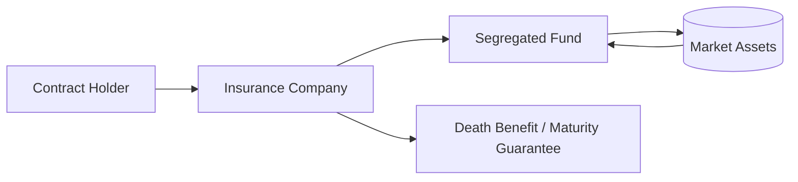

## 14.3 Segregated Funds

Segregated funds (or “seg funds”) are insurance contracts that invest in market-based assets while providing specific guarantees to investors. Unlike mutual funds, segregated funds fall under insurance legislation rather than securities regulation, and they are offered exclusively by life insurance companies. This combination of underlying investments with protective features makes them particularly useful for clients seeking a balance between market participation and various forms of risk mitigation.

### Introduction to Segregated Funds

Segregated funds operate similarly to mutual funds in that investors (referred to as “contract holders”) place their money into a professionally managed pool of assets. However, the insurance structure brings significant additional elements:

1. **Insurance Contract:** Policies fall under provincial insurance laws rather than securities legislation. In the event of insurer insolvency, coverage may be available from Assuris — a not-for-profit organization designed to protect Canadian policyholders.
2. **Guarantees:** These can include maturity guarantees, death benefit guarantees, and potential creditor protection (if certain conditions are met).
3. **Bypassing Probate:** In many Canadian provinces, the proceeds of a segregated fund pass directly to the named beneficiary outside the contract holder’s estate, avoiding probate fees and delays.
4. **Fees and Management Expense Ratios (MERs):** Typically higher than comparable mutual funds due to the insurance guarantees embedded in the contract.

For many Canadians, segregated funds align well with retirement planning, offering some of the upside potential of managed investments without completely forgoing safety nets that are typically absent in standard market products.

### Key Features and Benefits

#### Maturity Guarantees

A maturity guarantee ensures a certain portion of the original deposit (commonly 75% to 100%) is protected when the contract reaches its maturity date, often set 10 years from inception. If the investment’s market value is below the guaranteed amount at maturity, the insurer top-ups the difference.

- **Example:** Suppose you deposit $100,000 in a segregated fund with a 100% maturity guarantee and a 10-year term. If, at the end of 10 years, the market value is $80,000, the insurance company must pay you an additional $20,000 to meet the $100,000 guarantee.

#### Death Benefit Guarantees

Death benefit guarantees protect a portion (again, typically 75% to 100%) of the original deposit (or possibly the fund’s market value at a reset date). If the contract holder dies before maturity, the beneficiary receives the greater of the segregated fund’s market value or the guaranteed amount.

- **Estate Planning Advantage:** The beneficiary often receives the payout directly, bypassing probate. Particularly with family members named as beneficiaries, there may also be additional creditor protection in the event of the contract holder’s insolvency.

#### Potential Creditor Protection

Under certain conditions, segregated funds offer protection against creditors, as insurance contracts can be structured so that proceeds are protected if a family member is designated as beneficiary. This benefit is especially relevant for self-employed professionals or business owners who may wish to shield personal assets from business liabilities.

- **Important Caveat:** The availability of creditor protection depends on factors including provincial insurance legislation, timing of the designation, and the relationship to the beneficiary. Consult an insurance or legal specialist for precise details.

#### Bypassing Probate

In many provinces, with an appropriate beneficiary designation, the value of a segregated fund is paid out directly to the beneficiary rather than forming part of the estate, thus avoiding probate fees. The bypass of probate can also enable quicker distribution of assets.

#### Higher Fees and MERs

Since segregated funds come with built-in guarantees, the fees and MERs can exceed those of comparable mutual funds. Advisors should help clients weigh:
- The costs of these protections.  
- Their comfort level with market volatility.  
- Alternative approaches to mitigating investment risk (e.g., a diversified asset allocation strategy or guaranteed investment certificates [GICs]).

### How Segregated Funds Fit into a Retirement Income Strategy

Segregated funds can work effectively alongside other retirement vehicles, such as Registered Retirement Savings Plans (RRSPs), Tax-Free Savings Accounts (TFSAs), annuities, and pension plans. They are particularly attractive for clients who:

1. Exhibit strong risk aversion yet still desire partial exposure to equity or fixed income growth.  
2. Require estate planning benefits, including the ability to name a beneficiary directly and control the distribution of assets.  
3. Wish to realize certain tax-deferral benefits (where available under insurance contracts).  
4. Desire a blend of market returns, insurance guarantees, and management by a professional portfolio manager.

### Contract Reset Options

Some segregated fund policies allow **contract resets**, enabling the contract holder to lock in increased market values as the new guaranteed amount. This reset function effectively protects gains and updates the baseline for maturity or death benefit guarantees. Typically, there are limits on the number of resets allowed or the timeframe between resets.

### Comparison with Mutual Funds

While segregated funds may hold many of the same underlying securities as mutual funds, the key distinctions are:

- **Regulatory Oversight:** Seg funds are governed by provincial insurance regulators and guided by the Canadian Life and Health Insurance Association (CLHIA), while mutual funds fall under the jurisdiction of securities regulators and CIRO for dealer oversight.
- **Costs:** Seg funds typically have higher fees due to insurance-related guarantees.  
- **Payout Methods:** Insurance contract structure allows for direct payment to beneficiaries, potentially outside the estate.  
- **Creditor Protection:** May apply in segregated funds (subject to insurance legislation), whereas mutual funds typically do not offer this layer of protection.

### Real-World Examples

• **Large Canadian Banks with Insurance Subsidiaries:** RBC, TD, and BMO all have insurance arms offering segregated fund products designed for clients seeking both growth and capital protection.  
• **Canadian Pension Funds:** While large pension funds typically invest directly in capital markets, the concept of guarantee-based products inspired smaller pension plans to adopt investment structures that limit downside risk for their members. Although they do not typically use segregated funds as a vehicle, the same principle of ensuring some level of security underpins many defined benefit pension schemes.  
• **Local Case Study:** A small business owner invests in a segregated fund to protect personal assets against potential business creditors and to ensure a smooth transfer of wealth to family members. The higher fees are acceptable given the peace of mind from guaranteed benefits.

### Best Practices and Potential Pitfalls

#### Best Practices

- **Assess Suitability:** Confirm that the higher fees are justified by the client’s need for insurance guarantees, creditor protection, or probate bypass.
- **Examine Contract Terms:** Carefully review maturity dates, death benefit details, reset opportunities, and redemption fees.
- **Compare Creditor Protection Options:** Evaluate alternative creditor protection solutions such as trusts or holding companies if additional flexibility or coverage is desired.
- **Keep an Eye on Provider Strength:** Investigate the insurer’s financial stability and history. Assuris offers a degree of protection if the insurer becomes insolvent, but strong insurers can provide greater peace of mind.
- **Collaborate with Specialists:** Work alongside estate lawyers, tax professionals, and insurance underwriters to ensure that segregated fund strategies align with broader financial and estate planning objectives.

#### Potential Pitfalls

- **Misunderstanding Fees:** Clients who expect mutual fund–like MERs may be surprised. Advisors must clarify the cost structure early.
- **Over-Reliance on Guarantees:** Even with maturity or death benefit guarantees, investment returns can still be volatile. Also, insurance guarantees apply only at maturity or death; market drops prior to those events still affect the policy’s surrender value if clients exit early.
- **Creditor Protection Assumptions:** Believing all unintended creditors are automatically blocked can be misleading. Regulations and case law vary among provinces, and certain conditions must be met.  
- **Contractual Complexity:** Each insurer has unique policy wordings, which can be complex to navigate without professional counsel.

### Step-by-Step Implementation for Canadian Investors

1. **Evaluate Retirement Goals:** Determine if the client needs guaranteed capital at maturity or a secure death benefit for estate planning.  
2. **Assess Risk Tolerance:** Confirm if the client prioritizes growth or capital protection.  
3. **Compare Fees and Guarantees:** Gather key data—management expense ratios, type and level of guarantees, and reset features—from at least two or three providers.  
4. **Review Creditor Protection Requirements:** Verify if the beneficiary qualifies under provincial statutes for creditor protection.  
5. **Check Regulatory Guidance:** Consult CLHIA guidelines (https://www.clhia.ca/) and relevant provincial insurance regulators for up-to-date requirements.  
6. **Finalize Beneficiary Designations:** Name primary and contingent beneficiaries to ensure seamless wealth transfer.  
7. **Monitor and Reset (if Available):** If the contract includes reset privileges, monitor the seg fund’s value to lock in any gains periodically.  
8. **Stay Informed on Tax Implications:** Work with a tax professional to understand how capital gains or losses, distributions, or de-registrations (if held in a registered plan) will affect the client’s overall tax liability.

### Diagram: How Segregated Funds Flow

**Explanation:**  
• The Contract Holder enters into a segregated fund contract with an Insurance Company.  
• The Insurance Company invests in the underlying Market Assets on behalf of the segregated fund.  
• As part of the contract, the Insurance Company provides guarantee features such as a death benefit or maturity guarantee.  
• This structure is regulated by provincial insurance legislation, not securities laws.

### Additional Resources

- **Canadian Life and Health Insurance Association (CLHIA):**  
  https://www.clhia.ca/ for industry guidelines on segregated funds.  
- **Provincial Insurance Regulators:**  
  Refer to your province’s regulatory website for specifics on licensing and contract legislation.  
- **Assuris:**  
  https://www.assuris.ca/ for information on the insurance industry’s insolvency protection.  
- **Book Recommendation:**  
  “Segregated Funds in Canada: Protecting Your Investments and Estate” (commonly found in Canadian financial libraries and references).

---

### Summary

Segregated funds meld insurance guarantees with market-based investment growth, offering benefits such as creditor protection, bypass of probate, and structured death benefits. While fees tend to be higher than equivalent mutual funds, many Canadian investors find those costs justified by the peace of mind and estate advantages. Advisors should carefully navigate the contract details—especially regarding resets and fees—to ensure they align with clients’ overall wealth management strategies. When integrated thoughtfully, segregated funds can form a valuable pillar in retirement planning and estate conservation within Canadian portfolios.

---

## Protecting Retirement Income with Segregated Funds: Boost Your Knowledge



### 1. Which statement best describes a segregated fund?

- [x] It is an insurance contract that invests in underlying market-based assets with insurance guarantees.
- [ ] It is a high-interest savings account offered only by big banks.
- [ ] It is a government pension plan funded through payroll deductions.
- [ ] It is any mutual fund offering capital protection backed by the government.

> **Explanation:** Segregated funds are specifically insurance contracts governed by provincial insurance legislation. They combine market-based investments with insurance features like maturity and death benefit guarantees.

### 2. Which of the following is a unique benefit of segregated funds compared to mutual funds?

- [x] They typically bypass probate when a beneficiary is named.
- [ ] They always offer higher returns than mutual funds.
- [ ] They are fully guaranteed by the federal government.
- [ ] They have lower management fees due to their insurance component.

> **Explanation:** A key advantage of segregated funds is that proceeds often bypass probate. However, they generally have higher fees (not lower) than mutual funds, and returns vary depending on market conditions.

### 3. What is the term “maturity guarantee” referring to in a segregated fund contract?

- [ ] The amount of interest paid by the insurer each year.
- [ ] A bonus paid to the advisor upon contract renewal.
- [x] A guarantee on a specified percentage of principal at the contract's maturity date.
- [ ] The legal deadline for switching insurance companies without penalty.

> **Explanation:** The maturity guarantee commits the insurer to reimburse the contract holder’s principal, up to a specified percentage, if the market value at maturity is below that guaranteed threshold.

### 4. How might segregated funds provide potential creditor protection?

- [ ] By keeping the funds in a numbered bank account to avoid detection.
- [x] By designating certain family members or irrevocable beneficiaries who receive protection under provincial insurance legislation.
- [ ] By investing exclusively in government bonds.
- [ ] Through a separate reinsurance policy governed by CIRO.

> **Explanation:** Provincial insurance rules can confer creditor protection if the contract names eligible beneficiaries. The insurance designation must meet legislative requirements to enable this protection.

### 5. When can a contract reset option typically be used in a segregated fund product?

- [x] When the fund’s market value rises, allowing the guaranteed amount to be recalculated at the higher value.
- [ ] Only if the insurer decides that performance has been inadequate.
- [x] At any time during the first two years, but not afterward.
- [ ] When the contract holder cashes out completely.

> **Explanation:** Contract resets let the holder “lock in” gains and use that new market value as the basis for future guarantees. The frequency and timing depend on the specific policy’s terms, but they typically happen when the market value is higher.

### 6. Why do segregated funds usually have higher fees than conventional mutual funds?

- [x] They incorporate insurance guarantees, which increase administrative and capital reserve costs for insurers.
- [ ] They pay out large dividends to investors every quarter.
- [ ] They are sold only by special discount brokerages with markup fees.
- [ ] They are guaranteed safe by the government, so insurance premiums are minimal.

> **Explanation:** The cost of providing maturity and death benefit guarantees raises the management fees. Mutual funds do not typically bear these insurance-related obligations.

### 7. Which provincial or national institution helps protect policyholders if a life insurance company that issued a segregated fund fails?

- [ ] The Canadian Investor Protection Fund (CIPF).
- [ ] The Canadian Investment Regulatory Organization (CIRO).
- [x] Assuris.
- [ ] The Office of the Superintendent of Financial Institutions (OSFI) directly refunds investors.

> **Explanation:** Assuris is the not-for-profit organization that protects Canadian policyholders up to certain limits if their life insurance company becomes insolvent. CIPF covers investor assets from insolvent dealer members, while OSFI oversees federal insurance regulations.

### 8. In which circumstances do segregated fund benefits usually bypass probate?

- [x] When there is a named beneficiary on the insurance contract who survives the policyholder.
- [ ] Only if the estate is valued below $50,000.
- [ ] Always, provided the policyholder dies after the maturity date.
- [ ] Never; all investment products must go through probate in Canada.

> **Explanation:** A properly designated beneficiary on the segregated fund contract typically enables direct payout to that beneficiary, bypassing probate in most provinces.

### 9. Which step should a Canadian investor take first when considering a segregated fund for retirement?

- [ ] Immediately purchase the first segregated fund mentioned by their bank.
- [x] Clarify retirement goals and risk tolerance, deciding whether the costs of insurance guarantees are warranted.
- [ ] Focus on short-term trading gains before shifting to a segregated fund.
- [ ] Move all existing mutual funds into segregated funds for potential creditor protection.

> **Explanation:** It is essential to ensure the product matches long-term goals and risk profile and to evaluate the cost-benefit of the insurance features.

### 10. Segregated funds are regulated primarily by:

- [x] Provincial insurance legislation.
- [ ] The Canadian Securities Administrators (CSA).
- [ ] The Canadian Investment Regulatory Organization (CIRO) alone.
- [ ] Municipal by-laws.

> **Explanation:** Segregated funds are governed by insurance laws at the provincial level. They are not regulated as securities, although advisors may require dual licensing if they sell both securities and insurance products.


