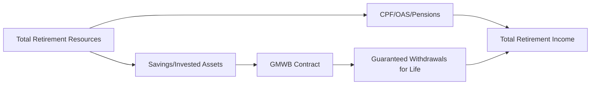

## 14.4 Guaranteed Minimum Withdrawal Benefit (GMWB) Contracts

Guaranteed Minimum Withdrawal Benefit (GMWB) contracts are specialized insurance products designed to protect retirees from outliving their savings. By combining elements of traditional investment vehicles (e.g., segregated funds) with insurance guarantees, GMWBs help ensure a predictable baseline of income regardless of market performance. This section explores GMWB mechanics, key features, regulatory aspects within the Canadian context, and practical steps for implementing and monitoring these solutions in a retirement strategy.

---

### Understanding GMWB Contracts

A GMWB contract is a retirement income product offered by insurance companies where:

- The investor deposits money into a contract invested in underlying funds (often structured similarly to segregated funds).  
- The insurance company guarantees a minimum withdrawal amount for life, commonly referred to as the Lifetime Withdrawal Amount (LWA).  
- Even if the market value of the underlying investments declines, the contract ensures that investors can continue to draw the guaranteed income, as long as they follow the product’s rules (e.g., observing withdrawal limits).

#### How GMWB Helps Mitigate Longevity Risk

Longevity risk is the possibility of an individual outliving their retirement savings. GMWB contracts address this risk by guaranteeing income for life. In essence, these products combine investment growth potential with income guarantees, a concept that appeals to many retirees seeking both security and the possibility of upside gains.

---

### Key Features

GMWB contracts share several common characteristics that distinguish them from other retirement strategies:

1. **Lifetime Withdrawal Amount (LWA)**  
   The LWA is the annual sum a contract holder can withdraw, usually expressed as a percentage of the contract’s Benefit Base. The LWA is guaranteed to continue for life, provided the withdrawal amount stays within the contract’s guidelines.

2. **Base Benefit (Benefit Base)**  
   This notional figure determines the guaranteed withdrawal. Although it often starts as the initial deposit, the Benefit Base may be adjusted through contract provisions (e.g., step-ups or resets).

3. **Guaranteed Withdrawal Rate**  
   Many contracts offer a specific annual withdrawal percentage—such as 5% of the Benefit Base—ensuring a predictable income stream. Some providers, including leading Canadian insurers, tie withdrawal percentages to the contract holder’s age.

4. **Reset (Step-Up) Feature**  
   GMWB contracts often allow you to “reset” the Benefit Base if the market value of the underlying investments surpasses the current Benefit Base, effectively locking in gains. This step-up can result in a higher LWA in subsequent years.

5. **Fees**  
   GMWBs usually involve higher fees than standard mutual funds or segregated funds. These costs can include management fees, insurance charges, and fees for additional riders. It is critical to evaluate the fee structure carefully to ensure the benefits of the guarantee outweigh the costs.

6. **Withdrawals Limits**  
   Exceeding the contract’s allowable annual withdrawal could reduce or eliminate the guarantee, making it vital for investors to respect the terms of the contract to maintain the guaranteed income.

#### Example:  
A 65-year-old investor deposits CAD 250,000 into a GMWB contract with a 5% guaranteed withdrawal rate. The initial LWA is 5% × 250,000 = CAD 12,500 per year for life. If, over time, the underlying fund’s performance pushes the asset value up to CAD 300,000 and the contract allows a reset, the base might increase to CAD 300,000, boosting the LWA to 5% × 300,000 = CAD 15,000 annually.

---

### Canadian Regulatory Environment

#### Provincial Insurance Legislation

GMWBs in Canada are primarily governed by provincial Insurance Acts and related regulations. Each province enforces standards for insurance product disclosures, solvency requirements, and policyholder protection.  

#### CIRO Guidelines

The Canadian Investment Regulatory Organization (CIRO)—formed from the amalgamation of IIROC and MFDA—oversees investment and mutual fund dealers. Advisors regulated by CIRO must follow suitability and disclosure guidelines when recommending GMWBs. For official guidance on regulatory updates, visit [CIRO’s website](https://www.ciro.ca).

#### OSFI Oversight

The Office of the Superintendent of Financial Institutions (OSFI) supervises federally regulated insurance companies. OSFI sets solvency requirements that indirectly protect GMWB contract holders.

#### Assuris Protection

In the event that an insurance company becomes insolvent, Assuris provides coverage for Canadian policyholders. Each contract’s protection limit depends on factors such as the product type and the promised guarantees. For more information, visit [Assuris](https://www.assuris.ca).

---

### GMWB Implementation: Step-by-Step

Below is a simplified approach an advisor might use to assess, recommend, and manage a GMWB solution for a client:

1. **Determine Suitability**  
   - Evaluate the client’s personal profile, risk tolerance, retirement timeline, and longevity concerns.  
   - Explore alternative solutions like annuities, segregated funds without a GMWB, and fixed income portfolios to compare fit.

2. **Project Retirement Needs**  
   - Calculate income shortfalls or surpluses based on Canada Pension Plan (CPP), Old Age Security (OAS), employer pension plans, and personal savings.  
   - Identify how much guaranteed income is required.

3. **Review GMWB Contract Features**  
   - Compare product terms among various Canadian insurers (e.g., RBC, Manulife, Sun Life) regarding withdrawal rates, resets, fees, and minimum deposit requirements.

4. **Check Tax Considerations**  
   - Consult CRA guidelines regarding the taxation of insurance products vs. securities.  
   - Verify if partial withdrawals are taxed as income or partially as a return of capital, depending on contract structure.

5. **Implement the Contract**  
   - Complete insurance and investment applications.  
   - Set up the contract’s investment allocations (e.g., balanced funds, Canadian equity funds).

6. **Monitor and Review Performance**  
   - Track the underlying fund’s performance, possible step-up opportunities, and evolving client needs.  
   - Adjust risk exposure if the client’s goals or financial situation change.

7. **Respect Withdrawal Guidelines**  
   - Remind clients to avoid withdrawals above the allowable limit, which could jeopardize the income guarantee.

---

### Comparison to Other Retirement Income Solutions

GMWBs are not the only retirement income products available. Understanding their differences is essential:

- **Fixed Annuities:** Provide a guaranteed income for life but typically have no market-based growth potential or liquidity.  
- **Segregated Funds (Without GMWB):** Offer maturity and death benefit guarantees but no guaranteed lifelong income.  
- **Defined Benefit Pension Plans:** Employer-sponsored plans that also guarantee monthly income, though typically not adjustable for market upside. Canadian pension funds (like OTPP or major bank-sponsored pension schemes) often use a mix of immunized fixed income products, real assets, and other hedging strategies, leveraging scale and stable inflows. Individual investors cannot replicate these entirely but might emulate elements of de-risking strategies through GMWBs.

---

### Best Practices and Potential Pitfalls

**Best Practices**

- **Conduct Thorough Cost-Benefit Analysis:** Compare the GMWB’s insurance costs and fees to potential alternatives, factoring in your client’s personal longevity expectations.  
- **Educate Clients on Withdrawal Rules:** Emphasize that surpassing the annual withdrawal limit can forfeit future benefits.  
- **Leverage Step-Up Features Wisely:** Monitor markets and periodically reset the contract’s Benefit Base when investment growth warrants.  
- **Integrate GMWB with Other Tools:** Combine GMWBs with TFSAs, RRSPs, or other registered plans for holistic retirement planning.

**Pitfall:**  
Many clients overlook the effect of high fees on their long-term returns. Advisors should illustrate how fees can erode net growth over time and highlight the trade-offs of investing in guaranteed products.

**Pitfall:**  
Failing to re-evaluate a GMWB contract over time is risky. A decline in market performance might trigger opportunities for resets or rebalancing. Ignoring these triggers can result in missed benefits or unnecessary risk exposure.

---

### Using GMWBs in Canadian Retirement Portfolios

Below is a simple diagram illustrating where GMWBs fit in a broader retirement income strategy:

**Diagram Explanation:**
- “Total Retirement Resources” flows into both government pension programs and private savings.  
- By placing part of the private savings (C) into a GMWB contract, retirees seek guaranteed withdrawals (E) to augment base income (B) from CPP/QPP, OAS, or employer pension plans.  

---

### Conclusion and Next Steps

Guaranteed Minimum Withdrawal Benefit (GMWB) contracts can provide certainty and confidence for Canadian retirees worried about running out of money. They combine aspects of traditional investments with insurance guarantees, ensuring a minimum income regardless of market conditions. While fees and contract complexities can be substantial, the longevity protection and potential for step-up benefits may be particularly valuable for clients seeking added security.

For further learning and professional guidance:

- **Insurance Contracts Act (provincial variations):** Review applicable provincial regulations for specific product guidelines.  
- **Further Reading:**  
  - “Guaranteed Retirement Income Solutions Explained” (white papers by RBC, TD, and other major Canadian financial institutions).  
  - [FP Canada](https://www.fpcanada.ca/) for resources on integrated retirement income planning.  
  - [CIRO](https://www.ciro.ca/) regulations on client risk profiling and disclosure.  
  - [Assuris](https://www.assuris.ca/) for details on coverage limits and guarantees.  

---

## Master Your Knowledge: Guaranteed Minimum Withdrawal Benefit (GMWB) Quiz



### 1. Which of the following best describes a GMWB contract?

- [x] A retirement income product that guarantees a minimum annual withdrawal regardless of market performance.  
- [ ] A short-term loan arrangement with variable interest rates.  
- [ ] A type of standalone life insurance policy without investment components.  
- [ ] An unsecured bond issued by Canadian corporations.  

> **Explanation:** A GMWB contract is specifically designed to guarantee a minimum withdrawal amount each year, regardless of investment performance.  

### 2. What is the “Lifetime Withdrawal Amount” (LWA) in a GMWB contract?

- [ ] The maximum one-time lump-sum payment from a segregated fund.  
- [x] The guaranteed annual amount a contract holder can withdraw for life.  
- [ ] The minimum amount paid only if the underlying fund underperforms.  
- [ ] A short-term bonus capped at six months.  

> **Explanation:** The LWA is the core promise of a GMWB, representing an annual, guaranteed income stream.  

### 3. How can a “reset” (step-up feature) benefit GMWB contract holders?

- [x] It can lock in investment gains, increasing future guaranteed withdrawals.  
- [ ] It can reduce the overall fees charged by the insurance company.  
- [ ] It converts the GMWB contract to a fixed annuity.  
- [ ] It triggers an immediate payment of the contract’s entire market value.  

> **Explanation:** Step-up features allow the benefit base to increase when the underlying investment value rises, thereby boosting the future withdrawal amounts.  

### 4. Which entity provides coverage if the insurance company offering a GMWB contract insolvent?

- [ ] CIPF  
- [x] Assuris  
- [ ] The Canada Revenue Agency  
- [ ] CIRO  

> **Explanation:** Assuris is the not-for-profit organization that protects policyholders if a Canadian life insurance company fails.  

### 5. In many GMWB contracts, withdrawing more than the allowable annual limit:

- [x] May reduce or eliminate the future guaranteed income.  
- [ ] Automatically doubles the next year’s guarantee.  
- [ ] Has no impact on guaranteed withdrawals.  
- [ ] Converts the product into a variable annuity.  

> **Explanation:** These contracts require adherence to specific withdrawal limits to preserve the long-term guarantees.  

### 6. What is the key advantage of including a GMWB contract in a Canadian retirement portfolio?

- [ ] Unlimited upside with no underlying fees.  
- [ ] 100% capital appreciation guarantee.  
- [x] Protection against outliving one’s retirement savings.  
- [ ] Complete exemption from provincial insurance regulations.  

> **Explanation:** GMWBs address longevity risk by offering lifetime guaranteed withdrawals, providing an income floor that lasts as long as you do.  

### 7. Which of the following statements about fees in GMWB contracts is correct?

- [x] GMWB contracts generally carry higher fees than standard segregated funds due to added guarantees.  
- [ ] Fees are capped at 0.2% of assets.  
- [ ] Fees typically waive once the contract is annuitized.  
- [ ] The contract fees are always lower than for mutual funds.  

> **Explanation:** Providing guaranteed withdrawals adds an extra cost component, often making the fees higher than conventional products.  

### 8. How are GMWBs regulated in Canada?

- [ ] They are unregulated as private contracts.  
- [x] They are insurance products governed by provincial Insurance Acts and OSFI guidelines.  
- [ ] Coverage is handled purely by CIPF.  
- [ ] They fall under the exclusive jurisdiction of the Canada Revenue Agency.  

> **Explanation:** GMWBs are insurance-based products subject to provincial insurance laws and OSFI oversight for federal rules.  

### 9. What is an effective step in integrating GMWB contracts into a retirement plan?

- [x] Conducting a thorough cost-benefit analysis and comparing with other retirement income products.  
- [ ] Selling all other assets and investing only in GMWBs.  
- [ ] Immediately withdrawing more than the guaranteed amount to “stress test” the plan.  
- [ ] Ignoring any proposed resets.  

> **Explanation:** A careful evaluation of fees, benefits, and alternatives ensures GMWB solutions truly meet client goals.  

### 10. True or False: The Benefit Base always remains equal to the current market value of the underlying investments.

- [x] False  
- [ ] True  

> **Explanation:** The Benefit Base is a separate notional amount used for calculating withdrawals. It does not necessarily track the daily market value 1:1, though it may be reset upwards if the underlying investments perform well.  


