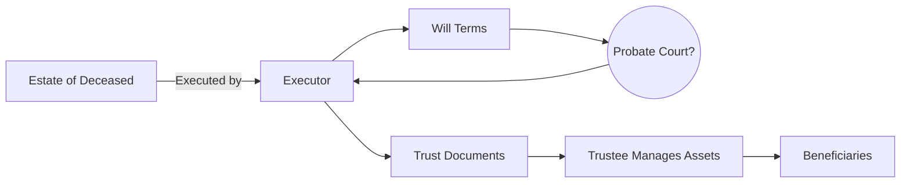

## 15.1 Passing on the Estate

Transferring assets after death—often referred to as estate distribution—can be a complex process that involves legal, tax, and personal considerations. In Canada, “passing on the estate” means ensuring that the deceased’s wishes are respected, provincial or territorial laws are followed, and beneficiaries promptly receive what they are entitled to. This section explores key documents such as wills, trusts, and designations; highlights the impact of ownership structures; and provides practical guidance on how wealth advisors can facilitate a smooth process.

---

## Overview of Estate Distribution

Estate distribution is governed by federal tax rules, provincial/territorial succession laws, and the instructions outlined in a valid will (or trust arrangements). Key ideas include:

- Honouring testamentary freedom, within limits set out by legislation (e.g., laws ensuring dependents receive adequate support).  
- Properly administering all types of assets—liquid (e.g., chequing accounts, RRSPs, TFSAs) and illiquid (e.g., real estate holdings, personal property).  
- Recognizing that some assets may bypass the will via direct designations or joint ownership.

### Core Principles

1. Testamentary Freedom  
   • Canadians generally have broad (though not absolute) discretion over their estate.  
   • Some provincial rules (e.g., British Columbia’s Wills, Estates and Succession Act) allow family members to contest a will if they have not been reasonably provided for.

2. Role of the Executor  
   • Also called an Estate Trustee in some jurisdictions, the executor ensures the instructions in the will are carried out.  
   • Executors handle probate applications, gather and value the estate assets, pay liabilities, and distribute the remaining assets.  
   • The process is supervised, in part, by provincial or territorial courts that confirm the executor’s authority through probate (if required).

3. Importance of Clarity  
   • Dated or ambiguous instructions can lead to disputes among potential beneficiaries or family members.  
   • Advisors can encourage estate owners to keep wills current and transparent, revisiting documents after significant life events (e.g., marriage, divorce, birth of a child).

---

## Key Documents and Ownership Structures

### The Will

A will is the cornerstone of any estate plan. It outlines:

- Who inherits each asset (or portion of the estate).  
- Who is appointed as executor.  
- Conditions or contingencies for distributing specific possessions.  

In many provinces, the will must follow formality requirements such as being witnessed by two individuals who are not beneficiaries. Failing to meet these requirements can invalidate the document, leading to a default (intestacy) distribution under provincial legislation.

### Trusts

A trust is an arrangement in which assets are held by a trustee for the benefit of specified beneficiaries. Trust instruments can help:

- Provide continuity: Assets may move outside the estate, reducing probate fees.  
- Protect privacy: Trust agreements are typically not public.  
- Prevent conflict: Guidelines for ongoing management and ultimate distribution are legally established in advance.

### Joint Ownership

Assets held in “joint tenancy with right of survivorship” (in many provinces) typically pass automatically to the surviving joint owner. This bypasses probate but may raise:

- Tax implications: Transferring property to a joint account with an adult child might trigger capital gains if not structured properly.  
- Legal and familial concerns: Other beneficiaries could question the validity of the transfer or whether it was intended to be a true gift.  

Wealth advisors should guide clients on the advantages and pitfalls of joint ownership, possibly involving estate lawyers to confirm alignment with the client’s overall plan.

### Designated Beneficiaries

Registered accounts—such as RRSPs, TFSAs, RRIFs, or life insurance policies—often allow a beneficiary designation. Where properly executed, these designations supersede the instructions in the will. For instance:

- If a client designates a spouse on their RRSP, that spouse typically inherits the account value outside probate.  
- Registered pension plans offered by Canadian pension funds also allow beneficiaries, sometimes with spousal priority rights governed by pension legislation.

Advisors, regulated by the Canadian Investment Regulatory Organization (CIRO), should remind clients to update designations regularly, especially after major life changes such as marriage, divorce, or the birth/adoption of children.

**Diagram Explanation:** This simplified flowchart illustrates the relationship between the estate of the deceased, formal documentation (will and trusts), potential probate involvement, and the beneficiary distributions. The executor and trustees ensure the wishes of the deceased are carried out legally.

---

## Probate and Its Impact

Probate is the judicial process that confirms the validity of a will and authorizes the executor to manage the estate. Probate fees (sometimes called estate administration taxes) vary by province or territory. For example:

- In Ontario, fees are calculated based on the total value of estate assets passing through probate.  
- In Alberta, probate fees are capped.  

By using strategies such as naming proper beneficiaries or holding assets jointly with a spouse, clients may reduce probate fees. However, if used incorrectly, these tactics could result in unintended tax consequences or family disputes.

---

## Avoiding Ambiguity and Disputes

Estate disputes can escalate quickly, often resulting in legal battles that consume significant resources. Common triggers include:

- Outdated wills that ignore new family dynamics.  
- Unclear instructions about personal items with sentimental value (e.g., antique collections).  
- Assets that do not conform with the distribution strategy (e.g., asset values changed significantly since the will was written).

### Steps to Mitigate Disputes

1. Encourage detailed instructions.  
2. Update wills and beneficiary designations after life events.  
3. Consider professional valuations for high-value items.  
4. Communicate estate plans to family, when appropriate.  

---

## Real-World Canadian Examples

• RBC and TD offer estate planning services aimed at high-net-worth (HNW) clientele. They provide integrated solutions combining wills, trusts, insurance planning, and philanthropic strategies.  

• Some BMO clients who hold complex securities (e.g., private equity funds) in registered accounts rely on designated beneficiary rules to streamline estate transfers while possibly deferring taxes until the final estate return.  

• Large Canadian pension funds (e.g., Ontario Teachers' Pension Plan, CPP Investments) structure beneficiary payouts through spousal continuation benefits or named beneficiaries, avoiding confusion about how pension entitlements are allocated upon a member’s death.

---

## Advisor Considerations and Best Practices

1. Clarify account ownership structures from the onset.  
   • Identify whether investments are held in joint accounts, individually, or via trusts.  
   • Verify beneficiary designations on registered products to ensure up-to-date alignment with the will.

2. Offer Basic Estate Planning Checklists  
   • Encourage clients to address assets with sentimental value that may not have significant market value but can cause family friction.  
   • Promote the use of supplementary letters or memoranda for distributing personal items.

3. Provide Holistic Oversight  
   • Coordinate with estate lawyers, tax professionals, and insurance specialists to ensure comprehensive planning.  
   • Incorporate a multi-disciplinary approach, especially for business owners or clients with cross-border considerations.

4. Stay Current with Regulations  
   • Review CSA (Canadian Securities Administrators) policy updates and relevant CIRO guidance.  
   • Monitor provincial and territorial legislation changes that can affect wills, trusts, or probate.

---

## Practical Steps for Clients

1. Draft or update a will under the guidance of a qualified estate lawyer.  
2. Check all beneficiary designations for registered accounts and insurance policies.  
3. Regularly review joint ownership structures to confirm they meet your intended objectives.  
4. Maintain clear records of personal possessions and their intended recipients.  
5. Consider setting aside funds in a separate account or estate trust to cover final taxes and other liabilities.

---

## Additional Resources

- [CIRO](https://www.ciro.ca/) – Current self-regulatory organization for dealers and marketplaces in Canada.  
- [Government of Canada – Wills and Estates](https://www.canada.ca/en/services/finance/personal-finances/wills-estates.html) – Overview of estate administration.  
- “Executor’s Handbook” by Jennifer Greenan – In-depth guidance on the estate settlement process.  
- Provincial law society resources or Will Planning Worksheets – Often provide free templates or checklists.  
- Provincial/Territorial statutes, e.g., Ontario’s *Estates Act*, British Columbia’s *Wills, Estates and Succession Act*.

---

## Summary and Actionable Steps

Estate distribution in Canada hinges on properly executed will and trust documents, current beneficiary designations, and awareness of asset ownership structures. By keeping designations up to date, clarifying joint ownership issues, and understanding how probate fees apply, clients and advisors can reduce conflict, minimize taxes, and ensure a smoother transfer of wealth.

• Always confirm that the estate plan aligns with changing personal and regulatory environments.  
• Collaborate with professionals—lawyers, tax experts, and fiduciaries—to handle complexities.  
• Engage family members (where appropriate) to manage expectations and lessen the possibility of disputes.

---

## Proactive Canadian Estate Planning Quiz: Key Insights for Passing on the Estate



### What is testamentary freedom in Canada?

- [x] The right of an individual to determine how their estate is distributed, subject to certain laws.
- [ ] The right of provincial courts to override all of a will’s instructions.
- [ ] The freedom for beneficiaries to split an estate equally at their own discretion.
- [ ] The freedom for advisors to decide how a client’s estate should be distributed.

> **Explanation:** Testamentary freedom allows individuals to decide how to distribute their assets, provided provincial or territorial rules protecting dependents are respected.

### Which of the following assets typically bypass probate in Canada?

- [x] Jointly held property with right of survivorship.
- [x] Assets in registered accounts with designated beneficiaries.
- [ ] Real estate solely in the name of the deceased.
- [ ] Personal property listed in the will.

> **Explanation:** Jointly held assets and registered accounts with named beneficiaries often transfer directly to survivors or designated recipients, avoiding probate.

### What role does the executor (estate trustee) primarily perform?

- [x] Administers the deceased’s estate, paying debts and distributing assets.
- [ ] Oversees the federal banking system.
- [ ] Provides legal advice free of charge.
- [ ] Acts as the sole beneficiary of the will.

> **Explanation:** The executor collects assets, pays liabilities, and distributes the remaining estate as outlined in the will, often with oversight from provincial courts.

### Which statement is most accurate regarding beneficiary designations for registered accounts?

- [x] The assets with valid designations typically bypass the will and probate.
- [ ] They must always defer to the instructions in the will.
- [ ] They are only valid if confirmed by the executor’s approval.
- [ ] They cannot be challenged legally under any circumstance.

> **Explanation:** Properly designated beneficiaries on registered accounts (e.g., RRSPs, TFSAs) generally override will instructions, preventing probate delays.

### Which of the following might reduce probate fees in certain provinces?

- [x] Holding assets jointly with right of survivorship.
- [ ] Using only cash for large investments.
- [x] Naming a beneficiary on registered products.
- [ ] Combining multiple wills into one master document.

> **Explanation:** Assets with valid beneficiary designations and joint ownership usually remain outside the deceased’s probate estate, potentially lowering probate fees.

### In a will, who typically validates its legality when probate is required?

- [x] The provincial or territorial court.
- [ ] The federal government.
- [ ] The executor alone.
- [ ] The deceased’s closest living relatives.

> **Explanation:** Probate grants official recognition that the will is valid under provincial or territorial laws, giving the executor authority to act.

### Which Canadian regulatory body oversees investment dealers and mutual fund dealers today?

- [x] The Canadian Investment Regulatory Organization (CIRO).
- [ ] The Mutual Fund Dealers Association of Canada (MFDA).
- [x] The Canadian Investment Regulatory Organization (CIRO) again (as a merged entity).
- [ ] The Investment Industry Regulatory Organization of Canada (IIROC).

> **Explanation:** As of 2023, MFDA and IIROC are defunct and have amalgamated into CIRO, which oversees both investment dealers and mutual fund dealers.

### Which of the following could lead to disputes among beneficiaries?

- [x] Ambiguous or outdated will clauses.
- [ ] A valid will written with professional legal advice.
- [x] Contradictions between a will’s provisions and joint ownership structures.
- [ ] Clearly designated beneficiaries on registered accounts.

> **Explanation:** Conflicts often arise when a will isn’t updated, is not clearly drafted, or when it conflicts with other ownership forms.

### Selecting a trustee for a trust often requires considering which factor?

- [x] Their expertise and willingness to manage assets faithfully.
- [ ] Their connection to the largest beneficiary.
- [ ] Whether they have a potential conflict of interest.
- [ ] Whether they can financially benefit the most from the trust.

> **Explanation:** An effective trustee needs competence and integrity, ensuring the trust’s assets are managed according to the settlor’s instructions.

### True or False: Designated beneficiaries named on a TFSA always override conflicting instructions in a will.

- [x] True
- [ ] False

> **Explanation:** In most provinces and territories, properly designated beneficiaries on registered products, such as TFSAs, generally supersede contradictory will instructions, allowing the assets to be transferred free of probate.


