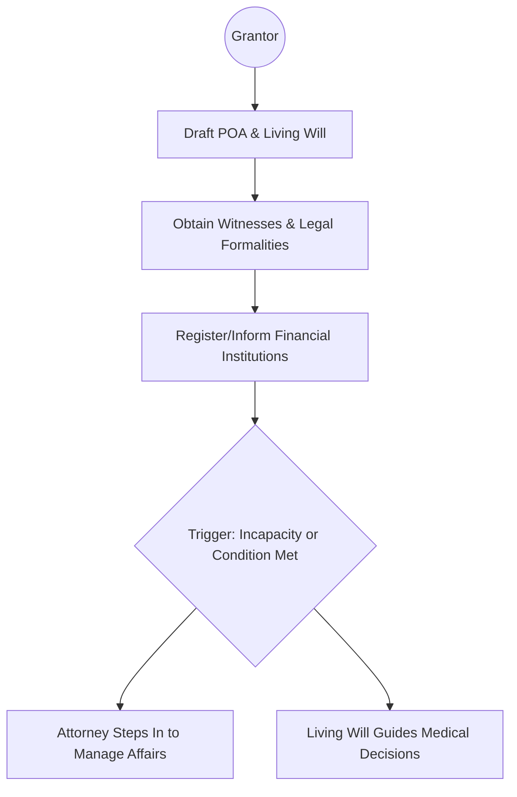

## 15.4 Powers of Attorney and Living Wills (Advance Health Care Directives)

In Canada, having a well-structured plan for managing financial and personal care decisions is a vital component of strategic wealth management. A Power of Attorney (POA) and a Living Will (also known as an Advance Health Care Directive) help ensure that an individual’s affairs—ranging from day-to-day banking to life-sustaining medical choices—are handled according to their wishes, especially in the event of incapacity. This section provides an overview of how POAs and Living Wills function, their legal requirements, and best practices to follow.

---

### Understanding Powers of Attorney

A Power of Attorney (POA) is a legal document through which one person (the “grantor”) designates another individual (the “attorney” or “agent”) to act on their behalf. Depending on jurisdiction, a POA may address financial, personal care, or both sets of responsibilities.

#### Legal Context and Terminology

- **Grantor**: The individual who creates and signs the POA, granting legal authority to the attorney/agent.
- **Attorney or Agent**: The person authorized to act on the grantor’s behalf. This individual has fiduciary duties to act in the grantor’s best interests—financially, medically, or with respect to personal care responsibilities.
- **Enduring (or Continuing) Power of Attorney**: A type of POA that remains valid even when the grantor becomes mentally incapacitated.
- **Springing Arrangement**: A POA that “springs” into effect only upon a specified event—commonly the mental or physical incapacity of the grantor.

Different provinces and territories have varied laws and rules regarding how POAs must be executed, witnessed, and administered. For instance, British Columbia uses “Representation Agreements” for personal care decisions, while Ontario recognizes separate “Continuing Powers of Attorney for Property” and “Powers of Attorney for Personal Care.”

#### Types of POAs

1. **Power of Attorney for Property (Financial Matters)**  
   - Authorizes the attorney to manage a grantor’s finances—paying bills, managing investments, collecting income, filing taxes, or buying/selling property.  
   - In many provinces, an “Enduring” or “Continuing” POA remains valid if the grantor becomes mentally incapable.

2. **Power of Attorney for Personal Care (or Representation Agreement)**  
   - Grants authority over personal decisions, such as living arrangements, health care treatments, and other non-financial matters.  
   - Typically used when the individual is unable to make decisions about daily activities (e.g., personal hygiene, nutrition, or mobility).

---

### Living Wills (Advance Health Care Directives)

A Living Will or Advance Health Care Directive allows an individual to outline their medical and personal care wishes if they cannot communicate them in the future. This document often covers:

- Life-sustaining treatments (e.g., the use of ventilators, feeding tubes)  
- Pain management preferences  
- Organ donation  
- Resuscitation instructions (e.g., DNR—Do Not Resuscitate)

Living Wills are not recognized in exactly the same way across all Canadian provinces and territories, but they generally serve as important guidance and can operate alongside a Power of Attorney for Personal Care. For clarity, some jurisdictions may bundle a Living Will’s directives into a single document or treat them as a component of a broader representation agreement.

---

### Importance of Having POAs and Living Wills

1. **Ensures Compliance with Personal Wishes**  
   By establishing a POA and a Living Will, individuals retain a measure of control over how their affairs are managed if they become unable to make their own decisions.

2. **Protects Estate and Financial Interests**  
   An Enduring POA for Property helps safeguard assets, ensure bills get paid, and prevent financial exploitation during incapacity.

3. **Prevents Family Disputes**  
   Clearly defined documents reduce the likelihood of conflicts among family members or disputes about the incapacitated person’s care and wishes.

4. **Streamlines Legal and Administrative Requirements**  
   Financial institutions like RBC, TD, and BMO have protocols for recognizing POAs on investment and bank accounts to ensure transactions can continue seamlessly if a client becomes incapacitated.

---

### Key Considerations for Drafting and Executing a POA

#### Selecting a Trusted Attorney
- **Trustworthiness**: Attorneys must uphold fiduciary duties, so honesty is paramount.  
- **Financial Literacy**: Where property or investments are involved, the attorney should have a baseline competence in financial matters.  
- **Availability and Willingness**: The chosen attorney should understand the scope of the role and be prepared for its responsibilities. Some clients may opt for a trust company or specialized professional to exercise this function, especially in cases of significant assets.

#### Witnessing Requirements
- POA documents must often be witnessed by parties who meet specific criteria—a requirement that varies by province.  
- Improper witnessing can invalidate the POA. Advisors should emphasize the importance of following provincial or territorial formalities.

#### Activation and “Springing” POAs
- Some POAs take effect immediately upon signing; others are “springing” and activate only upon the grantor receiving a medical opinion of incapacity.  
- Clients and advisors should clarify when and how a POA comes into force, taking into account the legal definition of capacity in their jurisdiction.

#### Communication with Financial Institutions
- Providing copies of the POA to relevant Canadian financial entities (banks, brokerages, insurance providers) ensures the attorney can promptly exercise their authority if needed.  
- CIRO (Canadian Investment Regulatory Organization) provides guidance to investment advisors regarding how to handle POAs on client files, including verifying documents and preventing unauthorized transactions.

---

### How a POA or Living Will Might Work in Practice

**Diagram Explanation**:  
- The individual (grantor) prepares the POA and Living Will, ensures legal formalities are met, and distributes documents to relevant parties (e.g., RBC, TD, or BMO branches managing their accounts).  
- Upon the specified trigger—often mental or physical incapacity—the attorney receives legal authority to act, and health care providers can reference the Living Will or Advance Health Care Directive to ensure the grantor’s medical wishes are followed.

---

### Living Wills: Best Practices

1. **Detail Your Wishes Clearly**  
   Provide explicit instructions about medical interventions, including comfort measures and end-of-life treatments.  
2. **Regularly Review and Update**  
   Health situations can evolve. A Living Will should be revisited periodically to ensure it remains accurate.  
3. **Discuss with Loved Ones**  
   Communication can reduce family stress and help loved ones understand the rationale behind your choices.  
4. **Combine with a POA for Personal Care**  
   While a Living Will sets out your preferences, a POA for Personal Care designates someone to implement them if circumstances change.

---

### Real-World Canadian Examples

- **Case Study: RBC POA Acceptance Process**  
  Royal Bank of Canada (RBC) typically requires a notarized or witnessed POA document before granting an attorney access to a client’s accounts. The bank may conduct internal checks to confirm authenticity. Once validated, RBC’s branch or wealth management division can allow the attorney to manage day-to-day banking, investments, or transfer funds according to the POA’s scope.

- **Case Study: TD Wealth Advisor**  
  A TD wealth advisor may receive a copy of the client’s Power of Attorney for Property. In coordination with TD’s legal and compliance teams, the advisor ensures that trading authorizations and relevant banking instructions follow the POA’s limits and instructions, mitigating the risk of unauthorized trades or potential misunderstandings.

- **Notable Single-Person Scenario**  
  BMO occasionally sees clients who opt to appoint a specialized trust company as their sole attorney for property if they lack immediate family or have concerns about impartiality. These specialized trustees systematically fulfill fiduciary responsibilities under strict oversight, often providing an extra layer of stability and professional guidance.

---

### Potential Pitfalls and How to Avoid Them

> **Pitfall:** Not having a POA or Living Will in place before mental incapacity strikes.  
> **Solution:** Draft and execute these documents early in the wealth management process to prevent legal complications, family disputes, and uncertain caregiving situations.

> **Pitfall:** Inadequate powers or unclear instructions in the POA.  
> **Solution:** Work with legal counsel to ensure the wording is properly tailored to the grantor’s needs, particularly where complex investment strategies or cross-border assets exist.

> **Pitfall:** Naming an attorney or agent who is not prepared for fiduciary obligations.  
> **Solution:** Choose a responsible individual or professional institution, and ensure they fully understand the financial scope and responsibilities.

---

### Regulatory and Legal Resources

- **CIRO (Canadian Investment Regulatory Organization)**  
  [https://www.ciro.ca](https://www.ciro.ca)  
  Governs regulation of investment dealers and mutual fund dealers, replacing IIROC and MFDA as of 2023. CIRO publishes guidelines for advisors on handling POA-related transactions and safeguarding client interests.

- **Provincial Law Societies**  
  (e.g., **Law Society of Ontario** or **British Columbia Attorney General**’s site for Representation Agreements)  
  Offer valuable information on drafting POAs, required formalities, and how to avoid pitfalls in each jurisdiction.

- **Office of the Superintendent of Financial Institutions (OSFI)**  
  Oversees federally regulated financial institutions; provides insight into how banks should manage risk and compliance around POAs.

- **Canada Revenue Agency (CRA)**  
  Contains guidelines on taxation implications when attorneys manage finances, such as continuing to file returns and handle tax shelters on the grantor’s behalf.

- **Canadian Centre for Elder Law**  
  “Enduring Power of Attorney in Canada” report elaborates on provincial requirements, best practices, and legal trends.

- **Carers Canada** and local Health Authorities  
  Provide advice on day-to-day caregiving, drafting Living Wills, and ensuring personal care directives are respected.

---

### Step-by-Step Approach for Advisors

1. **Identify Client Needs**  
   Initiate a conversation about the importance of POAs and Living Wills, particularly with older or high-net-worth clients.

2. **Collaborate with Legal Experts**  
   Encourage clients to consult with estate lawyers to prepare legally valid and properly witnessed documents.

3. **Review and Understand Scope**  
   Ensure the POA’s language aligns with the client’s wealth management intentions—for instance, specifying investment constraints or requiring second opinions for major transactions.

4. **Communicate with Financial Institutions**  
   Submit POAs to banks (RBC, TD, BMO) and investment dealers to ensure their legal teams register the documents. Clear instructions reduce confusion if the grantor loses capacity.

5. **Revisit and Update**  
   Life circumstances and laws change. Clients should review their POAs and Living Wills every few years (or after major life events).

6. **Plan for Global Assets**  
   If clients have property or accounts overseas, ensure international dimensions of the POA or alternative legal instruments are in place.

---

### Conclusion

Powers of Attorney and Living Wills (Advance Health Care Directives) are indispensable legal tools in wealth management, enabling seamless, pre-planned decision-making in times of crisis or incapacity. Whether it’s paying everyday bills or determining critical health care approaches, clients gain greater control and peace of mind when these documents are thoughtfully prepared, regularly updated, and properly communicated. For advisors, guiding clients through the preparation, maintenance, and application of these documents solidifies trust and ensures a resilient, client-centric wealth management strategy.

By proactively integrating POAs and Living Wills into your clients’ estate and financial plans, you nurture stability, preserve wealth, and uphold each client’s unique preferences, even when circumstances change unexpectedly.

---

## Test Your Knowledge: Canadian Powers of Attorney and Living Wills Quiz



### Which document specifically addresses medical and end-of-life care decisions in Canada?
- [ ] A Power of Attorney for Property
- [x] A Living Will (Advance Health Care Directive)
- [ ] A Joint Account Authorization
- [ ] A Trust Agreement

> **Explanation:** A Living Will (Advance Health Care Directive) focuses on medical treatments and end-of-life preferences, whereas a Power of Attorney for Property governs financial matters.

### What is a critical characteristic of an Enduring (Continuing) Power of Attorney?
- [ ] It expires when the grantor becomes mentally incapacitated.
- [x] It remains valid even if the grantor becomes mentally incapacitated.
- [ ] It includes instructions about funeral arrangements.
- [ ] It automatically grants organ donation rights.

> **Explanation:** Enduring (or Continuing) POAs specifically remain effective after the grantor’s incapacity, enabling the attorney to continue making decisions.

### When does a “springing” Power of Attorney typically come into effect?
- [ ] Immediately upon the grantor signing it.
- [ ] Only when the grantor is physically unable to drive.
- [x] Upon a specific event, most often the grantor’s incapacity.
- [ ] Automatically when the client’s net worth exceeds $1 million.

> **Explanation:** A springing POA is triggered by a defined condition, commonly the grantor’s doctor-confirmed incapacity or another specified event.

### Which of the following best describes the role of a Power of Attorney for Personal Care?
- [x] It covers non-financial aspects, including health care and living arrangements.
- [ ] It remains effective even after the grantee’s passing.
- [ ] It allows the holder to sign legally binding contracts in any jurisdiction.
- [ ] It automatically designates an executor for the grantor’s will.

> **Explanation:** A Power of Attorney for Personal Care focuses on personal care and health-related decisions, rather than financial matters.

### Why is it important to regularly review and update a Living Will or Advance Health Care Directive?
- [x] Health status, treatment preferences, and legislation may change over time.
- [ ] Living Wills automatically renew themselves every three years.
- [x] Additional instructions may be needed based on new medical technologies.
- [ ] They become invalid once a client establishes a Registered Retirement Income Fund.

> **Explanation:** Regular reviews ensure congruence with evolving personal needs, medical practices, and provincial reforms that might affect directive validity.

### What should an advisor encourage a client to do after preparing a POA?
- [x] Distribute copies to relevant financial institutions (e.g., RBC, TD, or BMO).
- [ ] Keep the POA strictly confidential and share with no one.
- [ ] File it under the client’s power consumption records.
- [ ] Only provide the POA to beneficiaries named in the client’s will.

> **Explanation:** Financial institutions need a copy of the POA on file to legally accept instructions from the attorney when the grantor is unable to manage their own affairs.

### What is one core fiduciary responsibility of an attorney under a POA for Property?
- [x] Acting in the best financial interests of the grantor.
- [ ] Deviating from the grantor’s instructions if it leads to higher returns.
- [x] Maintaining accurate records of all transactions made under the POA.
- [ ] Unilaterally changing the grantor’s personal care instructions.

> **Explanation:** Under a POA for Property, the attorney must place the grantor’s best interests first and keep thorough documentation of financial decisions.

### Which organization provides regulations and resources for handling POAs in Canadian investment accounts?
- [ ] The retired Investment Industry Regulatory Organization of Canada (IIROC)
- [ ] The defunct Mutual Fund Dealers Association of Canada (MFDA)
- [x] The Canadian Investment Regulatory Organization (CIRO)
- [ ] The Canada Revenue Agency (CRA) only

> **Explanation:** As of 2023, CIRO is the national self-regulatory organization overseeing investment dealers and mutual fund dealers, providing current guidance on POA usage.

### Which best practice is recommended when selecting someone to act under a Power of Attorney?
- [x] Choose a trustworthy person with financial literacy and who is willing to carry out fiduciary duties.
- [ ] Select the first available acquaintance to expedite the legal process.
- [ ] Appoint multiple attorneys who must independently decide on every matter.
- [ ] Avoid specifying the scope of authority to maintain flexibility.

> **Explanation:** Fiduciary obligations are rigorous. Selecting a trusted individual with the right skillset is crucial for effective property or personal care management.

### True or False: A Living Will in Canada can include directions on organ donation.
- [x] True
- [ ] False

> **Explanation:** Many Living Wills or Advance Health Care Directives allow individuals to express preferences regarding organ donation, in addition to other medical interventions.


