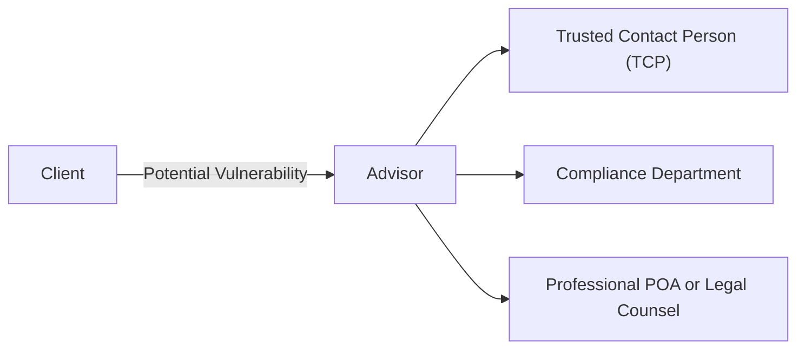

## 15.5 Considerations when Dealing with Vulnerable Clients

Financial advisors often serve clients who may be at a higher risk of financial exploitation or who face additional challenges due to age, health, limited financial knowledge, or cognitive impediments. These clients are frequently referred to as vulnerable clients. In Canada, working diligently and ethically to protect vulnerable clients is not just a best practice—it is a regulatory and fiduciary necessity. This section explores the key considerations for identifying, protecting, and serving vulnerable clients in alignment with CIRO (Canadian Investment Regulatory Organization) guidelines, provincial and federal regulations, and sound wealth management practices.

---

## Understanding Vulnerable Clients

### Definition of a Vulnerable Client
A vulnerable client is someone who, due to factors such as age, cognitive decline, physical disability, limited language skills, or inadequate financial literacy, may need extra support and protection to avoid financial harm. The vulnerability can be temporary or permanent and may evolve over time.

### Potential Risks and Challenges
1. Declining cognitive capacity (e.g., dementia or Alzheimer’s disease).  
2. Physical limitations preventing thorough review or understanding of documents.  
3. Language barriers that may cause confusion or misunderstanding.  
4. Undue influence or pressure from family members, caretakers, or external parties.  
5. Financial abuse, including unauthorized control or mismanagement of assets.

---

## Recognizing Signs of Vulnerability

Advisors should remain vigilant in spotting indications that a client may be at risk:

1. Sudden changes in behavior—such as abrupt, unusual requests for large withdrawals.  
2. Difficulty comprehending basic financial concepts previously well-understood.  
3. Suspicion that a relative or caregiver is controlling decisions.  
4. Frequent missed meetings or inability to recall key details.  
5. Previously expressed concerns about possible exploitation.

While advisors are not healthcare professionals, developing awareness and sensitivity to these warning signs is an essential step in safeguarding vulnerable individuals.

---

## Key Strategies to Protect Vulnerable Clients

### 1. Trusted Contact Persons (TCP)
A Trusted Contact Person serves as a reference point if the advisor suspects cognitive decline, undue influence, or other forms of vulnerability. The Canadian Investment Regulatory Organization (CIRO) has recognized TCP recommendations as a valuable practice. A TCP can provide updated contact details or confirm the client’s current circumstances when the advisor observes red flags.

> **Tip:** Encourage clients to appoint a TCP early, ensuring it is someone with no conflicts of interest—often a close family member, but not necessarily a direct beneficiary.

### 2. Requiring Two Signatures for Large Transactions
Requiring two distinct approvals (e.g., from the primary account holder and a co-signer or fiduciary) for substantial withdrawals or disbursements is a risk mitigation strategy. Many Canadian financial institutions, including RBC and TD, permit such account structures to help protect those with limited capacity or suspected undue influence.

### 3. Professional Powers of Attorney (POA)
In certain instances, recommending or facilitating a professional POA (for example, engaging a trust company) helps ensure decisions are made in the client’s best interest and frees the individual from undue pressure. This approach is particularly beneficial when family dynamics are strained or when no suitable personal contact is available.

### 4. Documentation and Meeting Notes
Accurate recordkeeping is essential. Maintain comprehensive notes of discussions regarding risk tolerance, transaction instructions, capacity, and product suitability. Clear documentation:

- Demonstrates compliance with CIRO rules and guidelines.  
- Provides evidence of thorough due diligence if disputes arise.  
- Helps the advisor track changes in client behavior or comprehension.

### 5. Education and Awareness
Advisors should proactively educate clients, along with their families, about:

- The importance of establishing POAs and creating or updating a valid will.  
- Recognizing red flags of financial abuse or exploitation.  
- Accessing community and government resources, such as the Canadian Centre for Elder Law or Public Health Agency of Canada, providing guidance on elder protection.

### 6. Joint Meetings with Family or Professionals
Facilitating joint sessions can help ensure all relevant parties (e.g., family members, accountants, lawyers, social workers) understand the client’s financial goals, capacity, and expressed wishes. This helps reduce the risk of miscommunication or manipulation.

---

## Regulatory and Ethical Considerations

### CIRO Requirements
CIRO emphasizes investor protection, including specialized guidance for supporting senior and vulnerable investors. Advisors should periodically consult the latest CIRO bulletins and notices (available at [https://www.ciro.ca](https://www.ciro.ca)) regarding:

- Obligations to report suspected financial abuse while respecting privacy laws.  
- Procedures for contacting trusted persons.  
- Verification of capacity and risk tolerance when unusual account activity arises.

### Privacy and Confidentiality
Advisors must also comply with applicable privacy legislation (e.g., the Personal Information Protection and Electronic Documents Act, PIPEDA) and relevant provincial laws. If suspected abuse or diminished capacity occurs, most firms have protocols to involve compliance departments or legal counsel while navigating these sensitive aspects.

### Compliance Department Involvement
When concerns about client wellbeing or capacity arise, advisors should promptly seek guidance from their compliance department. Compliance professionals can advise on the next steps, including any mandated reporting to authorities, information-sharing procedures, or heightened transaction controls.

---

## Best Practices and Common Pitfalls

| **Best Practices**                                                                  | **Common Pitfalls**                                                                  |
|-------------------------------------------------------------------------------------|---------------------------------------------------------------------------------------|
| Communicate clearly, using simple language and visual aids where possible.          | Overlooking early signs of cognitive decline or undue influence.                     |
| Encourage clients to establish a TCP and/or a professional POA early.               | Proceeding with large, unusual transactions without verifying capacity or intentions.|
| Keep thorough records of meetings, advice given, and instructions received.         | Failing to document interactions, exposing the advisor and client to risk.           |
| Conduct regular reviews of the client’s circumstances and understanding.            | Not revisiting financial plans or risk profiles as client capacities change.         |
| Involve the compliance department or legal counsel promptly if concerns arise.      | Attempting to handle complex legal, capacity, or abuse issues alone.                 |

---

## Real-World Canadian Examples

1. **Major Banks’ Vulnerable Client Protocols**  
   Several Canadian banks, such as BMO and RBC, have introduced specialized policies for seniors and individuals with limited capacity. These procedures often include recommended training for frontline employees, so they more readily identify suspicious activities and direct cases to a specialized support team.

2. **Canadian Pension Fund Practices**  
   Large pension funds, such as the Canada Pension Plan Investment Board (CPPIB), generally do not interact with clients in the same direct manner as wealth advisors. However, they ensure they meet high standards for governance and accountability—lessons retail advisors can apply by instituting internal checks and balances when working with vulnerable investors.

3. **Local Case Study—Client with Dementia**  
   A 78-year-old client diagnosed with early-stage dementia was approached by a new caregiver demanding the caregiver’s name be added to the client’s TFSA. The advisor noted suspicious behavior, documented the request, and contacted their compliance department. After discussions with the client’s appointed TCP, it was determined the caregiver had no legal standing, preventing a potentially harmful financial decision. The client’s assets remained protected due to the advisor’s proactive measures.

---

## Diagram: Safeguarding Vulnerable Clients

Below is a simplified illustration of the parties involved in protecting a vulnerable client:

**Explanation:**  
1. The client approaches the advisor for financial services.  
2. If signs of vulnerability arise, the advisor consults the trusted contact person to gather additional context or confirm certain actions.  
3. The advisor coordinates with the firm’s compliance department to ensure appropriate regulatory and legal measures are taken.  
4. When necessary, a professional POA or legal counsel steps in to support the client’s best interests.

---

## Practical Steps and Considerations

1. **Initial Client Engagement**  
   - Ask about any existing POAs, wills, or estate documents.  
   - Suggest designating a trusted contact person if none is in place.

2. **Service-Level Agreements**  
   - Consider implementing transaction thresholds that trigger additional reviews for clients showing signs of vulnerability.  
   - Specify conditions under which the advisor can contact a TCP or compliance.

3. **Ongoing Monitoring**  
   - Maintain periodic reviews to detect changes in client behavior or comprehension.  
   - Update capacity assessments more frequently where vulnerability is known or suspected.

4. **Collaborate with Professionals**  
   - Coordinate with accountants, lawyers, or social workers to develop a holistic approach.  
   - Refer to external resources like the Canadian Centre for Elder Law for specialized expertise.

5. **Documentation**  
   - Preserve thorough records for each interaction, emphasizing the rationale behind recommendations and confirming client understanding.

---

## Additional Resources

- **CIRO (Canadian Investment Regulatory Organization):** [https://www.ciro.ca](https://www.ciro.ca)  
  – For guidance on senior investment protection, best practices, and compliance FAQs.
  
- **Canadian Centre for Elder Law:**  
  – Offers comprehensive information about legal frameworks to prevent elder abuse and neglect, including reference materials for financial professionals.

- **Canada Revenue Agency (CRA):** [https://www.canada.ca/en/revenue-agency.html](https://www.canada.ca/en/revenue-agency.html)  
  – For tax considerations relevant to estate planning, trusts, and POAs.

- **Public Health Agency of Canada:** [https://www.canada.ca/en/public-health.html](https://www.canada.ca/en/public-health.html)  
  – Provides resources and strategies for supporting seniors and other vulnerable groups.

- **Canadian Securities Institute (CSI):**  
  – Offers specialized courses on elder financial abuse prevention, compliance, and ethical considerations in wealth management.

---

## Summary and Key Takeaways

Advisors in Canada have an ethical and regulatory duty to serve vulnerable clients with heightened care, ensuring that their financial well-being remains protected. By following CIRO guidelines, instituting robust protocols for detecting potential abuse, and leveraging resources such as TCPs, compliance teams, and professional POAs, wealth managers can balance privacy with effective safeguarding measures. Thorough documentation, clear communication, and regular reviews are indispensable for mitigating risk and demonstrating that all decisions are made in the client’s best interest.

---

## Protecting Vulnerable Clients: Key Considerations Quiz



### 1. Which of the following is a common strategy for protecting vulnerable clients?

- [x] Advising them to designate a Trusted Contact Person (TCP)
- [ ] Encouraging them to make unverified large transactions
- [ ] Avoiding all communication with family members
- [ ] Keeping compliance departments uninformed

> **Explanation:** Designating a Trusted Contact Person (TCP) allows advisors to seek guidance when they see signs of cognitive decline or undue influence.

### 2. Which of the following are observable signs that a client may be vulnerable? (Select all that apply)

- [x] Sudden or unusual transaction requests
- [x] Difficulty recalling recent financial decisions
- [ ] Consistently high net worth
- [ ] Effective and thorough communication in every meeting

> **Explanation:** Abrupt changes in transaction behavior and struggle to recall basic details suggest potential vulnerability; a high net worth or clear communication typically do not.

### 3. What should an advisor do when concerned about a vulnerable client’s capacity?

- [x] Contact their compliance department for guidance
- [ ] Proceed with the transaction without asking questions
- [ ] Immediately transfer client assets to a third-party account
- [ ] Inform the client they are incompetent

> **Explanation:** Advisors should alert their firm’s compliance team. Transferring assets or declaring incompetence are not within an advisor’s direct authority.

### 4. Under CIRO’s guidelines, what is the primary rationale for using a Trusted Contact Person (TCP)?

- [x] To help validate or clarify concerns about the client’s well-being
- [ ] To handle all investment decisions on behalf of the client
- [ ] To assume immediate control of the client’s assets
- [ ] To impose additional fees for protective services

> **Explanation:** A TCP is a resource for advisors to address red flags regarding capacity or financial abuse, not to assume control or make decisions for the client.

### 5. Which of the following is an example of undue influence?

- [x] A caregiver coercing a senior client to add them as a joint owner on accounts
- [ ] A broker providing educational materials for a client
- [x] A relative threatening to withhold care unless listed as a beneficiary
- [ ] A client voluntarily gifting money to a longtime friend

> **Explanation:** Undue influence occurs when someone uses intimidation or deception to force a client into decisions that do not reflect their true intentions.

### 6. How can documenting detailed meeting notes protect both the advisor and client?

- [x] It shows evidence of proper due diligence and client understanding
- [ ] It eliminates the client’s freedom to change financial plans
- [ ] It prevents compliance departments from intervening
- [ ] It allows the advisor to avoid regulatory oversight

> **Explanation:** Thorough documentation helps verify that the advisor acted ethically and in accordance with the client’s informed instructions.

### 7. If an advisor suspects financial abuse, which steps should they prioritize? (Select all that apply)

- [x] Consult with their compliance department
- [ ] Contact the alleged abuser directly
- [x] Notify the Trusted Contact Person, if permitted
- [ ] Close the client’s account immediately

> **Explanation:** Advisors should follow firm policies by bringing the matter to compliance and, when appropriate, contacting the TCP. Abrupt account closures or confronting the alleged abuser are not typically initial steps.

### 8. Which entity replaced the MFDA and IIROC in 2023 as the primary self-regulatory body for Canadian investment dealers and mutual fund dealers?

- [x] CIRO (Canadian Investment Regulatory Organization)
- [ ] OSFI (Office of the Superintendent of Financial Institutions)
- [ ] CIPF (Canadian Investor Protection Fund)
- [ ] CFP (Certified Financial Planner)

> **Explanation:** The MFDA and IIROC amalgamated to form the Canadian Investment Regulatory Organization (CIRO) on January 1, 2023.

### 9. What is the function of having two signatures required for certain transactions?

- [x] Reduces the risk of unauthorized or pressured financial decisions
- [ ] Guarantees an investment’s future returns
- [ ] Replaces POAs in all circumstances
- [ ] Ensures banks remain uninvolved in wealth management decisions

> **Explanation:** Having two signatures creates an extra layer of oversight, making it harder for one individual to exploit the client’s vulnerability.

### 10. True or False: Keeping regular communication and reviews helps advisors detect changes in a client’s capacity over time.

- [x] True
- [ ] False

> **Explanation:** Ongoing communication allows advisors to notice shifts in a client’s behavior or understanding, which can be critical for protecting vulnerable clients.


