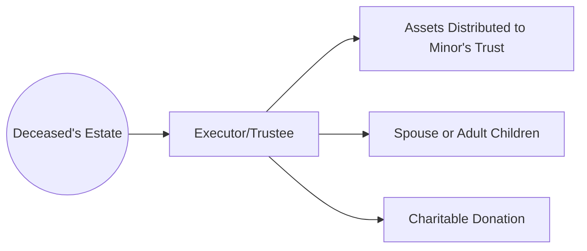

## 16.3 General Issues to Consider for Estate Planning

Estate planning encompasses more than simply drafting a will. It requires the alignment of legal directives, financial considerations, tax implications, trust arrangements, and provisions for both family and business interests. In Canada, advisors must navigate a complex regulatory environment—overseen by institutions such as the Canadian Investment Regulatory Organization (CIRO) and the Canada Revenue Agency (CRA)—while also coordinating with provincial legislation related to wills, estates, and succession. By approaching estate planning with a holistic mindset, you can support clients in preserving, growing, and ultimately transferring their wealth smoothly in line with their wishes.

Below, we examine the key issues to consider for effective estate planning and explore strategies relevant to Canadian investors and advisors.

---

## Succession Planning for Business Owners

For clients who own businesses—particularly closely held or family enterprises—succession planning is often the cornerstone of their estate plan. Without clear instructions, the sudden transition of ownership or leadership can create financial and operational disruptions.

1. **Buy-Sell Agreements**  
   - These legal contracts typically define how a business owner’s share will be purchased or transferred upon death, disability, or retirement.  
   - Valuation clauses set the price or formula to determine the business’s worth.  
   - Funding mechanisms (e.g., life insurance) ensure liquidity so surviving partners or family members can buy the shares without draining company capital.

2. **Estate Freeze**  
   - An estate freeze allows business owners to "freeze" the current value of their shares for tax purposes, while future growth is attributed to other stakeholders—often family members or trusts.  
   - This strategy can reduce tax liabilities at death and facilitate the orderly transfer of the business to heirs.

3. **Case Example: Family Restaurant Transition**  
   - Suppose Robert, owner of a successful family restaurant in Ontario, wants to retire. He opts for an estate freeze, exchanging his common shares for fixed-value preferred shares. His children receive new common shares, capturing future business growth. In this setup, Robert’s eventual tax burden on deemed disposition is limited to the frozen value, while heirs realize growth in their cost base over time.

---

## Asset Ownership Structures

When multiple individuals share property, whether a primary residence, vacation home, or investment account, the ownership structure can significantly affect the estate settlement:

1. **Joint Tenancy with Right of Survivorship (JTWROS)**  
   - The surviving owner automatically inherits the entire property.  
   - Often used by spouses to simplify asset transfer and potentially bypass probate fees.  
   - In Canada, you must still evaluate whether there are any tax implications on the transfer at death or if it triggers a deemed disposition.

2. **Tenancy in Common**  
   - Each owner holds a distinct proportional interest.  
   - On an owner’s death, that share is distributed according to the will or provincial intestacy laws.  
   - More suited for unrelated parties or investors with different contributions to an asset.

3. **Pitfall**  
   - Using joint tenancy to avoid probate fees can create disputes among surviving co-owners or potential claims from other heirs. Always clarify the right of survivorship and maintain documentation reflecting each party’s true intentions.

---

## Planning for Minors or Dependants

Children under the age of majority (18 or 19, depending on the province) cannot legally manage their own inheritance. Proper estate plans should include:

1. **Guardianship Designations**  
   - Outlining who will care for minors or dependants if both parents or primary guardians pass away.  
   - Possible to name separate guardians for personal care and for managing financial assets.

2. **Trust Arrangements**  
   - Funds set aside for a minor’s education, living expenses, or future capital.  
   - The trustee is responsible for prudent management or distribution of the funds until the child reaches a specified age or milestone.

3. **Example: Education Trust**  
   - A parent can establish a testamentary trust in their will. The trust invests assets for the minor’s benefit, releasing funds each year for private schooling or post-secondary tuition.

---

## Updating Beneficiary Designations

Beneficiary designations must be reviewed regularly to ensure alignment with a client’s evolving personal or financial circumstances. This step is critical for:

- **Life Insurance Policies**  
- **Registered Plans (RRSP, RRIF, TFSA)**  
- **Group Plans (pension or benefits at major Canadian banks like RBC, TD, or BMO)**

**Important:**  
- Beneficiary designations often supersede instructions in wills. Failing to update designations after major life events (e.g., marriage, divorce, or moving provinces) may lead to unintended asset distribution.

---

## Charitable Giving

Canadian tax laws offer various incentives for philanthropy. By incorporating charitable giving into an estate plan, clients can align their philanthropic goals with potential tax benefits:

1. **Donor-Advised Funds (DAFs)**  
   - Individuals or families contribute to a sponsoring organization, receive an immediate tax receipt, and then recommend grants over time to chosen charities.

2. **Charitable Remainder Trusts (CRT)**  
   - The trust provides income to designated beneficiaries for life, after which the remaining capital is donated to a named charity.  
   - In some scenarios, donors may receive a charitable tax receipt for the actuarial value of the remainder interest.

3. **Direct Donations**  
   - Gifting publicly traded securities in-kind to charities can avoid capital gains tax, resulting in a double tax benefit (no capital gains + donation receipt).

---

## Digital Assets

In a digital era, many individuals hold cryptocurrency, online brokerage accounts, domain names, and social media accounts:

1. **Inventory of Digital Assets**  
   - Compile a list of usernames, passwords, and potential digital wallets for cryptocurrency (e.g., Bitcoin or Ethereum).  
   - Store this information securely, in a password management app or sealed letter.

2. **Access and Authority**  
   - Ensure that executors or trustees have legal authority under the will, powers of attorney, or provincial legislation to access these digital properties.

3. **Social Media Considerations**  
   - Decide how social media accounts should be handled—memorialized, transferred, or deleted—according to the platform’s policies.

---

## Cross-Border or Multi-Jurisdictional Issues

Canadians often hold assets in more than one province or country. Whether it’s recreational property in Quebec, a U.S. rental, or investments abroad:

1. **Multiple Wills**  
   - Having separate wills for different jurisdictions can simplify probate processes but must be carefully aligned to avoid conflicts.

2. **Foreign Estate Taxes**  
   - The U.S. imposes estate taxes on property located in the U.S., even if the owner is a Canadian resident. Consult with cross-border tax specialists to navigate these rules.

3. **CRA Reporting Obligations**  
   - Canadian residents must report worldwide income to the CRA, which extends to estate assets. Collaborate with accounting professionals to stay compliant.

---

## Communication and Family Dynamics

Transparent, proactive communication can reduce the risk of disputes or challenges down the line:

1. **Family Meetings**  
   - Invite all key stakeholders—spouse, adult children, business partners—so that roles and expectations are understood.  
   - Consider including specialized advisors (e.g., lawyer or tax specialist) to clarify complex points.

2. **Regular Reviews**  
   - Update the estate plan every few years or after significant life events—marriage, divorce, birth of a child, acquisitions or sales of properties.  
   - Maintain a current inventory of assets, liabilities, and insurance policies.

3. **Avoiding Surprises**  
   - Communicate special bequests or philanthropic intentions to loved ones. This process can help preempt resentment or legal challenges.

---

## Illustrated Example: Assets and Beneficiary Flow

Below is a simple mermaid chart illustrating the flow of assets from the estate to various beneficiaries and charities:

**Explanation:**  
- The executor collects and secures the deceased’s assets. Distribution follows the will’s instructions (e.g., some assets move into a trust for minors, others go directly to a surviving spouse or adult children, and a portion may be donated to charity).

---

## Glossary

- **Joint Tenancy with Right of Survivorship (JTWROS)**: A form of co-ownership where the surviving owner automatically inherits the entire property upon the other owner’s death.  
- **Tenancy in Common**: A form of co-ownership where each owner holds a proportionate share; the deceased’s share passes according to their will or provincial intestacy laws.  
- **Minors (in Estate Planning)**: Individuals under the age of majority (usually 18 or 19, depending on the province) who require trust arrangements or guardianship for assets.  
- **Charitable Remainder Trust**: A trust that provides income to a beneficiary for life, with the remaining assets going to a chosen charity upon death.  
- **Digital Assets**: Online accounts, cryptocurrencies, domain names, and other electronically stored information that have value or sentimental importance.  
- **Probate**: The legal process by which a will is validated and the executor is granted authority to administer the estate.  
- **Executor (or Estate Trustee)**: The individual or institution appointed to administer the estate, pay debts, and distribute assets according to the will.  
- **Estate Freeze**: A strategy to lock in the current value of business shares for tax purposes, passing future growth to other individuals (often family members).

---

## Best Practices and Common Pitfalls

### Best Practices
- Engage specialized legal and tax professionals early, particularly for complex estates.  
- Consolidate account information and provide your executor or trustee with easy-to-access instructions.  
- Perform regular reviews of your estate plan after life events or major regulatory changes (such as changes in CRA rules or provincial estate statutes).

### Common Pitfalls
- Failing to update beneficiary designations after divorce or remarriage, leading to unintended payouts.  
- Underestimating the importance of a separate trust for minor children or disabled dependants.  
- Incorrectly relying on joint tenancy to avoid probate without considering potential tax consequences or family disputes.

---

## Practical Application: Step-by-Step Estate Planning

1. **Start With Discovery**  
   - Gather comprehensive information about the client’s personal, financial, and business affairs.  
   - Use standardized fact-finding forms, open-source templates from organizations like CLEO (Community Legal Education Ontario), or your firm’s proprietary questionnaires.

2. **Identify Priorities and Goals**  
   - Determine philanthropic intentions.  
   - Decide how you want to structure business succession.

3. **Draft or Update Legal Documents**  
   - Work with a legal expert to prepare or revise wills, powers of attorney, and trust agreements.  
   - Include explicit provisions for digital assets, guardianship of minors, and funeral instructions if relevant.

4. **Coordinate with Advisors**  
   - Collaborate with tax professionals to mitigate taxes upon death (e.g., using an estate freeze or strategic life insurance).  
   - Ensure your financial advisor is aware of all life insurance beneficiaries and registered account designations for consistency.

5. **Communicate the Plan**  
   - Have family and executor meetings, if appropriate.  
   - Provide instructions on what to do at the time of death and how to access important documents.

6. **Annual (or Periodic) Review**  
   - A good practice is to revisit your estate plan every two to three years or after major life events.  
   - Stay informed about changes in provincial succession laws, regulatory guidance from CIRO, and CRA updates.

---

## References and Additional Resources

- [CIRO (Canadian Investment Regulatory Organization)](https://www.ciro.ca/) for guidelines on estate planning and advisor responsibilities.  
- [Canada.ca – Wills and estate planning](https://www.canada.ca/en/services/benefits/publicpensions/cpp/wills.html) for official government resources.  
- Provincial acts and resources:  
  - Ontario Ministry of the Attorney General: Wills and Estates  
  - British Columbia: Wills, Estates, and Succession Act  
- [The Trust Institute (Moody’s Analytics Global Education)](https://www.moodysanalytics.com/) for trust and estate planning certifications.  
- “Plan Your Estate” by Denis Clifford – an overview of estate planning principles.  
- [CLEO (Community Legal Education Ontario)](https://www.cleo.on.ca/) for open-source legal forms and documentation templates.

---

## Summary

Estate planning in Canada requires attention to legal frameworks, tax rules, family considerations, and evolving digital assets. Proactive measures—such as establishing buy-sell agreements for business owners, selecting appropriate asset ownership structures, accounting for minors’ needs, and maintaining updated beneficiary designations—help ensure that wealth is transferred in a tax-efficient manner and aligns with the individual’s wishes. A robust estate plan also addresses digital assets, philanthropic endeavors, and cross-border complexities. By drafting comprehensive legal documents, regularly reviewing them for accuracy, and communicating intentions clearly, families and advisors can mitigate risk, avoid conflicts, and preserve wealth for future generations.

---

## Test Your Knowledge: Comprehensive Estate Planning in Canada



### Estate planning often goes beyond which common document?

- [x] A straightforward will
- [ ] A charitable remainder trust
- [ ] A power of attorney
- [ ] A pre-nuptial agreement

> **Explanation:** While a will is central to estate planning, many other arrangements (e.g., trusts, guardianships, and beneficiary designations) are equally crucial.

---

### What is a key advantage of a buy-sell agreement for a privately held business?

- [x] It outlines how ownership is transferred on a triggering event (death, disability, etc.)
- [ ] It absolves shareholders from all tax liabilities
- [ ] It guarantees unlimited business financing
- [ ] It waives probate fees for beneficiaries

> **Explanation:** A buy-sell agreement establishes clear processes and valuation methods to transfer ownership upon certain events, offering financial clarity and stability.

---

### Why might an estate freeze be beneficial for business owners in Canada?

- [x] It locks in the current value of shares for tax purposes
- [ ] It nullifies joint tenancy rules  
- [x] It allows future growth to pass to heirs while reducing the owner’s tax burden
- [ ] It automatically manages digital assets

> **Explanation:** By freezing the share value, owners control the tax liability on those shares at the time of the freeze and attribute subsequent growth to other stakeholders, often family members.

---

### Which ownership structure automatically transfers property to the surviving co-owner in Canada?

- [x] Joint Tenancy with Right of Survivorship (JTWROS)
- [ ] Tenancy in common
- [ ] Fee simple arrangement
- [ ] Ownership by contract

> **Explanation:** Under JTWROS, the surviving joint tenant(s) receive the entire property interest automatically upon one owner’s death.

---

### Which factor is most critical to address for a minor beneficiary in an estate plan?

- [x] A trust arrangement to hold and manage inherited funds
- [ ] Updating the power of attorney for personal care
- [x] Naming a legal guardian in the will
- [ ] Adopting them as a co-trustee

> **Explanation:** Minors typically cannot manage their inheritances. Creating a trust and naming a guardian ensures proper oversight and care.

---

### What is the primary reason for regularly reviewing beneficiary designations?

- [x] They often override instructions in the will
- [ ] They never need updating once filed
- [ ] They apply only to life insurance policies
- [ ] They guarantee easy probate

> **Explanation:** Beneficiary designations may take precedence over a will; reviewing them ensures they still match the individual’s wishes and current life circumstances.

---

### Which charitable giving instrument allows a donor to receive income for life, then leaves the remaining capital to a charity?

- [x] Charitable Remainder Trust
- [ ] Donor-Advised Fund
- [x] Pooled Income Fund
- [ ] Testamentary Trust

> **Explanation:** A charitable remainder trust provides an income stream to a named beneficiary (often the donor), with final residual assets being donated to charity.

---

### Where can Canadians find online resources for making wills and power of attorney documents?

- [x] CLEO (Community Legal Education Ontario)
- [ ] Defunct IIROC website
- [ ] Provincial phone directories only
- [ ] CRA’s corporate tax filing website

> **Explanation:** CLEO offers accessible legal information and template documents. The IIROC is defunct; it was integrated into CIRO.

---

### What is a common risk of overly relying on joint tenancy to avoid probate?

- [x] Potential family disputes over true ownership  
- [ ] Full exemption from provincial estate taxes
- [ ] Unlimited protection from creditors
- [ ] Guaranteed lower capital gains tax rates

> **Explanation:** Joint tenancy can lead to complications if the intentions of the parties are unclear, creating disputes among family members or creditors.

---

### True or False: An executor must consider digital assets in a modern Canadian estate plan.

- [x] True
- [ ] False

> **Explanation:** Digital assets, including online bank accounts, cryptocurrencies, and social media accounts, require specific instructions and legal authority for administration.


