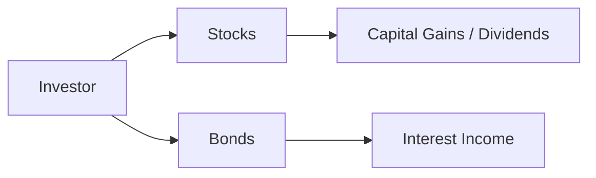
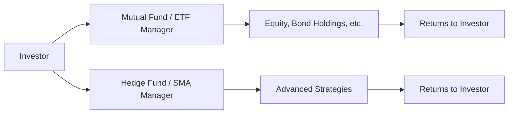

## 18.2 Individual Securities or Managed Products?

### Introduction
Determining whether to invest in individual securities or opt for managed products is one of the most significant decisions in portfolio construction. Canadian investors enjoy access to a wide range of options—including stocks, bonds, and a variety of managed accounts or funds. Each approach carries unique benefits, costs, and requirements for expertise. The final choice often depends on your client’s objectives, risk tolerance, and capacity for ongoing portfolio maintenance.

### Individual Securities

Investing in individual securities involves directly owning stocks, bonds, or other instruments. This approach is well-suited to investors who want full control and transparency over their holdings but comes with a higher responsibility for research and monitoring.

#### Key Advantages
1. **Greater Control**  
   - By selecting each security, investors have the flexibility to tailor their portfolio according to specific objectives or constraints. For example, if a client strongly believes in the growth potential of Canadian technology companies, they can overweight holdings in that sector.  
   - Each security can be bought or sold independently, making it easier to implement customized tax strategies, such as tax-loss harvesting at the security level.

2. **Transparency**  
   - Direct ownership makes it straightforward to see exactly which companies or government entities you are invested in.  
   - Investors can review performance, fees, dividends, and corporate actions on a security-by-security basis.

3. **Potential Cost Savings**  
   - Portfolio management fees can be reduced or eliminated in some situations.  
   - For larger portfolios, the management expense ratio (MER) on funds may exceed the brokerage and administrative costs associated with holding individual securities. High-net-worth clients in Canada often negotiate lower trading commissions with major brokerages like RBC Direct Investing, TD Direct Investing, or BMO InvestorLine.

#### Potential Disadvantages
1. **Time and Expertise**  
   - Individual security selection demands deep knowledge of markets, industries, and fundamentals.  
   - Active monitoring is crucial to manage risks and seize potential opportunities, which can prove challenging for busy investors or those lacking financial background.

2. **Concentration Risks**  
   - If a small number of stocks constitutes the bulk of the portfolio, underperformance of a single company or sector may significantly reduce overall returns.  
   - Proper diversification requires holding multiple securities across asset classes, which can add complexity.

3. **Transaction Costs**  
   - Frequent trading can erode returns via brokerage fees, bid-ask spreads, and short-term market fluctuations.  
   - Investors should note that while many Canadian brokerages have introduced lower commission structures, these fees still add up, especially with frequent trading activity.

*Diagram Explanation:*  
The above simple flowchart shows direct investment in individual securities—primarily stocks and bonds. Capital gains, dividends, and interest are received directly by the investor. However, coordinating research and monitoring each position can be demanding.

### Managed Products

Managed products bundle investments under professional oversight. They generally provide instant diversification and professional management, which can be especially beneficial if an investor lacks the confidence or time to manage a portfolio of individual securities.

#### Mutual Funds
- Pooled investments managed by professional portfolio managers.  
- Provide diversification across asset classes, such as equities or fixed income.  
- In Canada, mutual funds operate under National Instrument 81-102, which details regulations around fees, distribution, and reporting.  
- Mutual funds issue a “Fund Facts” document that summarizes fees, objectives, and historical performance, as required by Canadian regulation.

#### Exchange-Traded Funds (ETFs)
- Can be bought or sold throughout the trading day on an exchange, providing liquidity and price transparency.  
- Often track a broad market index (e.g., S&P/TSX Composite) or invest based on a specific factor (e.g., low volatility).  
- Helpful for cost-efficient broad diversification and generally lower MERs than many mutual funds.

#### Separately Managed Accounts (SMAs) or Wrap Programs
- Professional portfolio managers tailor portfolios to each client’s requirements, such as risk tolerance or income needs.  
- Carry higher minimum investment thresholds, making them more common among high-net-worth individuals or institutional investors such as Canadian pension funds.  
- “Wrap” programs often charge a single comprehensive fee that covers advisory, trading, and administrative costs.

#### Hedge Funds
- Employ diverse strategies (e.g., short selling, leverage, derivatives) to seek absolute returns.  
- Often subject to fewer disclosure requirements, making robust due diligence crucial.  
- Suitable primarily for sophisticated, accredited investors who can handle higher risk exposure and potential illiquidity.

#### Discretionary vs. Non-Discretionary Managed Accounts
- **Discretionary Managed Accounts:** The advisor or portfolio manager has the authority to make transactions without the client’s prior approval, enabling faster decisions.  
- **Non-Discretionary Managed Accounts:** Every transaction requires client confirmation, allowing more control but with potential delays in execution.

*Diagram Explanation:*  
This chart illustrates how funds or separate account managers pool investor resources, deploy them into specific strategies, and deliver aggregated returns to the investor. Portfolio managers handle research, security selection, and ongoing management.

### Suitability, Costs, and Disclosure

Deciding between individual securities and managed products often boils down to factors such as the investor’s sophistication, available time, and portfolio size.

1. **Aligning with Client Needs**  
   - For novice or busy investors, a low-cost ETF may be a better match than a DIY approach of managing 50 individual stocks.  
   - Conversely, a knowledgeable investor might prefer the flexibility and tax advantages offered by holding individual securities directly, especially for larger portfolios.

2. **Ongoing Fee Structures**  
   - Compare management fees, performance fees, sales charges (e.g., front-end or back-end loads), and trailing commissions.  
   - In Canada, the Fund Facts or ETF Facts documents mandated by CIRO (formerly regulated by MFDA or IIROC, now unified) articulate fees clearly.

3. **Disclosure Requirements**  
   - Regulatory rules make it mandatory to provide disclosure documents (e.g., Fund Facts, ETF Facts) describing fees, performance, and investment objectives.  
   - These disclosures help ensure Canadians understand the total cost of ownership, as well as the underlying risks.

### Important

- **CIRO as Current Regulator:** The Canadian Investment Regulatory Organization, or CIRO, is the single self-regulatory body overseeing investment dealers, mutual fund dealers, and market integrity in Canada. (MFDA and IIROC are now defunct predecessors.)  
- **CIPF Coverage:** The Canadian Investor Protection Fund (CIPF) protects investors in the event that a member firm becomes insolvent. CIPF is independent of CIRO.

### Best Practices and Common Pitfalls

- **Diversify Adequately:** Whether opting for individual securities or managed products, ensure that your portfolio spans different industries, regions, and asset classes.  
- **Monitor Fee Structures:** MERs and commission rates significantly impact net returns. Periodically review them and negotiate fees if possible.  
- **Assess Liquidity:** Some hedge funds or certain SMAs may impose lock-up periods or redemption schedules. Verify that liquidity constraints align with your investment timeframe.  
- **Stay Informed About Regulation:** National Instrument 81-102 sets out requirements for mutual funds in Canada. Updates and interpretative guidance from CIRO may directly affect product offerings and disclosure rules.

### Step-by-Step Approach for Managing Both Strategies in Canada

1. **Set Clear Goals and Constraints**  
   - Define investment objectives, including time horizon, risk tolerance, and income vs. growth requirements.  
   - Consider any tax considerations specific to provinces, since tax rates vary across Canada and capital gains can be handled differently under certain provincial regimes.

2. **Choose an Investment Vehicle**  
   - If you or your client has specialized knowledge and enough time to manage positions, individual securities can be advantageous.  
   - If time is limited, or if simplicity and diversification are priorities, evaluate suitable mutual funds or ETFs.

3. **Conduct Due Diligence**  
   - For individual securities, examine corporate financials, sector outlook, and macroeconomic factors.  
   - For managed products, review the fund’s prospectus, MER, historical performance, and overall strategy.

4. **Leverage Professional Advice**  
   - Consult with a qualified wealth advisor who is licensed under CIRO’s regulatory framework.  
   - Advisors can help ensure compliance with Know-Your-Client (KYC) and suitability requirements, as well as integrate estate or tax planning.

5. **Implement and Monitor**  
   - Revisit holdings periodically. Even managed products require monitoring to confirm they align with evolving financial goals or market conditions.  
   - Rebalance an individual security portfolio or consider switching a managed product if performance lags or objectives shift.

### Real-World Canadian Examples

- **Canadian Pension Funds:** Many large plans (e.g., CPP Investments, Ontario Teachers’ Pension Plan) use both direct investments (individual securities in infrastructure, private equity, or real estate) and managed accounts (specialized hedge fund or private equity partnerships).  
- **Major Banks Offering SMAs & Wrap Programs:** RBC, TD, and BMO each provide discretionary and non-discretionary wrap solutions. These programs often cater to high-net-worth clients, combining multiple asset classes with a single fee.  
- **Cost Control Example:** An investor looking to replicate the S&P/TSX Composite index might opt for a low-cost ETF from a provider such as BlackRock (iShares) or Vanguard Canada. By doing so, they reduce transaction costs relative to buying dozens of stocks individually.

### Additional Resources
- **National Instrument 81-102** – Mutual Funds (https://www.osc.ca/)  
- **CIRO** – Canada’s self-regulatory organization (https://www.ciro.ca/)  
- **SEDAR** – Public fund filings and disclosures (note: transitioning to the new system)  
- **Recommended Reading:**  
  - “Wealth Management Essentials®” from the Canadian Securities Institute (CSI)  
  - “The Intelligent Investor” by Benjamin Graham  
  - Various open-source financial modeling tools (e.g., Python libraries for financial analysis)

### Summary
Choosing between individual securities or managed products hinges on factors such as investor expertise, desired level of involvement, fee tolerance, and the need for diversification. In Canada, regulators emphasize transparency, suitability, and robust disclosure through mechanisms like Fund Facts and ETF Facts. For most investors, a blended approach—holding some individual securities for customization while also diversifying through ETFs or mutual funds—can be an efficient way to balance control and convenience.

---

## Test Your Knowledge: Securities vs. Managed Products in Canada



### Which of the following is an advantage of investing in individual securities?
- [x] Greater control over each investment decision.  
- [ ] Reduced necessity for ongoing research.  
- [ ] Elimination of volatility risk.  
- [ ] Guaranteed lower transaction costs.  

> **Explanation:** Individual security ownership grants a higher level of control and customization, but it also requires more research and offers no guarantee on transaction costs or volatility.

### Which type of managed product trades on an exchange and can be purchased or sold throughout the trading day?
- [ ] Mutual Funds  
- [x] ETFs  
- [ ] Hedge Funds  
- [ ] GICs  

> **Explanation:** ETFs, or Exchange-Traded Funds, trade on an exchange and thus provide liquidity and intraday pricing.

### What is a common regulatory requirement for mutual funds in Canada?
- [ ] They must be managed exclusively by banks.  
- [x] They must issue a “Fund Facts” document outlining fees and performance.  
- [ ] They must invest solely in equities.  
- [ ] They must keep a fixed 20% of assets in Canadian bonds.  

> **Explanation:** National Instrument 81-102 requires mutual funds to provide a Fund Facts document that clearly discloses fees, risks, and performance.

### In the context of Canadian investing, which body currently regulates both investment dealers and mutual fund dealers following the amalgamation of MFDA and IIROC?
- [ ] CSA  
- [x] CIRO  
- [ ] OSFI  
- [ ] GICB  

> **Explanation:** The Mutual Fund Dealers Association (MFDA) and the Investment Industry Regulatory Organization of Canada (IIROC) merged to form the Canadian Investment Regulatory Organization (CIRO).

### Which of the following represents a primary benefit of a discretionary managed account?
- [x] Timely decision-making by the portfolio manager without waiting for client approval.  
- [ ] Absolutely no management fees.  
- [x] Benefit from professional oversight in day-to-day trading.  
- [ ] A guaranteed outperformance of the benchmark.  

> **Explanation:** Discretionary authority lets a manager buy or sell securities quickly. There is no guarantee it will outperform benchmarks, but professional day-to-day oversight can be beneficial.

### What is a Separately Managed Account (SMA)?
- [x] A personalized portfolio managed by a professional on behalf of a client.  
- [ ] A guaranteed investment certificate (GIC).  
- [ ] A type of principal-protected note.  
- [ ] A standard chequing account with limited transaction fees.  

> **Explanation:** SMAs provide tailored asset allocation and security selection for a single client’s needs, usually requiring a higher minimum investment.

### Which is NOT commonly listed as an advantage of individual stock investing?
- [ ] Potential cost savings for larger portfolios.  
- [x] Elimination of the need for research or monitoring.  
- [ ] Transparent holdings.  
- [ ] Greater customization.  

> **Explanation:** Holding individual stocks usually requires substantial research and monitoring, so assuming it eliminates the need for research is incorrect.

### One disadvantage of investing in managed products could be:
- [x] Subjecting the investor to ongoing MERs or performance fees.  
- [ ] Reduced ability to diversify across multiple markets.  
- [ ] Enhanced direct control over security selection.  
- [ ] Lack of professional management.  

> **Explanation:** Managed products typically charge fees for professional services, which can reduce net returns and require scrutiny from investors.

### National Instrument 81-102 primarily governs:
- [x] Mutual funds in Canada.  
- [ ] Real estate investments only.  
- [ ] Hedge funds worldwide.  
- [ ] Options trading strategies.  

> **Explanation:** National Instrument 81-102 sets standards for Canadian mutual funds, describing how they must operate and disclose information.

### Is it possible for a high-net-worth individual to combine both individual securities and managed products in a single, holistic portfolio approach?
- [x] True  
- [ ] False  

> **Explanation:** Many investors blend direct ownership of certain stocks or bonds (for custom strategies) with broader investments through mutual funds, ETFs, or SMAs for diversification and professional management.


