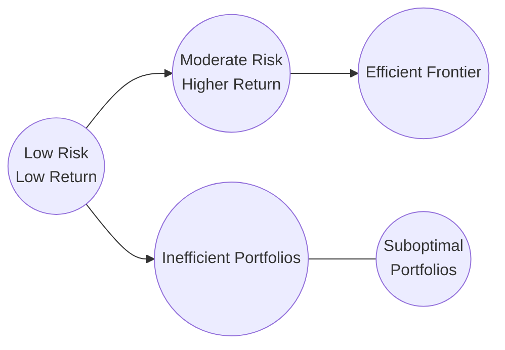

## 18.3 Portfolio Theory

Portfolio Theory underpins many of the strategies that wealth managers and financial advisors employ to construct suitable investment portfolios. This section explores key elements of Modern Portfolio Theory (MPT) and the Capital Asset Pricing Model (CAPM), highlighting the importance of diversification and correlation, and presenting practical considerations for Canadian investors. By reviewing these foundational concepts and examining important constraints, you can learn how to better align portfolios with client objectives, risk tolerances, and Canadian regulatory frameworks.

---

## Modern Portfolio Theory (MPT)

Modern Portfolio Theory was pioneered by Harry Markowitz in his seminal 1952 paper “Portfolio Selection.” Markowitz introduced a systematic way of evaluating portfolios by balancing expected returns with the associated risk, measured by variance or standard deviation. His work established the basis for how investors might structure a portfolio to optimize returns for an acceptable level of risk.

### Harry Markowitz’s Framework

- Rational investors aim to maximize returns for a given risk level.  
- Portfolios should include securities that exhibit low correlation with each other to reduce overall risk.  
- Combining assets with different return drivers, such as equities and bonds, can diminish the impact of one asset class performing poorly.

Markowitz proposed that, rather than focusing solely on individual security returns, investors should prioritize how each security contributes to a portfolio’s overall variance. In other words, the individual risk of each position is overshadowed by how the positions move relative to one another.

### Efficient Frontier

The Efficient Frontier is a concept that arises directly from Markowitz’s work. It comprises portfolios that offer the highest expected return for each level of risk. If a portfolio lies below this frontier curve on a risk–return graph, it is considered suboptimal because it can be improved by either:

1. Increasing expected returns for the same level of risk, or  
2. Reducing the level of risk for the same expected returns.

Below is a simplified illustration of the concept in a Mermaid diagram:

In this diagram:  
- Nodes A and B represent two different portfolio risk–return profiles.  
- Node C (the Efficient Frontier) illustrates the ideal set of portfolios.  
- Node D and X indicate inefficient portfolios, which lie below the frontier.

### Risk–Return Trade-Off

Under MPT, the trade-off between risk and return is paramount. Risk is commonly measured via standard deviation (σ) or variance (σ²). As risk increases, so should the expected return:

- **High Risk, High Return (e.g., small-cap equities, venture capital).**  
- **Low Risk, Low Return (e.g., Government of Canada Treasury Bills).**

Balancing this trade-off is central to constructing portfolios that can meet clients’ objectives within acceptable risk parameters.

---

## Capital Asset Pricing Model (CAPM)

The Capital Asset Pricing Model (CAPM) provides a framework to determine the expected return on a security or portfolio, relative to its market risk. It builds on the relationship between systematic risk and the required rate of return.

### Formula and Inputs

CAPM states:

$$
E(R_i) = R_f + \beta_i \bigl[E(R_m) - R_f\bigr]
$$

Where:  
- \\( E(R_i) \\) is the expected return of security \\( i \\).  
- \\( R_f \\) is the risk-free rate (commonly proxied by Government of Canada T-Bills).  
- \\( E(R_m) \\) is the expected return on the market portfolio (e.g., S&P/TSX Composite Index).  
- \\( \beta_i \\) is a measure of the security’s sensitivity to the market.

### Interpreting Beta

- **\\(\beta > 1\\):** The security is more volatile than the market and is expected to provide higher returns (with higher risk).  
- **\\(\beta = 1\\):** The security moves in line with the broader market.  
- **\\(\beta < 1\\):** The security is less volatile than the market, offering potentially lower returns but also lower risk.

In a Canadian context, major banks such as RBC and TD often have betas close to 1 because they comprise a significant portion of the S&P/TSX Composite Index. High-growth technology stocks found on the TSX Venture Exchange may have betas well above 1.

---

## Diversification and Correlation

### Correlation Measures

Correlation (\\(\rho\\)) quantifies how two assets move relative to each other. It ranges from \\(-1\\) to \\(+1\\):

- **\\(\rho = +1\\):** Perfect positive correlation (assets move in lockstep).  
- **\\(\rho = 0\\):** No linear relationship.  
- **\\(\rho = -1\\):** Perfect negative correlation (assets move in opposite directions).

MPT demonstrates that portfolios combining weakly or negatively correlated assets can reduce overall volatility more effectively than portfolios comprising closely correlated assets.

### Systematic vs. Unsystematic Risk

- **Systematic Risk:** Market-wide risk (e.g., interest rate changes, recessions) that cannot be fully diversified away. The CIRO requires advisors to ensure investors understand that even well-diversified portfolios may be affected by broad market events.  
- **Unsystematic Risk:** Security-specific or industry-specific risk (e.g., a mining company’s strike risk) that can be substantially mitigated through diversification.

In practice, large Canadian pension funds, like Ontario Teachers’ Pension Plan, demonstrate the power of systematic vs. unsystematic risk management by holding a globally diversified portfolio across equities, fixed income, real estate, and infrastructure.

---

## Practical Considerations

### Real-World Constraints

Even the most mathematically sound portfolio constructions face real-life constraints:

- **Tax Implications:** In Canada, capital gains are taxed at 50% of the gain (added to income). Interest income is taxed at the investor’s marginal rate, making the after-tax returns of different asset classes vary significantly.  
- **Liquidity:** Clients may require short-term access to funds, which can influence the need for more liquid assets like Treasury Bills or high-grade corporate bonds.  
- **Transaction Costs:** Commissions, bid–ask spreads, and currency conversion fees affect the practicality of frequent rebalancing.  
- **Client Preferences:** Responsible or sustainable investing mandates (ESG criteria) may limit certain investments.  

### Behavioral Biases

Despite thorough theoretical models, investor behavior can deviate from rational assumptions:

- **Loss Aversion:** Clients may sell too quickly when markets dip.  
- **Overconfidence:** Leads to concentrated portfolios.  
- **Herd Behavior:** Clients might follow market trends indiscriminately (e.g., technology stock booms).

Acknowledging these biases and educating clients can help minimize detrimental investment decisions.

### Implementation in Advisor Practice

Many Canadian financial institutions, including RBC Dominion Securities, BMO Nesbitt Burns, and TD Wealth, utilize robust portfolio analytics tools to apply MPT principles:

1. **Establish Risk Tolerance:** Gather detailed client information in accordance with CIRO’s “Know Your Client” requirements.  
2. **Identify Efficient Portfolios:** Use software libraries like “PortfolioAnalytics” (R) or “pyPortfolioOpt” (Python) to construct the efficient frontier.  
3. **Account for Unique Constraints:** Incorporate tax strategies, liquidity needs, or ESG preferences.  
4. **Review and Rebalance:** Periodically re-evaluate allocations in response to market conditions or client life changes.

**Tip:** Many advisors develop straightforward educational materials to help clients visualize and grasp the rationale behind diversification.

---

## Glossary

- **Efficient Frontier:** A curve representing portfolios that maximize expected return for a given level of risk.  
- **Correlation (\\(\rho\\)):** A measure of how two securities move in relation to each other.  
- **Systematic Risk:** Also known as market risk; cannot be fully diversified away. Examples include global recessions or major interest rate shifts.  
- **Unsystematic Risk:** Company or industry risk, which can be reduced through diversification.  
- **Beta (\\(\beta\\)):** The volatility of a security relative to the overall market.  
- **Risk-Free Rate (\\(R_f\\)):** The hypothetical rate of return on an investment with zero risk, often proxied by short-term government securities.

---

## Additional References and Resources

- **CIRO**: [https://www.ciro.ca](https://www.ciro.ca) – Includes guidelines on client disclosure, performance reporting, and suitability.  
- **Canadian Securities Administrators**: [https://www.securities-administrators.ca](https://www.securities-administrators.ca) – Regulatory updates, such as risk classification for mutual funds (e.g., National Instrument 81-102 or related instruments).  
- **Quantitative Tools**:  
  - “PortfolioAnalytics” (R) library  
  - “pyPortfolioOpt” (Python) library  
- **Recommended Reading**:  
  - “Modern Portfolio Theory and Investment Analysis” by Edwin J. Elton, Martin J. Gruber, et al.  
  - “A Random Walk Down Wall Street” by Burton G. Malkiel  

---

## Summary and Next Steps

Modern Portfolio Theory remains immensely influential in shaping how advisors help clients allocate capital among different asset classes. Combining MPT with the insight from CAPM, clarity on diversification, and a “real-world check” against constraints like taxes, liquidity, and investor psychology can lead to well-structured and resilient Canadian portfolios.

Moving forward, consider these action items:

- Review your clients’ asset allocations to see how they align with the Efficient Frontier.  
- Evaluate if behavioral biases are affecting decision-making.  
- Stay current on CIRO, CSA, and CRA guidelines to balance regulatory compliance with optimal portfolio practices.  

Embracing portfolio theory with practical constraints in mind can help investors meet their goals while managing risk prudently in the Canadian market environment.

---

## Master Your Portfolio Theory Knowledge: Comprehensive Quiz



### 1. Which statement best describes the fundamental idea behind Harry Markowitz’s Modern Portfolio Theory?

- [x] Investors should diversify across low-correlation assets to maximize returns for a given level of risk.  
- [ ] Investors should pick only the highest-yield securities regardless of volatility.  
- [ ] It is always best to invest in zero-risk assets.  
- [ ] MPT requires only a single asset class for optimal portfolios.  

> **Explanation:** Markowitz showed that combining assets with low correlation can help minimize variance and achieve higher returns for a given risk level.

---

### 2. Which of the following portfolios is considered suboptimal in the context of MPT?

- [ ] A portfolio lying on the Efficient Frontier.  
- [ ] A portfolio that exactly meets a client’s risk tolerance and return target.  
- [x] A portfolio that lies below the Efficient Frontier.  
- [ ] A portfolio consisting of both stocks and bonds.  

> **Explanation:** Portfolios below the frontier do not maximize returns for the level of risk undertaken and can thus be improved further.

---

### 3. In the CAPM formula, E(R_i) = R_f + β_i [E(R_m) – R_f], what does β_i represent?

- [x] The sensitivity of the security’s returns to the market’s returns.  
- [ ] The expected risk-free return.  
- [ ] The market’s overall volatility.  
- [ ] The portfolio’s average correlation.  

> **Explanation:** Beta measures how much a security’s returns vary with the overall market.

---

### 4. Which of the following correctly distinguishes systematic risk from unsystematic risk?

- [x] Systematic risk affects the entire market and cannot be eliminated by diversification. Unsystematic risk is company-specific and can be mitigated by diversification.  
- [ ] Systematic risk applies only to fixed income, whereas unsystematic risk applies only to equities.  
- [ ] Systematic risk is irrelevant to investment returns.  
- [ ] Systematic risk can be entirely eliminated by holding multiple asset classes.  

> **Explanation:** Systematic risk is market-wide; unsystematic risk is specific to an issuer or sector.

---

### 5. In a Canadian context, which of the following statements regarding taxes is correct?

- [x] Interest income is fully taxable at the marginal rate, while only 50% of capital gains is added to taxable income.  
- [ ] Dividends are fully taxable at the marginal rate with no credits.  
- [x] Certain capital gains can be 100% tax-free.  
- [ ] Capital losses can never offset capital gains.  

> **Explanation:** In Canada, interest income is fully taxed, whereas only 50% of realized capital gains is added to an individual’s income. Eligible Canadian dividends are taxed with a dividend tax credit, and certain exemptions may apply.

---

### 6. Why is correlation important when selecting assets for a portfolio?

- [x] Low or negative correlations among assets help reduce overall portfolio volatility.  
- [ ] High correlations ensure that all assets move in the same direction.  
- [ ] Correlation only matters for international markets.  
- [ ] Correlation is used exclusively to rank stocks.  

> **Explanation:** Correlation measures how asset returns move together. Diversifying among uncorrelated or negatively correlated assets helps reduce portfolio risk.

---

### 7. Which of the following is the best example of systematic risk for a Canadian investor?

- [x] A nationwide increase in interest rates set by the Bank of Canada.  
- [ ] A labour strike within a single mining company.  
- [x] A court ruling affecting only one real estate project.  
- [ ] A new competitor entering a niche industry.  

> **Explanation:** Systematic risk includes factors that impact the entire market or economy, such as broad monetary policy changes.

---

### 8. Under CAPM, if a security’s β = 1.5 with the market risk premium at 5% and the risk-free rate at 2%, what is the expected return?

- [x] 9.5%  
- [ ] 10.0%  
- [ ] 7.5%  
- [ ] 4.0%  

> **Explanation:** E(R_i) = 2% + 1.5 × (5%) = 2% + 7.5% = 9.5%.

---

### 9. Which of these is a real-world constraint that may cause a theoretically optimal portfolio to be adjusted?

- [x] Transaction costs and liquidity requirements.  
- [ ] The assumption that all investors are risk-loving.  
- [ ] The belief that capital gains are tax-free.  
- [ ] The presumption that markets never fluctuate.  

> **Explanation:** Real-world constraints such as liquidity needs, transaction fees, and taxes often necessitate adjustments to purely theoretical (MPT-derived) portfolios.

---

### 10. True or False: Behavioral biases like loss aversion can cause clients to deviate from the strategies suggested by Modern Portfolio Theory.

- [x] True  
- [ ] False  

> **Explanation:** Emotions such as loss aversion can lead clients to make decisions contrary to MPT’s rational assumptions, such as selling at market lows or avoiding rebalancing.




