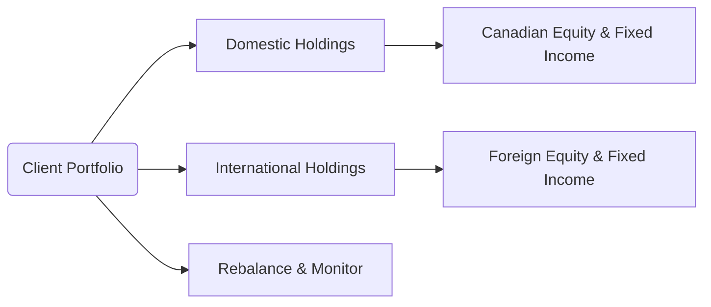

## 18.4 International Investing

International Investing is a vital aspect of portfolio management, particularly in today’s globalized economy. For Canadian investors, expanding beyond domestic markets can unlock new sources of returns and mitigate risk through broader diversification. However, cross-border investing also introduces currency, political, and regulatory complexities that must be addressed. This section explains the rationale for global diversification, key risks and considerations, common approaches to accessing foreign markets, and practical ways to incorporate international holdings into client portfolios.  

---

## Rationale for Global Diversification

### Expanded Opportunity Set

One of the primary motivations for international investing is accessing markets that may display stronger or more rapid growth than Canada’s domestic market. Emerging markets, particularly in Asia and Latin America, can experience higher growth rates driven by population trends, technological advancement, and industrial expansion.

• Many Canadian pension funds, including the Canada Pension Plan Investment Board (CPPIB) and Ontario Teachers’ Pension Plan, allocate a significant portion of their assets to international equities and bonds. By doing so, they tap into diverse growth opportunities not available in Canada alone.  
• Canadian retail investors can follow a similar approach through either direct foreign securities or investing in global funds (e.g., ETFs) to benefit from these global growth trends.

### Diversification Benefits

Because correlations between countries can be lower compared to correlations within a single market, a global portfolio may help smooth out returns. When one region’s economy faces a slowdown, another might be experiencing expansion. A well-structured global allocation can therefore improve overall risk-adjusted returns.

• An investor holding Canadian bank stocks (e.g., RBC, TD, BMO) combined with emerging market sectors (e.g., technology or consumer sectors in Asia) might see lower volatility versus holding only Canadian financial sector equities.

### Currency Exposure

Investing internationally also provides exposure to foreign currencies. If the Canadian dollar weakens against another currency, foreign holdings can become more valuable in CAD terms. Conversely, if the Canadian dollar strengthens, foreign positions may lose value on a currency translation basis.  

• In some years, currency fluctuations have played a substantial role in Canadian investors’ returns. While these swings can be beneficial, they can also introduce considerable risk.

---

## Risks and Considerations in Cross-Border Investments

### Currency Risk

Foreign exchange rates can change abruptly, affecting the realized returns of international investments. To mitigate or eliminate the effect of exchange rate fluctuations, investors may use:

- Currency Hedged ETFs: These funds use derivatives to minimize currency exposure.  
- Forward Currency Contracts: A forward contract locks in the exchange rate for a specific future date.  
- Options and Futures: Additional avenues for hedging, though more complex.

#### A Simple Formula

If your foreign investment returns $R_\text{foreign}$ in its local currency, and the currency moves by $\Delta \text{FX}$ relative to the Canadian dollar, your approximate return in Canadian dollars ($R_\text{CAD}$) can be expressed as:

$$
R_\text{CAD} = (1 + R_\text{foreign}) \times (1 + \Delta \text{FX}) - 1
$$

A +5% gain in the foreign security combined with a +3% appreciation in that foreign currency against the CAD would yield a total approximate return of (1.05 × 1.03) – 1 = 8.15% in Canadian dollar terms.

### Political and Economic Factors

Cross-border investments are more exposed to international political dynamics, including:

- Changes in government policies, such as increased taxation on foreign investors.  
- Sudden regulatory shifts affecting market access or corporate earnings.  
- Trade embargos and geopolitical tensions, which can alter growth forecasts or sentiment.

### Legal and Tax Considerations

Each country has distinct rules regarding:

- Withholding taxes on dividends or interest income.  
- Capital controls limiting money flows in or out of the country.  
- Reporting standards (e.g., IFRS vs. local GAAPs).  
- Canadian-specific issues like filing a T1135 form when foreign property meets or exceeds prescribed thresholds.  

Canadian advisors must be mindful of compliance with CIRO regulations, the Canada Revenue Agency (CRA) guidelines, and any additional cross-border requirements.

---

## Approaches to International Investing

### Direct Equity or Bond Purchases

Investors can purchase foreign-listed securities via a global brokerage platform. Some Canadian discount brokerages (e.g., RBC Direct Investing, TD Direct Investing) offer access to global exchanges.  

- This approach can give you precise control over security selection (buying specific stocks, corporate or government bonds).  
- Investors accept higher complexity for currency conversions, settlement timelines, and ongoing research across multiple jurisdictions.

### Global Mutual Funds or ETFs

For many Canadian individuals, a simpler option is to invest in global mutual funds or ETFs:

- These funds provide exposure to dozens or hundreds of international securities, spreading risk among multiple countries.  
- Global ETFs can be region-specific (e.g., Asia-Pacific) or broader (e.g., developed markets, emerging markets).  
- Management fees and hedging strategies vary, so investors should review fund objectives, costs, and any embedded currency exposures.

### American Depositary Receipts (ADRs)

ADRs are U.S.-listed receipts representing shares of foreign companies. They simplify cross-border investing by allowing Canadians (and U.S. investors) to trade shares on a familiar U.S. exchange.  

- ADRs settle in U.S. dollars, which means Canadians still face CAD/USD exchange considerations.  
- A wide range of foreign firms list ADRs, including major European, Asian, and Latin American corporations.

### Global Balanced Funds

Some funds combine international equities and international fixed-income securities under one umbrella. This allows for built-in diversification across regions and asset classes.  

- Adding international bonds can be particularly effective when correlated differently from Canadian or U.S. debt.  
- Global balanced funds often feature professional managers continually adjusting country and sector allocations.

---

## Implementation in Client Portfolios

### Determining Allocations

The proportion of international holdings in a Canadian client’s portfolio should reflect:

1. Risk Tolerance: Investors comfortable with higher volatility may allocate more to emerging markets.  
2. Investment Horizon: Longer timeframes often justify more international exposure, given the potential for currency and geopolitical fluctuations to even out over time.  
3. Diversification Objectives: Consider how existing holdings correlate with global positions.

### Ongoing Monitoring

After incorporating global assets:

- Track key political events (e.g., elections, trade disputes) and economic indicators (GDP growth, inflation).  
- Assess relative valuations: Are equity markets abroad overpriced or undervalued compared to domestic benchmarks?  
- Reevaluate currency markets to determine if hedging strategies need adjusting.  
- Monitor how correlations between current holdings and foreign assets shift over time.

**Diagram Explanation**: This Mermaid flowchart illustrates how a typical Canadian client portfolio splits between domestic and international holdings. Ongoing monitoring and rebalancing keep the overall asset mix aligned with the client’s objectives.

### Reporting Requirements

Canadian tax rules stipulate additional filings for certain foreign investments. For instance, individuals and trusts must complete the T1135 form if they hold specified foreign property with a total cost of more than CAD 100,000. Failing to file properly may trigger significant penalties.

- Ensure compliance with CRA guidelines for foreign income reporting.  
- Consult CIRO-approved guidance for any additional disclosure or compliance requirements.  
- Avoid pitfalls by engaging an accountant or a qualified tax specialist when dealing with more complex structures.

---

## Glossary

- **Emerging Markets**: Countries with developing but fast-growing economies, potentially offering higher returns at the cost of elevated political and market risk.  
- **ADR (American Depositary Receipt)**: A U.S.-listed certificate representing shares of a foreign company, allowing investor access to foreign equity via U.S. markets.  
- **Currency Hedging**: Strategies using financial derivatives (e.g., forwards, futures, options) to reduce or eliminate the impact of exchange rate fluctuations on investment returns.  
- **T1135 Form (Canada)**: A CRA-mandated tax form for reporting foreign property if the total cost of foreign assets meets or exceeds specified thresholds.

---

## References and Additional Resources

• [Canada Revenue Agency (CRA)](https://www.canada.ca/en/revenue-agency.html) – Official guidelines for tax treatment of foreign investments, including instructions for T1135.  
• [Bank of Canada](https://www.bankofcanada.ca/) – Official exchange rates and economic reports that guide currency-related decisions.  
• [CIRO](https://www.ciro.ca) – Canada’s self-regulatory organization (SRO) overseeing mutual fund dealers, investment dealers, and marketplace integrity.  
• [International Monetary Fund (IMF)](https://www.imf.org/) and [World Bank](https://www.worldbank.org/) – Global economic indicators, reports, and research on international markets.  
• “International Investments” by Bruno Solnik and Dennis McLeavey – Advanced reading on theory and practice of global investing.  
• [Morningstar.ca](https://www.morningstar.ca) – Fund comparisons and analytical research, including global mutual funds and ETFs.  
• [Statista.com](https://www.statista.com/) – Statistical data on global economies, industries, and market trends.

---

## Key Takeaways

• International investing expands opportunity sets, enhances diversification, and grants exposure to different currencies.  
• Canadian investors must navigate currency risk, political changes, and distinct tax and legal frameworks.  
• Options for cross-border investing range from direct securities purchases to global mutual funds, ETFs, and ADRs.  
• Selecting the right allocation and consistently monitoring international positions are essential for optimizing risk-adjusted returns.  
• Understanding tax requirements (such as T1135) and following CIRO regulations help ensure compliance.

By integrating these insights into your practice, you can better guide clients toward global investment opportunities that align with their goals and tolerance for international market volatility.  

---

## Test Your Knowledge: International Investing in Canadian Portfolios



### Which of the following is a key benefit of global diversification for Canadian investors?

- [x] Access to markets that may have different or faster growth than Canada.
- [ ] Avoiding all currency exchange risk.
- [ ] Guaranteeing lower volatility in all market conditions.
- [ ] Exempting the need to file Canadian tax forms.

> **Explanation:** Global diversification expands the investor’s set of opportunities, potentially exposing them to faster-growing or differently performing markets. Although it can help reduce overall portfolio volatility, it does not completely remove risk nor eliminate Canadian tax obligations.

---

### When investing in foreign markets, which risk refers to fluctuations in exchange rates that affect realized returns for Canadian investors?

- [ ] Regulatory risk
- [x] Currency risk
- [ ] Liquidity risk
- [ ] Country risk

> **Explanation:** Currency risk arises from changes in exchange rates between the Canadian dollar and foreign currencies, influencing the final CAD value of an investment.

---

### Which statement correctly describes American Depositary Receipts (ADRs)?

- [ ] They are Canadian government bonds sold in global markets.  
- [x] They represent shares of foreign companies but trade in U.S. markets.  
- [ ] They are mutual funds focused solely on European equities.  
- [ ] They are futures contracts to hedge currency movements.

> **Explanation:** ADRs are certificates that allow investors to trade foreign stocks on U.S. exchanges in U.S. dollars, simplifying cross-border equity investing.

---

### What is one common approach to mitigate currency risk in international portfolios?

- [x] Using currency-hedged ETFs or forward contracts.  
- [ ] Avoiding foreign investments entirely.  
- [ ] Investing in strictly domestic equities.  
- [ ] Holding only emerging market stocks.

> **Explanation:** Currency-hedged ETFs or forward contracts can help reduce or eliminate the impact of currency fluctuations on a portfolio, enabling investors to focus on the underlying asset performance.

---

### Which of the following would be the best example of an ongoing monitoring process for a globally diversified portfolio?

- [ ] Ignoring currency exchange rate movements for the next five years.  
- [x] Tracking political events, currency trends, and correlation changes among assets.  
- [ ] Excluding emerging markets because they are inherently riskier.  
- [ ] Liquidating all foreign positions when the Canadian dollar is strong.

> **Explanation:** Ongoing monitoring involves reviewing macroeconomic conditions, political risks, and correlations between holdings, ensuring the portfolio remains aligned with the client’s strategy.

---

### If a client’s foreign holdings exceed mandated CRA thresholds, they must complete which form?

- [ ] T4 Slip  
- [x] T1135  
- [ ] T5 Statement of Investment Income  
- [ ] T4A(P)

> **Explanation:** Canadian residents must file a T1135 form when they hold specified foreign property with a total cost amount above the CRA’s designated limit.

---

### Which of the following is a potential advantage of investing in global balanced funds for Canadian investors?

- [x] Access to both international equity and fixed-income in one product.  
- [ ] Full exemption from Canadian taxes on foreign gains.  
- [x] Professionally managed allocations across multiple asset classes.  
- [ ] No volatility risk.

> **Explanation:** Global balanced funds combine international equities and bonds, offering a managed, diversified approach. However, investors remain subject to taxes and volatility risks.

---

### What is the primary purpose of the term “Emerging Markets”?

- [ ] It refers to newly listed Canadian stocks.  
- [ ] It represents stable, developed countries with low risk.  
- [x] It identifies countries with developing economies and higher potential growth.  
- [ ] It labels markets within North America only.

> **Explanation:** Emerging markets are typically characterized by higher growth prospects but also greater risk due to political, regulatory, and market uncertainties.

---

### What Canadian regulatory body (as of 2025) oversees investment and mutual fund dealers after the amalgamation of MFDA and IIROC?

- [ ] IIROC  
- [ ] MFDA  
- [x] CIRO  
- [ ] OSFI

> **Explanation:** CIRO (the Canadian Investment Regulatory Organization) formed in 2023 by merging the MFDA and IIROC, becoming the primary SRO for investment and mutual fund dealers in Canada.

---

### True or False: Currency movements never impact the total return when a Canadian investor holds U.S.-based ADRs.

- [x] True
- [ ] False

> **Explanation:** Even though ADRs trade in U.S. dollars, there can be an additional layer of currency impact when converting U.S. dollars back into Canadian dollars. In this context, if an investor already considers the U.S. dollar as the base currency for their foreign credit, shifts can still influence the final CAD value. Hence, for Canadian investors, currency risk remains a factor.


