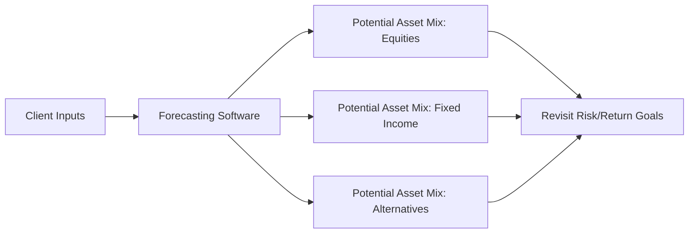

## 19.1 The Asset Allocation Process

Asset allocation is the cornerstone of successful portfolio construction. By distributing investments across different asset classes—such as equities, fixed income, cash equivalents, and alternatives—the goal is to optimize returns and manage risk in line with the investor’s financial objectives, time horizon, risk tolerance, and liquidity requirements. This section explores the principles, processes, and practical considerations involved in establishing and managing an asset allocation strategy within a Canadian context.

---

## The Importance of Asset Allocation

Modern Portfolio Theory (MPT) teaches us that asset allocation decisions can account for the majority of a portfolio’s performance variability over time—often cited in studies as having a greater impact than individual security selection. The main idea:
- A diversified allocation reduces reliance on any single asset class.  
- Different asset classes (e.g., equities vs. bonds) typically respond differently to market conditions.  
- Combining low- or negatively-correlated assets can help smooth out overall portfolio volatility.

### Canadian Example: Pension Funds
Canadian pension funds, such as the Ontario Teachers’ Pension Plan or the Canada Pension Plan Investment Board (CPPIB), are well-known for sophisticated asset allocation strategies. They often invest in traditional public equities and bonds, but also in alternative asset classes (e.g., infrastructure, private equity, and real estate) to enhance diversification, mitigate risk, and meet long-term obligations.

---

## Defining Client Objectives and Constraints

### 1. Identify Client Goals
The first step is determining what the portfolio should achieve for the client:
- Capital preservation (e.g., ensuring no significant losses).  
- Income generation (e.g., generating dividend or interest income).  
- Growth (e.g., aiming for higher capital appreciation over the long term).  

### 2. Understand the Client Profile
Gather detailed client data, including:
- Time Horizon: The client’s investment horizon can vary based on goals—short-term needs (e.g., saving for a down payment in two years) vs. long-term objectives (e.g., retirement in 20+ years).  
- Risk Tolerance: Use a formal risk assessment, following guidelines by the Canadian Investment Regulatory Organization (CIRO).  
- Liquidity Needs: Consider near-term cash requirements, such as covering expenses, unexpected emergencies, or planned outlays like tuition.  
- Net Worth and Cash Flow: Ensure that the asset allocation aligns with the client’s broader financial situation, factoring in assets, liabilities, and day-to-day cash flow.

### 3. Consider Unique Constraints
Clients may have specific constraints such as:
- Ethical or ESG (Environment, Social, Governance) preferences.  
- Regulatory restrictions (e.g., constraints on owning certain asset classes).  
- Concentration in specific securities (e.g., employee stock options).  

---

## Choosing Asset Classes

Once you understand client objectives and constraints, determine the mix of asset classes:

1. **Equities**  
   - Canadian equities may offer dividend tax credits and align with home-country bias (familiarity, currency matching).  
   - U.S. equities can provide global diversification and exposure to the world’s largest capital market.  
   - International and emerging markets may offer higher growth potential but come with increased volatility and currency considerations.

2. **Fixed Income**  
   - Government bonds (federal, provincial, or municipal) typically add stability and mitigate overall portfolio volatility.  
   - Corporate bonds may provide higher yields but also carry greater credit risk.  
   - T-bills and money market instruments can meet short-term liquidity requirements.

3. **Cash and Cash Equivalents**  
   - Useful for emergency funds and immediate cash needs, though typically offer minimal returns.  
   - Holding cash in high-interest savings accounts or GICs from Canadian banks (e.g., RBC, TD, or BMO) can reduce risk while retaining liquidity.

4. **Alternative Investments**  
   - Real estate (direct ownership, REITs) can offer stable income and growth potential with low correlation to equities.  
   - Hedge funds and private equity can generate absolute returns, albeit with higher fees, complexity, and limited liquidity.  
   - Commodities (e.g., energy, metals, agricultural products) may hedge against inflation but can be volatile.

---

## The Process of Constructing a Portfolio

A systematic approach to asset allocation typically includes:

1. **Risk Profiling and Objective Setting**  
   - Complete a formal risk questionnaire compliant with CIRO guidance.  
   - Incorporate both qualitative (e.g., comfort level) and quantitative (e.g., net worth, time horizon) factors.

2. **Strategic Asset Allocation**  
   - Establish long-term targets for each asset class.  
   - Use expected returns, volatility estimates, and correlation data.  
   - Consider tax-advantaged accounts (e.g., TFSAs, RRSPs) to optimize after-tax returns.

3. **Implementation**  
   - Select specific securities (e.g., stocks, bonds) or managed products (mutual funds, ETFs, segregated funds).  
   - Alternatively, employ direct indexing or robo-advisors to streamline investment processes.  
   - Example: RBC and TD offer robo-advisory platforms with model portfolios geared to different risk–reward profiles.

4. **Monitoring and Rebalancing**  
   - Regularly evaluate portfolio performance and compare against benchmarks.  
   - Rebalance to target weights when assets drift beyond predetermined thresholds.  
   - Consider tax implications (realize capital gains or losses) when conducting rebalancing.

5. **Review and Adjust**  
   - Life events (marriage, retirement, inheritance) or market changes (recession fears, regulatory updates) may require reallocation.  
   - Maintain open communication with clients to ensure alignment with goals and comfort levels.

---

## Technology and Human Oversight

### Robo-Advisors
Automated platforms, or robo-advisors, gather inputs like risk tolerance, time horizon, and investment goals to construct and rebalance portfolios algorithmically. While these solutions can be cost-effective and convenient:

- They rely on quantitative models that may oversimplify complex personal circumstances.  
- They provide quick, data-driven insights based on historical patterns, but they do not replace human judgment.  
- Continuous human oversight ensures the resulting allocations align with evolving market conditions and nuanced personal situations.

### Advanced Analytics and Optimization Tools
Portfolio optimization software can forecast potential outcomes for different asset mixes. Tools such as Portfolio Visualizer (portfoliovisualizer.com) offer backtesting and simulations:

**Diagram Explanation:** This flowchart illustrates how client inputs (e.g., risk tolerance, time horizon) feed into forecasting or optimization software, which then provides multiple allocation scenarios—each with different levels of equities, fixed income, and alternative investments. The advisor can review these scenarios to see if they meet the client’s risk–return profile, then repeat or adjust as needed.

---

## Canadian Regulatory and Tax Considerations

- **CIRO Regulations**: Advisors must follow CIRO guidelines when assessing a client’s risk tolerance, documenting recommendations, and ensuring the suitability of asset allocation.  
- **CRA Implications**: Tax on capital gains, dividends, and interest can significantly affect net returns. Holding interest-bearing assets inside an RRSP or TFSA can improve tax efficiency:  
  $$
  \text{After-Tax Return} = \text{Pre-Tax Return} \times (1 - \text{Tax Rate})
  $$
  Positioning assets with high expected taxable income within registered accounts can help maximize after-tax performance.  
- **Provincial Regulations**: Securities regulation is primarily provincial/territorial. While Canada has a passport system, advisors should stay updated on local rules that may influence portfolio structuring (e.g., rules around exempt market products).  

---

## Best Practices and Common Pitfalls

### Best Practices
- **Formalize an Investment Policy Statement (IPS)**: Clearly document client objectives, constraints, and asset allocation targets.  
- **Scalable Diversification**: Incorporate both domestic and international markets for a balanced risk–return profile.  
- **Periodic Reviews**: Schedule reviews to account for changes in personal circumstances, market conditions, or regulatory developments.  
- **Continuous Learning**: Follow reputable sources, such as the CFA Institute and CIRO, for the latest research on asset allocation techniques.

### Common Pitfalls
- **Ignoring Rebalancing Needs**: Failing to rebalance regularly can lead to unintentional risk exposures.  
- **Over-Reaction to Market Swings**: Excessively shifting allocations in reaction to volatility can undermine long-term results.  
- **Underestimating Liquidity Needs**: Tying up too much in illiquid investments can cause issues when cash is required.  
- **Neglecting Tax Implications**: Poor placement of assets in taxable vs. tax-sheltered accounts can erode net returns.

---

## Practical Exercises

1. **Allocation Simulation**: Using a free analytics tool like Portfolio Visualizer, build two sample portfolios—one weighted more heavily in equities and one with a balanced approach. Compare volatility, drawdowns, and returns over historical periods.  
2. **Rebalancing Scenario**: Assume an initial 60% equity / 40% fixed income mix. Equity markets rise significantly. How and when should you rebalance to maintain the target allocation?  
3. **Tax Strategy**: For a client in a high tax bracket, estimate the difference in after-tax returns if you hold dividend-paying equities in a TFSA vs. a non-registered account.

---

## Summary and Key Takeaways

Asset allocation is an ongoing process of aligning a client’s unique financial goals, time horizon, liquidity needs, and risk tolerance with a well-diversified mix of asset classes. In Canada, various regulatory guidelines (such as those from CIRO) and tax considerations (from the Canada Revenue Agency) play an essential role in shaping how an advisor structures a portfolio. By leveraging modern tools—robo-advisors, portfolio optimization software, and deep data analytics—advisors can produce tailored, data-driven allocations. However, human due diligence, frequent client communication, and periodic rebalancing ensure that the allocation strategy remains relevant and effective over time.

---

## Test Your Knowledge on Effective Asset Allocation in Canada



### Which factor primarily influences the majority of a portfolio’s performance variability, as per Modern Portfolio Theory?

- [ ] Timing the market precisely  
- [x] The allocation among different asset classes  
- [ ] The selection of individual stocks only  
- [ ] The investor’s personal spending habits  

> **Explanation:** Modern Portfolio Theory emphasizes that allocating investments across various asset classes is a key determinant of overall portfolio performance, overshadowing the impact of individual security choices or precise market timing.

### What is one advantage of investing in Canadian equities over foreign equities for Canadian residents?

- [x] Access to the dividend tax credit  
- [ ] Guaranteed immunity from market losses  
- [ ] Complete elimination of currency risk  
- [ ] Significantly higher returns than any other market  

> **Explanation:** Canadian equities may offer dividend tax credits, potentially boosting after-tax returns for Canadian residents. However, they do not guarantee immunity from market volatility or higher returns compared to every other market.

### According to CIRO guidelines, what critical step must an advisor perform before recommending an asset allocation?

- [x] Conduct a thorough risk tolerance assessment of the client  
- [ ] Guarantee a specific rate of return  
- [ ] Sell an existing portfolio without consultation  
- [ ] Offer a free robo-advisor service  

> **Explanation:** Under CIRO requirements, advisors must determine a client’s risk profile, time horizon, and investment objectives to ensure the recommended asset allocation is suitable.

### Which of the following is NOT a typical asset class in a diversified portfolio?

- [ ] Equities  
- [ ] Fixed income  
- [x] Lottery tickets  
- [ ] Cash equivalents  

> **Explanation:** Equities, fixed income, and cash equivalents are core asset classes in portfolio construction. Lottery tickets, due to their speculative and zero-sum nature, are not generally considered a standard investable asset class.

### When discussing asset allocation, what key benefit do alternative investments (e.g., real estate, hedge funds) often bring to a portfolio?

- [x] Potential for diversification and reduced correlation with traditional markets  
- [ ] A guarantee of higher returns  
- [x] Unique risk-return characteristics that can complement traditional assets  
- [ ] Full immunity from market regulation  

> **Explanation:** Alternative investments may not guarantee higher returns, but they can offer unique risk-return profiles and a lower correlation with publicly traded equities and bonds, enhancing overall portfolio diversification.

### Why might some Canadian advisors recommend placing high-yield bonds or other interest-bearing assets in registered accounts?

- [x] To shield interest income from immediate taxation  
- [ ] So that no rebalancing is ever required  
- [ ] To avoid disclosing these investments to tax authorities  
- [ ] Because these investments are not permitted in non-registered accounts  

> **Explanation:** Interest income is taxed at an investor’s marginal tax rate. Holding interest-bearing assets in a registered plan (e.g., RRSP) can defer or shield this income from immediate taxation, potentially improving after-tax returns.

### What is a significant risk of failing to rebalance a portfolio amid market fluctuations?

- [x] Allowing the portfolio’s risk profile to become misaligned with the investor’s target  
- [ ] Improving portfolio returns unexpectedly  
- [x] Missing out on new client funds  
- [ ] Achieving a guaranteed risk-free rate of return  

> **Explanation:** When one asset class performs strongly, it can overly dominate the portfolio, increasing risk levels beyond what the investor intended. Rebalancing realigns the portfolio with the predetermined target allocation.

### Which statement best describes how technology (e.g., robo-advisors) fits into the asset allocation process?

- [x] It can streamline modeling and rebalancing but does not replace the need for human due diligence  
- [ ] It has entirely replaced human advisors in every Canadian bank  
- [ ] It ensures profits in all market conditions  
- [ ] It is illegal to use automated platforms for mass-affluent clients  

> **Explanation:** Automated platforms apply algorithms to model portfolios, implement trades, and rebalance. However, ongoing human oversight is crucial to address qualitative factors and complex scenarios.

### Which regulatory body oversees advisors’ compliance with client risk assessment and asset allocation requirements in Canada?

- [x] CIRO (Canadian Investment Regulatory Organization)  
- [ ] MFDA (Mutual Fund Dealers Association), active and separate  
- [ ] IIROC (Investment Industry Regulatory Organization of Canada), active and separate  
- [ ] SEC (Securities and Exchange Commission)  

> **Explanation:** In 2023, the MFDA and IIROC amalgamated into CIRO, which oversees both investment dealers and mutual fund dealers in Canada. The SEC is a U.S. regulator.

### True or False: The time horizon of an investor does not significantly influence the asset allocation strategy used in Canada.

- [x] True  
- [ ] False  

> **Explanation:** This is false in practice (but carefully check the question’s wording). The time horizon is crucial. Longer horizons can allow riskier assets (e.g., equities) to grow, while shorter horizons often demand safer, more liquid investments.  


