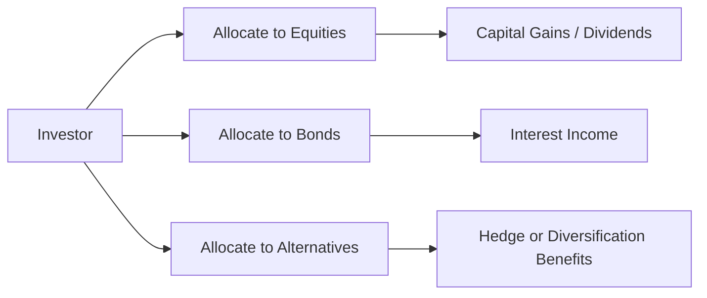

## 19.2 Issues in Asset Allocation

### Introduction
Asset allocation is often cited as the single most important decision in the investment process. While deciding how to distribute capital among equities, fixed income, cash, and alternative investments might seem straightforward, multiple issues can complicate this process. In the Canadian context, these complications are magnified by tax considerations, currency risks, and evolving regulations coordinated by the Canadian Investment Regulatory Organization (CIRO). This section examines the most common challenges faced by Canadian investors and wealth advisors when formulating and implementing an asset allocation strategy.

---

### Market Volatility
Market volatility, defined as rapid and significant price fluctuations in the securities markets, can lead to sudden gains or losses, causing investors to reconsider their long-term strategies. In volatile times, emotional responses—such as panic selling or unplanned shifts toward cash—can undermine strategic allocation.

- Volatility spikes often correlate with global or local geopolitical events, such as trade disputes or changes in monetary policy by the Bank of Canada.  
- Large institutional players like the Canada Pension Plan Investment Board (CPPIB) often plan for market swings by diversifying across regions and asset classes—aiming to smooth out overall returns despite short-term fluctuations.  

### Transaction Costs
Implementing an asset allocation strategy naturally involves transaction costs such as brokerage fees, commissions, and spreads:

- Frequent rebalancing can amplify these costs, particularly if you employ tactical allocations (e.g., short-term adjustments to capture perceived opportunities).  
- Canadian investors may incur additional fees if they invest in foreign securities (e.g., foreign exchange fees).  
- Major Canadian banks (e.g., RBC, TD, BMO) often provide special fee structures or commission schedules for wealth management clients. However, frequent trading can still erode returns if not carefully managed.

**Tip:**  
Evaluating trading frequency versus expected benefit from tactical shifts is crucial. Consider whether the incremental gain justifies the associated transaction costs.

---

### Tax Considerations in Canada
Tax treatment in Canada varies significantly among investment vehicles, prompting advisors to carefully position assets for optimal after-tax returns:

- Registered Retirement Savings Plans (RRSPs) offer tax-deferred growth, so allocations with high growth potential (e.g., equities) can be well-suited within RRSPs.  
- Tax-Free Savings Accounts (TFSAs) allow tax-free growth, making them ideal for highly-appreciating assets and for individuals who expect a higher tax bracket in retirement.  
- Non-registered accounts are subject to annual taxation on dividends, interest, and capital gains, but the tax rates differ:  
  - Dividends from Canadian corporations may qualify for the dividend tax credit.  
  - Capital gains are effectively taxed at 50% of your marginal rate.  

**Pitfall:**  
Ignoring the interplay of asset location and taxes can substantially reduce net returns. Review CRA (Canada Revenue Agency) guidelines for updated tax rates, deduction limits, and reporting rules:
[https://www.canada.ca/en/revenue-agency](https://www.canada.ca/en/revenue-agency)

---

### Correlation Shifts
Correlation—how two securities or asset classes move relative to each other—can change over time, especially during market stress:

- In normal markets, asset classes may appear uncorrelated (or negatively correlated), providing a diversification benefit.  
- In a crisis, correlations often converge (i.e., almost all asset prices fall simultaneously), reducing diversification advantages.  
- Understanding correlation dynamics is essential for optimizing portfolio risk, especially when shifting allocations in response to market signals.

In the above diagram, you can see how an investor’s capital flows into various asset choices. During times of stress, the correlation between Equities (B) and Alternatives (D) may increase, reducing diversification benefits.

**Formula Spotlight: Correlation & Portfolio Variance**  
When combining two assets, the portfolio variance ($\sigma_p^2$) is:

$$
\sigma_p^2 = w_1^2 \sigma_1^2 + w_2^2 \sigma_2^2 + 2\, w_1 w_2 \,\rho_{1,2}\,\sigma_1\,\sigma_2
$$

Where:  
- \\( w_i \\) = weight of each asset in the portfolio  
- \\( \sigma_i \\) = standard deviation of each asset  
- \\( \rho_{1,2} \\) = correlation between the two assets  

Note how a change in correlation (\\(\rho_{1,2}\\)) significantly impacts overall portfolio volatility.

---

### Behavioral Biases
Human psychology can cause suboptimal investment decisions, especially during market turbulence. Two notable biases are:

1. **Loss Aversion**: The tendency to feel the pain of losses more acutely than the pleasure of gains, often leading to premature selling when prices dip.  
2. **Recency Bias**: Placing excessive weight on recent performance rather than long-term trends, which can lead to chasing hot sectors or abandoning fundamentally solid positions.

**Tip:**  
Advisors can mitigate these biases by:  
- Establishing clear, rules-based asset allocation processes.  
- Educating clients on the importance of staying committed to longer-term strategies.  
- Offering scenario analyses to illustrate potential outcomes of emotional vs. disciplined decisions.  

Online courses on behavioral finance (e.g., offered through Coursera or edX) can deepen understanding of these biases and their impact on asset allocation.

---

### Local and Global Geopolitical Risks
Sudden geopolitical shifts—such as changes in trade policies, political turmoil, or global health crises—can rapidly alter market sentiment and risk profiles:

- Canadian commodity-driven sectors (e.g., energy, metals) may be particularly sensitive to global events.  
- Domestic political developments, such as changes in corporate taxation or environmental policies, affect certain industries more than others.  
- Diversifying across multiple geographic regions can mitigate concentration risk from localized events, but it also introduces currency risk for Canadian dollar (CAD) holders.

---

### Currency Exchange Risks
Holding foreign equities and bonds can enhance diversification and return potential, but it exposes investors to currency fluctuations:

- When the Canadian dollar weakens, CAD-converted returns from foreign assets may improve, and vice versa.  
- Hedged and unhedged products are available to manage currency exposure. For instance, many Canadian ETFs offer CAD-hedged versions of popular international benchmarks.  
- Large Canadian banks (like RBC) provide hedging instruments that can limit currency risk, though these carry fees and may forego some upside.

---

### Practical Asset Allocation Approaches
Investors can consider different approaches to navigate the issues above:

1. **Strategic Asset Allocation (SAA)**  
   - Focus on a long-term, target blend of assets.  
   - Rebalance periodically (e.g., annually or semi-annually) to maintain target weights.  
   - Minimizes transaction costs by limiting frequent trades.  

2. **Tactical Asset Allocation (TAA)**  
   - Seeks to outperform a strategic mix by exploiting short-term market opportunities.  
   - Higher transaction costs and volatility in allocation percentages.  
   - May be beneficial if you have strong views on, or proprietary research into, market movements.

3. **Core-Satellite Strategy**  
   - Maintain a “core” portfolio (often ETFs or mutual funds tracking broad indices) to capture market returns.  
   - Add “satellites," which can be specific sectors or styles (e.g., technology, dividend-growers, emerging markets) to boost alpha or hedge risk.

---

### Additional Resources
- **CIRO**: See [CIRO’s website](https://www.ciro.ca) for guidelines on regulatory compliance, best practices, and investor protection information.  
- **CRA**: Visit [CRA’s official site](https://www.canada.ca/en/revenue-agency) for details on RRSP and TFSA contribution limits, capital gains taxation, and investor tax credits.  
- **“Asset Allocation: Balancing Financial Risk” by Roger C. Gibson**: Offers deeper insights into handling common and specialized issues in asset allocation.  
- **Behavioural Finance Courses** on edX or Coursera: Enhance your understanding of how biases can distort investment decisions.

---

### Key Takeaways
1. **Plan for Volatility**: Anticipate market swings through consistent, rules-based rebalancing to avoid emotional decision-making.  
2. **Mind Costs and Taxes**: Transaction costs and tax treatment can substantially alter real returns; optimize asset location across RRSPs, TFSAs, and non-registered accounts.  
3. **Watch Correlation**: The diversification benefits of allocation can diminish during market stress if correlations rise.  
4. **Manage Behavior**: Awareness of loss aversion and recency bias is critical. Structured processes and clear guidelines help maintain discipline.  
5. **Stay Informed**: Keep track of Canadian regulatory changes, global events, and currency movements that can affect portfolio performance.  

---

## Advanced Asset Allocation Strategies in Canada: Test Your Knowledge



### Which of the following factors most commonly reduces the benefit of frequent rebalancing?
- [ ] A stronger Canadian dollar
- [ ] Improved sector allocation
- [ ] Better tax efficiency
- [x] Higher transaction costs

> **Explanation:** Frequent rebalancing triggers commissions, spreads, and other transaction-related expenses that can erode overall returns.

### When market volatility increases significantly, what often happens to correlations among asset classes?
- [ ] They remain constant over time.
- [x] They tend to increase, reducing diversification benefits.
- [ ] They tend to drop, improving diversification.
- [ ] They are unaffected by market conditions.

> **Explanation:** During market crises, many asset classes move together, weakening their usual diversification advantages.

### Which account type in Canada allows for tax-free growth on eligible contributions and earned income?
- [ ] Non-registered account
- [x] Tax-Free Savings Account (TFSA)
- [ ] Corporate account
- [ ] Guaranteed Investment Certificate (GIC)

> **Explanation:** TFSA contributions grow tax-free, making it especially attractive for assets expected to appreciate significantly.

### How does loss aversion most commonly manifest among investors?
- [ ] Prioritizing long-term gains over short-term losses
- [ ] Ignoring the market entirely
- [ ] Relying entirely on CIRO guidelines
- [x] Selling investments prematurely to avoid potential losses

> **Explanation:** Loss-averse investors often exit positions too soon when prices fluctuate downward, deviating from their strategic plan.

### What is one key advantage of a core-satellite asset allocation strategy?
- [x] It balances market exposure via a broad “core” while allowing targeted satellites for alpha.
- [ ] It eliminates all transaction costs.  
- [ ] It guarantees outperformance in bear markets.  
- [ ] It focuses exclusively on domestic equities.

> **Explanation:** The core provides stable market exposure, while satellites let investors seek extra returns or diversification in specific areas.

### Which of the following is a direct effect of higher market volatility on investors?
- [x] Emotional reactions leading to potential missteps
- [ ] An automatic drop in equity values
- [ ] Guaranteed higher returns in the long run
- [ ] Permanent collapse of diversification

> **Explanation:** Volatile markets cause stress that can lead to suboptimal decisions if not carefully managed.

### In the formula for a two-asset portfolio variance, which symbol represents the correlation between the two assets?  
- [ ] \\(\sigma_1\\)  
- [ ] \\(w_1\\)  
- [x] \\(\rho_{1,2}\\)  
- [ ] \\(v_{1,2}\\)

> **Explanation:** \\(\rho_{1,2}\\) denotes the correlation coefficient that influences how the two assets move in relation to each other.

### What is a primary reason for hedging foreign investments back to Canadian dollars?
- [ ] To eliminate all transaction fees
- [ ] To guarantee a higher return than domestic bonds
- [x] To reduce exposure to currency fluctuations  
- [ ] To attract more foreign investors

> **Explanation:** Currency hedging helps mitigate the impact of foreign exchange rate changes on returns when investing in international assets.

### According to CIRO guidelines, why is it essential to document an asset allocation plan?
- [x] It ensures transparency and compliance with regulatory requirements.  
- [ ] It allows unlimited trade freedom with no oversight.
- [ ] It absolves advisors of fiduciary duty.
- [ ] It prevents any investor losses.

> **Explanation:** CIRO encourages clear documentation to protect investors, promote suitable recommendations, and maintain transparency in investment decisions.

### True or False: During extreme market stress, assets generally become more correlated, potentially reducing the benefits of diversification.
- [x] True
- [ ] False

> **Explanation:** In severe downturns, the correlations among asset classes often spike, causing many investments to move in tandem.




