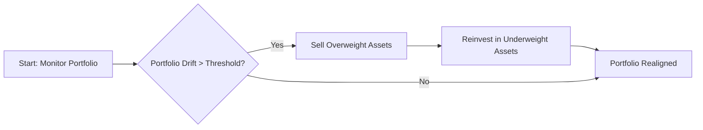

## 19.4 Rebalancing

Rebalancing is the process of realigning a portfolio’s current asset mix to its original (or revised) strategic allocation. In essence, it involves selling portions of asset classes that have risen in value and reinvesting proceeds into those that have fallen—restoring the portfolio to its intended risk-return profile. Canadian investors and advisors routinely rely on rebalancing strategies to ensure portfolios stay in line with clients’ evolving financial goals and suitability requirements.

---

### The Purpose of Rebalancing

1. **Risk Management**  
   • By adhering to a target asset allocation, investors maintain a consistent risk profile. Over time, market movements can cause a “portfolio drift,” with certain asset classes inflating in weight while others shrink. Rebalancing ensures that no single asset class becomes too large, mitigating concentration risk.

2. **Goal Preservation**  
   • Maintaining a carefully chosen strategic asset allocation helps investors stay on track to meet long-term objectives, such as retirement savings or major purchases. When left unchecked, an unbalanced portfolio can experience volatility beyond a client’s comfort level.

3. **Behavioural Discipline**  
   • Rebalancing encourages a disciplined approach. Often, it involves selling high-performers and buying assets that have lagged—a concept opposite to many behavioural biases that push investors to chase performance and avoid perceived underperformers.

---

### Common Rebalancing Strategies

Rebalancing can be done periodically, by threshold, or by blending both methods. Canadian advisors often choose an approach based on the client’s objectives, risk tolerance, and tax considerations.

#### 1. Periodic Rebalancing

• **Definition:** Under this strategy, the portfolio is reviewed and adjusted at regular intervals—say, semi-annually or annually—regardless of market conditions.  
• **Advantages:**  
  - Straightforward and systematic.  
  - Simplifies communication with clients, as the schedule is known in advance.  
• **Disadvantages:**  
  - The portfolio may drift significantly between scheduled reviews, especially in volatile markets.  
  - Could trigger higher transaction costs if rebalanced too frequently.

#### 2. Threshold Rebalancing

• **Definition:** Also known as percentage-based rebalancing, this method rebalances a portfolio when any asset class deviates beyond a set threshold (e.g., ±5%) from its target weight.  
• **Advantages:**  
  - Can minimize unnecessary transactions, as no action is taken until a specified deviation occurs.  
  - May capture opportune market entry and exit points more precisely.  
• **Disadvantages:**  
  - Requires regular monitoring to identify threshold breaches, which can be resource intensive.  
  - High volatility could repeatedly trigger rebalancing, increasing trading costs and potential tax implications.

#### 3. Hybrid Strategy

• **Definition:** Combines periodic and threshold rebalancing. A portfolio is monitored continuously for deviations, but also receives a “hard reset” to target weights on a scheduled basis.  
• **Advantages:**  
  - Offers flexibility by blending the discipline of a regular schedule with thresholds that control excessive drift.  
  - Potentially smoother performance if markets fluctuate significantly.  
• **Disadvantages:**  
  - More complex to execute and monitor.  
  - Could result in higher overall costs if not managed carefully.

---

### Lifecycle Considerations

Canadian investors often shift toward lower-risk asset classes as retirement nears, reflecting a desire to protect accumulated wealth. This transition, known as a “lifecycle” or “glide path” strategy, systematically lowers equity exposure and increases holdings in fixed-income or cash instruments. Major Canadian pension funds, such as the Canada Pension Plan Investment Board (CPPIB), use long-term asset allocation frameworks that adjust risk exposure over time. Incorporating lifecycle rebalancing:

- **Early Accumulation Phase**: Emphasizes growth-oriented assets (e.g., equities, alternative investments).  
- **Mid-Career Phase**: Gradually rebalances to increase stability, often adding more fixed income.  
- **Pre-Retirement Phase**: Seeks capital preservation, further shifting toward less volatile instruments (e.g., government bonds, cash reserves).  
- **Retirement Phase**: Focuses on generating steady income with minimal capital fluctuations.

---

### Merchandise the Process: An Example

Suppose a client’s target asset allocation is 60% equities and 40% fixed income. After significant equity market gains, the portfolio now sits at 68% equities and 32% fixed income:

1. **Measurement of Drift**  
   Let $E$ represent the equity portion and $F$ represent the fixed income portion:
   $$
   \text{Drift} = \frac{| E_\text{actual} - E_\text{target} |}{E_\text{target}} \times 100\%
   $$
   If $E_\text{actual} = 68\%$ and $E_\text{target} = 60\%$, then
   $$
   \text{Drift} = \frac{| 68\% - 60\% |}{60\%} \times 100\% = 13.3\%
   $$
   This indicates a significant deviation from the target allocation.

2. **Execution of Rebalancing**  
   • The advisor sells some equities to reduce the portfolio’s equity weight from 68% back down to 60%.  
   • The proceeds are reinvested into fixed income, which is below its 40% target.

3. **Outcome**  
   • The portfolio’s overall risk-return profile is realigned with the client’s preferences.  
   • The discipline helps avoid undue concentration risk in any single asset class.

---

### Transaction Costs and Tax Implications

Rebalancing is not without expense. Investors must evaluate:

1. **Transaction Fees**  
   • Brokerage commissions and spreads may reduce net returns.  
   • Frequent rebalancing may lead to unnecessary trading costs.

2. **Tax Consequences**  
   • In Canada, the Canada Revenue Agency (CRA) applies taxes on realized capital gains when rebalancing in non-registered accounts.  
   • Advisors often utilize tax-sheltered accounts (e.g., RRSPs or TFSAs) to minimize immediate tax impacts.  
   • Tax-loss selling strategies may offset capital gains, but require prudent timing and record-keeping.

3. **Prudent Timing**  
   • Some advisors delay or spread out rebalancing to reduce capital gains in a single calendar year.  
   • Coordinating rebalancing with known cash inflows (e.g., annual TFSA contributions) may reduce the need to sell existing holdings.

---

### Documentation and Communication

A **Rebalancing Policy** helps advisors and clients stay on the same page:

- **Portfolio Drift Tolerances**: Guidelines on acceptable levels of deviation.  
- **Frequency of Review**: Clear terms on how often the portfolio should be examined.  
- **Decision-Making Framework**: Whether to use a threshold, periodic approach, or both.  
- **Record-Keeping**: Detailed logs of trades executed, rationale, and tax adjustments for compliance.  

Clear documentation fosters transparent practices and ensures clients understand why and how the portfolio is being adjusted. From a regulatory perspective, the Canadian Investment Regulatory Organization (CIRO) requires advisors to maintain suitable recommendations and proper disclosure. A well-documented policy also reflects fiduciary diligence and can bolster client trust.

---

### Practical Implementation in Canadian Context

1. **CIRO Guidelines**  
   • CIRO emphasizes proper due diligence when making asset allocation decisions and rebalancing. Suitability assessments must be ongoing to ensure the client’s portfolio remains aligned with their goals and risk capacity.  
   • Visit [CIRO’s official website](https://www.ciro.ca) for up-to-date regulations, compliance bulletins, and best practices.

2. **CRA Documentation**  
   • Consult the CRA website for current rules on capital gains, capital losses, and tax-exempt accounts.  
   • Implementing a tax-efficient plan is essential to preserve returns for Canadian investors.

3. **Tools for Monitoring**  
   • Online Canadian portfolio aggregators such as Wealthica help track holdings across multiple accounts, measure drift, and signal rebalancing needs.  
   • Many discount brokerages (e.g., RBC Direct Investing, TD Direct Investing) and robo-advisors provide real-time drift alerts.

4. **Real-World Canadian Example**  
   • A balanced fund offered by a major Canadian bank (e.g., RBC, TD, BMO) might systematically rebalance on a quarterly basis, ensuring that the fund’s equity-to-bond ratio stays within a targeted range, such as 60/40, despite market fluctuations.

5. **Additional Resources**  
   • For a global perspective on wide-ranging allocations and backtested historical research, see Meb Faber’s “Global Asset Allocation.” Although not specifically Canadian-focused, it offers valuable insights into how different asset mixes can be rebalanced effectively over time.

---

### Visualizing the Rebalancing Process

Below is a simplified Mermaid.js flowchart illustrating how a typical rebalancing workflow might proceed:

**Explanation:**  
1. The process begins with portfolio monitoring.  
2. If an asset class’s weight has drifted beyond the acceptable threshold (e.g., ±5%), a rebalance is triggered.  
3. Overweight holdings are sold, and the proceeds are channeled into underweight categories.  
4. If the drift is still within limits, no trading is initiated.

---

### Best Practices and Potential Pitfalls

#### Best Practices
- **Set Clear Targets:** Document the strategic allocation and acceptable deviation thresholds.  
- **Assess Lifecycle Needs:** Adjust holdings as the client moves through different life stages.  
- **Leverage Tax-Efficient Accounts:** Wherever possible, rebalance within RRSPs/TFSAs to avoid immediate capital gains tax.  
- **Maintain Transparency:** Outline the rebalancing policy with clients in writing.

#### Potential Pitfalls
- **Excessive Trading:** Over-rebalancing can lead to high costs and after-tax underperformance.  
- **Neglecting Tax Impact:** Failing to account for taxes can substantially erode net gains.  
- **Forgetting External Holdings:** Clients with multiple accounts (including those not actively monitored) might inadvertently let their overall asset allocation drift.  
- **Misapplication of Thresholds:** An overly tight threshold can trigger frequent, unnecessary trades.

---

### Summary and Next Steps

Rebalancing is a core component of wealth management, ensuring that a client’s risk levels and financial objectives remain consistent over time. Advisors in Canada must weigh the benefits of systematic adjustments against the costs of transactions and taxes. Whether employing a periodic, threshold, or hybrid method, an effectively documented rebalancing policy fosters transparency, compliance, and trust.

As you integrate rebalancing into your practice, consider the lifecycle phase of clients, stay current with regulatory requirements, and continually refine your strategy to optimize long-term outcomes. Remember to use resources such as CIRO’s guidelines, CRA publications, and portfolio tracking tools to enhance your rebalancing decisions.

---

## Test Your Knowledge of Rebalancing Strategies in Canada



### 1. Which of the following best describes rebalancing?

- [ ] A method of outperforming the market through stock picking.  
- [x] A process of realigning the portfolio’s asset mix to its target allocation.  
- [ ] A strategy for avoiding all market risk by converting assets to cash.  
- [ ] A compliance requirement unique to mutual funds.  

> **Explanation:** Rebalancing seeks to bring the portfolio in line with pre-set strategic allocations, rather than aiming for market outperformance on its own.

### 2. In threshold rebalancing, what typically triggers a rebalance?

- [ ] A portfolio automatically rebalances every day.  
- [ ] A fixed trading fee is reduced.  
- [x] The portfolio drifts outside of predefined percentage limits.  
- [ ] A dividend is reinvested into the portfolio.  

> **Explanation:** Threshold rebalancing is activated when an asset class exceeds or falls below its target weight by a preset percentage, prompting a rebalance.

### 3. Why might advisors delay rebalancing even if an asset class drifts from its target?

- [x] To reduce transaction costs and potential immediate capital gains.  
- [ ] Because they are legally prohibited from rebalancing frequently.  
- [ ] To ignore client risk preferences.  
- [ ] Because rebalancing is unnecessary once a target is set initially.  

> **Explanation:** Advisors often weigh the benefits of immediate corrective action against its costs, including trading fees and taxes.

### 4. Which of the following is NOT a lifecycle consideration in rebalancing decisions?

- [ ] Shifting more assets into fixed income as retirement nears.  
- [ ] Gradually reducing equity exposure for capital preservation.  
- [ ] Adjusting the mix to reflect aging clients’ lower risk tolerance.  
- [x] Eliminating all equity positions upon turning 30.  

> **Explanation:** While reducing equity exposure is common as an investor ages, eliminating equities at a specific age without considering individual circumstances is not typical.

### 5. Which statement best describes periodic rebalancing?

- [x] It occurs on a specific timetable (e.g., quarterly or annually).  
- [ ] It only happens once equity valuations reach a 10% gain.  
- [ ] It is primarily driven by day-to-day market volatility.  
- [ ] It attempts to predict market peaks to sell high and buy low.  

> **Explanation:** Periodic rebalancing sets a defined schedule to review and potentially rebalance the portfolio, independent of short-term market swings.

### 6. How can advisors minimize the tax impact when rebalancing non-registered accounts?

- [x] By utilizing tax-loss selling or rebalancing within registered accounts first.  
- [ ] By never selling any investments until retirement.  
- [ ] By only trading once every ten years.  
- [ ] By ignoring changes to capital gains legislation.  

> **Explanation:** Tax planners often offset capital gains via tax-loss selling or shift rebalancing to tax-sheltered accounts when possible.

### 7. What is the primary regulatory requirement concerning rebalancing, as recommended by CIRO?

- [x] Ensuring the portfolio remains suitable for the client’s risk profile and objectives.  
- [ ] Rebalancing must only happen every five years.  
- [ ] Advisors must hold 50% in Canadian government bonds at all times.  
- [ ] Share classes must be switched without client consent.  

> **Explanation:** CIRO emphasizes suitability and ongoing risk management, requiring advisors to maintain alignment with client objectives.

### 8. Which of the following is a potential pitfall of too-frequent rebalancing?

- [x] High transaction fees and possible tax consequences.  
- [ ] The risk of over-diversification.  
- [ ] An immediate risk of regulatory penalties.  
- [ ] The inability to monitor market performance.  

> **Explanation:** Frequent rebalancing can trigger repeated transaction fees and capital gains, cutting into net investment returns.

### 9. Which tool can help investors track portfolio drift in Canada?

- [x] Wealthica or similar portfolio aggregators.  
- [ ] CRA’s official rebalancing dashboard.  
- [ ] A mandatory rebalancing app from CIRO.  
- [ ] A personal loan application.  

> **Explanation:** Third-party Canadian portfolio aggregators, such as Wealthica, allow investors to monitor all holdings in one place and flag asset allocation drifts.

### 10. Advisors who systematically sell overweight assets and buy underweight assets are practicing:

- [x] True  
- [ ] False  

> **Explanation:** This is the essence of rebalancing—bringing the portfolio’s allocations back to target weights by selling overweight and buying underweight asset classes.


