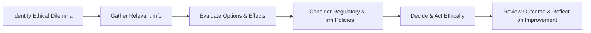

## 2.1 Ethics in the Financial Services Industry

Ethics in the financial services industry refers to the moral principles and standards of conduct that guide all activities carried out by wealth advisors, investment dealers, mutual fund dealers, and other financial professionals. These principles are essential to fostering trust, protecting investors’ interests, and maintaining market integrity.

---

### Why Ethics Matters in Canadian Finance

Financial institutions and professionals in Canada must demonstrate integrity and accountability to maintain confidence in the financial system. Clients entrust their advisors with significant personal and financial data, expecting expert guidance rooted in honesty and competence. An ethical approach ensures that:

- Clients receive advice that prioritizes their best interests.
- Investor protection remains paramount within Canadian capital markets.
- Advisors and firms remain compliant with regulations, reducing the risk of enforcement actions or reputational damage.
- The financial sector continues to attract and retain clients who value trustworthiness and transparent conduct.

---

### The Role of CIRO and Regulatory Compliance

Canada’s self-regulatory body, the Canadian Investment Regulatory Organization (CIRO), oversees the ethical and professional standards for investment dealers and mutual fund dealers. CIRO was formed by combining two former self-regulatory organizations (IIROC and MFDA). Now, it sets requirements that:

1. Ensure advisors place the client’s interest first.  
2. Maintain rigorous due diligence and “Know Your Client” practices.  
3. Enforce strict compliance with disclosure and conflict-of-interest guidelines.  
4. Uphold privacy and data protection regulations.  

In addition to CIRO, other regulators and industry bodies play a key role:

- The Canadian Securities Administrators (CSA): Coordinates provincial securities regulations and aims to protect Canadian investors.  
- The Office of the Superintendent of Financial Institutions (OSFI): Supervises federally regulated financial institutions, ensuring their financial soundness.  
- The Canada Revenue Agency (CRA): Enforces tax regulations, which often overlap with compliance obligations for financial professionals.

By adhering to CIRO and CSA standards, Canadian firms encourage ethical leadership and a culture of accountability. Many prominent Canadian banks (such as RBC, TD, and BMO) have robust internal codes of conduct and ethics training programs to ensure they meet or exceed these regulatory expectations.

---

### Core Ethical Principles in Financial Services

Below are key ethical concepts that guide day-to-day work of financial professionals:

1. **Client First**  
   Placing the client’s goals and interests above all else. This includes transparent disclosure of fees and potential risks.

2. **Integrity**  
   Acting with honesty, fairness, and consistency—even when no one is watching. Integrity builds an advisor’s reputation and reassures clients.

3. **Due Diligence**  
   Conducting a thorough review of a client’s financial needs, risk tolerance, and objectives. Recommending suitable products requires in-depth research and understanding.

4. **Confidentiality**  
   Ensuring private information is not disclosed improperly. Advisors must protect client data in accordance with Canadian privacy laws and firm policies.

5. **Accountability**  
   Accepting responsibility for outcomes and being prepared to explain and justify decisions to clients, regulators, or firm committees.

6. **Regulatory Compliance**  
   Complying with CIRO rules, CSA guidelines, and all relevant Canadian laws. This includes keeping up with reforms, rule changes, and regulatory best practices.

---

### Practical Steps to Promote Ethical Conduct

Financial professionals and firms can establish a robust ethical framework by following these steps:

1. **Develop a Comprehensive Code of Ethics**  
   Clearly articulate expectations for professional conduct and decision-making.  
   - Many Canadian financial institutions, such as RBC and TD, make their codes public to reinforce their commitment to ethical behavior.

2. **Ethics Training and Continuing Education**  
   Offer recurring educational sessions focused on ethical standards, real-life scenarios, and regulatory changes.  
   - Participation in workshops offered by FP Canada or professional bodies like the CFA Institute helps advisors stay current.

3. **Foster an Ethical Culture**  
   Encourage open communication so employees can raise concerns without fear of retaliation.  
   - Some Canadian banks, for instance, maintain whistleblower hotlines to encourage reporting of misconduct.

4. **Implement Internal Controls**  
   Use checklists and automated alerts to detect breaches or unusual activities.  
   - Example: Using advanced compliance software to flag suspicious transactions that diverge from stated client objectives.

5. **Monitor and Report**  
   Regularly review portfolios, transaction histories, and client communications to ensure compliance.  
   - CIRO’s regulations require firms to maintain robust compliance systems, which are audited periodically.

---

### Real-World Canadian Example: Case Studies

1. **Mortgage Sales Practices**  
   In past reviews by federal regulators, some large Canadian banks faced scrutiny over sales tactics in mortgage lending. By improving training and ensuring clients fully understood loan terms, these institutions demonstrated a proactive commitment to ethical improvement.

2. **Cross-Selling Strategies**  
   Advisors at large financial institutions—RBC, TD, BMO, among others—sometimes face pressure to meet sales targets. If not handled ethically, cross-selling can lead to misaligned advice. Through better oversight and “client-focused reforms,” banks now emphasize suitability and transparency.

3. **Investment Governance for Pension Funds**  
   Canadian pension funds (such as the Ontario Teachers’ Pension Plan and CPP Investments) set high standards for ethical investing. They publicly disclose their Responsible Investing Principles, showcasing the integral role of ethics in shaping investment decisions for Canadians’ retirement security.

---

### Ethical Decision-Making Process

Financial professionals often encounter ethical dilemmas. A structured decision-making process can help, as illustrated in this Mermaid diagram:

**Diagram Explanation:**  
1. Identify Ethical Dilemma – Recognize a potential conflict of interest or a situation where values may be compromised.  
2. Gather Relevant Info – Obtain client documents, disclosures, and guidance from regulations or leadership.  
3. Evaluate Options & Effects – Consider how each potential action aligns with ethical principles and the client’s best interest.  
4. Consider Regulatory & Firm Policies – Ensure compliance with standards set by CIRO and the firm’s code of ethics.  
5. Decide & Act Ethically – Choose an action that upholds ethical standards, putting the client first.  
6. Review Outcome & Reflect – Analyze the outcome for continuous improvement in future situations.

---

### Common Pitfalls and How to Avoid Them

Financial professionals should be vigilant about the following challenges:

- **Conflict of Interest:** If an advisor’s compensation or personal interests could bias recommendations, immediate disclosure and proper management of the conflict is crucial.  
- **Lack of Transparency:** Failing to clearly explain fees, risks, or terms can lead to misunderstandings and erode trust.  
- **Insufficient Due Diligence:** Pushing products without thoroughly assessing client objectives puts the advisor and firm at risk of regulatory penalties.  
- **Overlooking Emerging Regulations:** Changes to CIRO or CSA regulations require ongoing updates to compliance manuals and training programs.  
- **Communications Gaps:** Poor record-keeping or inadequate client communication can result in confusion, errors, or non-compliance with privacy standards.

---

### Resources for Further Exploration

- **CIRO Website:**  
  [https://www.ciro.ca](https://www.ciro.ca)  
  Find updates on Canadian investment industry regulations, compliance resources, and investor protection guides.
  
- **Canadian Securities Administrators (CSA):**  
  [https://www.securities-administrators.ca](https://www.securities-administrators.ca)  
  Follow policy developments, harmonized securities regulation, and investor education resources.
  
- **FP Canada:**  
  [https://www.fpcanada.ca](https://www.fpcanada.ca)  
  Offers certification and professional development programs with a strong ethics component for financial planners.
  
- **CFA Institute Code of Ethics and Standards of Professional Conduct:**  
  [https://www.cfainstitute.org/en/ethics-standards](https://www.cfainstitute.org/en/ethics-standards)  
  While global in nature, these standards are widely acknowledged in Canada, underscoring integrity and professional conduct.  

- **“Financial Ethics: A Positivist Analysis” by George Aragon and Wayne E. Ferson**  
  A scholarly work examining ethical challenges and frameworks within finance.

- **Ethics in Finance (Online Course)**  
  Offered by various post-secondary institutions in Canada, covering topics such as fiduciary duties, regulatory compliance, and the intersection of ethics with technology.

---

### Key Takeaways

1. **Maintain Trust Through Transparency:** Clear disclosure of fees, risks, and potential conflicts is the bedrock of ethical advising.  
2. **Continuous Professional Development:** Stay informed of updates to CIRO, CSA regulations, and best practices to navigate evolving ethical requirements.  
3. **Cultivate Ethical Culture:** When senior leadership champions ethical conduct, it permeates throughout the organization.  
4. **Protect Client Data:** Compliance with privacy laws and the maintenance of client confidentiality are paramount.  
5. **Accountability and Responsibility:** Own your decisions, document justification, and be ready to address inquiries from regulators or clients.

---

By adopting high ethical standards, Canadian financial professionals strengthen client relationships, uphold the integrity of capital markets, and foster a resilient financial ecosystem that benefits everyone. Ethics is not merely an ideal—it is the backbone of day-to-day operations and long-term professional success.

---

## Test Your Knowledge of Ethics in Canadian Financial Services



### 1. Why is ethics crucial in the Canadian financial services industry?

- [x] It fosters trust and upholds investor protection.
- [ ] It allows advisors to prioritize commissions.
- [ ] It ensures faster investment transactions.
- [ ] It eliminates the need for professional training.

> **Explanation:** Ethics builds trust among investors and is a foundation of investor protection. Without strong ethical standards, the financial system’s integrity suffers.

### 2. Which self-regulatory organization currently oversees investment dealers and mutual fund dealers in Canada?

- [ ] IIROC
- [ ] MFDA
- [x] CIRO
- [ ] OSFI

> **Explanation:** The Canadian Investment Regulatory Organization (CIRO) formed after the amalgamation of IIROC and MFDA, effective June 1, 2023.

### 3. What does placing the "client’s best interest first" imply for an advisor?

- [ ] Maximizing product sales volume
- [x] Delivering advice that meets the client’s financial goals
- [ ] Avoiding any discussion of fees
- [ ] Restricting real estate investments

> **Explanation:** Client-first conduct means all advice and recommendations must be suitable and aligned with the client’s financial situation, goals, and risk tolerance.

### 4. A key component of ethical leadership within a Canadian wealth management firm is:

- [x] Encouraging employees to speak up about misconduct or conflicts
- [ ] Restricting communication between employees and regulators
- [ ] Maximizing short-term profits above all else
- [ ] Only allowing senior executives access to ethics training

> **Explanation:** Ethical leadership promotes a speak-up culture and continuous ethics training, ensuring concerns are addressed and misconduct is minimized.

### 5. Which of the following is an example of due diligence?

- [x] Thoroughly reviewing a client's financial profile before recommending solutions
- [ ] Accepting an investment product based solely on brand recognition
- [x] Confirming the risks of a proposed investment align with a client’s risk tolerance
- [ ] Ignoring drastic changes in the client’s life circumstances

> **Explanation:** Advisors must gather and review detailed client information and research proposed investments to ensure suitability and alignment with client objectives.

### 6. What is a common pitfall to avoid in ethical financial advising?

- [x] Lack of transparency regarding fees
- [ ] Developing an internal code of conduct
- [ ] Obtaining continuing professional education
- [ ] Aligning recommendations with client objectives

> **Explanation:** Without transparent communication of fees, conflicts of interest may arise, damaging client trust and violating ethical norms.

### 7. In Canadian financial services, which entity coordinates provincial securities regulations?

- [ ] CIRO
- [x] The Canadian Securities Administrators (CSA)
- [ ] The Canada Revenue Agency (CRA)
- [ ] FP Canada

> **Explanation:** The CSA supports collaboration among provincial securities regulators, setting harmonized standards and policies.

### 8. Confidentiality in financial services means:

- [x] Not disclosing sensitive client information unless required by law
- [ ] Posting client data on social media
- [ ] Sharing all client details with business partners
- [ ] Encouraging unauthorized staff to access client records

> **Explanation:** Maintaining confidentiality protects client data and complies with Canadian privacy regulations.

### 9. A practical step for promoting ethical conduct within a Canadian bank is:

- [x] Establishing an accessible whistleblower program
- [ ] Minimizing staff exposure to ethics policies
- [ ] Eliminating compliance audits
- [ ] Refusing to adopt internal codes of conduct

> **Explanation:** A whistleblower mechanism allows employees to report concerns without fear, reinforcing the firm’s ethical culture.

### 10. True or False: Upholding ethical standards can attract more clients and lead to long-term career success.

- [x] True
- [ ] False

> **Explanation:** Ethical conduct fosters trust, boosts reputation, and sets the foundation for sustainable growth and success in the Canadian financial services industry.


