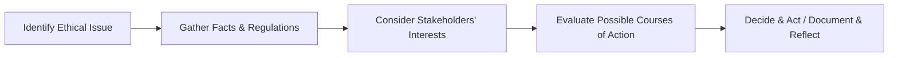

## 2.3 Resolving Ethical Dilemmas

In Canadian wealth management, ethical dilemmas may arise from conflicts of interest, ambiguous regulatory scenarios, or pressures to meet financial and performance targets. The ability to recognize and resolve ethical dilemmas is crucial for building trust with clients, staying compliant with regulations, and maintaining a reputation for professionalism. In this section, we explore a structured framework for ethical decision-making, share real-world Canadian examples, and highlight best practices for preventing or mitigating ethical breaches.

---

## Importance of Ethical Decision-Making in Wealth Management

Wealth advisors operate in a complex environment of laws, regulations, and fiduciary obligations. Even seemingly small conflicts can escalate if they are not handled in a timely, transparent, and methodical manner. Striking the right balance between client interests, the profitability of the firm, and personal or professional considerations is a fundamental challenge.

• An advisor who fails to address an ethical conflict promptly risks regulatory penalties, client mistrust, and potential legal action.  
• A strong ethical decision-making framework fosters trust and can deepen long-term relationships with clients.  
• Regulatory bodies such as the Canadian Investment Regulatory Organization (CIRO) enforce rules mandating fair treatment of clients and responsible conduct, emphasizing that advisors must promptly address ethical issues that affect clients’ portfolios.

---

## The Ethical Decision-Making Model

Advisors often use a systematic framework—sometimes called the “moral reasoning model” or “ethical decision-making model”—to resolve ethical dilemmas. While several variations exist, most models share five fundamental steps:

This diagram illustrates a pivotal process for addressing ethical conflicts:

1. **Identify the Ethical Issue**  
   Determine the specific conflict or dilemma. Ask: “What problem am I trying to solve, and why does it pose an ethical challenge?”  

2. **Gather Facts & Regulations**  
   • Collect relevant facts, including client data, regulatory guidelines, and internal firm policies.  
   • Consult CIRO bylaws and member rules for guidance ([https://www.ciro.ca](https://www.ciro.ca) has the latest policies).  
   • Reference the Canadian Securities Administrators’ (CSA) resources on registrant conduct ([https://www.securities-administrators.ca](https://www.securities-administrators.ca)).  

3. **Consider Stakeholders’ Interests**  
   Identify who will be affected by the decision (e.g., client, firm, regulators, other clients). Consider how various outcomes might positively or negatively impact each stakeholder.

4. **Evaluate Possible Courses of Action**  
   Weigh legal and ethical considerations for each option. In wealth management, options may include disclosing potential conflicts of interest, adjusting fee structures, or declining a client request. Try to imagine how each alternative aligns with both the letter and spirit of the law, as well as the firm’s code of conduct.

5. **Decide & Act / Document & Reflect**  
   • Choose the course of action that best meets ethical and regulatory standards.  
   • Document the entire process—this helps show regulators you have proceeded carefully and ethically.  
   • Reflect on the outcome to improve your decision-making process in the future.

---

## Consulting with Supervisors, Compliance Officers, or Ethics Hotlines

When faced with uncertainty, advisors should escalate concerns to a supervisor, compliance officer, or use the firm’s ethics hotline. Early intervention often resolves misunderstandings and prevents further complications:

- **Supervisor or Manager:** Can provide insights on the firm’s expectations and past precedents for similar situations.  
- **Compliance Officer:** Specializes in interpreting and applying regulations and ethical guidelines.  
- **Firm Ethics Hotline:** Anonymously reports potential violations or clarifies ethical issues without fear of reprisal.

Large Canadian financial institutions such as RBC, TD, and BMO maintain robust internal compliance teams and ethical reporting structures to tackle breaches before they escalate. Advisors are encouraged to use these resources proactively.

---

## Documentation and Transparent Communication

### Importance of Record-Keeping

Documenting each stage of the ethical decision-making process is crucial. From a regulatory standpoint, thorough documentation:

1. Demonstrates respect for legal and ethical standards.  
2. Shows the advisor’s rationale and due diligence if the decision is later questioned.  
3. Contributes to a broader organizational culture of compliance and continuous improvement.

### Clarity and Trust

Open communication with the client can often turn a potential ethical pitfall into a demonstration of integrity. For example:

- **Conflict of Interest Disclosure**  
  If a recommended product would generate a higher commission for the advisor, proactively explain the different fee structures and present the pros and cons for various options.  
- **Investigation or Delay in Execution**  
  If a suspected conflict arises when executing a client order, promptly inform the client that additional checks are needed, underscoring your commitment to fairness and regulatory compliance.

Advisors who adopt full disclosure—by outlining risks, potential biases, and the rationale behind recommended courses of action—typically earn deeper trust from clients.

---

## Real-World Canadian Examples

### Case Study: Pension Fund Influence

Many Canadian pension funds (e.g., Canada Pension Plan Investment Board) apply ethical screens or environmental, social, and governance (ESG) criteria to their investments. An advisor guided by these principles might face an ethical dilemma when a high-yield bond opportunity conflicts with ESG restrictions. Resolving the dilemma involves:

1. Disclosing the potential ESG conflict to relevant parties.  
2. Reviewing the fund’s official mandate and relevant regulations.  
3. Recommending an alternative investment that aligns with both expected returns and the pension fund’s values.

### Case Study: Internal Policy Conflicts in a Major Bank

A hypothetical scenario might involve a wealth advisor at a major Canadian bank (such as RBC) who discovers that a recommended proprietary product has higher fees but offers suboptimal performance compared to a third-party fund. The advisor:

1. **Identifies the conflict** (recommendation may not be in the client’s best interests).  
2. **Consults the compliance officer** to verify the bank’s policy on selling proprietary products.  
3. **Considers stakeholder interests** (the client’s performance vs. the bank’s product sales goals).  
4. **Evaluates different actions**: (a) continuing to sell the proprietary product without disclosure or (b) recommending a competing fund that offers better risk-adjusted returns.  
5. **Decides to prioritize client interests** by recommending the optimal solution, documenting the due diligence, and providing transparent disclosure.

---

## Encouraging a Speak-Up Culture

A “speak-up culture” within financial firms is one in which employees:

- Feel safe voicing concerns about unethical or suspect corporate behavior.  
- Receive active support from leadership when legitimate concerns are raised.  
- Are encouraged to report wrongdoing anonymously, if necessary, without fear of retaliation.

Firms can cultivate this environment by offering ethics training, anonymously monitored hotlines, and explicit whistleblower protections. Such a culture helps uncover issues early, often preventing reputational harm, regulatory fines, and deterioration of client relationships.

---

## Ongoing Training and Ethical Preparedness

Scenario-based training, offered by professional bodies and many Canadian financial institutions, is one of the most effective ways to prepare for ethical dilemmas. Advisors sharpen their judgment by:

- Participating in mock role-play or simulation of complex ethical scenarios.  
- Analyzing case studies of real conflicts and how they were resolved.  
- Learning to identify grey areas—subtle conflicts that can escalate without early intervention.

Advisors can also consult resources like the FP Canada “Ethical Decision-Making Tool,” which provides a practical instrument for analyzing and resolving ethical conflicts in a structured manner. Continuous education ensures readiness for dynamic changes in regulations and evolving client expectations.

---

## Best Practices and Potential Pitfalls

**Best Practices**  
- **Early Action:** The sooner an ethical issue is identified and addressed, the easier it is to resolve.  
- **Document Thoroughly:** Keep detailed records of the decision-making process.  
- **Continuous Learning:** Enhance your skill set with ethics courses or professional designations in compliance.  
- **Align with Regulation:** Stay updated on CIRO rules, CSA guidance, and any relevant provincial securities statutes.

**Potential Pitfalls**  
- **Ignoring Minor Conflicts:** Seemingly trivial issues can escalate.  
- **Lack of Communication:** Failure to communicate effectively with clients or supervisors can erode trust.  
- **Inadequate Documentation:** Having no paper trail makes it difficult to demonstrate that correct procedures were followed.  
- **Compensation Pressures:** Unchecked bonus structures may tempt advisors to recommend higher-commission products at the expense of the client’s interests.

---

## Key Takeaways

1. **Proactive Identification:** Recognizing problems early is half the battle.  
2. **Structured Models:** A moral reasoning or ethical decision-making model provides clarity.  
3. **Consult & Collaborate:** Seek input from managers, compliance officers, and ethics hotlines when uncertain.  
4. **Client-Centric Approach:** Align decisions with the client’s best interest, not short-term performance targets or commissions.  
5. **Document & Disclose:** Transparency is not only ethical but also essential for compliance with Canadian regulations and for building trust.  

By systematically applying these principles and resources, advisors safeguard themselves, their clients, and their firms from the repercussions of unethical practices.

---

## Additional Resources

- **CIRO**: [https://www.ciro.ca](https://www.ciro.ca) (for the latest bylaws and rules relating to member conduct)  
- **FP Canada “Ethical Decision-Making Tool”** (available for financial planners)  
- **CSA**: [https://www.securities-administrators.ca](https://www.securities-administrators.ca) (for cross-Canada securities regulations)  
- **Business Ethics: Decision Making for Personal Integrity and Social Responsibility** by Laura P. Hartman et al.  
- **Compliance and Ethics Management** (various online courses offered by recognized Canadian business schools)

---

### Glossary

- **Ethical Decision-Making Model**  
  A structured approach for analyzing and resolving ethical issues that involves fact gathering, stakeholder analysis, options evaluation, and outcome reflection.

- **Stakeholders**  
  Individuals or entities (e.g., clients, the firm, regulators, shareholders) who stand to gain or lose based on the advisor’s decision.

- **Compliance Officer**  
  A professional responsible for ensuring the firm adheres to relevant laws, regulations, and ethical standards.

- **Speak-Up Culture**  
  An organizational environment in which employees are encouraged, protected, and rewarded for raising ethical or legal concerns.

- **Transparency**  
  Providing accurate, clear, and timely disclosures to clients, regulators, and other stakeholders about key aspects of investment and decision-making processes.

---

## Test Your Knowledge: Resolving Ethical Dilemmas in Canadian Wealth Management



### Which of the following is the initial step in the ethical decision-making model?
- [ ] Evaluating possible solutions  
- [ ] Consulting with a compliance officer  
- [ ] Documenting the process  
- [x] Identifying the ethical issue  

> **Explanation:** The first step involves recognizing and defining the ethical dilemma. Without identifying the ethical issue, the subsequent steps cannot be executed effectively.

---

### Which stakeholder group is typically the most directly affected by an advisor's ethical decision?
- [x] The client  
- [ ] The regulator  
- [ ] The firm’s shareholders  
- [ ] The general public  

> **Explanation:** Although multiple stakeholders can be involved, the client is usually the foremost concern, as the advisor’s duty is to act in the client’s best interest.

---

### Which of the following actions best demonstrates proactive conflict management?
- [x] Disclosing to the client any commission-based compensation structures  
- [ ] Recommending only proprietary funds to maintain client loyalty  
- [ ] Avoiding written records to reduce managerial scrutiny  
- [ ] Prioritizing high-profit but higher-risk products for client portfolios  

> **Explanation:** Full disclosure of potential conflicts of interest, including fee structures, ensures clients understand how compensation might impact recommendations.

---

### When is the ideal time to engage a firm's ethics hotline or compliance department?
- [ ] Only after a formal complaint has been filed  
- [ ] After multiple breaches are confirmed  
- [x] As soon as an ethical dilemma or suspicion arises  
- [ ] Immediately after the decision is made  

> **Explanation:** Early intervention is key to preventing escalation and potential harm to both the client and the advisor.

---

### Which of the following is a common pitfall that may lead to an ethical breach?
- [x] Allowing bonus incentives to overshadow client interests  
- [ ] Discussing a potential conflict with your supervisor  
- [x] Failing to document the decision-making process  
- [ ] Communicating transparently with the client about product risks  

> **Explanation:** Misaligned incentives and lack of proper documentation are major risk factors for ethical misconduct.

---

### What is the primary purpose of documenting the ethical decision-making process?
- [x] To provide evidence of due diligence and compliance  
- [ ] To reduce the advisor’s accountability  
- [ ] To speed up client onboarding  
- [ ] To demonstrate to the client that mistakes cannot happen  

> **Explanation:** Detailed documentation serves as a vital paper trail to prove that proper steps were taken, which can protect both client and advisor.

---

### How does a “speak-up culture” benefit a financial advisory firm?
- [ ] It eliminates the need for compliance officers  
- [x] It encourages staff to raise concerns proactively  
- [ ] It prevents clients from questioning investment decisions  
- [x] It reduces the likelihood that ethical dilemmas go unreported  

> **Explanation:** A speak-up culture reduces the fear of retaliation and ensures that potential misconduct or breaches are flagged and addressed early.

---

### When considering a new investment strategy for a client, which factor should hold the highest priority?
- [x] The client’s best interests  
- [ ] The firm’s sales targets  
- [ ] The advisor’s personal commission benefits  
- [ ] Preference of senior management  

> **Explanation:** Adhering to fiduciary duties dictates that the client’s best interest must always come first, outweighing business or personal incentives.

---

### Which of the following resources remain relevant for Canadian advisors seeking guidance on ethical and regulatory compliance?
- [x] CIRO bylaws and rules  
- [x] CSA publications  
- [ ] MFDA, which still operates independently  
- [ ] IIROC for current day oversight  

> **Explanation:** CIRO now oversees what the MFDA and IIROC once covered. The Canadian Securities Administrators also provide ongoing national-level guidance.

---

### True or False: Reflecting on the outcomes of past ethical decisions helps improve future ethical decision-making.
- [x] True  
- [ ] False  

> **Explanation:** Reflecting on past decisions is crucial for personal and professional growth, enabling advisors to adapt and refine their ethical frameworks over time.


