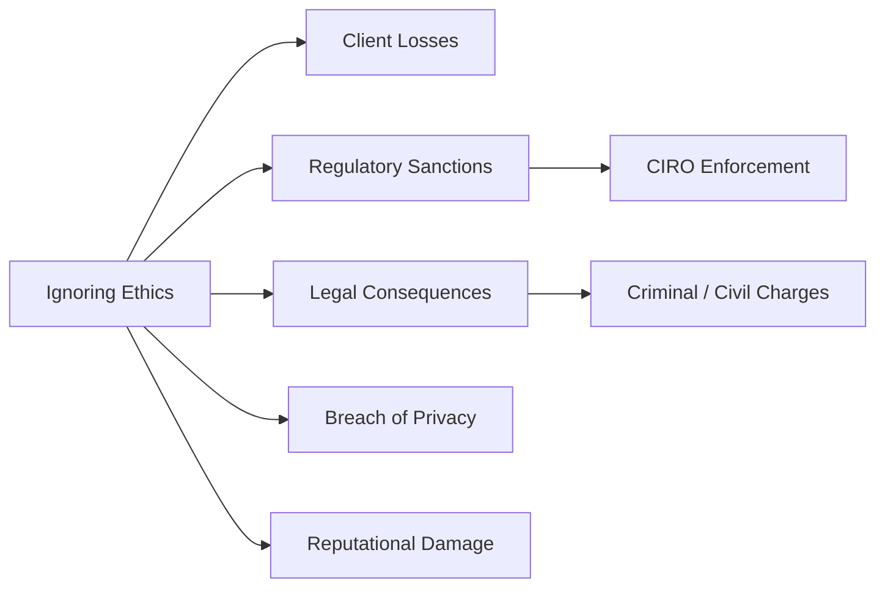

## 2.6 What Can Happen When an Advisor Ignores Ethics

When financial advisors dismiss ethical principles, the repercussions can be devastating for their clients, themselves, and the broader Canadian financial industry. Not only can advisors face severe penalties from regulators like the Canadian Investment Regulatory Organization (CIRO), but they can also incur criminal and civil liabilities that damage both personal and institutional reputations. Trust is the cornerstone of wealth management—eroding it jeopardizes the stability of Canada’s capital markets.

Below is a detailed look at what can happen when ethics are disregarded, including practical guidance, relevant examples, and references to Canadian legal and regulatory frameworks.

---

## Consequences for Clients

Clients place their financial well-being in the hands of advisors. When an advisor acts unethically, clients may experience:

- Financial losses that can derail key goals like retirement, home ownership, or education funding.  
- Diminished trust in financial institutions, making them reluctant to invest further or follow legitimate advice.  
- Potential legal issues, especially if unethical activities (e.g., insider trading, tax evasion) were undertaken with or on behalf of clients.

These consequences can be particularly damaging if clients have fewer opportunities to recoup substantial losses—common among retirees or lower-income investors.

---

## Disciplinary Action from CIRO

CIRO (the Canadian Investment Regulatory Organization) is Canada’s national self-regulatory body overseeing investment dealers, mutual fund dealers, and market integrity on equity and debt marketplaces. When advisors violate ethical guidelines and fail to meet professional standards, they may face:

1. Fines – Monetary penalties that can reach significant amounts, depending on the gravity of the misconduct.  
2. Suspension – A temporary ban from practicing within the Canadian securities industry.  
3. Permanent Bans – Lifelong exclusions that can prematurely end a wealth management career.

These sanctions are detailed in CIRO’s enforcement proceedings, available at [https://www.ciro.ca](https://www.ciro.ca). Each proceeding documents the nature of the offence, the disciplinary process, and the outcome—illustrating how seriously ethical breaches are treated in Canada.

---

## Reputational Damage to the Firm

An advisor’s misconduct has consequences not only for the individual but for the firm:

- Negative Publicity and Media Coverage: Ethical failures that hit the headlines can create a lasting stigma.  
- Client Attrition: Nervous clients often leave for more reputable wealth managers, resulting in a reduced asset base.  
- Loss of Industry Credentials: Firms might lose designations or special status if they fail to maintain robust supervisory frameworks.  
- Potential Class-Action Lawsuits: Large groups of affected clients can organize to pursue legal actions for compensation.

Even Canada’s largest financial institutions—such as RBC, TD, and BMO—are not immune to reputational risks. If their advisors commit unethical acts, news can spread rapidly, resulting in lost business and financial penalties.

---

## Legal Consequences Under Canadian Law

Unethical actions, when they break the law, can lead to civil or criminal proceedings. Provincial securities regulators like the Ontario Securities Commission (OSC), the Alberta Securities Commission (ASC), and the British Columbia Securities Commission (BCSC) actively investigate and enforce actions against:

- **Insider Trading**: Trading securities on material non-public information, which is prohibited under Canadian securities law.  
- **Fraud**: Deceptive or manipulative practices that harm victims financially.  
- **Misrepresentation**: Providing false or misleading statements about a product or an investment opportunity.  

In egregious cases, the Royal Canadian Mounted Police (RCMP) may lay criminal charges, resulting in possible jail terms and restitution orders. A high-profile example of this in Canada are instances of Ponzi schemes, where unsuspecting investors lost significant assets due to fraudulent misrepresentations and the misappropriation of funds.

---

## Breaches of Privacy Legislation

In addition to securities laws, advisors must comply with Canada’s privacy regulations, most notably the Personal Information Protection and Electronic Documents Act (PIPEDA). Failing to protect sensitive client data can lead to:

- Investigations by the Office of the Privacy Commissioner of Canada.  
- Fines or other penalties under federal or provincial privacy statutes.  
- Injunctions or lawsuits if clients’ rights and interests were compromised.

These breaches erode trust in the advisor’s competence and integrity, leading to potentially irreparable reputational harm.

The diagram above illustrates how ignoring ethics can branch out into various negative outcomes, ultimately undermining the advisor’s practice, harming clients, and destabilizing the integrity of financial markets.

---

## Erosion of Public Confidence

Capital markets rely on trust. Even a handful of unethical activities can tarnish the reputation of the entire industry, making it more difficult for honest advisors to attract new clients. Canada’s robust regulatory framework is designed to protect market integrity. When unethical behavior surfaces, it undermines:

- The willingness of new investors to enter the market.  
- The perception of fairness and transparency in trading and financial advice.  
- The credibility of professional designations and credentials (e.g., WME®, CFA®, CFP®).

Advisors have a collective responsibility to maintain the highest ethical standards, as even isolated events can cause widespread mistrust.

---

## Case Studies: Ethical Failures

1. **Ponzi Schemes in Canada**  
   Several high-profile Ponzi schemes have highlighted the devastation that occurs when unethical practices are paired with clever marketing and a lack of oversight. Investors lost millions of dollars, which triggered greater scrutiny on advisors and stricter enforcement action by regulators such as the CSA (Canadian Securities Administrators).

2. **Mis-Sold Mutual Funds**  
   Some advisors, seeking higher commissions or sales quotas, have been accused of misrepresenting the features and risks of certain mutual funds. Ultimately, clients with mismatched risk profiles suffered losses, and the advisors involved faced industry bans, cancellation of licenses, and heavy fines.

3. **False Performance Reporting**  
   Fabricated performance reports can temporarily mask losses or risks, but the truth emerges eventually. Regulatory bodies have penalized many advisors for reporting inflated returns to minimize redemptions and retain client assets under management.

These examples reinforce the importance of strong supervision, personal accountability, and adherence to robust ethical guidelines.

---

## Best Practices to Avoid Ethical Pitfalls

An advisor who is committed to ethical standards can minimize risks by:

1. Establishing a Compliance-First Culture  
   - Regularly attend and apply CIRO compliance training.  
   - Encourage open communication with compliance officers and peers.

2. Documenting Advice Thoroughly  
   - Keep well-structured records of investment strategies, justifications, and disclosures.  
   - Retain copies of all client communications to demonstrate transparency.

3. Aligning Products with Client Needs  
   - Conduct regular reviews of suitability and risk tolerance.  
   - Disclose potential conflicts of interest clearly.

4. Staying Educated  
   - Follow updates from regulators (OSC, ASC, BCSC, CIRO).  
   - Learn about the ethical dimensions of new financial products or market structures.

5. Preventing Privacy Breaches  
   - Secure client data with robust cybersecurity measures.  
   - Train staff in privacy legislation compliance (e.g., PIPEDA).

---

## Additional Resources

- [CIRO Enforcement Proceedings and Disciplinary Notices](https://www.ciro.ca)  
- [Regulatory Enforcement Databases: OSC, ASC, BCSC](http://www.securities-administrators.ca)  
- [RCMP – Criminal Fraud Investigations](http://www.rcmp-grc.gc.ca)  
- “Ponzi Schemes in Canada” – Analysis by CSA  
- Books and academic articles on major financial scandals (Enron, Tyco) as cautionary tales

---

## Summary

Ignoring ethics in wealth management can trigger client losses, professional sanctions, and legal confrontations that devastate careers and financial institutions alike. Confidence and trust are foundational to Canada’s financial system. Advisors who breach ethical conduct risk collateral damage to their clients, firms, and the broader capital markets. By respecting regulations, keeping client interests paramount, and fostering a culture of integrity, advisors safeguard their professional standing and contribute to a stable, trustworthy financial industry.

---

## 10 Must-Know Consequences of Ethical Violations in Wealth Management



### 1. Which of the following is a primary reason improper ethical conduct harms the client?

- [x] Clients may suffer financial losses that derail important life goals.
- [ ] Clients automatically receive compensation from CIRO.  
- [ ] Clients are barred from future investing.  
- [ ] Clients cannot seek restitution in Canadian courts.

> **Explanation:** Financial losses can erode clients’ assets and disrupt retirement or education plans. Advisors must uphold ethics to minimize risks.

### 2. What is one possible disciplinary action imposed by CIRO for ethical breaches?

- [x] A permanent ban from the securities industry.  
- [ ] A guarantee of future employment.  
- [ ] A mandatory transfer to another advisory firm.  
- [ ] A scheduled client reassignment without consequences.

> **Explanation:** CIRO can impose fines, suspensions, and even permanent bans, depending on the severity of the offence.

### 3. How do unethical practices harm the firm itself?

- [x] They lead to reputational damage that can result in client attrition.  
- [ ] They allow for tax deductions on compliance fines.  
- [ ] They improve short-term profit margins without risk.  
- [ ] They eliminate the need for supervision.

> **Explanation:** Clients often leave firms involved in scandals, damaging the firm’s brand and diminishing future revenue.

### 4. Which Canadian legislation primarily governs the protection of personal information?

- [x] PIPEDA (Personal Information Protection and Electronic Documents Act)  
- [ ] CIRO Act  
- [ ] Canada Privacy Commission Statute  
- [ ] INSIDER Act

> **Explanation:** PIPEDA sets rules on how private-sector organizations collect, use, and disclose personal information across Canada.

### 5. Which of the following actions can qualify as insider trading?

- [x] Trading on material non-public information.  
- [ ] Investing solely based on publicly available annual reports.  
- [x] Benefiting from leaked company earnings data prior to it being publicly disclosed.  
- [ ] Diversifying across index funds after reading economic forecasts in the newspaper.

> **Explanation:** Insider trading involves using undisclosed information for a trading advantage, which is illegal.

### 6. Why is public trust so important in the Canadian financial system?

- [x] Trust fosters a stable and efficient capital market.  
- [ ] Trust is optional and only affects foreign investors.  
- [ ] Trust is dictated by banks, not advisors.  
- [ ] Trust discourages investor protection laws.

> **Explanation:** When trust is eroded, confidence in the entire market can suffer, reducing participation and liquidity.

### 7. Which of the following is a common sign of a Ponzi scheme?

- [x] Consistent, above-market returns regardless of market conditions.  
- [ ] Clearly stated investment strategies with verifiable performance records.  
- [x] Difficulty in withdrawing or redeeming funds.  
- [ ] All investments fully transparent with official third-party audits.

> **Explanation:** Ponzi schemes often promise unrealistic returns and use incoming investments to pay out earlier participants, lacking real underlying profits.

### 8. How can advisors mitigate the risk of ethical violations?

- [x] Maintain detailed records of recommendations and disclosures.  
- [ ] Avoid compliance training to save time.  
- [ ] Delegate all ethical decisions to junior staff.  
- [ ] Keep client data unencrypted for easy access.

> **Explanation:** Thorough documentation and strict adherence to compliance processes help prevent misinformation and demonstrate ethical diligence.

### 9. Which organization handles criminal fraud investigations in Canada?

- [x] The Royal Canadian Mounted Police (RCMP)  
- [ ] Canada Post  
- [ ] City Tax Authorities  
- [ ] Canadian Investment Regulatory Organization (CIRO)

> **Explanation:** The RCMP investigates and prosecutes criminal matters, including complex fraud cases.

### 10. Unethical practices in wealth management often result in:

- [x] Industry-wide erosion of trust.  
- [ ] Guaranteed promotions.  
- [ ] Reduced scrutiny from regulators.  
- [ ] Immediate reinstatement of the advisor’s license.

> **Explanation:** Even isolated events can have widespread repercussions, damaging trust and leading to more intensive regulatory oversight.


