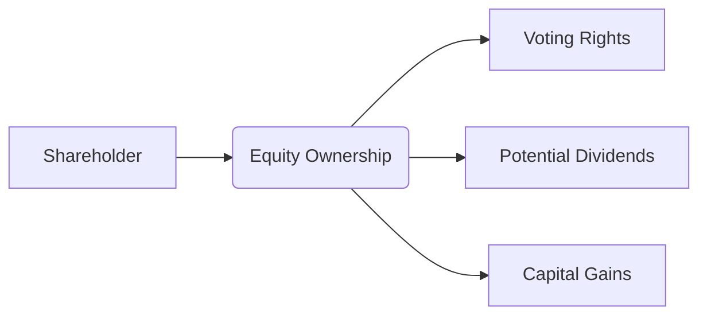

## 20.1 Characteristics of Equity Securities

Equity securities, also known as “stocks” or “shares,” represent an ownership interest in a company. As a shareholder, you benefit when the company performs well, typically through share price appreciation and dividends. Conversely, you share in the risks the company faces—stock prices can also decline, reducing—or in some cases eliminating—the value of your initial investment. This section explains the fundamental characteristics of equity securities and the implications for Canadian investors.

---

### Introduction to Equity Securities

Equity ownership comes with a set of rights and responsibilities. When you hold shares in a company, you are in effect a partial owner. While the degree of control you can exert depends on the number and class of shares you own, certain features, such as limited liability and the potential to earn dividends, generally apply to most share classes.

- **Limited Liability**: Shareholders typically cannot lose more than the amount they invested in the shares. If the company faces financial difficulties or fails, the shareholder’s maximum potential loss is their initial investment.  
- **Potential for Capital Gains**: If the share price rises above your purchase price, you can realize a profit (a “capital gain”) by selling your shares.  
- **Risk of Capital Loss**: The share price can also decline, resulting in a loss if you sell below your purchase price.  
- **Dividend Income**: Companies may distribute a portion of their profits in the form of dividends. In Canada, dividends from taxable Canadian corporations can qualify for the dividend tax credit, which can lower your effective tax rate on this source of income.

In the Canadian context, these features are central to how equity securities fit into a wealth management strategy.

---

### Common Shares

Common shares (often called “common stock” in the United States) are the ordinary form of equity ownership. Key attributes include:

1. **Voting Rights**  
   - Common shareholders typically enjoy one vote per share on major corporate matters, such as electing the board of directors and approving significant transactions.  
   - Voting privileges can be crucial for influencing the company’s strategic direction, especially if you own a large block of shares.  

2. **Potential Dividends**  
   - Dividends on common shares are not guaranteed and fluctuate based on the company’s earnings and strategic priorities.  
   - Canadian residents may benefit from the dividend tax credit, which reduces taxes payable on dividends from eligible Canadian corporations.  

3. **Residual Claim on Assets**  
   - In a liquidation scenario, common shareholders are last in line to receive assets after creditors, bondholders, and preferred shareholders.  

#### Example: RBC Common Shares  
Royal Bank of Canada (RBC), one of the largest Canadian banks, issues common shares traded on the Toronto Stock Exchange (TSX). RBC typically pays a quarterly dividend, which may qualify as an “eligible dividend,” offering an enhanced dividend tax credit to Canadian resident investors. Shareholders can also vote in RBC’s annual general meeting to elect or re-elect its board of directors, influencing the bank’s governance and future initiatives.

---

### Preferred Shares

Preferred shares often have features that set them apart from common shares, such as:

1. **Priority on Dividends**  
   - Preferred shareholders usually receive a fixed or formula-based dividend that has priority over common dividends.  
   - If a company must cut dividends, it generally suspends common share dividends before suspending the preferred share dividends.  

2. **Priority on Liquidation**  
   - In insolvency or liquidation, preferred shareholders have a higher claim on the company’s assets compared to common shareholders.  

3. **Limited or No Voting Rights**  
   - Most preferred shares do not carry voting rights on general corporate matters, unless specific triggers or default events occur.  

#### Example: TD Preferred Shares  
Toronto-Dominion Bank (TD) offers various series of preferred shares. These shares often pay a fixed or floating-rate dividend. Shareholders in these preferred shares get dividend priority and a higher chance of a set dividend yield, but they generally surrender their right to vote in shareholder meetings unless certain conditions materialize (e.g., missed dividend payments).

---

### Dividends and the Canadian Dividend Tax Credit

Dividends represent a key incentive for many investors in Canada:

- **Dividend Tax Credit (DTC)**: This tax credit applies to dividends paid by taxable Canadian corporations.  
- **Eligible vs. Non-Eligible Dividends**: Most dividends from large publicly traded institutions (e.g., BMO, RBC) are considered “eligible dividends,” qualifying for a higher credit. However, smaller private companies often issue “non-eligible” dividends, which grant a slightly lower credit.  
- **Tax Planning**: Working with your tax advisor to structure your portfolio—including the use of dividend-paying stocks—can significantly influence your after-tax returns. Earnings from equity securities are also subject to capital gains taxes if you sell the shares at a profit. The combination of capital gains advantages and dividend tax credits can be beneficial for Canadian investors over time.

---

### Corporate Actions

Companies can undertake various actions—called corporate actions—that affect the number and nature of shares outstanding:

1. **Stock Splits and Reverse Splits**  
   - A stock split increases the number of shares outstanding while decreasing the price proportionately.  
   - A reverse split (or share consolidation) reduces the number of shares outstanding and increases the stock price proportionately.  
2. **Rights Issues**  
   - Companies may issue rights to existing shareholders to buy additional shares at a discount.  
3. **Mergers, Acquisitions, and Takeovers**  
   - Shareholders may receive cash, new shares, or a mix of both if their company is acquired or merges with another firm.

Being aware of corporate actions helps you stay informed about changes to your shareholdings. Such knowledge also aids in evaluating potential impacts on share price and overall portfolio strategy.

---

### Corporate Governance

Corporate governance frameworks define how shareholders influence the company and safeguard their ownership interests. In Canada, typical governance structures include:

- **Board of Directors**: Elected by shareholders to oversee executive management and set long-term strategy.  
- **Annual General Meetings (AGMs)**: Occur at least once a year, allowing shareholders to ask questions, vote on critical issues, and propose new business.  
- **Shareholder Proposals**: Common shareholders can submit proposals to address governance concerns or direct corporate policy, though various regulatory requirements apply.

Good governance practices tend to boost investor confidence and can lead to more stable, sustainable returns over time. Canadian regulatory bodies like the Canadian Securities Administrators (CSA) and the Office of the Superintendent of Financial Institutions (OSFI) set guidelines and oversee governance rules for publicly traded companies and financial institutions.

---

### Regulatory and Institutional Framework in Canada

When investing in equity securities, it’s critical to be aware of the regulatory environment:

- **CIRO (Canadian Investment Regulatory Organization)**: Oversees investment dealers, mutual fund dealers, and market integrity across equity and debt marketplaces in Canada. CIRO enforces rules regarding client disclosure, suitability, and other critical investor protections.  
- **Canadian Securities Administrators (CSA)**: Composed of provincial and territorial securities regulators; it coordinates policy and regulation of Canada’s capital markets.  
- **SEDAR+**: The System for Electronic Document Analysis and Retrieval, where public company filings (financial statements, prospectuses, and other disclosures) can be accessed.  
- **CIPF (Canadian Investor Protection Fund)**: Provides protection to investors for assets held by a member firm if the brokerage becomes insolvent. This coverage does not insure against market losses.

These institutions work collectively to build investor confidence and protect investors’ rights in Canadian markets.

---

### Step-by-Step Approach to Analyzing Equity Securities

Below is a simplified procedure you can follow when deciding whether to acquire or retain equity positions in Canada:

1. **Analyze a Company’s Fundamentals**  
   - Review financial statements (income statement, balance sheet, and statement of cash flows).  
   - Evaluate profitability, growth prospects, and debt levels.  
2. **Assess Industry and Economic Trends**  
   - Investigate the company’s role within its sector—consider analyzing how Canadian pension plans (e.g., CPP Investments, Ontario Teachers’ Pension Plan) evaluate sectoral growth prospects.  
   - Look for indicators (like GDP growth rates or interest rate trends) that can affect share valuations.  
3. **Examine Management and Governance**  
   - Check the expertise and track record of executives.  
   - Review governance disclosures on SEDAR+ and consider the independence and competency of the board of directors.  
4. **Estimate Valuation**  
   - Apply fundamental valuation techniques (e.g., the Dividend Discount Model or discounted cash flow (DCF) analysis). For dividend stocks, consider the Gordon Growth Model:  
     $$
     P_0 = \frac{D_1}{r - g}
     $$  
     where \\(D_1\\) is next year’s expected dividend, \\(r\\) is the required rate of return, and \\(g\\) is the perpetual dividend growth rate.  
5. **Monitor Regulatory and Tax Implications**  
   - Keep updated on relevant rules from CIRO, CSA, and CRA (Canada Revenue Agency).  
   - Evaluate your tax position regarding dividends and capital gains each year and ensure compliance with filing requirements.  
6. **Construct and Rebalance Your Portfolio**  
   - Fit the chosen equity security into your overall asset allocation.  
   - Periodically rebalance to keep your preferred risk-adjusted returns in line with changing market conditions.

Many investors and portfolio managers leverage quantitative libraries such as [QuantLib](https://www.quantlib.org/) for more sophisticated analysis, reinforcing the importance of both qualitative and quantitative assessments.

---

### Practical Mermaid Diagram: Shareholder Flow

Below is a simple Mermaid diagram illustrating a shareholder’s participation in a company’s value creation:

- **Shareholder**: Person or organization investing in the company.  
- **Equity Ownership**: This ties the shareholder’s fortunes to the company’s success.  
- **Voting Rights**: Common shareholders typically have the right to vote in corporate governance.  
- **Potential Dividends**: Companies issue dividends based on profits and board approval.  
- **Capital Gains**: Arise if the share price appreciates.

---

### Best Practices and Potential Pitfalls

#### Best Practices

- **Diversify**: Spread your investments across different sectors and asset classes to mitigate risk.  
- **Stay Informed**: Regularly monitor company news, macroeconomic indicators, and corporate filings on SEDAR+.  
- **Long-Term Perspective**: Many successful Canadian pension funds adopt a longer horizon, seeing short-term volatility as part of a broader growth trajectory.  

#### Pitfalls

- **Over-Concentration**: Placing too much in one stock can amplify vulnerability to market and company-specific risks.  
- **Neglecting Governance**: Poorly governed companies can be riskier investments, even if short-term dividends are high.  
- **Ignoring Tax Implications**: Failing to strategize around the dividend tax credit and capital gains can result in suboptimal after-tax returns.

---

### Additional Resources

1. [CIRO](https://www.ciro.ca) – Regulatory updates and guidelines for dealers and advisors.  
2. [Canadian Securities Administrators (CSA)](https://www.securities-administrators.ca/) – Policy statements, rules, and investor alerts.  
3. [SEDAR+](https://www.sedarplus.ca/) – Database of public company disclosures.  
4. [QuantLib](https://www.quantlib.org/) – Open-source quantitative finance library for modeling and valuation.  
5. “Investment Analysis and Portfolio Management” by Frank K. Reilly and Keith C. Brown – Classic academic reference on equity valuation and portfolio theory.  
6. Online courses in “Corporate Finance” or “Equity Valuation” on Coursera and edX – Ideal for continued learning on advanced valuation techniques.

---

### Conclusion

Equity securities form an essential component of many investors’ portfolios in Canada. They offer potential for long-term growth, dividend income, and participation in corporate governance—if only indirectly. Understanding the distinctions between common and preferred shares, tracking corporate actions, and applying robust valuation methods are fundamental to successful equity investing. Regulatory structures, notably CIRO’s oversight, help maintain market integrity and protect investors’ rights. With this knowledge, you can better navigate equities as part of a well-rounded wealth management strategy.

---

## Equity Securities in Canada: Master Your Knowledge Quiz



### Which of the following best describes the limited liability feature of equity securities?
- [ ] Shareholders cannot lose money when share prices decline.  
- [ ] The company promises to repay the amount of the original investment at maturity.  
- [x] Shareholders are liable only up to the amount they have invested in the shares.  
- [ ] Shareholders receive a guaranteed dividend.  

> **Explanation:** Limited liability shields shareholders from personal liability beyond their initial investment in the event of company losses or bankruptcy.

### Common shareholders typically have:
- [x] Voting rights on significant corporate matters.  
- [ ] Priority over bondholders in liquidation.  
- [ ] Guaranteed dividend payments.  
- [ ] Zero risk of losing capital.  

> **Explanation:** Common shareholders ordinarily receive voting rights but are last in the liquidation order and do not have guaranteed dividends.

### Which of the following is a distinguishing feature of preferred shares?
- [ ] They always offer voting rights on corporate policy.  
- [x] They usually have priority in dividend payments over common shares.  
- [ ] They function like short-term debt instruments.  
- [ ] They are not subject to flucutations in market price.  

> **Explanation:** Preferred shares promise a fixed or formula-based dividend and carry priority in dividend distribution but typically offer limited or no voting rights.

### In the event of corporate liquidation, which group is typically last to receive any remaining assets?
- [ ] Bondholders  
- [ ] Preferred shareholders  
- [ ] Creditors  
- [x] Common shareholders  

> **Explanation:** The payout order generally starts with creditors and bondholders, then preferred shareholders, and finally common shareholders.

### What is one benefit Canadian investors often receive on dividends paid by taxable Canadian corporations?
- [ ] No income tax obligation for dividends.  
- [ ] Dividends are taxed at twice the normal rate.  
- [x] A dividend tax credit that reduces the effective tax rate.  
- [ ] Dividends are taxed as capital gains.  

> **Explanation:** The Canadian tax system offers the dividend tax credit to reduce double taxation on dividends.

### Which of the following describes a stock split?
- [x] An increase in the number of shares outstanding, with a proportionate drop in share price.  
- [ ] A merger between two companies.  
- [ ] A move to liquidate all existing share classes.  
- [ ] A re-evaluation of corporate governance policies.  

> **Explanation:** A stock split increases the number of shares outstanding and decreases the share price proportionally, leaving overall shareholder equity unchanged.

### Which Canadian regulatory body replaced the former MFDA and IIROC to oversee investment dealers and mutual fund dealers?
- [ ] CSA  
- [x] CIRO  
- [ ] CIPF  
- [ ] OSFI  

> **Explanation:** CIRO (Canadian Investment Regulatory Organization) was formed on January 1, 2023, by amalgamating the Mutual Fund Dealers Association (MFDA) and the Investment Industry Regulatory Organization of Canada (IIROC).

### When applying the Dividend Discount Model (DDM), which of the following is NOT typically required as an input?
- [ ] The expected dividend next year ($D_1$)  
- [ ] The required rate of return ($r$)  
- [ ] The perpetual growth rate of dividends ($g$)  
- [x] The face value of the share  

> **Explanation:** The DDM formula focuses on expected future dividends, growth, and the investor’s required rate of return. The share’s “face value” does not factor into this model.

### Which statement about corporate actions is correct?
- [x] Rights issues allow existing shareholders to purchase more shares at a discount.  
- [ ] A reverse stock split results in more shares at a lower share price.  
- [ ] Stock splits guarantee an immediate increase in shareholders’ net worth.  
- [ ] Corporate actions have no impact on the number of shares outstanding.  

> **Explanation:** Rights issues grant current shareholders the right to buy additional shares at a set price, generally lower than the market price.

### True or False: CIPF (Canadian Investor Protection Fund) covers losses in the market value of equity securities.
- [x] True  
- [ ] False  

> **Explanation:** This is actually a trick question. CIPF protects client assets held by an insolvent member firm, not market losses. While CIPF does not insure against normal market fluctuations, it does safeguard account assets up to specified limits in the event the brokerage fails to return client property. Hence, the statement as presented is false, but checking the correct CIPF coverage parameters is crucial for your understanding.  




