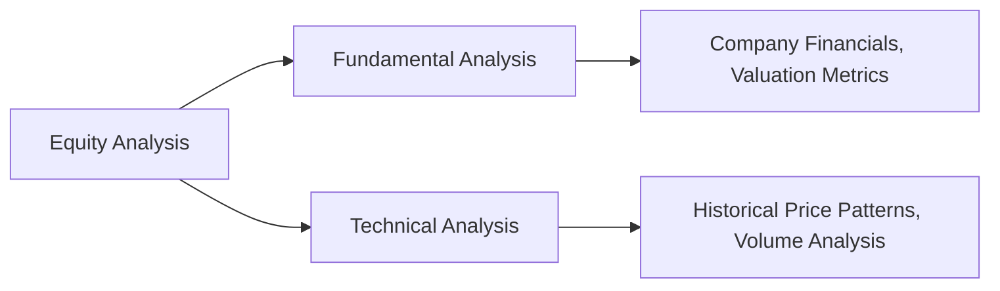

## 20.3 Introduction to Equity Analysis

Equity analysis involves evaluating a company’s fundamentals, financial health, and market position to form an opinion on whether its stock is undervalued, overvalued, or fairly valued. In the Canadian context, this process includes reviewing disclosures on SEDAR+ (System for Electronic Document Analysis and Retrieval +) and applying International Financial Reporting Standards (IFRS) to interpret financial statements. Wealth advisors often combine two main approaches—fundamental and technical analysis—to make informed decisions for their clients.

Below, we explore each aspect of equity analysis, outline key valuation metrics, and highlight important considerations for Canadian investors and advisors alike. Whenever possible, reference official Canadian regulations—particularly from the Canadian Investment Regulatory Organization (CIRO) and the Office of the Superintendent of Financial Institutions (OSFI)—to ensure compliance and alignment with industry best practices.

---

## Fundamental vs. Technical Analysis

### Fundamental Analysis

Fundamental analysis estimates a security’s intrinsic value by examining:

1. The company’s financial statements (balance sheet, income statement, cash flow statement).  
2. Management expertise, competitive environment, and overall market position.  
3. Macroeconomic conditions, including interest rates and GDP growth.  
4. The firm’s industry or sector outlook, including regulatory changes that might affect profitability.

Key data sources for Canadian publicly listed companies include annual reports (filed on SEDAR+), corporate presentations, analyst reports, media coverage, and third-party credit reviews by organizations like Moody’s Analytics, Fitch, or S&P Global.

#### Common Fundamental Metrics

- **Price-to-Earnings (P/E) Ratio**: Compares a firm's share price to its earnings per share. It indicates how much investors are willing to pay for each dollar of earnings.  
- **Price-to-Book (P/B) Ratio**: Examines a company’s share price relative to its book value per share. Provides insight into whether the market values a company more or less than its net asset base.  
- **Return on Equity (ROE)**: Measures how effectively the company uses shareholder equity to generate profits. Typically reported as a percentage.  
- **Dividend Yield**: The ratio of a company’s annual dividend to its share price, expressed as a percentage. Higher yields may appeal to income-oriented investors, though it can also signal slower company growth prospects.

### Technical Analysis

Technical analysis focuses on historical price patterns, trading volume, and other market-based indicators, such as moving averages or momentum oscillators, to forecast future price movements. Technical analysts assume that investor psychology heavily influences price trends and that all relevant information is already embedded in a stock’s price.

Common techniques in technical analysis include support and resistance levels, candlestick charting, and various momentum indicators. While more prevalent among traders, many wealth advisors supplement fundamental analysis with selected technical signals to optimize entry and exit points.

In the above diagram, equity analysis draws insights from both fundamental and technical methods. Fundamental analysis (left) focuses on the firm’s intrinsic value, while technical analysis (right) examines how market trends and trading signals affect the stock price.

---

## Valuation Metrics and Their Importance

Below are the major valuation metrics used in equity analysis:

1. **P/E Ratio**  
   - Helps compare companies within the same sector.  
   - A high P/E may indicate growth potential or overvaluation, depending on context.

2. **P/B Ratio**  
   - Offers insight into how a company’s net assets are valued by the market.  
   - Particularly relevant for financial firms like Canadian banks (e.g., RBC, TD, BMO), where book value reliably approximates net worth.

3. **ROE**  
   - Shows how effectively a company utilizes funds invested by shareholders.  
   - Canadian pension funds often favor companies with high ROE, as it suggests robust management performance and the potential for stable returns.

4. **Dividend Yield**  
   - Attracts investors seeking predictable income streams.  
   - Common in industries like utilities or telecommunications, which typically offer steady dividends.

---

## Qualitative Factors in Equity Analysis

While metrics illuminate a company’s performance, qualitative factors often determine its resilience and growth potential:

- **Management Expertise**: Effective leadership that adapts to changes in market conditions and regulations can drive long-term success.  
- **Brand Reputation**: Canadian companies with strong brand recognition (for example, in banking or consumer goods) often sustain customer loyalty and preserve market share.  
- **Competitive Advantages**: Unique traits like proprietary technology, patents, or a vast distribution network can bolster a company’s economic moat.  
- **Regulatory Environment**: Adhering to CIRO guidelines, OSFI capital requirements, and CRA (Canada Revenue Agency) tax structures significantly shapes a company’s compliance costs and growth prospects.

---

## Risk Assessment

A thorough equity analysis must evaluate various risks that may affect the company:

1. **Business Risk**  
   - Arises from the nature of operations, competition, and customer demand.  
   - Example: A mining company in Ontario faces commodity price swings and environmental regulations, increasing its business risk.

2. **Financial Risk**  
   - Tied to leverage (i.e., how much debt vs. equity the firm uses).  
   - Excessive leverage may magnify returns but also intensifies the risk of insolvency during downturns.

3. **Liquidity Risk**  
   - Reflects how easily a company’s securities can be traded without causing sharp price fluctuations.  
   - Thinly traded stocks on the TSX Venture Exchange may exhibit higher liquidity risk compared to blue-chip stocks listed on the Toronto Stock Exchange (TSX).

4. **Market Risk**  
   - The broader risk of economic events or market volatility affecting stock prices.  
   - Periods of heightened inflation or unexpected interest rate changes imposed by the Bank of Canada can funnel into equity market fluctuations.

---

## Macroeconomic and Industry Analysis

### Macroeconomic Analysis

Macroeconomic conditions in Canada and globally influence corporate earnings and stock valuations. Critical factors include:

- **GDP Growth**: Robust GDP expansion often drives consumer spending and corporate profits.  
- **Interest Rates**: Monetary policy by the Bank of Canada affects borrowing costs and consumer purchasing power, influencing company sales and profitability.  
- **Inflation**: Rising prices can erode real returns and increase input costs, but certain sectors (like commodities) may benefit from inflationary periods.  
- **Currency Exchange Rates**: Canadian exporters might gain a competitive edge when the Canadian dollar weakens against key foreign currencies like the U.S. dollar.

### Industry or Sector Analysis

Industries often behave differently under various economic environments:

- **Cyclical Sectors** (e.g., automotive, consumer discretionary) tend to be more sensitive to economic booms and recessions.  
- **Defensive Sectors** (e.g., utilities, consumer staples) fare better during economic downturns due to consistent demand.

As Canadian regulations or trade policies evolve, an industry’s competitiveness may shift. Monitoring the legislative environment and trade relationships, such as the Canada-United States-Mexico Agreement (CUSMA), can help predict changes in a firm’s outlook.

---

## Putting It All Together: A Practical Approach

When analyzing a Canadian equity, consider the following step-by-step approach:

1. **Gather Company Information**  
   - Obtain recent financial statements and management discussion & analysis (MD&A) from SEDAR+.  
   - Review analyst reports and credit ratings from reputable agencies (Moody’s, Fitch, S&P Global).

2. **Conduct Fundamental Analysis**  
   - Calculate valuation ratios (P/E, P/B, ROE, Dividend Yield).  
   - Evaluate profitability, liquidity, and solvency ratios.  
   - Assess the quality and experience of management and the strength of the brand.

3. **Supplement with Technical Analysis**  
   - Chart price trends and identify support/resistance levels.  
   - Examine volume patterns to confirm price movements.

4. **Perform a Macro and Industry Review**  
   - Note prevailing interest rates, inflation trends, and GDP forecasts.  
   - Determine if the stock’s industry is cyclical or defensive and whether it faces regulatory headwinds or tailwinds.

5. **Assess Risk and Prepare Contingencies**  
   - Evaluate business, financial, liquidity, and market risk.  
   - Identify scenario outcomes (best-case, base-case, worst-case) and the likelihood of each.

6. **Formulate Your Recommendation**  
   - Decide whether the stock is undervalued, fairly valued, or overvalued.  
   - If suitable, integrate the security into a holistic portfolio strategy considering asset allocation, risk tolerance, and tax implications.

7. **Review, Monitor, and Reassess**  
   - Keep up-to-date with quarterly earnings and news releases.  
   - Periodically recalculate valuations and adjust recommendations as needed.

---

## Additional Resources

- **CIRO (Canadian Investment Regulatory Organization)**: Oversees investment dealers and monitors market integrity. Visit https://www.ciro.ca for current regulations and industry notices.  
- **CIPF (Canadian Investor Protection Fund)**: Provides investor protection if a member firm becomes insolvent.  
- **CFA Institute**: Offers comprehensive materials on equity and industry analysis, including the latest best practices for valuation.  
- **Open-Source Tools**: Python libraries (e.g., pandas, NumPy) or R packages (e.g., tidyquant) can assist in building valuation models and performing statistical analysis.  
- **Online Courses**: Platforms like Udemy or LinkedIn Learning (formerly Lynda) provide tutorials on financial modeling and advanced equity valuation (e.g., Discounted Cash Flow (DCF) techniques).

---

## Summary

Equity analysis in the Canadian market requires a balanced blend of qualitative and quantitative assessments. By evaluating financial statements in line with IFRS, monitoring disclosures on SEDAR+, and incorporating broader economic indicators, advisors can gain insights into a company’s true worth. Risk assessment, from business to market risk, should guide portfolio allocations. Finally, continuous monitoring and periodic re-evaluation ensure that investors can adapt their equity strategies to evolving economic and market conditions.

---

## Master Equity Analysis: Test Your Understanding



### Which of the following best describes fundamental analysis?

- [x] A method of assessing a security’s intrinsic value using economic and financial factors
- [ ] A method of evaluating securities solely on past price and trade volume
- [ ] A theoretical approach that disregards macroeconomic influences
- [ ] An informal process that prioritizes market rumors over audited statements

> **Explanation:** Fundamental analysis focuses on real data, such as financial statements, economic indicators, and management quality, to estimate a company’s intrinsic value.

### When calculating the P/E ratio, an unusually high ratio generally suggests:

- [x] The market expects strong future growth or views the stock as overvalued
- [ ] The market believes the stock is fundamentally undervalued
- [ ] The stock has zero business risk
- [ ] A healthy dividend payout ratio

> **Explanation:** A high P/E ratio can indicate positive investor expectations about future earnings or, conversely, a sign of overvaluation.

### Which macroeconomic factor is most directly linked to borrowing costs for companies?

- [ ] Inflation
- [x] Interest rates
- [ ] Exchange rates
- [ ] GDP growth

> **Explanation:** Interest rates, set in part by the Bank of Canada, directly influence corporate borrowing costs and can thereby impact a firm’s profitability.

### Which type of sector tends to be more resistant to economic fluctuations?

- [ ] Automotive manufacturing
- [ ] Retail
- [x] Consumer staples
- [ ] Hospitality and tourism

> **Explanation:** Defensive sectors like consumer staples provide essential products that remain in demand regardless of the economic cycle.

### A company with a high ROE typically indicates:

- [x] The company is using its equity effectively to generate profits
- [ ] The company finances only through debt
- [x] Potentially attractive performance for equity investors
- [ ] Guaranteed high future dividend payments

> **Explanation:** A strong ROE shows efficiency in using shareholders’ equity to generate net income, attracting investors seeking robust return potential.

### How does technical analysis complement fundamental analysis?

- [x] It helps identify optimal entry and exit points for a security
- [ ] It replaces the need for evaluating company financial statements
- [ ] It provides in-depth knowledge of corporate governance standards
- [ ] It predicts exact future earnings growth

> **Explanation:** Technical analysis focuses on price patterns and market trends, while fundamental analysis focuses on intrinsic value; combining both can enhance a well-timed investment strategy.

### If a company’s P/B ratio is significantly below 1, it might suggest:

- [x] The market values the firm’s net assets at less than their book value
- [ ] The company has no equity financing
- [x] Possible undervaluation, though it requires more analysis
- [ ] High expectation of future dividends

> **Explanation:** A low P/B ratio often suggests undervaluation relative to assets, or potential operational or sector-specific concerns. Further analysis is crucial.

### Which source is most relevant for obtaining accurate and timely financial statements of Canadian public companies?

- [x] SEDAR+
- [ ] Local business newspapers
- [ ] Informal social media polls
- [ ] Company press releases only

> **Explanation:** Companies file continuous disclosure documents on SEDAR+, ensuring publicly available, government-regulated financial data.

### Why might high financial leverage increase a company’s risk?

- [x] Debt amplifies both gains and losses, raising the risk of insolvency
- [ ] It guarantees stronger earnings in all market conditions
- [ ] It eliminates the need for equity financing
- [ ] It stabilizes stock prices

> **Explanation:** While leverage can boost returns when times are good, it also increases the risk of default during downturns, as debt obligations remain fixed.

### True or False: CIRO replaced IIROC and MFDA as the national self-regulatory body overseeing investment dealers and mutual fund dealers in Canada.

- [x] True
- [ ] False

> **Explanation:** On January 1, 2023, the MFDA and the Investment Industry Regulatory Organization of Canada (IIROC) amalgamated to form the Canadian Investment Regulatory Organization (CIRO), now overseeing both investment and mutual fund dealers across the country.


