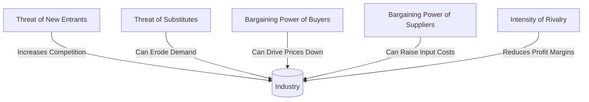

## 20.4 Industry Analysis

Industry analysis is a critical step in equity research and wealth management. Advisors who comprehend the competitive landscape of a specific sector can better anticipate the future profitability, risks, and opportunities for companies operating in that space. Successful industry analysis incorporates frameworks such as Porter’s Five Forces, the industry life cycle model, regulatory and political influences, and macroeconomic trends. Canadian wealth advisors must also consider unique factors such as the local regulatory environment, North American Industry Classification System (NAICS) codes, and guidance from Canadian financial institutions and organizations like CIRO (Canadian Investment Regulatory Organization), the Bank of Canada, and Innovation, Science and Economic Development (ISED) Canada.

---

## Understanding Porter’s Five Forces

A widely used methodology for industry analysis is Michael Porter’s Five Forces framework. This tool provides a structured approach to evaluate the intensity of competition within an industry. It examines the following dimensions:

1. **Threat of New Entrants**  
   - Industries with low barriers to entry invite new competitors, potentially driving down prices and profits.  
   - Example: Technology startups in Canada often face low initial costs, making entry feasible but also intensifying competition.

2. **Threat of Substitutes**  
   - Substitute products or services can erode demand for existing offerings.  
   - In Canada’s energy industry, for instance, renewable sources like solar and wind are substitutes for traditional oil and gas.

3. **Bargaining Power of Buyers**  
   - Powerful buyers can force prices down or demand additional services.  
   - Large Canadian grocery chains, for example, can exert greater negotiating power on suppliers due to their scale.

4. **Bargaining Power of Suppliers**  
   - Concentrated or specialized suppliers can charge more or limit supply, affecting profitability.  
   - In pharmaceuticals, a small number of specialized raw material suppliers can drive up costs for medication manufacturers.

5. **Intensity of Rivalry**  
   - Highly competitive markets see price wars or marketing battles, diminishing profit margins.  
   - Canadian telecom providers, such as Bell, Rogers, and Telus, engage in intense rivalry over market share.

**Explanation**: The diagram shows how each of Porter’s Five Forces influences the competition and profitability of an industry. By understanding these forces, advisors can assess an industry’s attractiveness for investment.

---

## Industry Life Cycle Stages

Another important consideration is where the industry stands in its life cycle. Each phase—introduction, growth, maturity, and decline—offers different potential risks and rewards:

1. **Introduction**  
   - New or emerging sectors with high development costs and uncertain demand.  
   - Example: Early-stage clean technologies or niche biotech solutions often face initial hurdles like securing funding or proving feasibility.

2. **Growth**  
   - Rising sales, increasing profits, and expanding market share.  
   - Canadian tech companies, such as those in Toronto’s innovation corridor, often experience this phase with strong venture capital support.

3. **Maturity**  
   - Slowing growth, stable demand, and consolidated market actors.  
   - Many consumer staples and financial services in Canada (e.g., big banks like RBC or BMO) operate in mature industries.

4. **Decline**  
   - Shrinking demand, excess capacity, and ongoing consolidation or exit by weaker players.  
   - Print media in Canada, for instance, has grappled with a secular decline as digital content gains traction.

Identifying an industry’s life cycle is vital, as it influences expected returns, risk profiles, and subsequent management strategies.

---

## Regulatory and Political Factors

In Canada, certain industries are shaped heavily by regulation and political intervention:

- **Financial Services**: Governed by OSFI (Office of the Superintendent of Financial Institutions) for solvency, and CSA (Canadian Securities Administrators) and CIRO for market and dealer oversight.  
- **Energy**: Impacted by federal, provincial, and environmental regulations, including carbon pricing.  
- **Healthcare**: Provincial health authorities and national regulations determine approval processes and reimbursement rates for drugs and medical devices.

Changes to legislation, compliance requirements, or political priorities can cause sudden shifts in cost structures, affect market demand, or alter profit margins. Advisors need to track relevant government resources, such as ISED Canada’s sector-specific policies and the Bank of Canada’s assessments, to gauge the regulatory climate and potential legislative changes.

---

## Macroeconomic, Technological, and Demographic Trends

Beyond competition and regulation, industries evolve due to external trends:

1. **Macroeconomic Trends**  
   - Interest rates set by the Bank of Canada can affect borrowing costs and consumer spending.  
   - Currency fluctuations, GDP growth, and inflation rates often influence sectors like exports or consumer goods.

2. **Technological Advancements**  
   - Disruptive technologies can reshape entire markets, as e-commerce did for retail or FinTech for banking.  
   - Advisors should monitor patents, R&D spending, and emerging technologies in Canada’s innovation ecosystems.

3. **Demographic Shifts**  
   - Canada’s aging population affects industries related to retirement living, healthcare, and wealth transfer services.  
   - Changing immigration policies can expand labor pools or consumer markets, driving growth in housing and consumer goods.

**Cyclical Trends** are linked to the broader economic cycle and may recede or reappear periodically (e.g., housing booms and busts), while **Secular Trends** (like digitization or population aging) often reshape demand and business models over the long term.

---

## Market Structure and Key Players

Evaluating an industry’s market structure involves identifying major players and how market share is distributed:

- **Oligopoly**: A few dominant firms hold the majority of market share. Canadian telecom exemplifies this, with a handful of major companies dominating the space.  
- **Monopoly**: A single firm effectively controls the market, limiting competitive pressure. While true monopolies are rare, certain regional utilities in Canada function similarly.  
- **Competitive Markets**: Numerous firms ensure no single company has disproportionate influence.

**Market share** analysis will indicate which companies have pricing power or benefit from economies of scale. For instance, Royal Bank of Canada (RBC) and Toronto-Dominion Bank (TD) maintain significant leverage in card services and lending due to their extensive client bases.

---

## Practical Approaches for Industry Analysis

When applying industry analysis to a portfolio, Canadian wealth advisors can consider these steps:

1. **Classify the Industry**: Use the NAICS codes to ensure you compare similar firms and gather accurate financial metrics and industry benchmarks.  
2. **Review Porter’s Five Forces**: Assess how strong each force is in the current market environment for the sector of interest.  
3. **Determine the Life Cycle Stage**: Identify whether the industry is early-stage, rapidly growing, maturing, or in decline.  
4. **Analyze Regulatory Impacts**: Investigate how Canadian financial rules and government policies might raise or lower opportunities and risks.  
5. **Evaluate Macroeconomic Signals**: Check Bank of Canada interest rate announcements, inflation data, and relevant economic forecasts.  
6. **Consider Technologies and Demographics**: Identify whether the sector is likely to evolve due to technology innovations or shifts in population segments.  
7. **Compare Major Players**: Review market share, competitive advantages, and cost leadership.  
8. **Draw Conclusions for Portfolio Construction**: Decide if the industry is likely to generate above-average returns or if it faces headwinds. Adjust asset allocation accordingly.

---

## Example: Canadian Pension Funds in the Energy Sector

Canadian pension funds, such as the Canada Pension Plan Investment Board (CPPIB) or Ontario Teachers’ Pension Plan (OTPP), often perform extensive industry analysis before investing in energy infrastructure projects. They consider:

- Regulatory influences (e.g., carbon taxes or pipeline approvals).  
- The position of each subsector (renewables vs. conventional oil and gas) within the energy life cycle.  
- Technological innovations that could boost efficiency or create new substitutes.  
- International demand, especially from rising economies, and currency risks for cross-border investments.

By combining long-term forecasting with thorough industry evaluation, these pension funds align their large-scale portfolios with stable, growth-oriented opportunities.

---

## Best Practices and Common Pitfalls

### Best Practices
- **Use Multiple Data Sources**: Cross-reference analyst reports with governmental datasets (e.g., ISED, Bank of Canada) for more robust conclusions.  
- **Stress Test for Downturns**: Evaluate how industries respond to adverse economic conditions, especially those sensitive to interest rate hikes or commodity price swings.  
- **Stay Updated on Regulations**: Follow announcements from CIRO and the CRA for any changes that could affect investment or taxation rules.

### Potential Pitfalls
- **Overlooking Emerging Competitors**: Missing the rise of new entrants equipped with disruptive technology.  
- **Ignoring Global Context**: Some industries, such as automotive or aerospace, are closely tied to global trade policies and currency exchange rates.  
- **Failing to Differentiate Cyclical and Secular Trends**: Misinterpreting a lasting shift in consumer behavior as a short-lived economic cycle can derail long-term strategies.

---

## Canadian Regulatory References and Additional Resources

- **Canadian Investment Regulatory Organization (CIRO)**: Oversees investment dealers and mutual fund dealers in Canada. Visit [ciro.ca](https://www.ciro.ca) for current regulation updates.  
- **Office of the Superintendent of Financial Institutions (OSFI)**: Sets solvency guidelines for banks and insurers.  
- **Canadian Securities Administrators (CSA)**: Coordinates regulation of Canadian capital markets.  
- **Innovation, Science and Economic Development (ISED) Canada**: Provides detailed industry reports, policy documents, and statistics (https://ised-isde.canada.ca/).  
- **Bank of Canada**: Releases key macroeconomic metrics, inflation targets, and interest rate decisions (https://www.bankofcanada.ca/).  
- **North American Industry Classification System (NAICS)**: Allows standardized industry classification to compare data across firms.  
- **Textbook**: “Competitive Strategy” by Michael E. Porter offers additional depth on applying the Five Forces framework.

---

## Summary

Industry analysis is a critical component of effective equity research and wealth management. Advisors must evaluate competitive dynamics, identify industry life cycle stages, account for regulatory and political factors, and monitor macroeconomic and demographic trends. By integrating frameworks like Porter’s Five Forces with local Canadian insights, wealth managers can uncover opportunities and mitigate risks in a range of sectors—from financial services to energy, healthcare, and beyond. Understanding how each sector responds to technological, economic, and demographic changes is crucial for long-term investment success and prudent portfolio construction.

---

## Test Your Knowledge: Mastering Industry Analysis for Canadian Investors



### Which of the following best describes the purpose of Porter’s Five Forces?

- [x] To evaluate the competitive environment surrounding an industry
- [ ] To determine a company’s exact market share
- [ ] To identify a company’s internal cost structure
- [ ] To set price targets for an equity security

> **Explanation:** Porter’s Five Forces framework analyzes the competitive forces—including buyers, suppliers, new entrants, substitutes, and rivalry—that shape an industry’s profitability.

---

### What stage of the industry life cycle typically exhibits high growth and expanding market share?

- [ ] Introduction
- [x] Growth
- [ ] Maturity
- [ ] Decline

> **Explanation:** During the growth stage, an industry experiences a rapid increase in demand, revenue, and market penetration.

---

### Which of the following is the current self-regulatory organization overseeing Canadian investment dealers and mutual fund dealers?

- [x] CIRO (Canadian Investment Regulatory Organization)
- [ ] IIROC (Investment Industry Regulatory Organization of Canada)
- [ ] MFDA (Mutual Fund Dealers Association of Canada)
- [ ] CIPF (Canadian Investor Protection Fund)

> **Explanation:** As of June 1, 2023, IIROC and MFDA have been amalgamated into CIRO, making it Canada’s national self-regulatory body.

---

### What role does the Bank of Canada play that can directly impact industry analysis?

- [x] It sets monetary policy and influences interest rates.
- [ ] It approves corporate mergers and acquisitions.
- [ ] It enforces guidelines for industry competition.
- [ ] It provides individual investor guarantees.

> **Explanation:** The Bank of Canada’s monetary policy decisions, including interest rate changes, can significantly affect borrowing costs, consumer spending, and overall business conditions.

---

### In the context of Canadian markets, which of the following industries is most notably impacted by both federal and provincial regulations?

- [x] Energy
- [ ] Retail groceries
- [ ] Hospitality
- [ ] Software development

> **Explanation:** Energy projects often require federal and provincial environmental and regulatory approvals, especially in resource-rich provinces like Alberta.

---

### Which of the following best describes a “secular trend”?

- [x] A long-term, sustained change not tied to short-term economic cycles
- [ ] A brief fluctuation within a single fiscal quarter
- [ ] A seasonal increase in retail sales
- [ ] An anomaly in commodity pricing

> **Explanation:** Secular trends, such as digitization or aging demographics, unfold independently of short business cycles and can redefine entire industries over time.

---

### Which step is essential when applying industry analysis for portfolio construction in Canada?

- [x] Reviewing relevant NAICS codes for accurate comparisons
- [ ] Selecting an industry based solely on media coverage
- [x] Monitoring interest rate announcements by the Bank of Canada
- [ ] Ignoring political and regulatory considerations

> **Explanation:** Classifying an industry using NAICS codes and monitoring interest rate policies are both important for making precise and informed investment decisions.

---

### How might advisors factor in Canadian pension fund strategies when performing industry analysis?

- [x] By observing large-scale investment trends in certain industries
- [ ] By mimicking only short-term trades
- [ ] By ignoring macroeconomic data
- [ ] By focusing solely on dividend yields

> **Explanation:** Canadian pension funds, due to their size and influence, often set trends in how they allocate capital, especially in regulated or capital-intensive industries.

---

### Which of the following is a common pitfall in industry analysis?

- [x] Failing to differentiate cyclical trends from secular trends
- [ ] Reviewing multiple industry data sources
- [ ] Analyzing company financial statements
- [ ] Considering regulatory shifts

> **Explanation:** Mixing up cyclical shifts with secular, long-term changes can result in inaccurate forecasting and misaligned investment strategies.

---

### True or False: In Canada, a monopoly implies that government regulations do not apply to the single dominant firm.

- [x] True
- [ ] False

> **Explanation:** Even if a single firm dominates the market, government regulations, anti-trust laws, and consumer protection rules can still restrict its activities in Canada.


