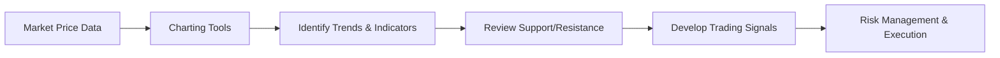

## 20.6 Technical Analysis

Technical analysis is a method of evaluating securities by analyzing market-generated data such as historical prices, volume, and other related metrics. Rather than focusing on a company’s intrinsic value or fundamentals, technical analysis relies on price action and commonly used indicators to project future price movements. In Canada, individual investors, major banks (e.g., RBC, TD, BMO), and institutional players like pension funds often incorporate some degree of technical analysis into their investment decision-making processes.

Below, we examine the key concepts, tools, and practical steps involved in technical analysis, along with specific Canadian regulatory considerations and local examples.

---

### The Role and Purpose of Technical Analysis

1. **Market-Generated Data**  
   Technical analysis seeks to detect patterns and signals derived from price action, trading volume, and indicators (e.g., moving averages). It assumes that historical price behavior can provide clues about potential future movements.

2. **Short-Term Trading and Long-Term Timing**  
   While often associated with short-term strategies, technical analysis also helps longer-term investors refine entry and exit points. For example, a Canadian pension fund might use technical indicators to time partial rebalancing or to hedge equity exposure.

3. **Contrasting with Fundamental Analysis**  
   Technical analysts do not prioritize financial statements, macroeconomic data, or corporate earnings. In contrast, fundamental analysts attempt to evaluate a security’s “true value.” Many advisors blend both methods, seeking the “best of both worlds.”

4. **Efficient Market Hypothesis (EMH) Considerations**  
   Some observers claim that markets are efficient (i.e., all known information is priced in) and that using historical price data to predict future moves cannot yield consistent outperformance. Nonetheless, technical analysts often assert there are pockets of short-term inefficiencies to exploit.

---

### Understanding Charts

Visual representations of price data are pivotal in technical analysis. Several chart types are popular:

1. **Line Charts**  
   - Plot only closing prices over time.  
   - Provide a simple snapshot of long-term trends but may omit important intraday fluctuations.

2. **Bar Charts**  
   - Display each period’s high, low, open, and close (HLOC).  
   - Reveal intraday volatility, which can be valuable for timing trades in rapidly moving markets like the Toronto Stock Exchange (TSX).

3. **Candlestick Charts**  
   - A variation of bar charts, with “candles” highlighting the open-to-close range and wicks showing the high and low.  
   - Offer a clear visual differentiation between bullish (price rising) and bearish (price falling) sessions.

---

### Support and Resistance Levels

- **Support Level**  
  A price point where downward momentum may slow due to increased buying interest. For example, if a stock repeatedly bounces above $50 per share, that price could be viewed as support.
  
- **Resistance Level**  
  A price point where upward momentum may weaken due to heightened selling interest. For instance, if the same stock stalls repeatedly at $60 per share, it can be considered a resistance zone.

Identifying support and resistance is vital for planning exits, setting stop-loss orders, or determining profitable entry points. Canadian traders, whether retail investors or professionals, usually observe support and resistance on TSX stocks to gauge potential near-term shifts in buying and selling pressure.

---

### Popular Technical Indicators

Technical indicators help quantify momentum, trends, and volatility. Some of the most widely used include:

1. **Moving Average (MA)**  
   - Smooths out short-term price fluctuations by calculating average prices over a specific lookback period (e.g., 50-day or 200-day).  
   - A rising MA may indicate an uptrend; a falling MA suggests downward momentum.

2. **Relative Strength Index (RSI)**  
   - Oscillator ranging from 0 to 100 that measures the speed and change of price movements.  
   - Readings above 70 often signal overbought conditions, while readings below 30 can indicate oversold levels.

3. **Moving Average Convergence Divergence (MACD)**  
   - Shows the relationship between two exponential moving averages of a stock’s price.  
   - Often plotted with a signal line and a histogram, MACD can help identify trend changes or momentum shifts.

4. **Bollinger Bands**  
   - Consist of a moving average plus upper and lower bands (standard deviations away from the average).  
   - When bands widen, volatility is high; when they narrow, volatility is low, potentially signaling an upcoming breakout.

---

### Risk Management in Technical Trading

Because technical trading often aims to capture shorter-term price movements, risk management becomes essential:

- **Stop-Loss Orders**  
  An order to liquidate a position once a security falls below (or rises above, for short positions) a predetermined price. Helps traders protect against significant losses if the market moves unexpectedly.

- **Position Sizing**  
  Controlling the proportion of capital allocated to any single trade or sector (e.g., Canadian financials versus energy stocks) to limit potential drawdowns.

- **Diversification**  
  Combining multiple types of trades, securities, or asset classes to ensure that a single adverse price movement doesn’t unduly impact the portfolio.

---

### Applying Technical Analysis in Canada

1. **Regulatory Considerations**  
   - In Canada, the Canadian Investment Regulatory Organization (CIRO) oversees investment dealers and mutual fund dealers and enforces rules around suitability. Advisors incorporating technical analysis into recommendations should ensure they meet CIRO’s guidelines on product and strategy suitability for each client’s risk tolerance, objectives, and time horizon.

2. **Integration with Fundamental Perspectives**  
   - Even large Canadian pension funds may pair fundamental valuations with technical triggers. For instance, if a pension fund believes a TSX-listed stock is undervalued fundamentally, it might wait for a definitive technical breakout above a key resistance level before increasing its allocations.

3. **Local Market Nuances**  
   - Factors such as dividend yields, bank earnings schedules (RBC, TD, BMO), and resource sector cycles (oil, mining) can cause unique price patterns on the TSX. Awareness of these patterns can aid in applying technical tools effectively.

---

### Practical Steps and Example

Below is a simplified workflow for integrating technical analysis into your decision-making:

1. **Collect Market Data**  
   Obtain up-to-date historical prices and volume data (e.g., from the TSX or alternative trading platforms).  
2. **Charting Tools**  
   Use charting platforms such as TradingView or open-source libraries like “ta-lib” for computing MACD, RSI, Bollinger Bands, and other indicators.  
3. **Trend and Indicator Analysis**  
   Look for patterns (e.g., moving average crossovers) and oscillator signals (RSI over 70) that suggest potential changes in market sentiment.  
4. **Assess Support & Resistance**  
   Combine the identified indicators with known support or resistance levels; watch for breakouts or bounces off key price points.  
5. **Develop Trading Signals**  
   If signals confirm your bullish or bearish hypothesis, define clear entry and exit prices.  
6. **Implement Risk Management**  
   Set stop-loss orders and size positions in line with your risk appetite and the guidelines set by your firm and CIRO.  

---

### Considerations Under the Efficient Market Hypothesis (EMH)

Proponents of EMH argue that historical price data and chart patterns are already reflected in current prices, thus rendering technical analysis ineffective over the long term. However, advanced practitioners with swift analytical tools or specialized insights may identify short-lived inefficiencies, especially in less liquid Canadian equity segments. Whether or not such opportunities can persist remains a central debate between fundamentalists and technical analysts.

---

### Tools, Designations, and Further Resources

- **CMT Association**  
  For those seeking in-depth expertise, the Chartered Market Technician (CMT) program (https://cmtassociation.org/) offers a globally recognized credential in technical analysis.  
- **Quantitative Research**  
  Academic platforms, such as SSRN, contain research papers that delve deeper into the efficacy of various technical signals.  
- **Open-Source Libraries**  
  “ta-lib” (https://github.com/TA-Lib/ta-lib-python) provides Python-based functions for commonly used technical indicators.  
- **Regulatory References**  
  - CIRO (https://www.ciro.ca), which replaced the historical IIROC and MFDA, sets the standards for market integrity and dealer conduct.  
  - CIPF is Canada’s sole investor protection fund, ensuring coverage of client assets in case of dealer insolvency.  

---

### Glossary of Key Terms

- **Support Level**  
  A price level where downward movement may stall due to increased buying interest.  
- **Resistance Level**  
  A price level where upward movement may stall due to increased selling interest.  
- **Moving Average (MA)**  
  A tool to smooth price data by taking the average price over a specified period.  
- **Relative Strength Index (RSI)**  
  A momentum oscillator that gauges overbought or oversold conditions.  
- **MACD (Moving Average Convergence Divergence)**  
  A trend-following momentum indicator comparing two moving averages of price.  
- **Bollinger Bands**  
  An envelope around a moving average, indicating market volatility.  
- **Stop-Loss Order**  
  An order to limit a trader’s loss or protect profit once the price crosses a specified threshold.  
- **Efficient Market Hypothesis (EMH)**  
  A theory stating that all known information is already priced into the market, making it hard to consistently outperform.

---

### Key Takeaways

1. Technical analysis centers on interpreting markets through patterns and indicators in price and volume data.  
2. Charting methods (line, bar, candlestick) are fundamental to visualizing market movements and identifying pivotal support and resistance points.  
3. Widely-used tools (e.g., Moving Averages, RSI, MACD) help solidify an investor’s sense of current market momentum and possible trend changes.  
4. Risk management is paramount. Practitioners protect themselves with stop-loss orders, careful position sizing, and systematic reviews of trades.  
5. While critics invoke the EMH to dispute the effectiveness of technical analysis, many traders and Canadian institutions integrate elements of it into broader strategies.  
6. Canadian regulations, especially CIRO’s guidelines on suitability, should be observed when using technical analysis in professional client advisory roles.

---

## Canadian Technical Analysis Mastery: 10-Question Quiz



### 1. What is the main focus of technical analysis?

- [x] Analyzing market-generated data such as price and volume  
- [ ] Evaluating a company’s fundamentals and earnings  
- [ ] Investigating macroeconomic variables  
- [ ] Determining the appropriate interest rate decisions  

> **Explanation:** Technical analysis relies on price, volume, and other market data to forecast future movements, unlike fundamental analysis, which focuses on intrinsic factors of a company.

### 2. Which chart type displays the open, high, low, and close all in one bar?

- [ ] Line chart  
- [x] Bar chart  
- [ ] Candlestick chart  
- [ ] Heikin-Ashi chart  

> **Explanation:** Bar charts show the opening and closing prices with a vertical line indicating the high and low. Candlestick charts also show these points but emphasize open-close relationships visually.

### 3. When a stock consistently bounces upward after reaching a certain price level, that level is commonly referred to as:

- [ ] Resistance  
- [x] Support  
- [ ] Stop  
- [ ] Breakout  

> **Explanation:** A support level is a price point where buying pressure often halts or reverses a downward trend.

### 4. A Relative Strength Index (RSI) reading above 70 typically suggests:

- [x] Overbought conditions  
- [ ] Strong bullish confirmation  
- [ ] Oversold conditions  
- [ ] No significant signal  

> **Explanation:** An RSI above 70 signals a potential overbought condition.

### 5. Which of the following is NOT true about Bollinger Bands?

- [ ] They use a moving average and standard deviations  
- [ ] They help indicate market volatility  
- [ ] They narrow during low volatility  
- [x] They are based solely on trading volume  

> **Explanation:** Bollinger Bands rely on a moving average and measure volatility through standard deviations of price, not volume alone.

### 6. What is the primary purpose of a stop-loss order?

- [x] To limit potential losses or protect profits  
- [ ] To identify support levels  
- [ ] To automatically execute a limit buy order at a higher price  
- [ ] To reduce the overall portfolio volatility  

> **Explanation:** A stop-loss order automatically sells (or buys for a short position) a security once it reaches a specific price, limiting further losses or safeguarding profits.

### 7. Which entity is responsible for overseeing investment dealers and mutual fund dealers in Canada as of 2025?

- [ ] MFDA  
- [ ] IIROC  
- [x] CIRO  
- [ ] CIPF  

> **Explanation:** The Mutual Fund Dealers Association (MFDA) and the Investment Industry Regulatory Organization of Canada (IIROC) amalgamated into the Canadian Investment Regulatory Organization (CIRO).

### 8. Which statement best describes the view of the Efficient Market Hypothesis (EMH) on technical analysis?

- [ ] It believes technical analysis is the only way to beat the market  
- [x] It asserts that historical price data cannot lead to consistent outperformance  
- [ ] It encourages the use of indicators like MACD and RSI  
- [ ] It focuses on accounting deficiencies in reported earnings  

> **Explanation:** EMH holds that markets incorporate all known information into prices, thereby reducing or negating any advantage from analyzing past prices and patterns.

### 9. What is a practical step for risk management when using technical analysis in a Canadian equity portfolio?

- [x] Setting a stop-loss order for each position  
- [ ] Relying solely on support and resistance levels  
- [ ] Maintaining a 100% allocation to volatile stocks  
- [ ] Ignoring short-term market fluctuations  

> **Explanation:** Implementing stop-loss orders and prudent position sizing are key practices to manage risk effectively.

### 10. True or False: Major Canadian pension funds may combine technical and fundamental analysis to optimize investment decisions.

- [x] True  
- [ ] False  

> **Explanation:** Many large institutional investors in Canada use a blended approach, integrating fundamental value assessments with technical triggers for refined timing.


