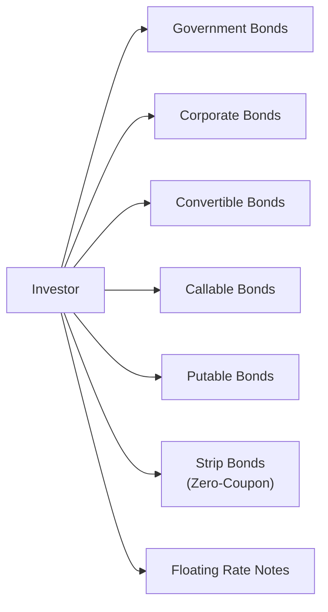

## 21.2 Types of Debt Securities

Canadian investors can access a wide variety of debt securities for their portfolios, ranging from government bonds with relatively low credit risk to corporate offerings with higher yields. Understanding the features, risks, and regulatory considerations of each can help align fixed-income selections with a client's needs and objectives.

Below are the core types of debt securities commonly available to Canadian investors.

---

### Government Bonds

Government bonds include securities issued by:

- The Government of Canada (often considered the “benchmark” for Canadian debt)  
- Provincial governments (e.g., Ontario, British Columbia, Quebec)  
- Municipal governments (e.g., City of Toronto bonds)

Key characteristics:  
- Typically carry lower credit risk compared to corporate bonds.  
- Yields are generally lower because of the government’s perceived higher credit quality.  
- Interest is fully taxable at the investor’s marginal tax rate.  
- Range of maturities: from short-term Treasury Bills (T-bills) to 30-year bonds.

Canadian pension funds such as the Canada Pension Plan Investment Board (CPPIB) and Ontario Teachers’ Pension Plan often allocate a significant portion of their fixed-income portfolios to federal and provincial bonds, seeking stable returns and capital preservation.

---

### Corporate Bonds

Corporate bonds are issued by Canadian and international corporations to finance business activities. Examples include bonds from major Canadian banks (e.g., RBC, TD, BMO) or leading companies in various sectors (e.g., telecommunications, utilities, energy).

Key characteristics:  
- Carry higher credit risk than government bonds, compensated by higher yields.  
- Bond ratings range from “investment-grade” (e.g., BBB- or higher) to “high-yield” (below BBB-).  
- Subject to market liquidity and default risk.  
- Investors should closely monitor credit ratings from firms such as DBRS Morningstar, Moody’s, and S&P Global.

Many Canadian pension funds and large institutions maintain a dedicated credit research team to assess corporate bond risks. For individual investors, reviewing disclosure documents via SEDAR (System for Electronic Document Analysis and Retrieval) can provide insights into a corporation’s financial health and bond terms.

---

### Convertible Bonds

Convertible bonds are hybrid securities that allow the holder to convert the bond into a predetermined number of the issuing company’s shares.

Key characteristics:  
- Offer bond-like coupon payments plus potential upside if the issuer’s stock price rises.  
- Generally carry lower coupon rates than non-convertible bonds due to their conversion feature.  
- Attract investors who are comfortable with more complex structures and who seek a blend of fixed income and equity exposure.

For instance, tech companies or growth-oriented firms may issue convertible bonds to lower their financing costs. Before investing, advisors evaluate conversion terms, the underlying share price’s volatility, and potential dilution effects.

---

### Callable Bonds

Callable bonds grant the issuer the option to redeem the bonds before their scheduled maturity, typically at a premium (known as the call price).

Key characteristics:  
- Allow issuers to refinance if interest rates drop, reducing their financing costs.  
- Expose investors to reinvestment risk if their bonds are called away in a lower-yield environment.  
- Often come with call protections (a time window during which the bond cannot be called).

In Canada, callable issues may come from large corporate entities or even certain provincial issuers looking to manage debt more flexibly. Advisors must factor in the likelihood of a call and the potential yield impact.

---

### Putable Bonds

Putable bonds give bondholders the right to force the issuer to repurchase (or “put”) the bond at par (or a specified price) before maturity.

Key characteristics:  
- Grant investors downside protection if interest rates rise.  
- Typically offer lower yields than comparable non-putable bonds because of the extra protection for investors.  
- Enable investors to exit a position without waiting for maturity if market conditions deteriorate.

In some structured deals, putable features can help manage duration risk. This added flexibility can be beneficial in volatile or uncertain rate environments.

---

### Strip Bonds (Zero-Coupon Bonds)

Strip bonds (also known as zero-coupon bonds) are created when the coupon payments and principal (face value) of a standard coupon bond are separated and sold separately.

Key characteristics:  
- Sold at a significant discount from face value.  
- Do not pay periodic coupons; all interest is effectively paid at maturity.  
- Subject to annual imputed interest taxation in Canada, even though no cash coupon is received each year.

Because of their predictable return at maturity, strip bonds are often used for long-term liability matching strategies, such as setting aside funds for a child’s education or a projected lump-sum expense.

A simplified pricing formula for a zero-coupon (strip) bond is:

$$
P_0 = \frac{F}{(1 + r)^t}
$$

Where:  
• \\( P_0 \\) = Current price of the bond  
• \\( F \\) = Face (par) value payable at maturity  
• \\( r \\) = Discount (yield) rate  
• \\( t \\) = Number of years to maturity  

---

### Floating Rate Notes (FRNs)

Floating Rate Notes (FRNs) pay a coupon that resets periodically based on a reference interest rate, such as the prime rate or CDOR (the Canadian Dollar Offered Rate).

Key characteristics:  
- Reduced interest rate risk since coupons adjust to reflect market rates.  
- Typically trade near par.  
- Investors remain exposed to the issuer’s credit risk.

Major Canadian banks frequently issue FRNs, adjusting interest payments every three to six months. These securities can be appealing if rates are expected to rise, as the coupon will generally move upward to offset some of the price decline typically associated with fixed-rate instruments in a rising rate environment.

---

**Diagram Explanation:** This flowchart illustrates the common categories of debt securities in Canada and shows how investors can choose among multiple options, each with unique features, risk profiles, and return characteristics.

---

## Key Considerations in Selecting a Debt Security

1. **Risk Tolerance and Yield Objectives**  
   - Government bonds often suit conservative risk profiles, while higher-yield corporate bonds may fit more aggressive allocations.  
   - Convertible bonds can offer equity-like participation with fixed income protection.

2. **Tax Considerations**  
   - Interest income is fully taxable at the investor’s marginal rate.  
   - Zero-coupon bonds require investors to pay tax on imputed interest annually.  
   - Tax efficiency may be improved by holding fixed-income assets in tax-advantaged accounts such as RRSPs or TFSAs (subject to contribution rules).

3. **Interest Rate Outlook**  
   - Callable bonds may be called away in a falling rate environment, leading to reinvestment risk.  
   - Floating Rate Notes are often favored in a rising rate environment.  
   - Duration management is vital: longer maturities increase sensitivity to interest rate movements.

4. **Credit Quality**  
   - Assess the credit ratings from agencies such as DBRS Morningstar, Moody’s, and S&P Global.  
   - Conduct due diligence on corporate issuers by reviewing disclosures on SEDAR.

5. **Regulatory Framework**  
   - CIRO (Canadian Investment Regulatory Organization) sets proficiency standards for licensed advisors who sell complex debt products.  
   - Provincial securities commissions (e.g., Ontario Securities Commission) may impose additional guidelines and require standardized disclosures.  
   - CIPF (Canadian Investor Protection Fund) covers client assets held by member dealers if they become insolvent.

---

## Best Practices and Common Pitfalls

- **Important:** Always verify settlement details and day-count conventions (e.g., Actual/365, 30/360) as these can slightly affect bond pricing and yield calculations.  
- **Tip:** Diversifying across issuers, sectors, and maturities helps smooth out portfolio returns and mitigate default risk.  
- **Pitfall:** Failing to account for taxes on imputed interest of strip bonds could result in unexpected tax bills.  
- **Strategy:** For clients seeking protection from inflation or rising rates, consider short-duration bonds or floating rate notes.

---

## Further Resources

- **CIRO**: [www.ciro.ca](https://www.ciro.ca) – Canada’s national self-regulatory body overseeing investment dealers and mutual fund dealers.  
- **SEDAR**: [www.sedar.com](https://www.sedar.com/) – Official site for accessing corporate financial statements and prospectuses.  
- **OSFI**: Office of the Superintendent of Financial Institutions, which supervises federally regulated financial institutions.  
- **Rating Agencies**: DBRS Morningstar, Moody’s, and S&P Global for in-depth credit analysis.  
- **“Bond Markets, Analysis, and Strategies” by Frank J. Fabozzi** – An authoritative textbook for more advanced coverage of bond valuation and portfolio strategies.

---

## Summary

Canadian debt securities come in many forms, each with distinct features, risk-return profiles, and tax treatment. Selecting the right type requires careful consideration of risk tolerance, market outlook, and individual financial goals. Government, corporate, convertible, callable, putable, strip, and floating rate notes cater to various investment strategies. A comprehensive understanding of their characteristics—combined with sound due diligence and awareness of regulatory requirements—enables wealth advisors to construct balanced and resilient fixed-income portfolios for their clients.

## Debt Securities in Canada: Types & Strategies Quiz



### Which of the following debt securities typically carries the lowest credit risk?

- [ ] Corporate bonds
- [x] Government bonds
- [ ] Convertible bonds
- [ ] High-yield bonds

> **Explanation:** Government bonds are generally considered to have the lowest default risk, especially those issued by the Government of Canada.

### Which bond feature allows the issuer to repay the debt before its maturity?

- [ ] Convertible feature
- [ ] Put feature
- [x] Call feature
- [ ] Strip feature

> **Explanation:** Callable (or redeemable) bonds allow the issuer to call back the bonds before maturity, often at a premium.

### What is a key advantage of zero-coupon (strip) bonds for certain investors?

- [x] They can lock in a known amount at maturity.
- [ ] They pay higher coupons than most government bonds.
- [ ] They are never subject to taxation.
- [ ] They cannot be purchased in registered accounts.

> **Explanation:** Strip bonds pay no coupons but are discounted heavily. Investors know exactly how much they will receive at maturity, useful for matching known future liabilities, although imputed interest is taxable annually.

### Which of the following bond types is most suitable if an investor expects interest rates to rise?

- [ ] Long-term government bonds
- [x] Floating rate notes (FRNs)
- [ ] Callable corporate bonds
- [ ] Zero-coupon strip bonds

> **Explanation:** Floating rate notes periodically reset coupons to reflect current rates, mitigating interest rate risk in a rising rate environment.

### Which regulatory body oversees Canada’s investment dealers and mutual fund dealers?

- [ ] IIROC
- [ ] MFDA
- [ ] OSC
- [x] CIRO

> **Explanation:** Since June 1, 2023, CIRO (the Canadian Investment Regulatory Organization) has been Canada’s national self-regulatory body receiving regulatory functions from the defunct IIROC and MFDA.

### Convertible bonds offer which of the following key advantages?

- [x] The potential for equity upside while still paying bond coupons
- [ ] Guaranteed protection against default
- [ ] Higher yields than high-yield corporate bonds
- [ ] Exemption from federal taxes

> **Explanation:** Convertible bonds may be converted into the issuer’s shares, giving investors the potential for stock price appreciation plus the security of coupon payments.

### Why might an issuer call a callable bond?

- [x] Declining interest rates allow the issuer to refinance at lower cost
- [x] The issuer wants to reduce its overall debt burden early
- [ ] Interest rates are rising significantly
- [ ] The bondholder requests early repayment

> **Explanation:** When interest rates drop, issuers may "call" existing bonds and reissue new ones at lower rates, reducing financing costs. An issuer can also choose to reduce debt obligations ahead of schedule if desired.

### Which of the following is true about putable bonds?

- [ ] They automatically convert into equity.
- [ ] The issuer has the right to redeem the bond at will.
- [x] They allow the bondholder to sell the bond back to the issuer before maturity.
- [ ] They eliminate credit risk entirely.

> **Explanation:** Putable bonds provide investors a right—but not an obligation—to “put” or sell the bond back at par (or a pre-agreed price) prior to maturity.

### When analyzing corporate bonds for default risk, investors should primarily consult:

- [ ] The issuer’s marketing materials
- [ ] The advisor’s personal recommendations only
- [x] Independent credit rating agencies (DBRS Morningstar, Moody’s, S&P Global)
- [ ] The local Chamber of Commerce

> **Explanation:** Credit rating agencies conduct thorough evaluations of a corporation’s financial stability and the likelihood of default, providing a key reference point for investors.

### A floating rate note (FRN) ties its coupon payments to a benchmark interest rate. True or False?

- [x] True
- [ ] False

> **Explanation:** An FRN periodically resets its coupon based on a reference rate (such as CDOR or prime), providing variable interest payments.




