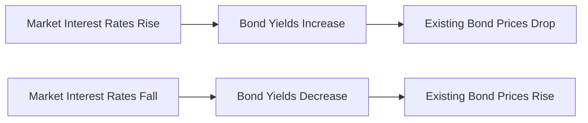

## 21.3 Risks of Debt Securities

Debt securities (often referred to as bonds or fixed-income instruments) provide many investors with stable income and potential capital preservation. However, investors need to understand that these instruments do not come without risk. This section explores the principal risks of debt securities, particularly within the Canadian context, and provides practical techniques to manage these exposures. We will also reference guidelines and resources from Canadian regulators and financial institutions to help inform a robust risk management approach.

### Understanding the Inherent Risks

Debt securities can be exposed to a variety of risks that impact pricing, yield, and overall returns. Although many of these risks are interrelated, it helps to consider them individually to fully appreciate how each factor can affect both the market value of debt securities and an investor’s ultimate return.

### Interest Rate Risk

Interest rate risk arises from the inverse relationship between bond prices and prevailing market interest rates. When interest rates increase, bond prices typically decrease, and vice versa. This risk is fundamental to fixed-income investments:

- Long-term bonds tend to be more sensitive to interest rate changes due to their extended duration.  
- Shorter-term bonds are less affected but still susceptible to movements in interest rates.

#### Illustrated Relationship

Below is a simple flowchart to visualize how rising or falling market interest rates can affect bond prices:

**Explanation:**  
• When market interest rates rise, newly issued bonds offer higher coupon rates, making existing bonds with lower coupons less attractive. This causes their prices to fall.  
• Conversely, if market interest rates fall, existing bonds with higher coupons become more attractive, causing their prices to increase.

#### Canadian Considerations

The Bank of Canada’s updates on interest rate trends are crucial for investors to monitor. Changes to the policy interest rate can swiftly impact bond values. Investors can use the Bank of Canada’s interactive charts ([https://www.bankofcanada.ca/rates/interest-rates/](https://www.bankofcanada.ca/rates/interest-rates/)) to stay informed on market expectations for rates.

### Credit (Default) Risk

Credit risk, also known as default risk, refers to the possibility that the issuer will fail to meet its interest or principal payment obligations. The severity of this risk depends on the issuer’s creditworthiness:

- Government bonds (federal, provincial, municipal) generally have lower default risk but may still experience price volatility driven by interest rates.  
- Corporate bonds, especially those from issuers with lower investment-grade or high-yield (junk) credit ratings, have a higher risk of default.

Major rating agencies (DBRS Morningstar, Moody’s, Standard & Poor’s, Fitch) evaluate an issuer’s ability to repay debt. While credit ratings provide a valuable snapshot of default risk, investors should perform ongoing due diligence—examining factors such as the issuer’s financial statements, business model, and industry conditions.

#### Canadian Regulatory Context

- The Office of the Superintendent of Financial Institutions (OSFI) provides guidelines and standards emphasizing prudent credit risk monitoring.  
- CIRO (Canadian Investment Regulatory Organization) mandates that investment dealers recommend suitable products based on a client’s risk tolerance, aligning bond credit quality with the investor’s objectives.

### Inflation Risk

Inflation risk relates to the potential decrease in purchasing power of future interest payments and the principal amount repaid at maturity if inflation rises. Even if bonds pay a fixed coupon, higher inflation means each coupon payment buys fewer goods or services over time.

- Real Return Bonds (RRBs), issued by the Government of Canada, offer inflation-linked returns that can help offset inflation risk.  
- Holding a mix of floating-rate bonds and RRBs can also mitigate potential adverse effects of rising inflation.

### Callable Risk

Some issuers (most commonly corporations, but sometimes municipalities or other public entities) issue callable bonds that allow the issuer to redeem (or “call”) the bond before its maturity date. This option is typically exercised when market interest rates decline:

- Investors face uncertainty regarding the length of time they will receive coupon payments.  
- If the bond is called, reinvesting proceeds in a lower-interest-rate environment can reduce overall returns.

### Liquidity Risk

Liquidity risk refers to the difficulty of selling a bond in the secondary market at a fair price. This poses a challenge for some corporate and high-yield bonds that do not trade frequently:

- Illiquid bonds may require a price discount (or “haircut”) to attract buyers.  
- Canadian investors should note that Government of Canada bonds are more liquid than many corporate or municipal issues, but liquidity can still be affected by market conditions.

### Reinvestment Risk

Reinvestment risk occurs when interest income or principal repayments must be reinvested at lower prevailing rates if interest rates have fallen. For instance:

- As bonds mature or coupon payments are paid out, the investor may only be able to find lower-yielding securities to reinvest in.  
- Investors counting on stable interest income must account for fluctuating yields over time.

### Equation for Bond Pricing

Bond investors can analyze price sensitivity through the fundamental bond pricing formula, which underscores the impact of interest rates and time to maturity:

$$
P_0 = \sum_{t=1}^{n} \frac{C_t}{(1+r)^t} + \frac{M}{(1+r)^n}
$$

Where:  
• \\( P_0 \\) = Current price of the bond  
• \\( C_t \\) = Coupon payment in period \\( t \\)  
• \\( M \\) = Maturity (face) value, typically redeemed at par (e.g., \$1,000)  
• \\( r \\) = Discount rate or yield to maturity  
• \\( n \\) = Number of periods to maturity  

The discount rate \\( r \\) will rise (lower price) or fall (higher price) if perceived risk or market interest rates change.

### Managing Debt Security Risks

A well-structured risk management plan can help mitigate the various risks associated with debt securities.

1. **Diversification**  
   - Spread investments across different issuers, credit qualities, industries, and geographies (where permitted).  
   - For instance, include a mix of federal, provincial, and high-grade corporate bonds in a Canadian portfolio.

2. **Laddering Strategy**  
   - A bond ladder involves purchasing bonds with staggered maturities—e.g., 1-year, 3-year, 5-year, 7-year, and 10-year maturities.  
   - Upon each maturity, proceeds can be reinvested into the longer “rung.” This approach helps mitigate both reinvestment and interest rate risk over time.  
   - Many Canadian financial institutions (e.g., RBC, TD, BMO) provide resources on executing effective bond-ladder strategies.

3. **Credit Rating Monitoring**  
   - Track credit rating agency updates regularly.  
   - Combine rating alerts with fundamental financial analysis to gauge the issuer’s ongoing stability.

4. **Fixed vs. Floating Rates**  
   - Consider adding floating-rate notes to a portfolio. Their coupons adjust according to market reference rates, lowering interest rate risk in a rising rate environment.

5. **Inflation-Hedged Securities**  
   - Incorporate inflation-indexed products like Real Return Bonds to reduce inflation risk.

6. **Professional Advice and Due Diligence**  
   - Consult with qualified wealth advisors—under CIRO rules, they must ensure recommendations align with the client’s risk profile.  
   - Use open-source financial tools to model bond price scenarios and stress-test potential outcomes.

### Canadian Resources and Additional Reading

- **CIRO Suitability Guidelines**: Advisors and dealers must align bond investments with client objectives and risk tolerance. More details at [https://www.ciro.ca](https://www.ciro.ca).  
- **Bank of Canada**: Interest rate announcements and economic indicators at [https://www.bankofcanada.ca/rates/interest-rates/](https://www.bankofcanada.ca/rates/interest-rates/).  
- **OSFI**: Guidance on credit risk management practices at [https://www.osfi-bsif.gc.ca](https://www.osfi-bsif.gc.ca).  
- **Major Canadian Banks** (RBC, TD, BMO, CIBC, Scotiabank): Educational content on bond investing, portfolio diversification, and relevant product offerings.  
- **Bond Ladder Tools**: Many financial institutions and third-party analytics platforms offer calculators to build and monitor bond ladders tailored to Canadian and global fixed-income markets.

### Summary

Managing debt security risks is an essential component of a sophisticated wealth management strategy. By recognizing and mitigating interest rate risk, credit risk, inflation risk, callable risk, liquidity risk, and reinvestment risk, investors can strengthen the resilience of their fixed-income portfolios. Effective approaches include laddering maturities, diversifying by credit quality, and staying informed of market and regulatory developments such as Bank of Canada policy announcements and CIRO guidelines. Ultimately, a structured and proactive approach to risk management helps align bond investments with a client’s deeper financial goals and comfort with market uncertainty.

---

## Maximize Your Bond Portfolio Resilience: A Comprehensive Risk Management Quiz



### Which risk best describes the potential drop in bond prices when interest rates rise?

- [ ] Credit risk
- [x] Interest rate risk
- [ ] Inflation risk
- [ ] Callable risk

> **Explanation:** Interest rate risk is the inverse relationship between bond prices and market interest rates. As rates increase, bond prices typically decrease.

### What is the principal concern when an issuer of a bond is unable to make regular coupon or principal payments?

- [x] Credit (default) risk
- [ ] Reinvestment risk
- [ ] Callable risk
- [ ] Liquidity risk

> **Explanation:** Credit (default) risk refers to the possibility that the issuer cannot fulfill its debt obligations, increasing the likelihood of partial or total loss for the investor.

### If an investor plans to combat inflation risk within a Canadian context, which of the following products would be most suitable?

- [ ] High-yield corporate bonds
- [x] Real Return Bonds
- [ ] Callable bonds
- [ ] Debentures

> **Explanation:** Real Return Bonds (RRBs) are linked to the Consumer Price Index (CPI) and adjust principal payments to manage purchasing power against inflation.

### Which Canadian regulator oversees investment dealer and mutual fund dealer activities under the consolidated self-regulatory framework?

- [ ] OSFI
- [ ] CSA
- [x] CIRO
- [ ] Former IIROC

> **Explanation:** Effective 2023, the Canadian Investment Regulatory Organization (CIRO) oversees these activities, replacing the now-defunct MFDA and IIROC.

### What is the main disadvantage of callable bonds for investors?

- [ ] Investors benefit from early redemption.
- [ ] Coupons automatically increase when rates drop.
- [x] Investors may lose potential interest income if the bond is called early.
- [ ] The bond cannot be sold on secondary markets.

> **Explanation:** Callable bonds allow issuers to redeem bonds early, often when interest rates have fallen, forcing investors to reinvest in a lower-rate environment.

### How can bond laddering help manage reinvestment risk?

- [x] By staggering maturities, proceeds are reinvested systematically at prevailing rates.
- [ ] By only buying zero-coupon bonds.
- [ ] By ensuring every bond in the ladder is callable.
- [ ] By investing strictly in junk bonds.

> **Explanation:** Laddering creates maturities at regular intervals, reducing the impact of reinvesting a large sum of principal at a single point in uncertain market conditions.

### Which of the following best illustrates the role of credit rating agencies when assessing a bond issuer?

- [x] They provide a snapshot of creditworthiness, but investors should still do their own analysis.
- [ ] They represent a complete and infallible assessment of issuer risk.
- [x] They are independent organizations that can place negative or positive outlooks on an issuer’s debt.
- [ ] They only evaluate government bonds.

> **Explanation:** Credit rating agencies’ ratings offer an important starting point but are not comprehensive. Investors must also conduct independent research on financial fundamentals.

### Which type of risk concerns the difficulty of selling a bond quickly at a fair price?

- [x] Liquidity risk
- [ ] Interest rate risk
- [ ] Reinvestment risk
- [ ] Callable risk

> **Explanation:** Liquidity risk is the risk that the market for a bond becomes too thin, forcing discount selling or lengthy delays to find buyers.

### What is one major way the Bank of Canada influences interest rate risk?

- [x] By adjusting its policy interest rate target.
- [ ] By issuing mandatory credit ratings.
- [ ] By calling in all outstanding bonds during recessions.
- [ ] By setting pricing formulas for corporate bonds.

> **Explanation:** The Bank of Canada uses policy rate adjustments and open market operations to influence prevailing interest rates and, consequently, bond yields and prices.

### True or False: Reinvestment risk increases when interest rates rise, making it easy to find higher-yielding bonds.

- [ ] True
- [x] False

> **Explanation:** Reinvestment risk generally increases when interest rates fall, because reinvested coupon or principal proceeds typically earn lower yields.




