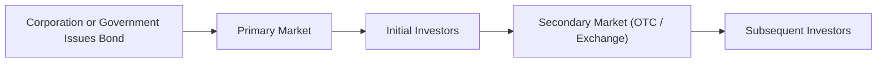

## 21.4 Debt Market Trading Mechanics

The Canadian bond market provides both government entities and corporations access to capital. This section examines how bonds are brought to the market, how they trade, the relevant pricing mechanisms, and settlement procedures. We will also look at key participants in the market and best practices from a Canadian regulatory standpoint.

---

### Understanding the Canadian Debt Market

The Canadian debt market is composed of two main segments:

- **Primary Market:** Where new bonds are first issued and sold to investors.  
- **Secondary Market:** Where existing bonds are traded among investors after issuance.

Each segment has distinct characteristics, participants, and regulations. Below is a visual overview of how a bond initially moves from issuer to investor and then into secondary transactions:

In the diagram, entities like corporations or governments (A) raise capital through the **primary market** (B). Once investors purchase these initial bond offerings (C), further trading can occur in the **secondary market** (D), enabling other investors (E) to buy or sell the bonds as needed.

---

### 1. Primary Market

In the Canadian context, the primary market for bonds involves the following mechanisms:

1. **Government Auctions:**  
   - The Bank of Canada regularly conducts auctions for Government of Canada bonds and Treasury bills.  
   - Interested buyers (e.g., banks, investment dealers, pension funds) submit bids that determine the bond’s yield and price.  
   - Auction results and schedules are published on the Bank of Canada’s website.  

2. **Syndicate Underwriting for Corporate Issuance:**  
   - Corporations issue bonds through an underwriting syndicate—often comprising major Canadian banks (e.g., RBC, TD, BMO).  
   - These underwriters purchase the entire issue from the corporation and then resell it to investors.  
   - The syndicate is responsible for setting the initial offering price, interest rate (coupon), and distributing the bonds to a broad base of investors.

**Tip:**  
Clients should pay attention to the credit quality and coupon details for new issues. For example, an investment-grade corporate bond offered by major Canadian banks may carry lower yield spreads than a lower-rated issuer but can offer more stable income and higher liquidity.

---

### 2. Secondary Market

Once bonds have been issued, they trade in the secondary market, where prices fluctuate based on:

- **Interest Rate Movements:** If market interest rates rise, existing bond prices tend to fall, and vice versa.  
- **Credit Conditions:** Market perceptions of an issuer’s financial health.  
- **Supply and Demand:** The balance between buyers and sellers, which can shift rapidly.

In Canada, the secondary market comprises:

- **Over-the-Counter (OTC) Market:** The primary channel for trading bonds. Dealers provide buy and sell quotes, and trades happen through specialized trading platforms or directly by phone or email.  
- **Exchange-Traded Bonds:** A smaller portion of the market where certain corporate or provincial bonds may be listed, though liquidity is often lower than in OTC markets.

---

### 3. Bond Pricing and Quoting

Bonds are typically quoted as a percentage of par (face) value. For instance, a quote of **95.50** indicates the bond can be bought or sold at **95.50%** of its par value. If the bond’s face value is \$1,000, the market price is \$955.

#### Yield Conventions

Yields are typically calculated using the coupon, price, and time to maturity. A simplified annual yield given price and coupon might be represented as:

$$
\text{Current Yield} = \frac{\text{Annual Coupon Payment}}{\text{Market Price}} \times 100
$$

However, a more precise measure is the yield to maturity (YTM), which factors in:

1. The coupon payments.
2. The time remaining to maturity.  
3. Any difference between the bond’s current market price and its redemption (par) value.  

---

### 4. Settlement Conventions

**Settlement** refers to the transfer of the payment from the buyer and the bond from the seller, completing a trade. Common timelines in Canada include:

- **T+2 or T+3:** Settlement occurs two or three business days after the trade date.  
- **Government of Canada Bonds:** Often follow T+2 settlements, though historically T+1 has also been used for short-term instruments like Treasury bills.  

Some institutional investors—such as large pension funds (e.g., Canada Pension Plan Investment Board)—may negotiate customized settlement schedules for specific transactions. Adhering to these standards helps ensure smooth transaction clearance and mitigates counterparty risk.

---

### 5. Over-the-Counter (OTC) Bond Trading

OTC trading in Canada is facilitated by an extensive network of dealers who quote bid (purchase) and ask (sale) prices. While large trades are often transacted between institutions directly, individual investors may purchase bonds through:

- **Full-Service Brokerages:** Offer research, advice, and bond inventory access.  
- **Discount Brokerages:** Allow self-directed investors to trade bonds online, though availability of certain new issues or less liquid bonds may be limited.

**Pitfall:**  
Less liquid issues (e.g., certain high-yield corporate bonds) may have wider bid-ask spreads, leading to higher trading costs. Always compare multiple dealers to ensure competitive pricing.

---

### 6. Mark-to-Market Accounting

Canadian investment firms, under CIRO rules and OSFI standards (for federally regulated financial institutions), typically mark their bond positions to market regularly. This means updating the value of each bond to its current trading price rather than its historical cost. Mark-to-market impacts:

- **Balance Sheet Reporting:** Reflects real-time gains or losses on bond holdings.  
- **Regulatory Capital Requirements:** Banks and other dealers must hold sufficient capital to cover potential losses.  
- **Performance Measurement:** Investors (e.g., mutual funds, segregated funds) see daily net asset value (NAV) changes based on current bond market prices.

---

### 7. Market Participants and Their Roles

Several types of market participants shape the liquidity and pricing environment in Canadian bond markets:

1. **Banks and Investment Dealers:**  
   - Provide two-way quotes and underwrite new issues.  
   - Historically, regulated by the Investment Industry Regulatory Organization of Canada (IIROC) and the Mutual Fund Dealers Association of Canada (MFDA), which amalgamated into the Canadian Investment Regulatory Organization (CIRO) on June 1, 2023.  
   - Must comply with CIRO requirements for best execution and transparency.  

2. **Institutional Investors:**  
   - Pension funds, insurance companies, mutual funds, hedge funds.  
   - Often hold large bond positions and sometimes require customized strategies (e.g., interest rate swaps or repos).  

3. **Corporations:**  
   - Issue bonds or buy back their own debt.  
   - Engage in hedging strategies to manage interest rate risk.  

4. **Retail Investors:**  
   - Buy or sell bonds through brokerages with a focus on diversification, income generation, or capital preservation.  
   - Protected by the Canadian Investor Protection Fund (CIPF) if their CIRO-member firm becomes insolvent.

---

### 8. Practical Steps for Canadian Investors

Below is a quick checklist to help Canadian investors navigate bond trading mechanics:

1. **Research Bond Features:** Coupon rate, maturity date, credit rating, callable/convertible features.  
2. **Compare Quotes:** Request bids and offers from multiple dealers or platforms to find the best price.  
3. **Understand Settlement:** Confirm the settlement cycle (T+2, T+3, or others), especially for government auctions.  
4. **Use Tools and Resources:**  
   - Consult the Bank of Canada’s auction results and maturities for government securities.  
   - Explore open-source analytics (e.g., QuantLib, FINCAD) when analyzing complex bond structures.  
   - Check CIRO guidelines for best execution requirements.  
5. **Mark-to-Market Implications:** Recognize that pricing changes may affect portfolio valuations daily.  
6. **Consider Tax Implications:** Interest income is typically taxed as ordinary income by the CRA (Canada Revenue Agency), so plan accordingly to optimize after-tax returns.

---

### 9. Regulatory Landscape and Resources

• **CIRO (Canadian Investment Regulatory Organization):**  
  - Oversees investment dealers, mutual fund dealers, and marketplace integrity.  
  - Enforces trade transparency and best execution for fixed-income products in Canada.

• **Bank of Canada:**  
  - Manages and publishes auction results for Government of Canada bonds.  
  - Provides economic and interest rate guidance that often influences debt markets.

• **CMIC (Canadian Market Infrastructure Committee):**  
  - Publishes industry standards for OTC trading and clearing in Canada.

• **CRA (Canada Revenue Agency):**  
  - Sets rules for taxation on interest income and capital gains.

---

### Summary and Key Takeaways

Debt market trading mechanics in Canada revolve around two crucial markets—primary and secondary. The primary market involves the issuance of new bonds, either via government auctions or corporate syndication. Once bonds are in circulation, they trade in a secondary market dominated by OTC transactions, though some bonds list on exchanges. Pricing and yield depend on coupon rates, credit quality, and market interest rates.

Settlement timelines—often T+2 or T+3—are vital to completing trades promptly and securely. Mark-to-market accounting ensures that investment valuations remain current, influencing both regulatory capital and portfolio performance. Major participants range from large financial institutions like RBC or TD to pension funds, insurance companies, and retail investors looking for income and diversification. 

By staying informed about liquidity, pricing structures, and regulatory guidelines, advisors and investors can make better decisions when trading and holding debt securities within Canadian portfolios.

---

## Test Your Knowledge: Canadian Bond Market Trading Quiz



### Which market is responsible for the initial sale of new bond issues?  
- [x] Primary market  
- [ ] Secondary market  
- [ ] Over-the-counter market  
- [ ] Forex market  

> **Explanation:** The primary market is where new bond issues are initially sold to investors, often via government auction or corporate syndicate underwriting.

### What does a bond quote of 98.25 typically represent?  
- [x] 98.25% of the bond’s par value  
- [ ] A bond price of $982.50 for a $1,000 par bond  
- [ ] Fixed redemption yield  
- [ ] The annual coupon rate  

> **Explanation:** Quotes for bonds are usually expressed as a percentage of the face (par) value. Thus, 98.25 means the bond is selling at 98.25% of its par value.

### Which regulatory body oversees Canadian bond dealers and marketplaces after the 2023 amalgamation?  
- [x] CIRO (Canadian Investment Regulatory Organization)  
- [ ] MFDA (Mutual Fund Dealers Association)  
- [ ] IIROC (Investment Industry Regulatory Organization of Canada)  
- [ ] OSFI (Office of the Superintendent of Financial Institutions)  

> **Explanation:** The MFDA and IIROC amalgamated into CIRO on June 1, 2023, making CIRO responsible for oversight of Canadian investment dealers and marketplaces.

### Why might a corporate bond have a wider bid-ask spread than a Government of Canada bond?  
- [x] Lower liquidity or higher credit risk  
- [ ] Higher liquidity and credit rating  
- [ ] Fixed settlement cycles  
- [ ] Government subsidies  

> **Explanation:** Corporate bonds often carry greater credit risk and lower trading volumes, resulting in a wider bid-ask spread.

### Which term describes the practice of updating a bond’s book value to its current market price?  
- [x] Mark-to-market  
- [ ] Amortization  
- [ ] Historical cost accounting  
- [ ] Accretion  

> **Explanation:** Mark-to-market accounting revalues bonds at current market prices, providing an up-to-date assessment of the portfolio’s worth.

### What is the standard settlement period for most Government of Canada bond trades?  
- [x] T+2  
- [ ] T+1  
- [ ] T+0  
- [ ] T+5  

> **Explanation:** In Canada, Government of Canada bonds typically settle on a T+2 basis, meaning two business days after the trade date.

### Which entity commonly conducts auctions for new issues of Government of Canada bonds?  
- [x] Bank of Canada  
- [ ] Canada Revenue Agency (CRA)  
- [ ] Canada Pension Plan Investment Board (CPPIB)  
- [ ] Canadian Investment Regulatory Organization (CIRO)  

> **Explanation:** The Bank of Canada runs auctions on behalf of the Government of Canada, issuing new bonds to the market.

### What is one primary benefit of OTC trading for institutional investors like pension funds?  
- [x] The ability to negotiate customized deals and large block trades  
- [ ] Faster settlement times than T+2  
- [ ] Guaranteed uniform market pricing  
- [ ] Lower credit risk than exchange-traded bonds  

> **Explanation:** OTC transactions allow large institutions to negotiate directly with dealers for features like price, size, and settlement terms, which can be more flexible than exchange-based trades.

### How do most retail investors access the secondary bond market?  
- [x] Through brokerages (full-service or discount)  
- [ ] Directly through the Bank of Canada  
- [ ] Filing a prospectus with CIRO  
- [ ] Equities exchanges only  

> **Explanation:** Retail investors typically rely on brokerages to execute bond trades on their behalf in the secondary market.

### In Canada, the interest paid on bond coupons is generally taxed:  
- [x] As regular income at the investor’s marginal tax rate  
- [ ] As a capital gain  
- [ ] As a dividend  
- [ ] Not taxed if it’s a corporate bond  

> **Explanation:** Interest income is typically taxed at the full marginal rate, unlike capital gains or dividends, which may receive preferential tax treatment.


