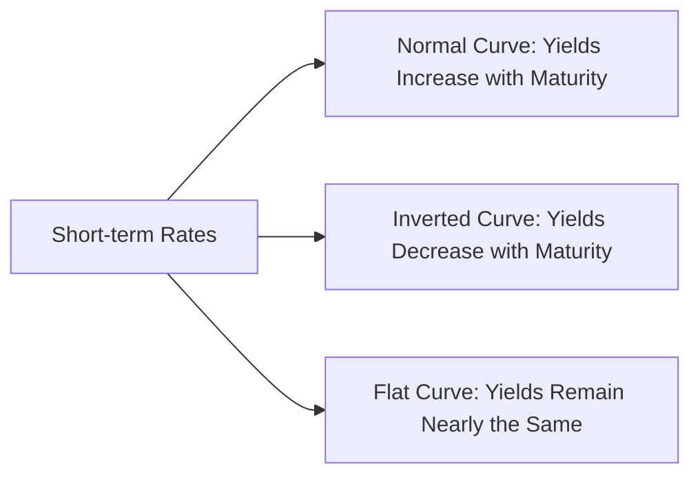

## 21.5 The Term Structure of Interest Rates

The term structure of interest rates, commonly illustrated by a yield curve, describes how the yields (returns) on bonds of similar credit quality vary by maturity. In Canada, this most often pertains to Government of Canada (GoC) bonds. Understanding the yield curve is crucial for wealth managers and investors alike, as it provides insights into future interest rates, economic conditions, and potential shifts in monetary policy.

---

### Key Concepts and Definitions

1. **Yield Curve**  
   A graphical representation showing the relationship between bond yields (on the vertical axis) and maturities (on the horizontal axis) for comparable debt securities.  
   - Example: A yield curve plotting yields of Government of Canada bonds from 1 month to 30 years.

2. **Normal (Upward Sloping) Yield Curve**  
   - Longer maturities generally offer higher yields.  
   - Usually implies healthy economic growth expectations, as investors require additional compensation for locking their funds in longer-term bonds.

3. **Inverted (Downward Sloping) Yield Curve**  
   - Longer maturities tend to have lower yields than shorter maturities.  
   - Often signals economic slowdown or recession.

4. **Flat Yield Curve**  
   - Yields across short, medium, and long maturities are similar.  
   - Suggests economic uncertainty or a potential turning point in monetary policy.

5. **Duration**  
   - A measure of a bond’s price sensitivity to changes in interest rates.  
   - A portfolio with a longer duration experiences greater price fluctuation than one with a shorter duration when interest rates change.

---

### Theories Explaining the Yield Curve

Over time, economists and financial researchers have proposed several theories to explain how and why yield curves take on particular shapes.

#### 1. Expectation Theory

- Proposes that long-term interest rates are determined by investor assumptions about future short-term interest rates.  
- If the market expects future short-term rates to rise, the yield curve will slope upward because investors demand a higher yield for longer maturities.

#### 2. Liquidity Preference Theory

- Suggests that investors expect a premium for holding longer-term bonds due to the uncertainties of time (e.g., reinvestment risk, inflation risk).  
- This added premium typically creates an upward bias in the yield curve, even if short-term rates are not expected to rise substantially.

#### 3. Market Segmentation Theory

- Argues that distinct groups of investors (such as pension funds, insurance firms, or asset managers) concentrate on specific maturity segments.  
- Supply and demand in each segment (short, medium, long) determine bond yields independently, contributing to the overall shape of the yield curve.

---

### Yield Curve as an Economic Indicator

Analysts—including those at the Bank of Canada—view yield curve shifts as an important gauge of market expectations:

1. **Predicting Economic Cycles**  
   - Historically, an inverted yield curve in countries like Canada and the U.S. has often preceded a recession.  
   - A steep yield curve may suggest robust economic growth ahead.

2. **Inflation and Monetary Policy Clues**  
   - Central banks (e.g., the Bank of Canada) adjust policy rates based on inflation and economic conditions.  
   - Rapid steepening or flattening can signal changing expectations around the Bank of Canada’s next rate moves.

3. **Implications for Portfolio Returns**  
   - If interest rates are forecasted to rise, shorter-duration bonds may be favored to limit price risk.  
   - If rates are expected to fall, longer-duration bonds may generate capital gains.

---

### Yield Curve Shapes: Practical Scenarios

Below is a simplified Mermaid diagram showing different yield curve shapes:

- **Explanation:**  
  - This diagram represents how short-term interest rates feed into multiple potential yield curve outcomes: normal, inverted, or flat.  
  - Macroeconomic conditions, market expectations, and investor behaviors contribute to which shape manifests.

---

### Managing Fixed-Income Portfolios with Yield Curve Insights

#### 1. Portfolio Duration

- Duration helps investors measure and manage interest rate risk:  
  $$
  \text{Modified Duration} \approx \frac{\% \text{ Change in Bond Price}}{\% \text{ Change in Yield}}
  $$
- A higher duration typically means increased sensitivity to changes in interest rates.

#### 2. Yield Curve Positioning

- **Barbell Strategy:** Invest in short-term and long-term bonds, leaving out the intermediate range. Can be beneficial if the yield curve flattens, because capital gains on the long end may help offset yield changes on the short end.  
- **Bullet Strategy:** Focus on a single maturity segment, often used if investors have strong conviction about the direction of interest rate moves for that segment.  
- **Laddering Strategy:** Purchase multiple bonds with staggered maturities to manage reinvestment risk and provide ongoing liquidity.

#### 3. Canadian Examples

- **Pension Funds:** Large Canadian pension funds (e.g., CPP Investments, Ontario Teachers’ Pension Plan) often use advanced yield curve modeling to manage liabilities that extend for decades. This might include interest rate swaps or futures based on the GoC bond yield curve.  
- **Banks:** Major Canadian banks such as RBC, TD, and BMO publish regular research on the term structure and make yield curve forecasts that guide their treasury operations and client advisories.

---

### Regulatory Environment in Canada

Regulators and industry bodies watch the yield curve carefully:

- **CIRO (Canadian Investment Regulatory Organization):**  
  Oversees and sets rules for investment dealers and mutual fund dealers nationwide. For up-to-date resources, refer to [CIRO’s website](https://www.ciro.ca).  
- **OSFI (Office of the Superintendent of Financial Institutions):**  
  Supervises federally regulated financial institutions to ensure their stability and promotes confidence in the Canadian financial system.  
- **CSA (Canadian Securities Administrators):**  
  Coordinates securities regulation across provinces and territories.  
- **CIPF (Canadian Investor Protection Fund):**  
  Protects investor assets should an investment dealer become insolvent. CIPF coverage includes specific limits on amounts held in protected accounts.

---

### Best Practices, Pitfalls, and Strategies

**Best Practices**  
- Stay informed with Bank of Canada releases (e.g., the Quarterly Economic Analysis).  
- Use duration-based strategies that align with your or your client’s forecast on interest rate movements.  
- Diversify by holding multiple maturities and bond types (e.g., Government of Canada, provincial, corporate).

**Pitfalls**  
- Ignoring yield curve signals when rates are about to change.  
- Overextending duration exposure just to chase higher yields without considering interest rate risk.  
- Failing to consider liquidity needs, which can lead to forced sales at unwelcome times.

**Strategies to Address Challenges**  
- Model potential interest rate scenarios (up, down, stable) using tools like Bloomberg or open-source software (e.g., Python’s pandas-datareader or R’s quantmod).  
- Implement structured products such as interest rate swaps, forward rate agreements (FRAs), or covered calls on bond ETFs, if appropriate for your client’s risk profile.

---

### Additional Resources

- **Bank of Canada:** Historical and real-time yield curve data, policy announcements, and economic research.  
- **Academic Research:**  
  - “Fixed Income Securities” by Pietro Veronesi  
  - “The Handbook of Fixed Income Securities” by Frank Fabozzi  
- **Software & Tools:**  
  - Bloomberg Terminal, Reuters Eikon, or open-source Python/R libraries for quantitative yield curve modeling.  
- **Canadian Universities & Think Tanks:**  
  Publish research papers on advanced yield curve topics, including regional economic implications.

---

### Summary

The term structure of interest rates in Canada, illustrated by the yield curve, plays a central role in investment decision-making and wealth management. By analyzing yield curve theories—Expectation Theory, Liquidity Preference Theory, and Market Segmentation Theory—advisors and investors can interpret economic signals, estimate future interest rates, and design portfolio strategies that align with market outlooks. Paying close attention to the yield curve shape and duration helps mitigate interest rate risk.

For Canadian investors, yield curves not only indicate broader economic transitions but also guide decisions tailored to regulatory frameworks and market structures unique to Canada. Understanding these factors fosters more informed, strategic wealth management and fixed-income portfolio design.

---

## Test Your Knowledge: The Term Structure of Interest Rates in Canada



### 1. What does the term structure of interest rates primarily illustrate?

- [x] The relationship between bond yields and maturities for similar credit-quality securities.
- [ ] Contrasts between corporate and government bond yields only.
- [ ] The annual default rates across multiple bond categories.
- [ ] Differences between short-term lending rates and stock returns.

> **Explanation:** The term structure or yield curve shows how yields change with different maturities for bonds of comparable credit quality, such as Government of Canada bonds.

### 2. Which yield curve shape is most commonly associated with an economic slowdown or recession signals?

- [ ] Flat yield curve
- [x] Inverted yield curve
- [ ] Normal yield curve
- [ ] Humped yield curve

> **Explanation:** An inverted yield curve, where long-term yields are lower than short-term yields, often predicts recessions because it suggests investors expect future interest rates (and economic growth) to decline.

### 3. According to the Expectations Theory, what primarily drives the shape of the yield curve?

- [ ] Investor preference for shorter maturities
- [ ] Variability in government bond ratings
- [x] Market expectations for future short-term interest rates
- [ ] Regulatory changes at the provincial level

> **Explanation:** The Expectations Theory states that the long-term rates reflect anticipated future short-term rates—if investors expect higher short-term rates, the yield curve becomes upward sloping.

### 4. How does Liquidity Preference Theory differ from Expectations Theory?

- [x] It argues investors demand a premium for longer maturities due to uncertainty and risk.
- [ ] It posits that bond yields are random and unpredictable.
- [ ] It suggests new regulatory reforms have the greatest impact on bonds.
- [ ] It claims that short-term and long-term yields must always be equal.

> **Explanation:** Liquidity Preference Theory suggests investors require additional yield (liquidity premium) for assuming the higher risk of longer maturities.

### 5. Which of the following is a key insight from Market Segmentation Theory?

- [x] Different investor bases focus on different segments of the yield curve.
- [ ] Short-term rates are solely determined by government policy.
- [x] Demand and supply imbalances in each maturity range shape yields.
- [ ] The shape of the yield curve is unaffected by macroeconomic factors.

> **Explanation:** Market Segmentation Theory argues that investors tend to prefer particular maturity ranges (e.g., short, medium, or long). Differences in supply and demand within each maturity segment help define the yield curve structure.

### 6. What is the general relationship between bond duration and sensitivity to interest rate changes?

- [x] Higher duration leads to greater sensitivity.
- [ ] Higher duration leads to lower sensitivity.
- [ ] Duration has no relevance to interest rate changes.
- [ ] Duration only applies to equity investments.

> **Explanation:** Duration measures how much a bond’s price is likely to change when interest rates fluctuate. A high duration means more price volatility for a given change in rates.

### 7. Which of the following strategies combines short-term and long-term bonds while leaving out intermediate maturities?

- [ ] Laddering strategy
- [ ] Bullet strategy
- [x] Barbell strategy
- [ ] Duration targeting strategy

> **Explanation:** In a barbell strategy, investors hold both short-duration and long-duration bonds but avoid mid-range maturities, aiming to benefit from changes at the extremes of the yield curve.

### 8. Why might an investor favor a laddered bond portfolio?

- [x] To smooth out reinvestment risk by staggering maturities.
- [ ] To focus only on the shortest-maturity bonds.
- [ ] To take on maximum interest rate risk.
- [ ] To benefit solely from high-yield speculative bonds.

> **Explanation:** A laddered strategy staggers bond maturities over time—this helps manage reinvestment risk and provides regular opportunities to reinvest principal at prevailing rates.

### 9. Which organization in Canada oversees investment dealers and mutual fund dealers under the current regulatory framework?

- [ ] The defunct MFDA
- [x] CIRO
- [ ] The defunct IIROC
- [ ] CIPF

> **Explanation:** Effective in 2023, the Mutual Fund Dealers Association (MFDA) and the Investment Industry Regulatory Organization of Canada (IIROC) amalgamated into CIRO, Canada’s new national self-regulatory body.

### 10. True or False: An inverted yield curve has historically been considered a reliable forecasting tool for economic recessions.

- [x] True
- [ ] False

> **Explanation:** Historical data, including in Canada and the U.S., frequently shows economic recessions aligned with inverted yield curves, making them an important indicator for investors and policymakers.


