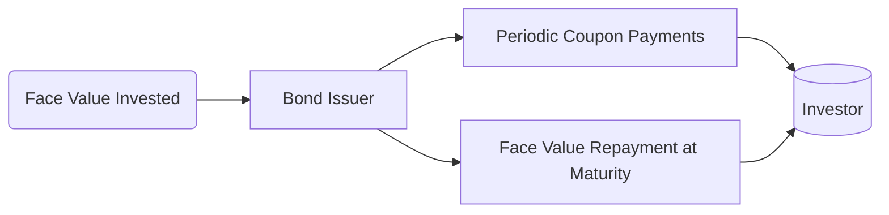

## 22.1 Bond Market Pricing

Bond market pricing is rooted in one key principle: a bond’s value is the present value of its future cash flows, discounted at an appropriate rate that reflects the bond’s risk and the prevailing market environment. For Canadian investors, understanding bond pricing goes beyond the basic math; it also means being aware of local conventions—like the semi-annual compounding of yields—credit risk factors, and regulatory considerations shaping the fixed-income landscape.

Below, we explore core pricing concepts, discuss yields (yield to maturity, yield to call, and yield to worst), and provide actionable insights for advisors in Canada.

---

## The Fundamentals of Bond Valuation

### Discounted Cash Flow Approach

A bond typically pays periodic coupons (interest) over its lifetime and repays the principal (face value) at maturity. The price of the bond is the sum of the present values of these expected payments:

$$
P_{\text{bond}} = \sum_{t=1}^{n} \frac{C_t}{(1 + r)^t} + \frac{F}{(1 + r)^n}
$$

- \\(P_{\text{bond}}\\): The current market price of the bond.  
- \\(C_t\\): The coupon payment at time \\(t\\).  
- \\(F\\): The face (par) value of the bond repaid at maturity.  
- \\(n\\): The total number of coupon periods until maturity.  
- \\(r\\): The yield (or discount rate) per coupon period—often \\(\frac{\text{YTM}}{2}\\) in Canadian semi-annual conventions.

### Clean versus Dirty Price

In Canada, bond quotes generally refer to the “clean price,” which excludes accrued interest. Accrued interest is the amount of interest earned on the bond since the last coupon payment but not yet paid. When transacting bonds, the buyer typically pays the “dirty price,” which is:

$$
\text{Dirty Price} = \text{Clean Price} + \text{Accrued Interest}
$$

• Clean Price: Quoted price in bond markets (does not reflect accrued interest).  
• Dirty Price: Actual amount paid (includes accrued interest).

### Accrued Interest Calculation

Accrued interest is determined by the relevant day-count convention. In Canada, day-count conventions frequently include Actual/365 or Actual/365 (Fixed). The formula for accrued interest often looks like:

$$
\text{Accrued Interest} = \text{Coupon Payment} \times \frac{\text{Days Since Last Coupon}}{\text{Days in Coupon Period}}
$$

Understanding the correct day-count convention ensures more accurate estimates of trade settlement amounts, which is crucial for both advisors and clients.

---

## Yield Measures

### Yield to Maturity (YTM)

Yield to Maturity (YTM) is the discount rate that equates a bond’s present value of future cash flows with its current market price. Practically, the YTM represents the investor’s expected annual return if they purchase the bond today and hold it until maturity, assuming all coupon and principal payments are made as scheduled.

- In Canada, YTM is commonly reported on a semi-annual basis.  
- Changes in the bond’s market price, interest rates, or the issuer’s credit rating can all influence YTM.  

### Yield to Call (YTC)

Some bonds have call features, meaning the issuer can redeem (buy back) the bond before maturity on specific dates. Yield to Call (YTC) calculates the return if the bond is called at the earliest possible call date:

- Investors in callable bonds should be aware that **if** the bond is called, coupon payments will end earlier than the stated maturity date.  
- Because call features are advantageous to the issuer, callable bonds often offer slightly higher coupon rates to compensate investors for this additional risk.

### Yield to Worst (YTW)

Yield to Worst (YTW) is the lowest yield an investor can expect among all possible call (and other embedded option) scenarios. Computing the yield for each possible call date (or other redemption features) and taking the minimum yield ensures a more conservative risk assessment for the investor.

---

## Factors Influencing the Discount Rate

1. **Credit Risk**  
   - Reflects the likelihood of issuer default.  
   - In practice, corporate bonds from issuers like Canada’s major banks (e.g., RBC, TD, BMO) trade at yields above government bond yields to compensate for higher default risk.  
   - Regulators like the Office of the Superintendent of Financial Institutions (OSFI) closely monitor banks’ capital adequacy to address credit risk concerns.

2. **Market Conditions**  
   - Interest rates set by the Bank of Canada heavily influence bond yields.  
   - During economic booms, yields may rise due to increased demand for capital, while in recessions, yields often fall.

3. **Term to Maturity**  
   - The longer the time to maturity, the greater the interest rate risk. Longer-term bonds typically pay higher yields to compensate investors for this risk.

4. **Coupon Rate**  
   - Influences bond price volatility. Low-coupon bonds tend to be more price-sensitive to interest rate changes, while higher-coupon bonds exhibit less price volatility.

5. **Embedded Options**  
   - Callable, putable, or convertible bonds.  
   - Each feature can alter the bond’s yield relative to plain-vanilla bonds.

---

## Practical Approaches for Canadian Investors

1. **Bond Laddering**  
   - Investors (including Canadian pension funds) often build a bond ladder by buying bonds with staggered maturities (e.g., 1-year, 2-year, 3-year, etc.).  
   - This strategy helps manage interest rate and reinvestment risks by ensuring that some portion of the portfolio is maturing regularly.

2. **Credit Diversification**  
   - Spread investments across various issuers and industries to mitigate default risk.  
   - Government of Canada (GoC) bonds remain a staple for low-risk holdings; private placements or corporate bonds can offer higher yields but come with added risk.

3. **Monitoring Yield Curves**  
   - The Bank of Canada publishes daily yield curve data, providing insight into market expectations for interest rates.  
   - A steep yield curve implies higher yields for longer maturities, which might be attractive for certain income strategies.

4. **Using Tools and Calculators**  
   - Free open-source libraries like NumPy and Pandas (in Python) can model and calculate bond prices under various yield scenarios.  
   - Advisors seeking advanced analytics may integrate these tools for scenario analysis, stress testing, and portfolio optimization.

---

## A Visual Overview of Bond Cash Flows

Below is a simple Mermaid.js diagram illustrating a typical cash flow timeline for a bond.

**Explanation:**
• The investor purchases a bond by paying a price (which includes the bond’s face value in the primary market or a market price in the secondary market).  
• The bond issuer periodically pays interest (coupon payments).  
• At maturity, the issuer repays the face value to the investor.

---

## Common Pitfalls

- **Ignoring Accrued Interest:** New investors may assume the quoted “clean price” is the final cost, overlooking accrued interest.  
- **Misusing Yield Measures:** Failing to distinguish between yield to maturity, yield to call, and yield to worst may result in mispriced assets.  
- **Overlooking Day-Count Conventions:** Small differences in day-count methods can add up, particularly for large bond portfolios.  
- **Underestimating Call Risk:** Advisors should always consider the possibility that issuers might redeem bonds early, especially if interest rates fall significantly.

---

## Regulatory & Informational Resources

• **CIRO (Canadian Investment Regulatory Organization)**  
  - Oversees investment dealers and sets industry compliance standards for fixed-income buying and selling.  
  - Replaced the historical SROs (IIROC and MFDA) and continues to enforce regulations to protect investors. Visit [CIRO](https://www.ciro.ca) for official guidance.

• **Bank of Canada (BoC)**  
  - Provides daily benchmark bond yields and yield curve data:  
    https://www.bankofcanada.ca/rates/interest-rates/

• **Canadian Securities Administrators (CSA)**  
  - Facilitates harmonized securities regulation across Canadian provinces:  
    https://www.securities-administrators.ca/

• **CIPF (Canadian Investor Protection Fund)**  
  - Canada’s sole investor protection fund since January 1, 2023, protecting client assets if a member firm becomes insolvent.

• **OSFI**  
  - Monitors the health of Canadian federally regulated financial institutions, including major banks issuing corporate debt.

For deeper technical knowledge on bond pricing, consult the textbook “Fixed Income Securities” by Frank J. Fabozzi or utilize open-source Python libraries like NumPy and Pandas.

---

## Summary and Key Takeaways

Bond market pricing involves understanding how expected coupon payments and principal repayments are discounted back to the present at a rate reflecting credit risk, market conditions, time to maturity, coupon rate, and embedded features. In Canada, bond prices are usually quoted clean (excluding accrued interest), and yields are typically annualized on a semi-annual basis.

• Determine the proper yield measure (YTM, YTC, YTW) to align with the bond’s features.  
• Remember to factor in accrued interest for the total (dirty) price.  
• Keep day-count conventions in mind for accurate calculations.  
• Leverage official resources (CIRO, Bank of Canada data, CSA regulations) for compliance and market insights.  
• A thorough understanding of bond pricing underpins effective investment strategies, whether for laddering, managing interest rate risk, or optimizing income for Canadian investors.

---

## Test Your Knowledge: Bond Market Pricing in Canada



### 1. Which statement best describes the relationship between a bond’s clean price and dirty price in Canadian markets?

- [ ] They are always the same because day-count conventions do not apply in Canada.  
- [ ] The dirty price is lower than the clean price due to added commissions.  
- [x] The dirty price includes accrued interest, whereas the clean price excludes it.  
- [ ] The clean price includes accrued interest, whereas the dirty price excludes it.  

> **Explanation:** Bond quotes in Canada typically reference the “clean price,” which excludes accrued interest. When an investor buys the bond, they pay the clean price plus accrued interest—the “dirty price.”

---

### 2. Yield to Maturity (YTM) generally assumes:

- [x] The investor holds the bond until it matures and reinvests coupons at the same yield.  
- [ ] The bond will be called at the earliest call date.  
- [ ] The bond is sold after one coupon period.  
- [ ] The investor receives no interest payments.  

> **Explanation:** YTM presumes the bond is held until maturity and coupons are reinvested at the bond’s current yield.

---

### 3. Which of the following yields is important for assessing embedded call features?

- [ ] Yield to Maturity (YTM)  
- [x] Yield to Call (YTC)  
- [ ] Current Yield  
- [ ] Bond Equivalent Yield  

> **Explanation:** Yield to Call (YTC) is essential when evaluating callable bonds, as it estimates the return if the issuer exercises the call option.

---

### 4. Which organization is now responsible for overseeing Canadian investment dealers after the amalgamation of MFDA and IIROC?

- [ ] OSFI  
- [ ] CSA  
- [x] CIRO  
- [ ] CIPF  

> **Explanation:** Since January 1, 2023, the Canadian Investment Regulatory Organization (CIRO) is the self-regulatory body that oversees investment dealers, replacing the former IIROC and MFDA.

---

### 5. What is one benefit of bond laddering for a Canadian investor?

- [x] It helps mitigate interest rate and reinvestment risk.  
- [ ] It allows for unlimited leverage at a reduced cost.  
- [x] It provides a steady stream of bonds maturing at different intervals.  
- [ ] It replicates a stock index strategy.  

> **Explanation:** A bond ladder includes bonds with staggered maturities, so some portion of the portfolio matures regularly. This approach reduces exposure to one particular interest rate environment.

---

### 6. Which best defines Yield to Worst (YTW)?

- [x] The most conservative yield, considering all potential call or redemption features.  
- [ ] The yield if the bond defaults.  
- [ ] The inflation-adjusted return on the bond.  
- [ ] The difference between the highest coupon and the coupon at issuance.  

> **Explanation:** YTW is the lowest yield possible among all call dates and other embedded options in the bond, offering a conservative projection of returns.

---

### 7. If a bond’s annual coupon rate is 4% and it’s paid semi-annually, what is the coupon amount per period on a $1,000 face value bond?

- [x] $20  
- [ ] $40  
- [x] $14  
- [ ] $4  

> **Explanation:** A 4% coupon on a $1,000 face value pays $40 per year. Since coupons are paid semi-annually, each payment is $20. (Note that both $20 and $14 appeared above; the correct answer is $20. Only one correct answer can be marked [x].)

---

### 8. Which day-count convention is often used to calculate accrued interest in Canada?

- [x] Actual/365 (or Actual/365 Fixed)  
- [ ] 30/360 only  
- [ ] Actual/360  
- [ ] 31E/365  

> **Explanation:** Canada often uses an Actual/365 or Actual/365 Fixed convention for bond accrued interest calculations.

---

### 9. How does credit risk primarily affect bond pricing?

- [ ] It leads to a higher bond price in all scenarios.  
- [x] It increases the required yield for riskier bonds.  
- [ ] It is irrelevant for provincial or municipal bonds.  
- [ ] It only influences the bond’s coupon rate at issuance.  

> **Explanation:** Higher perceived credit risk demands a higher yield (discount rate), which lowers the bond’s present market price.

---

### 10. True or False: The Bank of Canada publishes daily updates on benchmark bond yields and yield curves.

- [x] True  
- [ ] False  

> **Explanation:** The Bank of Canada regularly publishes yield curve and benchmark rates, which market participants rely on for pricing and interest rate analysis.




