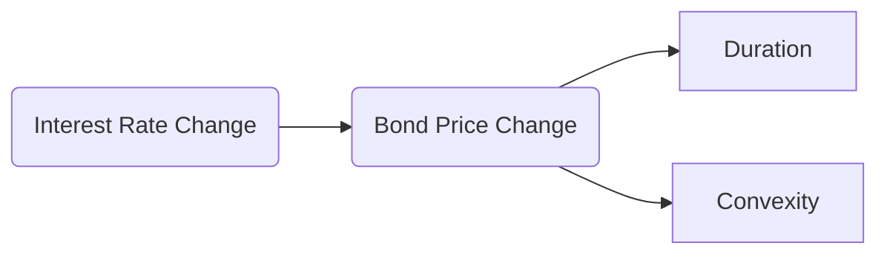

## 22.2 Bond Price Volatility

Bond price volatility represents how much—and how quickly—the market price of a bond fluctuates. Several key factors, including interest rates, credit spreads, and economic conditions, contribute to volatility. In Canada, bond market movements are closely influenced by policy decisions from the Bank of Canada, regulatory guidance from the Canadian Investment Regulatory Organization (CIRO), and shifts in global markets. Understanding bond price volatility is essential for wealth advisors who aim to manage client portfolios in any economic environment.

---

### The Fundamentals of Bond Price Volatility

Bond prices typically move in the opposite direction to interest rates. When interest rates rise, bond prices decline, and vice versa. The degree of this price fluctuation is called “volatility.” Volatility is affected by:

- The bond’s coupon rate  
- The bond’s time to maturity  
- Prevailing interest rates and the yield curve  
- Credit spreads (and their possible widening or narrowing)  
- Macroeconomic conditions and investor sentiment  

Wealth advisors must gauge these factors to determine whether a bond’s level of volatility matches a client’s risk tolerance and time horizon.

---

### Duration as a Measure of Interest Rate Sensitivity

One of the most widely used metrics for assessing bond price volatility is duration, which can be understood as the weighted average time it takes for a bond’s cash flows (coupon payments and principal) to be received. In practice:

- **Macaulay Duration** is the standard weighted average term to the bond’s cash flows.  
- **Modified Duration** translates Macaulay Duration into a measure of price sensitivity to changes in yields.  

Mathematically, modified duration can be approximated as:

$$
\text{Modified Duration} = \frac{\text{Macaulay Duration}}{1 + y}
$$

where \\( y \\) is the bond’s yield (often the yield to maturity in decimal form).

- A higher duration implies greater sensitivity to interest rate movements.  
- A bond with a low coupon (e.g., a zero-coupon bond) generally has a higher duration and, therefore, higher price volatility.  

#### Example: Duration in Action

Imagine a 10-year corporate bond issued by RBC with a 3% coupon. If this bond’s modified duration is 8, and the yield increases by 1% (or 100 basis points), the bond’s price might decline by approximately 8%. If yields fall by 1%, the bond’s price could rise by about 8%. Understanding this concept helps advisors to predict and manage interest rate risk in client portfolios.

---

### Convexity: Refining the Duration Measure

While duration measures a bond’s linear sensitivity to interest rate changes, real-world price changes are often curved or non-linear. **Convexity** captures this curvature in the price-yield relationship. A bond with higher convexity:

- Declines less in price when interest rates rise.  
- Increases more in price when interest rates fall.  

Bonds with high convexity are generally more expensive because they offer a more favorable risk-return profile. Understanding both duration and convexity can help advisors refine interest rate risk management strategies.

---

**Diagram Explanation:** This flowchart shows how a change in interest rates can affect bond prices. Duration (C) measures the initial sensitivity, while Convexity (D) accounts for the curvature in the price-yield relationship.

---

### Factors Influencing Bond Volatility

1. **Coupon Rate**  
   - Lower coupon (or zero-coupon) bonds are more sensitive to interest rate changes than high-coupon bonds because a larger portion of their cash flows is received further in the future.

2. **Time to Maturity**  
   - Longer-maturity bonds typically exhibit greater price fluctuation than shorter-term bonds.

3. **Yield Level**  
   - When yields are very low, small changes in interest rates can lead to significant percentage changes in price.

4. **Credit Spreads**  
   - Credit spreads represent the premium investors demand for holding corporate bonds (or other non-government securities) compared to risk-free government bonds of similar maturity. In Canada, this spread often is measured against Government of Canada bonds.  
   - During economic downturns, credit spreads may widen, pushing bond prices down for issuers deemed riskier.

5. **Macroeconomic Indicators**  
   - Changes in GDP growth, employment rates, or inflation forecasts can influence bond market sentiment, affecting both government bonds and credit spreads in corporate bond markets.

---

### Managing Interest Rate Risk

#### Monitoring the Bank of Canada

Wealth advisors in Canada closely watch the Bank of Canada’s interest rate announcements. Changes in the overnight rate or signals about future monetary policy can shift market yields quickly. Advising clients about possible rate movements can help them prepare for bond price volatility.

#### Diversification by Maturity and Coupon

- **Laddering Strategy:** Canadian investors often create a “bond ladder,” spreading investments across multiple maturities. As bonds mature at staggered intervals, investors can reinvest proceeds at current market rates, smoothing out the impact of interest rate swings.  
- **Barbell Strategy:** Involves holding short- and long-term bonds while minimizing medium-term maturities. This can help balance income and price sensitivity.

#### Hedging with Derivatives

Some Canadian pension funds and institutional investors use interest rate swaps and futures to hedge market risk. For sophisticated retail clients, advisors might discuss the merits of hedging strategies—though regulatory and suitability requirements governed by CIRO still apply.

> **Pitfall**  
> Over-hedging can introduce unnecessary complexity and costs, negating the benefits of the strategy. Always assess the client’s knowledge and risk tolerance before recommending derivative-based hedging.

---

### The Role of Credit Spreads and Economic Trends

#### Spread Widening Versus Narrowing

- **Widening**: If the market perceives heightened risk, the yield difference between corporate and government bonds will expand, lowering corporate bond prices.  
- **Narrowing**: In periods of economic optimism, investors demand less risk premium, narrowing spreads and driving up corporate bond prices.

#### Credit Risk Analysis

When advising clients on corporate or high-yield bonds, consider:

- **Issuer’s Financial Health**: Look at balance sheets, income statements, and cash flow.  
- **Economic Outlook**: Sector trends, global economic drivers, and Canadian trade patterns.  
- **Regulatory Environment**: CIRO guidelines, which emphasize know-your-client (KYC) and suitable product recommendations.

---

### Best Practices for Canadian Investors

1. **Align Bond Selection with Client Objectives**  
   - Determine a suitable duration target based on the client’s time horizon and risk tolerance.  
   - Evaluate credit quality to ensure it matches the client’s comfort with default risk.

2. **Stay Informed About Policy and Regulation**  
   - Regularly review CIRO bulletins for compliance insights on fixed-income product recommendations.  
   - Monitor the Bank of Canada’s communications for interest rate and macroeconomic guidance.  
   - Reference the Office of the Superintendent of Financial Institutions (OSFI) for guidance on the broader financial system stability.

3. **Use Open-Source Analytics Tools**  
   - Leverage publicly available tools such as [QuantLib in Python](https://www.quantlib.org/) to calculate duration, convexity, and scenario analyses.  
   - These tools can help Canadian wealth advisors tailor bond strategies with greater precision.

4. **Continuous Education**  
   - Books like “Bond and Money Markets: Strategy, Trading, Analysis” by Moorad Choudhry offer deeper insights into bond volatility and risk management.  
   - Industry courses from the Canadian Securities Institute or the CFA Institute provide advanced training in fixed-income markets.

---

### Practical Example: RBC Corporate Bond in a Rising Rate Environment

• Suppose a client holds an RBC corporate bond maturing in 10 years with a 2.5% coupon. The bond’s modified duration is around 7.5, indicating that for a 1% increase in yield, the price will drop by approximately 7.5%. If the Bank of Canada signals an upcoming rate hike, the advisor may recommend:

- Reducing exposure to long-duration bonds.  
- Shifting into a shorter-duration (or higher-coupon) bond or a laddered portfolio to mitigate price risk.  
- Evaluating credit spreads to see if corporate risk premiums are likely to widen further, which would compound the price decline.

---

### Summary

Bond price volatility is guided by duration, convexity, coupon rate, maturity, and prevailing market conditions—especially interest rate levels and credit spreads. Advisors must account for these factors when constructing fixed-income portfolios for clients, emphasizing the importance of:

- Matching bond characteristics to the client’s time horizon and risk tolerance.  
- Monitoring macroeconomic, regulatory, and monetary policy developments.  
- Considering credit risk exposure and how spreads might widen or contract.

By focusing on these elements, wealth advisors can better manage bond price volatility, protecting client portfolios against sudden market shifts and optimizing long-term returns.

---

## Test Your Knowledge of Bond Price Volatility in Canada



### What is the primary factor causing bond prices to fluctuate in relation to interest rates?

- [x] The inverse relationship between yields and bond prices
- [ ] The direct relationship between coupon rates and inflation
- [ ] The up-front payment of bond principal
- [ ] The bond issuer’s market capitalization

> **Explanation:** Bond prices generally move inversely to interest rates. When market interest rates rise, existing bond prices typically fall, and vice versa.

### How does Modified Duration primarily differ from Macaulay Duration?

- [x] It directly relates a bond’s price change to a given yield change
- [ ] It omits coupon payments
- [ ] It extends the maturity of the bond artificially
- [ ] It does not account for present value

> **Explanation:** Modified Duration adjusts Macaulay Duration to measure how much a bond’s price is expected to change if yields move by 1%, making it more directly usable for assessing price volatility.

### Which of the following statements about convexity is correct?

- [x] Higher convexity means a bond’s price will rise more when yields fall and fall less when yields rise
- [ ] Higher convexity means the bond price has no curvature relative to changes in yield
- [ ] Lower convexity results in greater protection against rising interest rates
- [ ] Convexity and duration are interchangeable terms

> **Explanation:** Convexity indicates the curve in the bond’s price-yield relationship. A bond with high convexity is more responsive when yields fall and is relatively more protected when yields rise.

### Zero-coupon bonds typically have:

- [x] Higher price volatility than comparable coupon bonds
- [ ] Lower price volatility than higher coupon bonds
- [ ] The same price volatility as traditional coupon bonds
- [ ] No sensitivity to interest rate changes

> **Explanation:** Zero-coupon bonds offer a single payment at maturity, resulting in a higher duration and thus greater sensitivity to changes in yields.

### When credit spreads widen on a corporate bond due to economic uncertainty:

- [x] The bond’s price generally falls
- [ ] The bond’s price generally rises
- [x] Yield on the bond increases
- [ ] The bond switches to a fixed rate

> **Explanation:** Spread widening means investors demand greater yield for the perceived higher credit risk, pushing the market price for existing bonds down and raising the yield.

### Which strategy can help mitigate bond price volatility due to rising interest rates?

- [x] Laddering the bond portfolio
- [ ] Purchasing only long-duration bonds
- [ ] Avoiding government bonds in favor of higher-yield bonds
- [ ] Ignoring the Bank of Canada’s announcements

> **Explanation:** Laddering involves holding bonds that mature at different intervals, helping spread out interest rate risk and reinvestment risk.

### Which institution is responsible for overseeing both investment dealers and mutual fund dealers in Canada since the 2023 amalgamation?

- [x] CIRO
- [ ] IIROC
- [x] CIRO
- [ ] MFDA

> **Explanation:** In 2023, the Mutual Fund Dealers Association of Canada (MFDA) and the Investment Industry Regulatory Organization of Canada (IIROC) amalgamated to form the Canadian Investment Regulatory Organization (CIRO).

### Which open-source library can be used for advanced fixed-income analytics such as duration and convexity calculations?

- [x] QuantLib
- [ ] Excel only
- [ ] SQL Server
- [ ] Hadoop

> **Explanation:** QuantLib in Python (https://www.quantlib.org/) is a widely used open-source library for financial calculations, including bond analytics.

### Why do many Canadian pension funds use derivatives like interest rate swaps?

- [x] To hedge interest rate risk and stabilize portfolio returns
- [ ] To avoid regulatory capital requirements
- [ ] To eliminate the need for government bonds
- [ ] To only speculate on commodity prices

> **Explanation:** Pension funds use interest rate swaps to manage or hedge interest rate exposure, ensuring more predictable liabilities and cash flows amid market changes.

### Duration broadly indicates the weighted average time until a bond’s cash flows are received. True or False?

- [x] True
- [ ] False

> **Explanation:** Duration calculates the time-weighted present value of future bond cash flows, reflecting how sensitive the bond is to interest rate movements.




