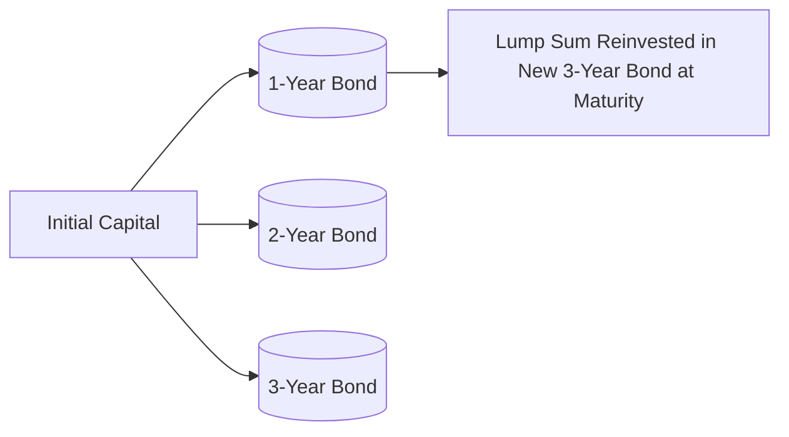

## 22.3 Debt Security Strategies

Bond or debt security strategies often play a critical role in a well-rounded wealth management plan. While debt instruments can help preserve capital and generate predictable income, they can also introduce risks such as interest rate fluctuations and credit default. The strategies discussed below offer a variety of ways to address different client goals, including income generation, capital preservation, risk management, and alignment with specific time horizons.  

Before delving into the specifics, it is important for advisors to understand that Canada’s regulatory landscape—now supervised by the Canadian Investment Regulatory Organization (CIRO)—requires full disclosure of risks and suitability. Ensuring clients comprehend both the potential and risks associated with bond strategies is essential, especially within the context of Canada’s unique market environment and tax regime.

---

### The Role of Bond Strategies in a Portfolio

In Canadian portfolios, debt securities help investors achieve:  
- Predictable Income Streams: Through coupon payments.  
- Capital Preservation: Lower volatility compared to equities (though not risk-free).  
- Diversification: Bond returns often differ from equity returns, providing a stabilizing effect.  
- Specific Goals: Meeting known liabilities, funding projects, or providing retirement income.

These benefits can be tailored to clients through various strategies, outlined below.

---

### 1. Buy-and-Hold Strategy

A buy-and-hold strategy involves purchasing bonds and holding them to maturity. Clients receive regular coupon payments and eventually the face value (principal) when the bond matures.

**Key Features**  
- Simplified Management: Once purchased, there is minimal need to trade unless creditworthiness deteriorates.  
- Reduced Transaction Costs: Fewer trades mean fewer fees.  
- Predictable Cash Flow: Coupon income is generally stable, and capital gains/losses are realized only if bonds are sold before maturity.  
- Main Risks: If interest rates rise, bond market values typically fall. However, if the investor holds until maturity, the price fluctuation is less impactful, assuming no default.

**Canadian Example**  
Many Canadian retirees adopt a buy-and-hold approach using Government of Canada bonds or high-grade provincial bonds, prioritizing safety and predictable income. For instance, RBC (Royal Bank of Canada) has offered bond funds centered around government securities where a substantial portion of holdings are intended to be held to maturity.

---

### 2. Bond Laddering

Bond laddering involves creating a portfolio of bonds with staggered maturities—for example, 1-year, 2-year, 3-year, and so on. As each bond matures, the proceeds are typically reinvested into a longer-maturity bond, allowing the “ladder” to persist.

**Benefits**  
- Interest Rate Risk Management: If interest rates rise, only a portion of the portfolio needs rollover at the higher rates. If rates fall, the remaining extended maturities still lock in higher coupons.  
- Regular Liquidity: Staggered maturities ensure that parts of the portfolio regularly mature, making cash available.  
- Lower Reinvestment Risk: Proceeds are re-invested over time rather than all at once.

**Visual Representation**  
Below is a simplified diagram of how capital flows into different “rungs” on a bond ladder:

In this diagram, an investor allocates initial capital into bonds with successive maturities. As each bond matures, the funds can be reinvested at the long-end rung of the ladder, maintaining a consistent structure.

**Canadian Example**  
Many Canadian pension funds, such as provincial pension plans, use laddering for liquidity management to meet periodic cash outflows (e.g., pension payouts) while managing interest rate exposure.  

---

### 3. Barbell Strategy

The barbell strategy concentrates on very short-term and long-term maturities, avoiding mid-term maturities. This can offer a way to balance liquidity needs with the higher yield typically offered by longer-term bonds.

**Rationale**  
- The short-term bonds allow quick reinvestment if interest rates rise, providing flexibility.  
- The long-term bonds lock in higher yields if the yield curve (which historically in Canada is often upward sloping) offers a premium for longer maturities.  
- The mid-range is purposely avoided to achieve a very specific interest rate risk profile.

**Practical Considerations**  
- More volatility can arise from the long-term bond segment if interest rates fluctuate significantly.  
- Frequent monitoring is sometimes required to re-balance or adjust the proportion of short-term vs. long-term holdings.

**Real-World Example**  
A Canadian bank like TD (Toronto-Dominion Bank) might structure certain institutional portfolios with a barbell approach if their market economists anticipate a steepening or flattening yield curve. The short-term component (e.g., 1–2-year Government of Canada T-Bills) can quickly be rolled over if interest rates are expected to climb.

---

### 4. Bullet Strategy

A bullet strategy focuses on bonds that mature at much the same time—often aligned with a client’s specific goal or liability date.

**How It Works**  
- Investors buy bonds with maturities clustered around a single “target date,” such as the start of retirement or the anticipated tuition payment for a child’s university program.  
- Coupons are received throughout the holding period, but the principal is returned all at once at maturity.

**Advantages and Drawbacks**  
- On the plus side, it ensures a sum of money is made available exactly when needed.  
- On the downside, it can expose the portfolio to interest rate risk if rates rise substantially in the interim, and there are no offsetting maturities to capture those higher rates.

**Case Study**  
A retiree planning for a lump-sum purchase (e.g., a cottage in Muskoka) might choose to “bullet” a set of bonds (such as 5-year and 6-year Government of Canada bonds) all maturing around the anticipated purchase date.

---

### 5. Active Bond Management

In an active strategy, portfolio managers frequently adjust the bond portfolio based on interest rate outlooks, credit analyses, and market conditions. This can include:  

- **Riding the Yield Curve:** Buying longer maturities in an upward-sloping yield curve and selling the bonds as they approach maturity to benefit from potential price appreciation.  
- **Bond Swaps:** Substituting one bond for another with similar characteristics but higher yield or lower price, possibly exploiting perceived mispricing.  
- **Sector Rotation:** Shifting allocation among government, provincial, or corporate bonds based on where the manager sees value or foresees changes in policy or credit conditions.

**Risks of Active Strategies**  
- Increased Transaction Costs: Frequent trading generates more costs.  
- Market Timing Challenge: Forecasting interest rate moves is notoriously difficult.  
- Potential for Underperformance: If markets move contrary to expectations, active strategies can underperform a simple buy-and-hold approach.

**Canadian Industry Example**  
Some BMO (Bank of Montreal) bond funds actively rotate among corporate, provincial, and municipal bonds to add alpha. Their managers rely on economic models and credit research to target undervalued segments of the Canadian fixed-income market.

---

### 6. Credit Strategy

Credit strategies involve seeking out bonds with undervalued or “mispriced” credit spreads—for instance, high-yield corporate bonds where the market’s risk perception might be excessive, or investment-grade corporate issues that could tighten in spread as the issuer’s credit profile improves.

**Key Points**  
- The investor profits if the credit spread narrows, leading to capital appreciation.  
- This approach comes with default risk; poor credit performance by the issuer can widen spreads and reduce bond prices.  
- Requires strict due diligence and ongoing credit monitoring.

**Canadian Context**  
Large Canadian pension funds, like the Ontario Teachers’ Pension Plan, are known for deep credit research capabilities, enabling them to identify promising corporate or infrastructure bond opportunities within Canada or globally.

---

## Implementation Steps for Canadian Advisors

1. **Know the Client:** CIRO customer-focused regulations require a comprehensive suitability analysis. Conduct in-depth discovery to identify cash flow needs, retirement horizons, risk tolerance, and tax considerations.  
2. **Align with Goals:** Each bond strategy serves specific objectives—laddering for steady cash flow, bullet for a future lump-sum liability, barbell if seeking flexibility, etc.  
3. **Conduct Thorough Due Diligence:** Before recommending specific bonds, evaluate the issuer’s credit rating, yield-to-maturity, and sensitivity to rate changes. Use reputable sources like DBRS Morningstar, Fitch, or S&P Global Ratings for Canadian credit ratings.  
4. **Monitor and Rebalance:** Even buy-and-hold strategies may need to be revisited if the issuer’s fundamentals deteriorate or if major changes occur in interest rates. Rebalancing ensures alignment with the client’s evolving needs.  
5. **Document and Disclose:** Provide written explanations of risks, fees, and potential outcomes, following CIRO and CSA guidelines.

---

## Key Formulas and Concepts

When analyzing bonds, a foundational concept is bond pricing and yield, illustrated by the following:

$$
P_0 = \sum_{t=1}^{n} \frac{C_t}{(1 + r)^t} + \frac{F}{(1 + r)^n}
$$

Where:  
- \\( P_0 \\) = Current bond price  
- \\( C_t \\) = Coupon payment in period \\( t \\)  
- \\( F \\) = Face (par) value  
- \\( r \\) = Required yield (discount rate)  
- \\( n \\) = Number of periods to maturity  

Understanding how to calculate the price of a bond over its life and how it responds to fluctuations in \\( r \\) is critical for all these strategies.  

---

## Regulatory and Resource References

- **CIRO (Canadian Investment Regulatory Organization)**: For current guidelines on fixed-income suitability, disclosure, and complaint resolution.  
- **CSA (Canadian Securities Administrators)**: Consult [securities-administrators.ca](https://www.securities-administrators.ca/) for standardized regulations across Canada, including tips on fixed-income trades and client risk disclosure.  
- **CRA (Canada Revenue Agency)**: Review CRA bulletins for tax treatment of interest income and capital gains on bond trades.  
- **Open-Source Tools**: Websites like [Investopedia.com](https://www.investopedia.com/) offer bond calculators and “Bond Basics 101” sections.  
- **Academic References**: “Investments” by Bodie, Kane, and Marcus is highly recommended for detailed coverage of yield curve strategies and fixed-income portfolio management.

---

## Best Practices, Pitfalls, and Challenges

**Best Practices**  
- Customize for the Client: No single strategy works for everyone.  
- Stress-Test Scenarios: Consider potential rate shifts or credit downgrades.  
- Tax-Efficient Planning: Use registered accounts (RRSPs, TFSAs) when possible to shield interest income from immediate taxation.  

**Pitfall**  
- Ignoring Reinvestment Risk: In a falling rate environment, coupon payments may be reinvested at lower yields. Strategy selection (e.g., laddering) helps mitigate this risk.  

**Challenge**  
- Predicting Interest Rates: Few analysts consistently predict rate movements. Overreliance on forecasts can mislead an active strategy.  

---

## Conclusion and Application

Debt securities remain an essential component of many Canadian portfolios by providing income, stability, and diversification. Whether you choose a passive buy-and-hold approach, a carefully structured bond ladder, or an active strategy that capitalizes on short-term market developments, the goal is to align with the client’s objectives and tolerance for risk.  

Advisors should integrate these approaches with broader financial planning tools such as NaviPlan or Snap Projections, modeling various “what-if” scenarios to see how different interest rate changes and maturities might impact the client’s retirement or other life goals.  

Ultimately, understanding the interplay between interest rates, credit quality, and reinvestment risk lets you optimize bond allocations and better serve your clients’ wealth management needs in Canada’s evolving financial markets.

---

## Test Your Knowledge: Canadian Debt Security Strategies



### Which best describes a buy-and-hold strategy for bonds?

- [x] Purchasing bonds and retaining them until maturity while collecting coupon payments
- [ ] Continuously swapping bonds based on credit spread movements
- [ ] Using a mix of short-term and long-term bonds while avoiding intermediate terms
- [ ] Grouping bonds around one maturity date for a specific future event

> **Explanation:** A buy-and-hold strategy involves purchasing bonds and holding them until maturity, collecting coupon payments along the way with minimal trading.

### In a bond ladder strategy, how is reinvestment risk typically managed?

- [x] By staggering bond maturities so only a portion of the portfolio matures at any given time
- [ ] By clustering bond maturities on one target date
- [ ] By only investing in long-term government bonds
- [ ] By investing exclusively in short-term bonds

> **Explanation:** Bond laddering staggers maturities, ensuring that proceeds from each maturing bond are reinvested gradually rather than all at once, helping to manage reinvestment risk.

### Which one of the following is most characteristic of a barbell bond strategy?

- [ ] Concentrating bond maturities at a single point in time
- [ ] Regularly rotating between government and corporate bonds
- [x] Focusing on very short-term and very long-term bonds, while avoiding mid-term maturities
- [ ] Pairing short-term bonds with intermediate-term bonds

> **Explanation:** The barbell strategy focuses on combining short-term and long-term bonds, leaving out the intermediate segment to achieve a unique interest rate risk profile.

### When might a bullet strategy be most appropriate?

- [ ] For achieving regular liquidity through staggered maturities
- [ ] When maximizing portfolio turnover to exploit short-term mispricing
- [x] When an investor needs funds at a specific future date, such as a targeted liability
- [ ] For creating a uniform distribution of maturities across all time frames

> **Explanation:** A bullet strategy is designed to have bonds mature near a specific date, aligning well with predictable, lump-sum capital needs.

### What is a potential downside of active bond management?

- [x] Higher transaction costs due to frequent trading
- [ ] Reduced flexibility in portfolio management
- [ ] Less chance of outperforming passive strategies
- [ ] Complete elimination of interest rate risk

> **Explanation:** Active strategies often involve more frequent trading, which raises transaction costs and can erode returns if trades are not carefully timed.

### Which statement about credit strategies in bond investing is correct?

- [ ] Credit strategies involve buying only government securities
- [ ] Credit strategies never require monitoring credit ratings
- [x] Credit strategies aim to find undervalued credit spreads that may tighten
- [ ] Credit strategies eliminate the risk of default

> **Explanation:** Credit strategies focus on bonds with spreads that may be mispriced, hoping to profit when the spreads narrow, but ongoing monitoring is critical due to default risk.

### Which tool could Canadian advisors use to model bond strategies for a retirement plan?

- [ ] A standalone discount rate table found in academic texts
- [x] Comprehensive financial planning software like NaviPlan or Snap Projections
- [ ] Exclusively Excel-based calculators with no industry data
- [ ] A single yield curve chart without scenario testing

> **Explanation:** Professionals frequently utilize comprehensive planning software, such as NaviPlan or Snap Projections, which allow scenario testing and align strategies with retirement objectives.

### If interest rates rise unexpectedly, which bond segment in a barbell strategy might provide some immediate flexibility?

- [x] Short-term bond segment
- [ ] Intermediate-term bond segment
- [ ] Long-term bond segment
- [ ] All segments equally

> **Explanation:** The short-term portion of a barbell strategy matures sooner, enabling reinvestment at higher rates, providing immediate flexibility in a rising-rate environment.

### How do Canadian pension funds commonly use bond laddering?

- [x] To match outgoing pension payments with maturing bonds and reinvest proceeds over time
- [ ] To only invest in short-term T-Bills
- [ ] To concentrate all bonds to mature at year-end
- [ ] To speculate on falling interest rates by buying longer-duration bonds

> **Explanation:** Canadian pension funds frequently ladder maturities so that bond proceeds align with ongoing pension payment obligations, managing liquidity and reinvestment risk effectively.

### True or False: Changing market conditions affect both the market value of bonds and their reinvestment opportunities.

- [x] True
- [ ] False

> **Explanation:** Interest rate fluctuations impact current bond prices and the yield available on new or reinvested funds, highlighting how market conditions affect overall bond portfolio performance.




