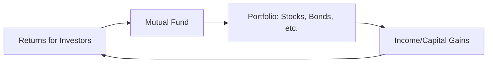

## 1.2 Mutual Funds

Mutual funds play a pivotal role in Canadian wealth management, offering clients an efficient way to invest in a diversified portfolio of securities. This section provides a comprehensive look at how mutual funds operate, their fees and expenses, the regulatory requirements in Canada, and best practices when recommending or selecting funds. Real-world examples and practical insights will help you guide clients based on their unique goals and risk profiles.

---

### Overview of Mutual Funds

A mutual fund pools money from multiple investors. A professional portfolio manager then invests this pool of capital in a range of securities—often stocks, bonds, or a combination—to match a stated investment strategy. Mutual funds aim to provide:

- Professional management expertise.  
- Diversification, reducing risk exposure to any single investment.  
- Liquidity, as shares (or units) in mutual funds are typically redeemable at the fund’s Net Asset Value (NAV) on any business day.  

Mutual funds in Canada must comply with specific disclosure rules, such as issuing a Fund Facts document and a simplified prospectus, stipulated under **National Instrument 81-101** and **National Instrument 81-102**.

*Diagram Explanation:*  
This diagram demonstrates how investor contributions flow into a mutual fund structure, which then invests in a diversified portfolio (e.g., stocks, bonds). Any income, capital gains, or overall returns generated by the underlying securities are returned to the investors proportionally.

---

### Key Terminology and Concepts

- **Net Asset Value (NAV)**  
  The per-share (or per-unit) price of the fund, calculated by dividing the total value of the fund’s assets (minus liabilities) by the number of shares outstanding.  
  $$
  NAV = \frac{\text{Total Assets} - \text{Liabilities}}{\text{Number of Shares Outstanding}}
  $$

- **Management Expense Ratio (MER)**  
  The total annual expenses of a mutual fund (including management fees, operating expenses, and taxes) expressed as a percentage of the fund’s average net assets.  

- **Sales Charges (Loads)**  
  Mutual funds may carry front-end loads (fees paid when shares are purchased) or back-end loads (fees paid upon redemption, often decreasing over time). Funds without any sales charges are referred to as no-load funds.

- **Prospectus**  
  A legal document detailing the fund’s objectives, risks, major holdings, financial statements, and the background of its management team.

- **Fund Facts Document**  
  A simplified disclosure form designed to help investors quickly understand the key points of a mutual fund—fees, performance, and risks.

---

### Types of Mutual Funds

Mutual funds differ by their investment objectives and strategies. The primary categories include:

1. **Equity Funds**  
   - Invest predominantly in equities (stocks) for long-term growth.  
   - Subject to market volatility but historically can deliver higher returns over longer periods.  
   - Example: Canadian pension funds (like CPP Investments) might hold equity mutual funds for strategic growth, although they often invest directly.  

2. **Fixed-Income Funds**  
   - Invest in bonds or other debt instruments to generate stable interest income.  
   - Generally less volatile than equity funds but have interest rate and credit risk considerations.  
   - Example: TD, RBC, and BMO offer bond funds targeting Canadian government bonds or corporate debt.

3. **Balanced Funds**  
   - Combine equity and fixed-income investments within a single portfolio.  
   - Aim to offer both growth (through stocks) and income/stability (through bonds).  
   - Often used by conservative or moderate Canadian investors as all-in-one solutions.

4. **Specialty Funds**  
   - Focus on specific geographic regions, sectors (e.g., technology, health care), or themes (e.g., responsible investing).  
   - May carry higher risk due to concentration in particular markets or industries.  

**Tip:** A balanced or multi-asset class approach often suits clients seeking to spread their risk while still capturing market growth.

---

### Fees and Expenses

Mutual funds charge management fees and operating expenses, collectively contributing to the **Management Expense Ratio (MER)**. When recommending a fund, it is essential to discuss:

- **MER Impact**  
  Higher MERs can erode returns over time, especially in lower-return markets.  
- **Front-End or Back-End Loads**  
  Determine whether the client’s time horizon and liquidity needs justify paying a load.  
- **No-Load Funds**  
  May still have ongoing operational fees, but avoid sales fees.  

**Pitfall:** Focusing solely on short-term performance without fully understanding the fee structure can lead to lower net returns for clients.

---

### Mutual Fund Regulation in Canada

Mutual funds in Canada are governed by rules designed to protect investors:

- **National Instrument 81-101 – Mutual Fund Prospectus Disclosure**  
  Details the requirements for delivering a simplified prospectus and Fund Facts to investors.  
- **National Instrument 81-102**  
  Outlines the core investment restrictions and operational standards for mutual funds.  
- **CIRO (Canadian Investment Regulatory Organization)**  
  As of January 1, 2023, the Mutual Fund Dealers Association and the Investment Industry Regulatory Organization of Canada were consolidated into CIRO. This national self-regulatory body oversees mutual fund dealers, investment dealers, and marketplace integrity. For the most up-to-date regulations and investor protection details, visit [CIRO’s website](https://www.ciro.ca).  
- **Canadian Investor Protection Fund (CIPF)**  
  Protects client assets if a member firm becomes insolvent. CIPF coverage applies to eligible securities, including mutual funds, held through a CIRO member firm.

---

### Best Practices in Selecting a Mutual Fund

When selecting or recommending mutual funds for Canadian clients:

1. **Align with Investment Objectives**  
   - Match the fund’s mandate (e.g., growth, income, balanced) with the client’s financial goals.  
2. **Assess the Client’s Risk Tolerance**  
   - Higher equity exposure may not suit a risk-averse client.  
3. **Evaluate Historical Performance and Benchmark**  
   - Review performance relative to an appropriate benchmark index (e.g., S&P/TSX Composite for Canadian equities).  
4. **Compare Fees and Expenses**  
   - Consider the impact of MER over the long term.  
5. **Study the Fund Manager’s Track Record**  
   - Analyze consistency in managing different market environments.  
6. **Review Regulatory Documents**  
   - Prospectus and Fund Facts can highlight strategies, top holdings, fees, and risk levels.  

**Important:** Always verify that the fund’s manager and the dealer offering it are registered with CIRO and in good standing.

---

### Applying Mutual Funds in a Canadian Portfolio

Advisors often use mutual funds for core positions within a diversified strategy:

1. **Core-Satellite Strategy**  
   - Use broad-based, low-fee mutual funds (core) and complement them with specialty or active funds (satellite).  
2. **Retirement Portfolios**  
   - Balanced or target-date funds (common offerings from RBC, TD, BMO) can simplify the investment strategy for retirement-focused clients.  

**Case Study Example:**  
A 45-year-old Canadian investor, saving primarily for retirement in 20 years, wants moderate growth. An advisor might recommend a balanced mutual fund with a 60% equity and 40% fixed-income mix. The investor benefits from professional management, diversification, and stable returns relative to an all-equity strategy.

---

### Step-by-Step Approach to Selecting a Mutual Fund

1. **Determine Goals**  
   - Short-term or long-term? Income or growth?  
2. **Assess Risk Profile**  
   - Use risk questionnaires and suitability checks, required by CIRO, to sleep-test the portfolio’s volatility.  
3. **Screen for Eligible Funds**  
   - Use publicly available tools like Morningstar Canada or Fund Library to narrow down options.  
4. **Analyze Management Fees (MER)**  
   - Higher MER can drag on performance over the long run.  
5. **Review Historical Performance Consistency**  
   - Compare over 3-, 5-, and 10-year periods against relevant benchmarks.  
6. **Examine Fund Manager Expertise**  
   - Investigate the fund provider’s track record (e.g., RBC Asset Management, TD Asset Management).  

---

### Common Pitfalls and How to Avoid Them

- **Chasing Past Performance**  
  Funds that performed well recently may revert to average or underperform.  
- **Ignoring Fees**  
  Even a small difference in MER compounds significantly over time.  
- **Lack of Portfolio Fit**  
  Adding a new fund that duplicates existing holdings can distort asset allocation.  
- **Overlooking Tax Implications**  
  Distributions from the fund can trigger taxable events. Advisors should coordinate with tax professionals and consult [CRA guidance](https://www.canada.ca/en/revenue-agency.html) for strategies to minimize clients’ tax liabilities.

---

### Summary

Mutual funds remain one of the most popular investment vehicles in Canada because of their accessibility, diversified nature, and professional management. Advisors should thoroughly evaluate how each fund aligns with a client’s objectives, risk tolerance, and time horizon. By understanding regulatory requirements, fee structures, and performance metrics, advisors can better serve investor needs and maintain the trust necessary for a long-term advisory relationship.

---

## Boost Your Knowledge of Canadian Mutual Funds – WME® 1.2 Quiz



### 1. Which of the following documents must Canadian mutual funds provide to investors for simplified disclosure?

- [ ] Fund Basics Overview
- [ ] Investment Statement
- [x] Fund Facts Document
- [ ] Annual Information Only

> **Explanation:** Under National Instrument 81-101, Canadian mutual funds must deliver a Fund Facts Document that summarizes essential details such as fees, past performance, and risks.

### 2. Which metric specifically measures a mutual fund’s total annual expenses, including management fees, as a percentage of its average assets?

- [ ] NAV
- [x] MER
- [ ] ROI
- [ ] P/E Ratio

> **Explanation:** The Management Expense Ratio (MER) captures all annual expenses, including management fees, administrative costs, and taxes, divided by the average net assets of the fund.

### 3. In Canada, daily redeemability of mutual fund shares typically occurs at:

- [x] The Net Asset Value (NAV)
- [ ] The average trading price of the underlying stocks
- [ ] The manager’s discretion
- [ ] A fixed predetermined price

> **Explanation:** Mutual fund shares (or units) are generally bought and sold at the end-of-day Net Asset Value, which reflects the total value of the fund’s assets minus liabilities, divided by the number of units.

### 4. What is a balanced mutual fund mainly designed to provide?

- [ ] Only a high level of income
- [ ] Concentrated growth through specific sectors
- [ ] Tax relief for shareholders
- [x] Both growth and stability by combining equities and fixed income

> **Explanation:** Balanced funds invest in a mix of equity and fixed-income securities, aiming for both growth potential and relative stability.

### 5. Which regulatory body is responsible for overseeing both investment dealers and mutual fund dealers in Canada as of 2023?

- [ ] MFDA
- [x] CIRO
- [ ] IIROC
- [ ] OSFI

> **Explanation:** Effective January 1, 2023, the Mutual Fund Dealers Association (MFDA) and Investment Industry Regulatory Organization of Canada (IIROC) combined to form CIRO, Canada’s national self-regulatory organization.

### 6. A back-end load (or deferred sales charge):

- [ ] Is paid at the time of purchase
- [ ] Is never disclosed in the prospectus
- [x] Is typically paid upon redemption, often decreasing over time
- [ ] Does not appear in Canadian mutual funds

> **Explanation:** Back-end loads (deferred sales charges) apply when investors redeem their shares. These charges usually decrease the longer an investor holds the fund.

### 7. Canadian mutual funds are generally governed by:

- [x] National Instrument 81-101 and National Instrument 81-102
- [ ] OSFI Act for Banks
- [ ] Canada Pension Plan Act
- [ ] Provincial Tax Codes Only

> **Explanation:** National Instrument 81-101 covers prospectus disclosure requirements, while National Instrument 81-102 provides the core investment and operational guidelines for Canadian mutual funds.

### 8. Which statement about fees is most accurate?

- [x] High fees can significantly reduce net returns over time
- [ ] Fees are generally negligible in mutual fund performance
- [ ] MER and loads do not matter for long-term investors
- [ ] Fees are irrelevant if the fund is actively managed

> **Explanation:** Even moderate fees can erode returns substantially over time, especially in periods of lower overall market growth.

### 9. What is one method to compare mutual funds with similar objectives for a client?

- [ ] Focus only on the short-term performance
- [ ] Ignore past performance entirely
- [x] Use publicly available resources like Morningstar Canada or Fund Library
- [ ] Rely solely on a fund’s marketing brochures

> **Explanation:** Third-party research platforms such as Morningstar Canada or Fund Library allow advisors to see standardized performance metrics, fee structures, and risk profiles, facilitating better fund comparisons.

### 10. True or False: Mutual funds lacking sales charges (no-load funds) are always free of any fees.

- [x] True
- [ ] False

> **Explanation:** While no-load funds do not charge sales fees at purchase or redemption, they still carry operational and management fees that comprise the MER.


